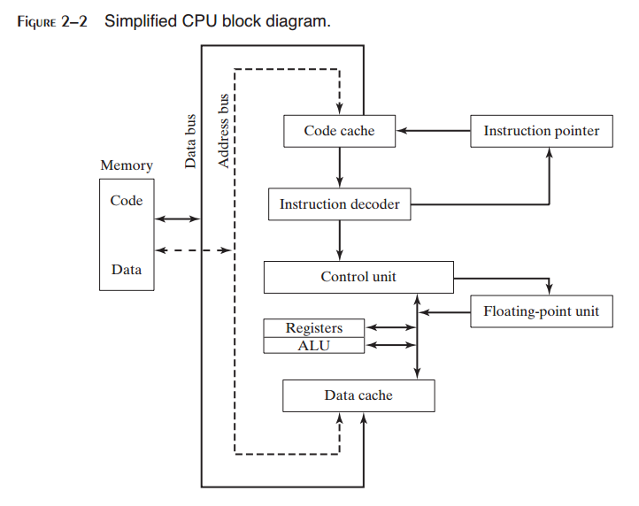

2 x86 处理器体系结构
^^^^^^^^^^^^^^^^^^^^^^^^^^

本章关注于x86汇编语言的底层硬件。有人说，汇编语言是与机器直接交流的理想工具。如果是这样，那么汇编程序员必须了解处理器的内部体系结构和功能。我们将会讨论当指令执行时在处理器内部发生的基本操作。我们将会讨论程序是如何被操作系统载入并执行的。一个示例主板布局将会为我们提供关于x86系统的硬件环境的内部理解，而本章将会以应用程序与操作系统之间的层次输入/输出是如何工作的结尾。本章的所有主题将会为你开始编写汇编语言程序提供硬件基础。

2.1 通用概念
--------------------

本章将会描述x86处理器家族的体系结构以及程序员视角看到的宿主计算机系统。包含在这一体系结构中的有所有的Intel IA-32以及Intel 64处理器，例如Intel Pentium与Core-Duo，以及高级微设备（AMD）处理器，例如Athlon，Phenom，Opteron与AMD64。汇编语言是了解计算机如何运作的理想工具，并且它要求你具有计算机硬件的基础知识。为此，本章的概念与细节将会有助于你理解你所编写的汇编语言代码。

我们将会力求在适用于所有微计算机系统以及特定的x86处理器的概念之间保持平衡。在未来你也许会使用多种处理器，所以我们为你提高广泛的概念。为了避免为你提供计算机体系结构的肤浅理解，我们专注于x86，从而为你使用汇编语言编程提供坚实的基础。

2.1.1 基础微计算机设计
>>>>>>>>>>>>>>>>>>>>>>>>>>>>>>

图2-1显示了理论微机的基础设计。中心处理器单元（CPU），计算与逻辑操作所在地，包含有限数量的寄存器存储位置，高频时钟，控制单元，以及算术逻辑单元。

* 时钟同步CPU的内部操作与其他系统组件。
* 控制单元（CU）协调机器指令执行的序列步骤。
* 算术逻辑单元（ALU）执行算术操作，例如加法与减法，以及逻辑操作，例如AND，OR与NOT。

CPU通过计算机主板中CPU套口上的管脚与计算机的其他部分相连接。大部分管脚连接到数据总线，控制总线，以及地址总线。内存存储单元是计算机程序运行时指令与数据所在地。存储单元接收来自CPU的数据请求，将来自随机访问内存（RAM）的数据传输到CPU，并将来自CPU的数据传输到内存。所有数据处理发生在CPU内部，所以内存中的程序在能够运行之前必须被拷贝到CPU。每次只有单个的程序指令，或指令集合被拷贝到CPU。

总线是一组并行的线路，将数据由计算机的一个部分传输到另一部分。一个计算机系统通常包含四种总线类型：数据，I/O，控制，与地址。数据总线在CPU与内存之间传递指令与数据。I/O总线在CPU与系统输入/输出设备之间传输数据。控制总线使用二进制信号来同步连接到系统总线上的所有设备的动作。如果当前执行的指令在CPU与内存之间传输数据时，地址总线为指令与数据的地址。

*时钟* CPU与系统总线的所有操作都是由一个固定频率的内部时钟脉冲进行同步的。机器指令的基本时间单元为机器周期（或时钟周期）。时钟周期的长度为一个完整的时钟脉冲所需要的时间。在下图中，时钟周期被描述为一个下落边与下一个下落边之间的时间：

时钟周期的持续时间计算为时钟速度的倒数，可以通过每秒的震荡次数进行度量。例如，每秒震荡十亿次的时钟可以得到十亿分之秒持续时间的时钟周期（1纳秒）。

机器指令的执行至少需要一个时钟周期，而且一些指令需要超过50个时钟周期（例如，80888处理器上的乘法指令）。由于CPU，系统总线以及内存电路之间的速度差异，需要内存访问的指令经常具有一个名为等待状态的空时钟周期。

2.1.2 指令执行周期
>>>>>>>>>>>>>>>>>>>>>

一条机器指令并不是一次执行完成的。CPU需要经过一个预定义的步骤序列来执行一条机器指令，被称为指令执行周期。让我们假定指令指针寄存器保存我们要执行的指令的地址。下面是执行该指令所需要的步骤：

1. 首先，CPU需要由一个名为指令队列的内存区域获取指令。完成之后，它会增加指令指针。
2. 接下来，CPU通过查找查看其二进制位模式解码指令。位模式也许会表明指令具有操作数（输入值）。
3. 如果有操作数，CPU由寄存器与内存获取操作数。有时，这需要地址计算。
4. 然后，CPU使用之前所获取的操作数执行指令。同时会更新一些状态标记，例如零，进位与溢出。
5. 最后，如果输出操作数是指令的一部分，CPU将其执行的结果存储到操作数中。

我们通常将这个复杂的过程简化为三个基本步骤：获取，解码与执行。操作数或者为输入值，或者为操作的输出值。例发， 表达式Z=X+Y有两个输入操作数（X与Y）以及一个输出操作数（Z）。

图2-2中的框图显示典型CPU内部的数据流动。此框图有助于显示指令执行周期内交互的组件之间的关系。为了由内存中读取程序指令，地址被放入地址总线。接下来，内存控制器将请求码放置在数据总线，代码放入代码缓存中。指令指针的值决定下一条要执行哪条指令。指令由指令解码器进行分析，从而使得相应的数字信号被发送到控制单元，协调ALU与浮点单元。尽管在图中并没有显示控制总线，它运载使用时钟来协调不同CPU组件之间数据传输的信号。

2.1.3 内存读取
>>>>>>>>>>>>>>>>>>>>

作为一条原则，计算机对内存的读取要比对内部寄存器的访问慢得多。这是因为由内存中读取一个值涉及到四个独立的步骤：

1. 将你要读取的值的地址放入地址总线。
2. 断言（修改其值）处理器的RD管脚。
3. 等待一个时钟周期以等待内存芯片的响应。
4. 将数据由数据总线拷贝到目的操作数。

上述每一步通常需要一个时钟周期，基于处理器内部以一定频率滴嗒的时钟度量该周期值。计算机CPU通常由其时钟速度的角度来描述。例如，1.2GHz的速度意味着时钟每秒嘀嗒，或震荡12亿次。所以，4个时钟周期非常快，每个周期仅持续1/1,200,000,000分之一秒。即使如此，这依然要比CPU寄存器慢得多，后者的访问通常仅需要一个时钟周期。

幸运的是，计算机设计者很久以前就发现计算机内存是计算机速度的瓶颈，因为大部分程序都需要访问变量。他们发明了一种聪明的方法来降低花费在内存读写上的时间－他们将最近用到的指令和数据存储在名为缓存的高速内存中。其思想在于程序很可能会重复访问相同的内存和指令，所以缓存存储这些它们可以快速访问的值。同时，当CPU开始执行程序时，它会预告将接下来的1000条指令（例如）读入缓存，其基本假定在于这些指令会很快被需要。如果在该代码块中恰好有一个循环，则相同的指令将会位于缓存中。当计算机能够在缓存中找到所需要数据，我们称之为缓存命中。否则，如果CPU尝试在缓存中查找却没有找到，我们称之为缓存丢失。

x86家族中的缓存有两种：Level-1缓存（或主缓存）位于CPU上。Level-2缓存（或次缓存）略慢，通过一条高速数据总线安装到CPU上。两种类型的缓存以一种优化的方式配合工作。

缓存要比传统RAM快得多的原因在于，缓存是由一种名为静态RAM的特殊内存芯片构建的。它造价昂贵，但是它不需要定时刷新以及保存其内容。相与之相对，传统内存，被称为动态RAM，必须定时刷新。它的速度慢得多，但是价格便宜。

2.1.4 载入并执行程序
>>>>>>>>>>>>>>>>>>>>>>>>>>>

在程序运行之前，它必须通过程序加载器的实用程序将其载入到内存中。在加载之后，操作系统必须将CPU指向程序的入口点，即程序开始执行的地址。下面的步骤会将该过程分解更细的步骤：

* 操作系统（OS）在当前磁盘目录下查找程序的文件名。如果没有找到，它会在预定义的目录列表（称为路径）中查找文件名。如果操作系统查找程序文件名失败，则会导致错误信息。
* 如果找到程序文件，OS由磁盘目录中获取关于程序文件的基本信息，包含文件大小及其在磁盘驱动器上的物理位置。
* OS确定内存可下一个可用的位置并将程序文件加载到内存中。它为程序分配内存块，并将程序的大小与位置信息填入一张表（有时称为描述符表）。另外，OS也许会调整程序中指针的值以使其包含程序数据的地址。
* OS开始程序的第一条机器指令的执行（其入口点）。一旦程序开始运行，它被称为一个进程。OS会为该进程分配一个标识数字（进程ID），以用于跟踪程序的运行。
* 进程自己运行。OS的工作是跟踪进程的执行并响应对系统资源的请求。所谓资源有内存，磁盘文件以及输入输出设备。
* 当进程结束时，它会被由内存中移除。

2.2 32位x86处理器
---------------------

在本节中，我们关注所有x86处理器的基本体系结构特征。这包括Intel IA-32家族以及所有的32位AMD处理器。

2.2.1 操作模式
>>>>>>>>>>>>>>>>>>>>>>

x86处理器有三种主要操作模式：保护模式，实模式以及系统管理模式。一个名为虚拟8086的子模式是保护模式的特殊情况。下面是每种模式的简短描述：

*保护模式* 保护模式是处理器的原生状态，在此模式中可以使用所有的指令与特征。程序被指定单独的内存区域，被称为段，而处理器会阻止程序程序引用其分配段之外的内存。

*虚拟8086模式* 当处于保护模式中时，处理器可以在一个安全环境中直接执行实地址模式软件，例如MS-DOS程序。换句话说，如果程序崩溃或是尝试将数据写入系统内存区域，它不会影响同时运行的其他程序。现代操作系统可以同时运行多个单独的虚拟8086会话。

*实地址模式* 实地址模式实现了早期Intel处理器的编程环境，有一些额外的特性，例如切换到其他模式的能力。如果程序需要直接访问系统内存或硬件设备时，该模式会非常有用。

*系统管理模式* 系统管理模式（SMM）为操作系统提供实现诸如电源管理与系统安全等功能的机制。这些功能通常是由为特定系统设置自定义处理器的计算机供应商实现的。

2.2.2 基本执行环境
>>>>>>>>>>>>>>>>>>

地址空间
::::::::::::::

在32位保护模式中，任务或程序可以编址高达4GB的线性地址空间。由P6处理器开始，一种被称为扩展物理地址（extended physical addressing）的技术允许编址64GB的物理内存。与之相对，实地址模式程序仅能编址1MB范围。如果处理器运行于保护模式，并在虚拟8086模式下运行多个程序，每个程序有其自己的1MB内存区域。

基本程序执行寄存器
:::::::::::::::::::::

寄存器是直接位于CPU中的高速存储位置，被设计用来比传统内存高得多的速度进行访问。例如，当一个处理循环为速度进行优化时，循环计数器位于寄存器而不是变量中。图2-3显示了基本程序执行寄存器。有8个通用寄存器，6个段寄存器，一个处理器状态标记寄存器（EFLAGS），以及一个指令指针（EIP）。

*通用寄存器* 通用寄存器主要用于算术运算与数据移动。如图2-4所示，EAX寄存器的低16位可以通过名字AX进行引用。

某些寄存器的组成部分可以使用8位值进行编址。例如，AX寄存器的高8位部分被称为AH，而低8位部分被称为AL。对于EAX，EBX，ECX与EDX寄存器也存在同样的重叠关系：

其余的通用寄存器仅可以使用32位或16位名字进行访问，如下表所示：

*特定使用* 某些通用寄存器具有特定用途：

* EAX被乘法与除法指令自动使用。它通常被称为扩展累加器寄存器。
* CPU自动使用ECX作为循环计数器。
* ESP编址栈上的数据（一种系统内存结构）。它很少被用于普通的算术运算与数据传输。它通常被称为扩展栈指针寄存器。
* ESI与EDI为高速内存传输指令所使用。它们有时被称为扩展源索引与扩展目的索引寄存器。
* EBP被高级语言用来引用函数参数与栈上的局部变量。除了高级编程以外，它不应被用于普通的算术运算或数据传输。它通常被称为扩展帧指针寄存器。

*段寄存器* 在实地址模式中，16位段寄存器指示被称为段的预先分配的内存区域的基地址。在保护模式下，段寄存器保存指向段描述符表的指针。某些段保存程序指令（代码），其他段保存变量（数据），而另一种名为栈段的段保存局部函数变量与函数参数。

*指令指针* EIP，或指令指针，寄存器包含要执行的下一条指令的地址。特定的机器指令操纵EIP，从而使得程序分支到一个新的地址处。

*EFLAGS寄存器* ELFAGS（或标记）寄存器由控制CPU操作或反映某些CPU操作的输出的单个二进制位构成。某些指令测试并操纵单个的处理器标记。

*控制标记* 控制标记控制CPU的操作。例如，它们会使得CPU在每个指令执行之后停止，当算术溢出被检测到时使得CPU中止，进入虚拟8086模式或进入保护模式。

程序可以在ELFAGS寄存器中设置单个位来控制CPU的操作。例如方向与中止标记。

*状态标记* 状态标记反映CPU所执行的算术运算与逻辑运算的输出。它们是溢出，符号，零，辅助进位，校验，以及进位标记。显示在他们名字后面的是其简写：

* 当无符号算述操作的结果过大，而不适于目的时，设置进位标记（CF）。
* 当有符号算述操作的结果对于目的过大或过小时，设置溢出标记（OF）。
* 当算术运算或逻辑操作的结果为负结果时，设置符号标记（SF）。
* 当算术运算或逻辑操作的结果为零时，设置零标记（ZF）。
* 当8位操作数中的算术操作使得位3进到位4时，设置辅助进位标记（AC）。
* 当结果中的低位字节包含偶数个1时，设置校验标记（PF）。否则，PF被清除。通常，当存在数据被修改或破坏的可能时，它通常用于错误检测。

MMX寄存器
:::::::::::::::::

当实现高级媒体或通信应用时，MMX技术可以改进Intel处理器的性能。8个64位MMX寄存器支持名为SIMD（单指令，多数据）的特殊指令。正如其名字所表明的，MMX指令并行作用于包含在MMX寄存器中的数据值上。尽管它们看起是单个寄存器，MMX寄存器名字事实上是浮点单元所用的相同寄存器的别名。

XMM寄存器
::::::::::::::::::

x86体系架构也支持8个被称为XMM寄存器的128寄存器。它们被用于指令集的流式SIMD扩展。

*浮点单元* 浮点单元（FPU）执行高速浮点算术运算。为此，每次需要一个单独的协处理器芯片。由Intel486开始，FPU被集成到主处理器芯片中。在FPU中有8个浮点数据寄存器，名为ST(0)，ST(1)，ST(2)，ST(3)，ST(4)，ST(5)，ST(6)，以及ST(7)。其余的控制与指针寄存器显示在图2-5中。

2.2.3 x86内存管理
>>>>>>>>>>>>>>>>>>>>>>>>>>>

x86处理器依据2.2.1节中讨论的基本操作模式进行内存管理。保护模式最为鲁棒与强大，但是它限制应用程序直接访问系统硬件。

在实地址模式中，仅可以编址1M内存，由十六进制的00000至FFFFF。处理器一次仅运行一个程序，但是它可以临时中断程序来处理外围请求（被称为中断）。应用程序被允许访问任意内存地址，包括与系统硬件直接相连接的地址。MS-DOS操作系统运行于实地址模式，而Window95与98可以启动进入该模式。

在保护模式中，处理器可以同时运行多个程序。它为每个进程（运行程序）分配总共4GB内存。每个程序可以被赋预其自己的保留内存区域，而程序被阻止误访问其他程序的代码与数据。MS-Windows与Linux运行于保护模式。

在虚拟8086模式中，计算机运行保护模式，但是创建虚拟8086机器，该机器有其自己的1MB地址空间，模拟运行在实地址模式下的80x86计算机。例如，Windows NT与2000在你打开命令容器时创建一个虚拟8086机器 。你可以同时运行多个这样的窗口，而每一个都会受到保护，不受其他窗口动作的影响。在Windows NT，2000与XP系统下，某些可以直接访问计算机硬件的MS-DOS程序不能运行于该模式下。

第11章将更为详细地解释实地址模式与保护模式。

2.3 64位x86-64处理器
-----------------------

在本节中，我们关注所有使用x86-64指令集的64位处理器的基本架构细节。这构成了Intel 64与AMD64处理器家族。指令集是对我们已经了解的x86指令集的64位扩展。下面是一些核心特性：

1. 它向后兼容x86指令集。
2. 地址为64位长，允许2^64字节的虚拟地址空间。在当前的芯片实现中，只使用了最低的48位。
3. 它可以使用64位通用寄存器，允许指令具有64位整数操作数。
4. 它比x86多使用8个通用寄存器。
5. 它使用48位物理地址空间，最高支持256TB RAM。

另一方面，当运行原生64位模式时，这些处理器不支持16位实模式或虚拟8086模式。（有一人依然支持16位编程的遗留模式，但是在Microsoft Windows的64位版本中并不可用。）

使用x86-64的每一个Intel处理器是Xeon，然后是其他处理器，包括Core i5与Core i7处理器。使用x86-64的AMD处理器有Opteron与Athlon 64。

你也许听说过Intel的另一个64位体系架构，即IA-64，后来被重命名为Itanium。IA-64指令集完全不同于x86与x86-64。Itanium处理器经常用于高性数据库与网络服务器。

2.3.1 64位操作模式
>>>>>>>>>>>>>>>>>>>>>>>

Intel 64体系结构引入了一个名为IA-32e的新模式。由技术上说，它包含两个子模式，名为兼容模式与64位模式。但是将其称为模式与而不是子模式相对简便，所以我们也这样做。

兼容模式
::::::::::::::::

当运行于兼容模式时，已有的16位与32位程序通常可以运行，而无需重新编译。然而，16位Windows（Win16）与DOS应用不能运行于64位Microsoft Windows之中。不同于Windows的早期版本，64位Windows并不存在一个虚拟DOS机器子系统来利用处理器切换进入虚拟8086模式的功能。

64位模式
::::::::::::::

在64位模式下，处理器运行使用64位线性地址空间的应用。这是64位Microsoft Windows的原生模式。这种模式允许64位指令操作数。

2.3.2 基本64位执行环境
>>>>>>>>>>>>>>>>>>>>>>>>>>>>

在64位模式下，理论上地址可以达到64位长，尽管当前处理器仅支持48位用于编址。由寄存器的角度来看，下述是与32位处理器的最大区别：

* 16个64位通用寄存器（在32位模式下，你仅有8个通用寄存器）
* 8个80位浮点寄存器
* 名为RFLAGS的64位状态标记（仅使用低32位）
* 名为RIP的64位指令指针

你也许会回忆起，32位标记与指令指针被命名为EFLAGS与EIP。另外，还有一些用于媒体处理的特殊寄存器：

* 8个64位MMX寄存器
* 16个128XMM寄存器（在32位模式下，你仅有8个这样的寄存器）

通用寄存器
:::::::::::::::::

当我们描述32位处理器时，引入的通用寄存器是执行算术运算，移动数据以及在数据中循环的指令的基本操作数。通用寄存器可以访问8位，16位，32位或64位操作数（使用特殊前缀）。

在64位模式下，默认操作数大小为32位，而且有8个通用寄存器。然而通过为每个指令添加REX（寄存器扩展）前缀，操作数可以为64位长，而且共有16个通用寄存器可用。你拥有与32位模式相同的寄存器，加上8个编号寄存器，R8至R15。表2-1显示了当使用REX前缀时可用的寄存器。

下面是需要记住的一些细节：

* 在64位模式下，一条指令不能同时访问寄存器的高字节，例如AH，BH，CH与DH，以及新字节寄存器（例如DIL）的低字节。
* 在64位模式下，32位ELFAGS寄存器被64位RFLAGS寄存器所代替。两个寄存器共享相同的低32位，而RFLAGSS的高32位并未被使用。
* 32位模式与64位模式下的状态标记相同。

2.4 典型x86计算机的组件
---------------------------------

