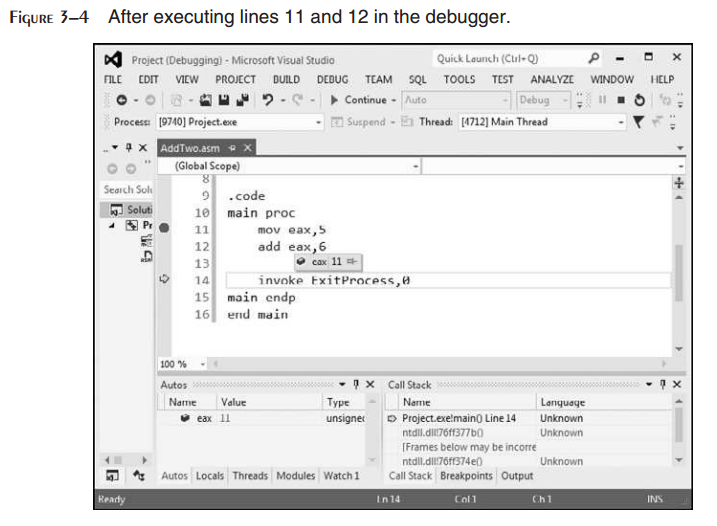

3 汇编语言基础
^^^^^^^^^^^^^^^^

本章关注Microsoft MASM汇编器的基本构建块。我们将会看到常量与变量是如何定义的，数值与字符串字面量的标准格式，以及如何汇编并运行我们的第一个程序。在本章中我们会特别强调Visual Studio调试器，将其作为理解程序如何运行的优秀工具。本章的重点是一次前进一步，在我们前进下一步之前掌握所有细节。我们将筑牢基础，这将会极大地有助于我们进入接下来的章节。

3.1 基础语言元素
-----------------------

3.1.1 第一个汇编语言程序
>>>>>>>>>>>>>>>>>>>>>>>>>

汇编语言也许冠有晦涩和难以捉摸的名声，但是我们希望以另一种方式来思考，这是一门几乎会为我们提供全部信息的语言。我们可以看到正在执行的一切，甚至是CPU中的寄存器与标记。然而，正是由于如此强大的能力，我们负有管理数据表示细节与指令格式的责任。我们工作在一个非常细节化的层级。要了解这是如何工作的，让我们看一个非常简单的汇编程序，该程序会计算两个数的和，并将结果保存在寄存器中。我们将其命名为AddTwo程序：

.. code-block::

    1: main PROC
    2: mov eax,5 ; move 5 to the eax register
    3: add eax,6 ; add 6 to the eax register
    4:
    5: INVOKE ExitProcess,0 ; end the program
    6: main ENDP

尽管在每一行的开头插入了行号以辅助我们的讨论，事实上当我们创建汇编程序时并不需要输入行号。而且暂时先不要尝试输入并运行该程序，它还缺少一些我们在本章稍后会包含的重要声明。

让我们来逐行查看一下该程序：第1行开始main过程，这是程序的入口点。第2行将整数5放入eax寄存器中。第3行将EAX中的值加6，并为其赋一个新值11。第5行调用名为ExitProcess的Windows服务（也被称为函数）结束程序将控制还给操作系统。第6行主程序结束的标记。

也许你已经注意到我们包含了以分号开始的注释。我们程序顶部略过了一些我们稍后会看到的声明，但本质上这是一个可以运行的程序。它并不会在屏幕上显示任何内容，但是我们可以通过一个名为调试器的实用程序来运行该程序，从而可以让我们逐行浏览程序并查看寄存器的值。在本章稍后，我们将会演示如何来做。

添加变量
:::::::::

让我们将加法运算的结果保存在一个名为sum的变量中，从而使我们的程序变得更有趣一些。要实现该目标，我们需要添加一些标记或声明，以标明程序的代码区与数据区：

.. code-block::

        1: .data ; this is the data area
        2: sum DWORD 0 ; create a variable named sum
        3:
        4: .code ; this is the code area
        5: main PROC
        6: mov eax,5 ; move 5 to the eax register
        7: add eax,6 ; add 6 to the eax register
        8: mov sum,eax
        9:
        10: INVOKE ExitProcess,0 ; end the program
        11: main ENDP

sum变量在第2行被声明，通过使用DWORD关键字，我们将其大小设置为32位。还有一些其他的用于指定大小的关键字，其作用或多或少类似于数据类型。但是它们并不是我们熟悉的数据类型，例如int，double，float等等。它们仅是指定大小，但是并不会检查变量中实际放入了什么。记住，我们拥有完全控制权。

顺便一提，我们通过.code与.data指令所标记的代码区与数据区被称为段（segment）。所以我们拥有代码段与数据段。稍后我们会看到名为栈（stack）的第三个段。

下面，让我们深入某些语言细节，演示如何声明字面量（也被称为常量），标识符，指令。也许你将会多次阅读本章以记住这些内容，但确实值得如此。另外，在本章中，当我们提到汇编器的语法规则时，我们实际上是指Microsoft MASM汇编器的语法规则。其他的汇编器具有不同的语法规则，我们忽略讨论。当我们每次涉及汇编器时而不重复出现MASM单词，我们也许至少会拯救一棵树。

3.1.2 整数字面量
>>>>>>>>>>>>>>>>

整数字面量（有时也被称为整数常量）由一个可选的前置符号，一位或多位数字以及一个标记数值进制的可选后置字符构成：

.. code-block::

        [{+ | - }] digits [ radix ]

注意：在本书中我们将会使用Microsoft语法规范。方括号[..]中的元素是可选元素，而花括号{..}是通过|字符分隔的选项元素。斜体项表明其具有已知的定义或描述。

例如，26是一个正确的整数字面量。它并没有后缀，所以我们将看作十进制格式。如果我们希望它是十六进制的26，我们需要将其写为26h。与之类似，数值1101将会被看作十进制数，如果我们在其结尾处添加一个b，则将其变为二进制1101b。下面是可用的后缀值：

下面是使用各处后缀声明的整数字面量。每行包含一条注释：

.. code-block::

        26 ; decimal
        26d ; decimal
        11010011b ; binary
        42q ; octal
        42o ; octal
        1Ah ; hexadecimal
        0A3h ; hexadecimal

以字符开始的十六进制字面量必须包含一个前缀0，以避免汇编器将其解释为标识符。

3.1.3 常量整数表达式
>>>>>>>>>>>>>>>>>>>>>>

常量整型表达式是一个涉及整型字面量与算术运算符的数学表达式。每个表达式的计算结果必须为可存储为32位的整型（0至FFFFFFFF）。算术运算符依据其优先级顺序由高（1）到低（4）在表3-1中列出。关于常量整型表达式需要认识到的重点是它们仅在汇编时被计算。从此以后，我们仅将其称为整型表达式。

.. image:: _images/table-3-1.png

运算符优先级是指当一个表达式包含一个或多个操作符时的隐式运算顺序。如下述表达式所示的运算顺序：

.. code::

        4 + 5 * 2 Multiply, add
        12 -1 MOD 5 Modulus, subtract
        -5 + 2 Unary minus, add
        (4 + 2) * 6 Add, multiply

下述是一些正确表式及其值的示例：

建议：在表达式中使用括号以表明运算顺序，从而我们就不必记住优先级规则。

3.1.4 实数字面量
>>>>>>>>>>>>>>>>

实数字面量（也被称为浮点数字面量）可以表示为十进制实数或编码（十六进制）实数。十进制实数包含一个可选符号，后跟一个整数，一个十进制句点，一个可选的表示小数的整数以及一个可选的幂次：

.. code-block::

        [sign]integer.[integer][exponent]

下述为符号与幂次的格式：

.. code-block::

        sign            {+,-}
        exponent        E[{+,-}]integer

下述为合法的十进制实数的示例：

.. code-block::

        2.
        +3.0
        -44.2E+05
        26.E5

十进制实数至少需要一个整数与一个十进制句点。

编码实数以十六进制表示一个实数，对于短实数使用IEEE浮点格式表示。例如，十进制+1.0的二进制表示为

.. code-block::

        0011 1111 1000 0000 0000 0000 0000 0000

在汇编语言中，相同的值编码为短实数为

.. code-block::

        3F800000r

我们暂时并不会使用实数常量，因为大多数的x86指令集倾向于整数处理。然而第12章将会展示如何使用实数，也被称为浮点数，进行算术运算。这非常有趣，也非常具有技术性。

3.1.5 字符字面量
>>>>>>>>>>>>>>>>>

字符字面量是以单引号或双引号包含的单个字符。汇编器在内存中存储字符的二进制ASCII码。字符字面量的示例如

.. code-block::

        'A'
        "d"

回忆第1章展示了字符字面量使用ASCII码顺序在内部存储为整数。所以，当我们编写字符常量"A"时，在内存中被存为数值65（或十六进制41）。在本书的内封页上有一个完整的ASCII码表，从而可以时不时查看。

3.1.6 字符串字面量
>>>>>>>>>>>>>>>>>>>

字符串字面量是以单引号或双引号包含的字符串序列（包含空格）：

.. code-block::

        'ABC'
        'X'
        "Good night, Gracie"
        '4096'

下面的示例展示了当使用此种方式时也可以使用嵌入引号：

.. code-block::

        "This isn't a test"
        'Say "Good night," Gracie'

正如字符常量被存储为整数一样，我们可以认识到字符串常量在内存中被存为整数字节值的序列。所以，字符串"ABCD"包含四个字节41h，42h，43h与44h。

3.1.7 保留字
>>>>>>>>>>>>>>

保留字具有特殊含义，并且仅应用于正确的语境。默认情况下，保留字并不是大小写敏感的。例如，MOV等同于mov和Mov。有多种不同的保留字类型：

* 指令助记，例如MOV，ADD与MUL
* 寄存器名
* 指令，通知汇编器如何汇编程序
* 属性，为变量与操作数提供大小和使用信息。例如BYTE与WORD
* 操作符，用于常量表达式
* 预定义符号，例如@data，在汇编时返回常量整数值

3.1.8 标识符
>>>>>>>>>>>>>>

标识符是程序选择的名字。它可以标识变量，常量，过程或代码标签。标识符的构成有一些规则：

* 它们可以包含1至247个字符。
* 它们并不是大小写敏感的。
* 第一个字符必须是字母（A..Z，a..z），下划线（_），@，?或$。后续的字符也可以是数字。
* 标识符不能与汇编器的保留字相同。

提示：通过在运行汇编器时添加-Cp命令行开关，我们可以使得所有的关键字与标识符变为大小写敏感。

通常，为标识符使用描述性的名字是一个好主意，正如我们在高级编程语言代码中所做的那样。尽管汇编语言指令都比较矮小和模糊，但是也没有理由使得我们的标识符难于理解。下面是一些定义良好的名字：

.. code-block::

        lineCount       firstValue      index   line_count
        myFile          xCoord          main    x_Coord

下列的标识符名字同样合法，但是并不可取：

.. code-block::

        _lineCount      $first      @myFile

通常我们应避免使用@符号与下划线作为前缀字符，因为它们同时被汇编器以及高级语言编译器所使用。

3.1.9 指令（directives）
>>>>>>>>>>>>>>>>>>>>>>>>

指令（directive）是嵌入在源码中的命令，可以被汇编器识别并发挥相应的作用。指令并不在运行时执行，但是可以让我们定义变量，宏与过程。它们可以为内存段赋名，并执行许多与汇编器相关的家政任务。默认情况下，指令并不是大小写敏感的。例如，.data，.DATA与.Data是相同的。

下面的示例有助于展示directive与instruction之间的区别。DWORD指令通知汇编器在程序中为双字变量保留空间。相对应的，MOV指令在运行时执行，将myVar的内容复制到EAX寄存器：

.. code-block::

        myVar DWORD 26
        mov eax,myVar

尽管用于Intel处理器的所有汇编器共享相同的指令集，他们通常拥有不同的指令（directive）集合。例如，Microsoft汇编器的REPT指令并不会被其他的汇编器识别。

*定义段*  汇编器指令的一个重要功能是定义程序段。段是具有不同作用的程序部分。例如，可用于定义变量的段，可以通过.DATA指令标识：

.. code-block::

        .data

.CODE指令标识包含执行指令的程序区域：

.. code-block::

        .code

.STACK指令标识保存运行栈的程序区域，并设置其大小：

.. code-block::

        .stack 100h

附录A包含一个用于指令与操作符的有用参考。

3.1.10 指令（instructions）
>>>>>>>>>>>>>>>>>>>>>>>>>>>>

指令是程序被汇编时变为可执行的语句。指令被汇编器翻译为机器语言字节，在运行时被CPU载入并执行。一条指令包含四个基本部分：

* 标签（可选）
* 指令助记符（必需）
* 操作数（通常必需）
* 注释（可选）

下面是不同的部分是如何排列的：

.. code-block::

        [label:] mnemonic [operands] [;comment]

让我们分别探索每一部分，由标签域开始。

Label
:::::::::

标签是用作指令与数据的位置标记的标识符。位于指令之前的标签意味着指令的地址。类似地，位于变量之前的标签意味着变量的地址。有两种标签类型：数据标签与代码标签。

数据标签标识变量的位置，为在代码中引用变量提供了一种方便的方法。例如，下面的语句定义了一个名为count的变量：

.. code-block::

        count DWORD 100

汇编器为每一个标签赋值一个数值地址。也可以在一个标签之后定义多个数据项。在下面的示例中，array定义了第一个数字（1024）的地址。其后的其他数字在内存中依次排列：

.. code-block::

        array DWORD 1024, 2048
              DWORD 4096, 8192

变量将会在3.4.2节中解释，而MOV指令将会在4.1.4节中解释。

程序代码域（指令所在的位置）中的标签必须以冒号（:）结尾。代码标签被用作跳转与循环指令的目标地址。例如，下面的JMP（跳转）指令将控制树传给target标签所标记的位置，创建一个循环：

.. code-block::

        target:
                mov ax,bx
                ...
                jmp target

代码标签可与指令位于同一行，也可以单独一行：

.. code-block::

        L1: mov ax,bx
        L2:

标签名遵循与3.1.8节中描述的标识符相同的命名规则。我们可以在一个程序中多次使用相同的代码标签，只要每个标签在封闭过程中唯一即可。我们将会在第5章中展示如何创建过程。

指令助记符
:::::::::::

指令助记符是标识指令的一个简短单词。在英语中，助记符（mnemonic）是辅助记忆的装置。类似的，汇编语言的指令助记符，例如mov，add与sub提供了他们可执行的操作类型的提示。下列是指令助记符的示例：

操作数
::::::::

操作符是用于指令输入或输出的值。汇编语言指令可以有0至3个操作数，其中每一个可以是寄存器，内存操作数，整数表达式或输入输出端口。我们在第2章中讨论了寄存器名，并且在3.1.2节中讨论了整数表达式。有不同的方法可以创建内存操作数－例如使用变量名，以方括号包含的寄存器。我们会在稍后详细探讨。变量名意味着变量的地址，并指示计算机引用指定地址处的内存内容。下表包含一些操作数示例：

让我们来看一些汇编语言指令。例如，STC指令没有操作数：

.. code-block::

        stc ; set Carry flag

INC指令有一个操作数：

.. code-block::

        inc eax ; add 1 to EAX

MOV指令有两个操作数：

.. code-block::

        mov count,ebx ; move EBX to count

操作数有一个自然顺序。当指令有多个操作数时，第一个操作数通常被称为目的操作数。第二个操作数通常被称为源操作数。通常，目的操作数的内容被指令所修改。例如，在MOV指令中，数据由源被复制到目的。

IMUL指令有三个操作数，其中第一个操作数是目的，后两个操作数是要执行相乘操作的源操作数：

.. code-block::

        imul eax,ebx,5

在这个示例中，EBX被乘以5，所得到的结果被存储到EAX寄存器中。

注释
::::::

注释是程序编写者与源码阅读者之间交流程序设计信息的重要方法。下列内容通常包含在程序顶部：

* 程序目的的描述
* 程序创建或修改人员的名字
* 程序创建或修改日期
* 关于程序实现的技术说明

注释可有两种方法实现：

* 单行注释，以冒号（:）字符开头。同一行中冒号字符之后的所有内容会被汇编器忽略。
* 块注释，以COMMENT指令和用户指定的符号开始。后续所有的文本行都会被汇编器忽略，直到用户指定的符号再次出现。如下面的示例所示：

.. code-block::

        COMMENT !
        This line is a comment.
        This line is also a comment.
        !

我们也可以使用其他的符号，只要该符号不再注释行中出现即可：

.. code-block::

        COMMENT &
        This line is a comment.
        This line is also a comment.
        &

当然，我们应该在程序中提供注释，特别是我们代码的意图并不明显时更应如此。

NOP（No Operation）指令
:::::::::::::::::::::::::::

最安全（也是最无用）的指令是NOP指令。它占用1字节的程序空间而不执行任何操作。有时它会被编译器与汇编器用来将代码对齐到有效的地址边界。在下面的示例中，第一个MOV指令生成三个机器码字节。NOP指令将第三条指令的地址对齐到双字（doubleword）边界（4的偶数倍）：

.. code-block::

        00000000 66 8B C3 mov ax,bx
        00000003 90 nop ; align next instruction
        00000004 8B D1 mov edx,ecx

x86处理器的设计可以快速地由偶数双字地址载入代码与数据。

3.2 示例：整数加减
-------------------

3.2.1 AddTwo程序
>>>>>>>>>>>>>>>>>

让我们重新查看本章开头所展示的程序，并添加必要的声明使其成为一个可执行的程序。记住，行号并不是程序的真正组成部分：

.. code-block::

        1: ; AddTwo.asm - adds two 32-bit integers
        2: ; Chapter 3 example
        3:
        4: .386
        5: .model flat,stdcall
        6: .stack 4096
        7: ExitProcess PROTO, dwExitCode:DWORD
        8:
        9: .code
        10: main PROC
        11: mov eax,5 ; move 5 to the eax register
        12: add eax,6 ; add 6 to the eax register
        13:
        14: INVOKE ExitProcess,0
        15: main ENDP
        16: END main

第4行包含.386指令，表明这是一个可以访问32位寄存器与地址的32位程序。第5行选择内存模型（flat），并标识过程的调用约定（stdcall）。因为32位Windows服务要求使用stdcall约定（第8章解释stdcall如何工作）。第6行为运行栈设置4096字节空间，这是每一个程序必需拥有的。

第7行为ExitProcess函数声明原型，这是标准的Windws服务。原型包含函数名，PROTO关键字，逗号以及输入参数列表。ExitProcess的输入参数名为dwExitCode。你可以将其看作传递回Windows操作系统的返回值。返回值0通常意味着我们的程序成功执行。其他整数值通常意味着错误代码值。所以你可以将你的汇编程序看作是由操作系统调用的子例程或过程。当你的程序准备完成时，它调用ExitProcess并返回一个整数通知操作系统你的程序运行良好。

更多信息：你也许会疑惑为什么操作系统希望知道你的程序是否完全成功呢。下面是原因：系统管理员经常创建脚本文件而不是依次执行多个程序。在脚本中的每个点，他们需要知道最近执行的程序是否失败，从而他们可以在必需时退出脚本。类似下面的脚本，其中ErrorLevel 1表明前一步的返回代码大于或等于1：

.. code-block::

        call program_1
        if ErrorLevel 1 goto FailedLabel
        call program_2
        if ErrorLevel 1 goto FailedLabel
        :SuccessLabel
        Echo Great, everything worked!

让我们回到AddTwo程序。第16行使用end指令来标记要汇编的最后一行，并标识程序的入口点（main）。标签main是在第10行声明的，而其标识了程序将会开始执行的地址。

汇编器指令回顾
:::::::::::::::

让我们回顾一下我们在示例程序中所用的最重要的汇编器指令。首先，.MODEL指令通知汇编器要使用的内存模式：

.. code-block::

        .model flat,stdcall

在32位程序中，我们总是使用平坦（flat）内存模式，这是与处理器的保护模式相关联的。我们在第2章中讨论了保护模式。stdcall关键字通知汇编器当过程被调用时如何管理运行时栈。这是一个复杂的主题，我们会在第8章中进行解决。接下来，.STACK指令指示汇编器为程序的运行时栈保留多少内存字节：

.. code-block::

        .stack 4096

值4096通常大于我们将会使用的值，但是它恰好对应于处理器的系统中用于管理内存在的内存密度的大小。所有现代程序在调用子例程时使用栈-首先，保存传递的参数，其次保存调用函数的代码的地址。当函数调用完成时，CPU使用该地址返回到函数被调用时的点。另外，运行栈可以保存局部变量，也就是在函数内部声明的变量。

.CODE指令标记程序的代码区的开始，该区域包含可执行的指令。通常，.CODE之后的下一行是程序入口点的声明，并且按约定，通常是一个名为main的过程。程序的入口点是程序将会执行的第一条指令的地址。我们使用下述行来传递该信息：

.. code-block::

        .code
        main PROC

ENDP指令标记过程的结束。我们的程序有一个名为main的过程，所以ENDP必须使用相同的名字：

.. code-block::

        main ENDP

最后，END指令标记程序的结束，并引用程序入口点：

.. code-block::

        END main

如果我们在END指令之后向程序添加更多的代码行，则它们会被汇编器所忽略。我们可以在此放置任何内容-程序注释，你的代码拷贝等-没有关系。

3.2.2 运行并调试AddTwo程序
>>>>>>>>>>>>>>>>>>>>>>>>>>>

我们可以很容易地使用Visual Studio来编辑，构建并运行汇编语言程序。本书的示例文件目录下有一个名为Project32的目标，其中包含一个已经为32位汇编语言编程配置好的Visual Studio 2012 Windows控制台工程（另一个名为Project64是为64位汇编配置的）。接下来的指令，遵循Visual Studio 2012模式，告诉你们如何打开示例工程并创建AddTwo程序：

* 打开Project32目标并双击Project.sln文件。这会调用你的计算机上所安装的Visual Studio的最新版本。

* 在Visual Studio内打开解决方案窗口。它应该是可见状态，但是我们总是可以通过在View菜单中选择Solution Explorer来使其可见。

* 右键点击解决方案中的工程名，由上下文菜单中选择添加，然后由弹出菜单中选项新建项。

* 在添加新文件对话窗口（图3-1），将文件命名为AddTwo.asm，并为文件选择合适的磁盘目录。

* 点击添加按钮保存文件。

* 输入所示的程序源码。这里的关键词大写并不是必需的。

.. code-block::

        ; AddTwo.asm - adds two 32-bit integers.
        .386
        .model flat,stdcall
        .stack 4096
        ExitProcess PROTO,dwExitCode:DWORD
        .code
        main PROC
        mov eax,5
        add eax,6
        INVOKE ExitProcess,0
        main ENDP
        END main

* 由工程菜单中选择构建工程，并查看Visal Studio工作区间底部的错误信息。它被称为错误列表窗口。图3-2展示了我们的示例程序在打开并汇编之后的样子。注意，当没有错误时窗口底部的状态栏会提示构建成功。

调试演示
:::::::::

我们将会为AddTwo程序演示一个示例调试会话。我们还没有向你展示直接在控制窗口中显示变量值的方法，所以我们将会在调试会话中运行程序。我们将会在演示中使用Visual Studio 2012，但是这也同样适用于Visual Studio 2008之后的任何版本。

运行并调试程序的方法是由Debug菜单中选择Step Over。依据Visual Studio的配置，F10功能键或是Shift+F8键将会执行Step Over命令。

启动调试会话的另一种方法是使用鼠标在代码窗口左侧的垂直灰色栏上点击从而为程序语句设置断点。一个大红点将会标记断点位置。然后我们可以通过由Debug菜单中选择Start Debugging来运行程序。

图3-3展示了程序在调试会话开始时的样子。断点设置在第11行，第一条MOV指令，而调试器暂停在该行。该行并没有被执行。当调试器被激活时，Visual Studio窗口的底部状态行变为橙色。当你停止调试器并返回编辑模式时，状态行变为蓝色。这些视觉提示很有帮助，因为你不能在调试器运行时编辑或保存程序。

图3-4展示了用户在执行经过第11行与第12行后的样子，并暂停在第14行。通过将鼠标悬浮在EAX寄存器名上，我们可以看到其当前内容（11）。然后我们可以通过点击工具栏上的Continue按钮，或是点击红色停止调试按钮来完成程序的执行。

自定义调试界面
::::::::::::::::::::

你可以在调试器运行时自定义调试界面。例如，你也许希望显示CPU寄存器；要实现该目的，由Debug菜单中选择Windows，然后选择Registers。图3-5显示了我们刚刚所用的调试会话，但是使得寄存器窗口可见。我们同时关闭了其他一些不必要的窗口。EAX中所显示的值，0000000B，是十进制11的十六制表示。我们在图中画了一个指向值的箭头。在寄存器窗口中，EFL寄存器包含所有的状态标记（零，进位，溢出，等）。如果我们右击寄存器窗口，并由弹出菜单中选择Flags，由左到右的标记分别为：OV（溢出标记），UP（方向标记），EI（中断标记），PL（符号标记），ZR（零标记），AC（辅助进位），PE（校验标记）以及CY（进位标记）。这些标记的精确含义将会在第4章解释。

关于寄存器窗口最重要的一点是，随着我们在程序中逐步前进，其值为当前指令所修改的寄存器会变为红色。尽管我们不能在（黑白）打印纸显示，红色高亮会跳到我们眼前，让你知道你的程序是如何影响寄存器的。

当我们在Visual Studio中运行汇编程序时，它会启动一个控制台窗口。当我们由Windows开始菜单运行名为cmd.exe的程序时，我们会看到相同的窗口。或者，在项目的Debug\Bin目录下，我们可以打开一个命令提示，并由命令行直接运行程序。如果你这样做，你仅可以看到由写入到控制台的文本所构成的程序输出。查找与你的Visual Studio工程同名的可执行文件。

3.2.3 程序模板
>>>>>>>>>>>>>>>>

汇编语言程序具有一个简单的结构，较少变化。当我们开始一个新程序时，由一个包含所有基本元素的空壳程序开始是十分有益的。通过填充缺失的部分并以新文件名保存可以避免冗余的输入。下述程序（Template.asm）可以很容易被自定义。注意，插入的注释标记了你应在哪里添加你自己的代码。关键字的大写是可选的：

.. code-block::

        ; Program template (Template.asm)
        .386
        .model flat,stdcall
        .stack 4096
        ExitProcess PROTO, dwExitCode:DWORD
        .data
        ; declare variables here
        .code
        main PROC
        ; write your code here
        INVOKE ExitProcess,0
        main ENDP
        END main

*用户注释*  包含程序描述，程序作者名字，创建日期以及后续的修改信息等是一个很好的主意。这类文档对于阅读程序（包括几个月或几年以后的你）的人非常有用。许多程序员已经发现，在编写完程序几年以后，他们在可以修改程序之前必须重新熟悉他们自己的代码。如果你参加一门编程课程，你的指导老师也许会坚持其他的信息。

3.3 汇编，链接并运行程序
-------------------------

以汇编语言编写的源程序并不能直接在其目标计算机上运行。它必须被翻译，或汇编为可执行代码。汇编器与编译器非常类似，所谓编译器就是我们可以用来将C++或是Java程序翻译为可执行代码的程序类型。

汇编器生成一个包含机器语言的文件，被称为目标文件（object file）。这个文件并不能执行。它必须被传递给名为链接器（linker）的另一个程序，然后生成可执行文件。这个文件可以由操作系统的命令行执行。

3.3.1 汇编－链接－执行周期
>>>>>>>>>>>>>>>>>>>>>>>>>>>>>>

图3-7总结了编辑，汇编，链接与执行程序语言程序的全过程。下面是每一步的详细描述。

**Step 1:** 程序使用文本编辑器来创建名为源文件的ASCII文本文件。

**Step 2:** 汇编器读入源文件并生成目标文件，这是程序的机器语言翻译。它还可以生成一个列表文件。如果发生错误，程序员必须返回步骤1并修正程序。

**Step 3:** 链接器读入目标文件，并且检查程序是否包含对链接库中过程的调用。链接器会由链接库中拷贝所需的过程，将其目标文件组合，并生成可执行文件。

**Step 4:** 操作系统装载器实用程序将可执行文件读入到内存中，将CPU分配到程序的开始位置，然后程序开始执行。

查看作者网站（www.asmirvine.com）中的"Getting Started"主题可以了解使用Microsoft Visual Studio进行汇编，链接与运行汇编语言的详细步骤。

3.3.2 列表文件
>>>>>>>>>>>>>>>>

列表文件包含程序源码的一份拷贝，同时包含行号，每条指令的数值地址，每条指令的机器码字节（十进制形式）以及符号表。符号表包含所有程序标识符的名字，段，以及相关的信息。高级程序员有时使用列表文件获取程序的详细信息。图3-8显示了AddTwo程序的部分列表文件。让我们进行详细检查。1－7行并不包含可执行代码，所以它们直接由源文件进行无修改拷贝。第9行显示代码段的起始位于地址00000000处（在32位程序中，地址显示为8个十六进制数字）。该地址相对于程序内存地址的起始处，但是当程序被载入到内存中时，它会被转换为一个绝对内存地址。当该过程发生时，程序也许会由地址00040000h处开始执行。

第10行与第11行也显示相同的00000000地址，因为第一条可执行语句是第11行的MOV指令。注意在第11行中多个十六进制字节显示在地址与源码之间。这些字节（B8 00000005）表示机器指令（B8）以及通过指令赋值给EAX的常量32位值（00000005）。

.. code-block::

        11: 00000000 B8 00000005 mov eax,5

值B8也被称为操作码，因为它表示特定的机器指令来将32位整数移到eax寄存器。在第12章中我们将会更详细的解释x86机器指令的结构。

第12行同包含一条可执行指令，由偏移量00000005处开始。该偏移量与程序起始处相距5个字节。也许你可以猜到这个偏移量是如何计算的。

第14行包含invoke指令。注意第15行与第16行是如何被插入到我们的代码中的。这是因为INVOKE指令使得汇编器生成15行与16行所示的PUSH与CALL语句。在第5章中，我们将会展示如何使用PUSH与CALL。

图3-8所示的示例列表文件展示了机器指令被作为整数值序列载入到内存中，此处为十六进制表示：B8，00000005，83，C0，06，6A，00，EB，00000000。每个数字中的数字值表示位数：2个数字值为8位，4个数字值为16位，8个数字值为32位，依次类推。所以我们的机器指令为15个字节长（两个4字节值与7个1字节值）。

无论何时当我们要确定汇编器为我们的程序生成正确的机器码字节时，列表文件是我们最佳的资源。如果你正学习机器码指令是如何被生成的，则它也是很好的一份教学工具。

列表文件的其余部分包含结构与联合列表，以及过程，参数与局部变量。我们不会在这里显示这些元素，但我们会在稍后的章节中进行讨论。

3.4 定义数据
-----------------
3.4.1 内部数据类型
>>>>>>>>>>>>>>>>>>>>

汇编器可识别一个基础的内部数据类型集合，由其尺寸大小（字节，字，双字，等），是否带有符号，以及是否为整数或实数等角度来描述其类型。在这些类型之间有大量的重叠－例如，DWORD类型（32位无符号整数）与SDWORD类型（32位带符号整数）是可互换的。你也许会说，使用SDWORD的程序要向读者传递一个值包含符号信息，但是汇编器并没有如此执行。汇编器仅是计算操作数的尺寸大小。所以你可以将DWORD，SDWORD或是REAL4等类型的变量赋值给一个32位整数。表3-2包含了所有内部数据类型的列表。表中的某些IEEE规范是指由IEEE计算机协会发布的标准实数格式。

3.4.2 数据定义语句

数据定义语句，带有一个可选的名字，在内存中为变量分配空间。数据定义语句基于内部数据类型（表3-2）创建变量 。数据定义语句的语法格式如下：

.. code-block::

        [name] directive initializer [,initializer]...

下面是一个数据定义语句的示例：

.. code-block::

        count DWORD 12345

*名字*  赋给变量的可选名字必须满足标识符的规则（3.1.8节）。

*指令*  数据定义语句中的指令可以是BYTE，WORD，DWORD，SBYTE，SWORD，或是表3-2中所列的其他类型。另外，它也可以是表3-3中所示的遗留数据定义指令中的一种。

*初始化器* 在数据定义中至少需要一个初始化器，即使其为零。如果有额外的初始化器，则通过逗号分隔。对于整数数据类型，初始化器是一个与变量类型，例如BYTE或WORD，的尺寸大小相匹配的整数字面量或整数表达式。如果你希望保留变量的未初始化（赋一个随机值）状态，可以使用?符号作为初始化器。所有的初始化器，无论其格式，都会被汇编器转换为二进制数据。初始化器，例如00110010b，32与50，都具有相同的二进制值。

3.4.3 为AddTwo程序添加变量

让我们为本章开头所引入的AddTwo程序创建一个新版本，我们称之为AddTwoSum。这个版本引入了一个名为sum的变量，该变量会出现完整的程序列表中：

.. code-block::

        1: ; AddTwoSum.asm - Chapter 3 example
        2:
        3: .386
        4: .model flat,stdcall
        5: .stack 4096
        6: ExitProcess PROTO, dwExitCode:DWORD
        7:
        8: .data
        9: sum DWORD 0
        10:
        11: .code
        12: main PROC
        13: mov eax,5
        14: add eax,6
        15: mov sum,eax
        16:
        17: INVOKE ExitProcess,0
        18: main ENDP
        19: END main

我们可以在第13章设置断点后在调试器中运行，并逐行执行该程序。在执行过第15行后，将鼠标悬停在sum变量上查看其值。或者我们可以打开监视窗口。在打开监视窗口，由Debug菜单中选择Windows，选择Watch并选择四种变量选择之一（Watch1，Watch2，Watch3或Watch4）。然后通过鼠标高亮sum变量，并将其拖到监视窗口中。图3-10展示了一个示例，并带有一个大大的箭头指向执行过第15行后的sum当前值。

3.4.4 定义BYTE与SBYTE数据
>>>>>>>>>>>>>>>>>>>>>>>>>>

BYTE（定义字节）与SBYTE（定有带符号字节）指令为一个或多个无符号或带符号值分配空间。每个初始化器必须适用于8位空间。例如，

.. code-block::

        value1 BYTE 'A' ; character literal
        value2 BYTE 0 ; smallest unsigned byte
        value3 BYTE 255 ; largest unsigned byte
        value4 SBYTE −128 ; smallest signed byte
        value5 SBYTE +127 ; largest signed byte

问号（?）初始化器会保留变量的未初始化状态，这意味着在运行时为其赋值：

.. code-block::

        value6 BYTE ?

可选的变量名是一个距离变量封闭段起始处的偏移量的标签。例如，如果value1位于数据段中的0000偏移量处，并且占用一个字节空间，则value2会自动位于0001偏移量处：

.. code-block::

        value1 BYTE 10h
        value2 BYTE 20h

DB指令也可以定义一个带符号或无符号的8位变量：

.. code-block::

        val1 DB 255 ; unsigned byte
        val2 DB -128 ; signed byte

多初始化器
:::::::::::

如果在相同的数据定义中使用多个初始化器，其标签仅指向第一个初始化器的偏移处。在下面的示例中，假定list位于0000偏移量处。如果如此，则值10位于0000偏移量处，20位于0001偏移量处，30位于0002偏移量处，而40位于0003偏移量处：

.. code-block::

        list BYTE 10,20,30,40

图3-11将list展示为了字节序列，每个字节拥有其各自的偏移量。

并不是所有的数据定义均需要标签。例如，要继续list开始的字节数组，我们可以在下一行定义其他的字节：

.. code-block::

        list    BYTE 10,20,30,40
                BYTE 50,60,70,80
                BYTE 81,82,83,84

在同一个数据定义中，其初始化器可以使用不同的后缀。字符与字符串字面量可自由混合。在下面的示例中，list1与list2具有相同的内容：

.. code-block::

        list1 BYTE 10, 32, 41h, 00100010b
        list2 BYTE 0Ah, 20h, 'A', 22h

定义字符串
:::::::::::::

要定义一个字符串，可以将其包含在单引号或双引号中。最常见的字符串数据类型以空字节（包含0）结尾。这被称为空结尾（null-terminated）字符串，这种字符串类型被许多程序语言所使用：

.. code-block::

        greeting1 BYTE "Good afternoon",0
        greeting2 BYTE 'Good night',0

每个字符使用一个字节空间。字符串是字节值必须使用逗号分隔的规则的一个例外。如果没有这条例外规则，greeting1必须定义为：

.. code-block::

        greeting1 BYTE 'G','o','o','d'....etc.

这将会非常麻烦。字符串可以分隔为多行，而无需为每行提供标签：

.. code-block::

        greeting1 BYTE "Welcome to the Encryption Demo program "
                BYTE "created by Kip Irvine.",0dh,0ah
                BYTE "If you wish to modify this program, please "
                BYTE "send me a copy.",0dh,0ah,0

十六进制代码0Dh与0Ah被称为CR/LF（回车换行）或行结尾字符。当写入到标准输出时，它们会将光标移动当前行的下一行的左列。

行继续字符（\）将两个源码行合并为一条语句。它必须是一行的最后一个字符。下面的语句

.. code-block::

        greeting1 BYTE "Welcome to the Encryption Demo program "

与语句

.. code-block::

        greeting1 \
        BYTE "Welcome to the Encryption Demo program "

是相同的。

DUP操作符
:::::::::::

DUP操作符使用一个整数表达式作为计数器，为多个数据项分配空间。当为字符串或数组分配空间时，该操作符特别有用，并且可用于初始化或未初始化数据：

.. code-block::

        BYTE 20 DUP(0) ; 20 bytes, all equal to zero
        BYTE 20 DUP(?) ; 20 bytes, uninitialized
        BYTE 4 DUP("STACK") ; 20 bytes: "STACKSTACKSTACKSTACK"

3.4.5 定义WORD与SWORD数据
>>>>>>>>>>>>>>>>>>>>>>>>>>>

WORD（定义字）与SWORD（定位义带符号字）指令为一个或多个16位整数分配空间：

.. code-block::

        word1 WORD 65535 ; largest unsigned value
        word2 SWORD -32768 ; smallest signed value
        word3 WORD ? ; uninitialized, unsigned

也可以使用遗留的DW指令：

.. code-block::

        val1 DW 65535 ; unsigned
        val2 DW -32768 ; signed

*16位字数组* 通过列出元素或是使用DUP操作符创建一个字数组。下面的数组包含一个值列表：

.. code-block::

        myList WORD 1,2,3,4,5

图3-12展示了内存中的数组图，假定myList由偏移量0000处开始。地址会以2字节递增，因为每个值占用2个字节。

DUP操作符为声明数组提供了一种便捷方法：

.. code-block::

        array WORD 5 DUP(?) ; 5 values, uninitialized

3.4.6 定义DWORD与SDOWRD数据
>>>>>>>>>>>>>>>>>>>>>>>>>>>>>>

DWORD指令（定义双字）与SDWORD指令（定义带符号双字）为一个或多个32位整数分配空间：

.. code-block::

        val1 DWORD 12345678h ; unsigned
        val2 SDWORD −2147483648 ; signed
        val3 DWORD 20 DUP(?) ; unsigned array

也可以使用DD指令来定义双字数据：

.. code-block::

        val1 DD 12345678h ; unsigned
        val2 DD −2147483648 ; signed

DWORD可以用于声明包含另一个变量的32位偏移的变量。如下的pVal包含val3的偏移：

.. code-block::

        pVal DWORD val3

*32位双字数组* 通过显式地初始化每个值，我们可创建一个双字数组：

.. code-block::

        myList DWORD 1,2,3,4,5

图3-13展示了该数组在内存中的布局，假定myList位于0000偏移处。偏移量递增4。

3.4.7 定义QWORD数据
>>>>>>>>>>>>>>>>>>>>>>

QWORD（定义四字）指令为64位（8字节）值分配空间：

.. code-block::

        quad1 QWORD 1234567812345678h

也可以使用遗留的DQ指令来定义四字数据：

.. code-block::

        quad1 DQ 1234567812345678h

3.4.8 定义包装BCD（TBYTE）数据
>>>>>>>>>>>>>>>>>>>>>>>>>>>>>>>>

Intel将包装的二进制编码十进制（binary coded decimal, BCD）整数存储在一个10字节包中。每个（除了最高位）字节包含两个十进制数字。在低位的9个空间字节中，每半个字节存有一个十进制数字。在最高位字节中，最高位表示数字的符号。如果最高位字节等于80h，则数值为负；如果最高位字节等于00h，则数值为正。整数范围为-999,999,999,999,999,999 至 +999,999,999,999,999,999

*示例* 下表展示了正数与负数十进制1234的十六进制空间字节，由最低位字节到最高位字节：

MASM使用TBYTE指令来声明包装BCD变量。常量初始化器必需为十六进制，因为汇编器并不会自动将十进制初始化器翻译为BCD。下面的两个示例分别显示了十进制数-1234的合法与非法表示：

.. code-block::

        intVal TBYTE 800000000000001234h ; valid
        intVal TBYTE -1234 ; invalid

第二个示例非法的原因在于MASM将常量编码为二进制整数，而不是包装BCD整数。

如果你要将一个实数编码为包装BCD，你首先使用FLD指令将其载入到浮点寄存器，然后使用FBSTP指令将其转换为包装BCD。该指令会将其值近似为最接近的整数：

.. code-block::

        .data
        posVal REAL8 1.5
        bcdVal TBYTE ?
        .code
        fld posVal ; load onto floating-point stack
        fbstp bcdVal ; rounds up to 2 as packed BCD

如果posVal等于1.5，则所得到的BCD值为2。在第7章中，你将会了解到如何使用包装BCD值进行算术运算。

3.4.9 定义浮点类型
>>>>>>>>>>>>>>>>>>>>

REAL4定义一个4字节单精度浮点变量。REAL8定义一个8字节双精度值，而REAL10定义一个10字节扩展精度值。每一个都需要一个或多个实数常量初始化器：

.. code-block::

        rVal1 REAL4 -1.2
        rVal2 REAL8 3.2E-260
        rVal3 REAL10 4.6E+4096
        ShortArray REAL4 20 DUP(0.0)

表3-4由重要数字的最小个数和近似范围的角度描述了每一个标准实数类型：

DD，DQ与DT指令也可以用于定义实数：

.. code-block::

        rVal1 DD -1.2 ; short real
        rVal2 DQ 3.2E-260 ; long real
        rVal3 DT 4.6E+4096 ; extended-precision real

3.4.10 添加变量的程序
>>>>>>>>>>>>>>>>>>>>>>

本章目前为止所展示的示例程序是将相加的整数存储在寄存器中。现在你已经对如何声明数据有了一些理解，我们会再次回看同一个程序，我们将三个整数变量的内容相加，并将和存储在第四个变量中。

.. code-block::

        1: ; AddVariables.asm - Chapter 3 example
        2:
        3: .386
        4: .model flat,stdcall
        5: .stack 4096
        6: ExitProcess PROTO, dwExitCode:DWORD
        7:
        8: .data
        9: firstval DWORD 20002000h
        10: secondval DWORD 11111111h
        11: thirdval DWORD 22222222h
        12: sum DWORD 0
        13:
        14: .code
        15: main PROC
        16: mov eax,firstval
        17: add eax,secondval
        18: add eax,thirdval
        19: mov sum,eax
        20:
        21: INVOKE ExitProcess,0
        22: main ENDP
        23: END main

注意，我们使用非零值初始化三个变量（第9至11行）。第16到18行相加变量。x86指令集不允许我们将一个变量与另一个变量直接相加，但是允许变量与寄存器相加。这就是第16至17行使用EAX作为加法器的原因：

.. code-block::

        16: mov eax,firstval
        17: add eax,secondval

在第17行之后，EAX包含firstval与secondval的和。接下来，第18行将thirdval累加到EAX中的和：

.. code-block::

        18: add eax,thirdval

最后，在第19行，和被拷贝到名为sum的变量中：

.. code-block::

        19: mov sum,eax

作为练飞，我们鼓励你在调试会话中运行此程序，并检视每条指令执行后每个寄存器的值。最终的和应为十六进制的5333533。

3.4.11 小端序
>>>>>>>>>>>>>>

x86处理器使用小端序（由低到高）由内存进行数据存取。最低位字节存储在为数据所分配的内存空间的起始处。其他的字节存储在后续的内存地址处。以双字节12345678h为例。如果存放在偏移量为0000处的内存地址，78h将会被存放在第一个字节处，56h将会被存放在第二个字节处，而其余的字节将会位于偏移量0002与0003处，如图3-14所示。

有些其他计算机系统使用大端序（由高到低）。图3-15展示了以大端序将12345678h存储在偏移量0处的示例：

3.4.12 声明未初始化数据
>>>>>>>>>>>>>>>>>>>>>>>>

.DATA?指令声明未初始化数据。当定义一个大块未初始化数据时，.DATA?指令会减少编译程序的尺寸大小。例如，下面的代码是有效声明：

.. code-block::

        .data
        smallArray DWORD 10 DUP(0) ; 40 bytes
        .data?
        bigArray DWORD 5000 DUP(?) ; 20,000 bytes, not initialized

相对应的，下面的大码会生成一个20,000字节大小的编译程序：

.. code-block::

        .data
        smallArray DWORD 10 DUP(0) ; 40 bytes
        bigArray DWORD 5000 DUP(?) ; 20,000 bytes

*混合代码与数据* 汇编器允许你在程序中的代码与数据之间切换。例如，你也许希望仅在程序的局部区域内声明一个变量。下面的示例在两个代码段之间插入了一个名为temp的变量：

.. code-block::

        .code
        mov eax,ebx
        .data
        temp DWORD ?
        .code
        mov temp,eax
        . . .

尽管temp声明看起来中断了可执行指令的流程，MASM将temp放在一个与存储已编译代码隔离的数据段中。同时，混合.code与.data指令会使程序变得难于阅读。

3.5 符号常量
--------------

符号常量（或符号定义）是通过将标识符（符号）与整数表达式或文本相关联而创建的。符号并不占用空间。它们仅被汇编器在扫描程序时使用，并且在运行时不可修改。下表总结了它们之间的区别：

我们将会展示如何使用等号指令（=）来创建表示整数表达式的符号。我们将会使用EQU与TEXTEQU指令来创建表示任意文本的符号。

3.5.1 等号指令
>>>>>>>>>>>>>>>>>

等号指令将一个符号名与一个整数表达式相关联（参看3.1.3节）。其语法为：

.. code-block::

        name = expression

通常，表达式是一个32位整数值。当程序被汇编时，在汇编器的预处理步骤，所有的name都会被替换为expression。如果下面的语句出现在源码文件的起始处：

.. code-block::

        COUNT = 500

而且，如果下面的语句出现在文件后面的第10行：

.. code-block::

        mov eax, COUNT

当文件被汇编时，MASM将会扫描源文件，并生成如下的代码行：

.. code-block::

        mov eax, 500

*为什么使用符号？* 我们可以完全略过COUNT符号，并且简单地使用字面量500编码MOV指令，但是经验显示如果使用符号，程序会更易于阅读与维护。如果COUNT在程序中被多次使用，稍后，我们可以很容易地重新定义其值：

.. code-block::

        COUNT = 600

假定源文件被再次汇编，所有的COUNT实例会被自动替换为600。

*当前位置计数器* 所有符号中最重要的一个符号，显示为$，被称为当前位置计数器。例如，下面的声明语句声明了一个名为selfPtr的变量，并且使用变量的偏移值对其初始化：

.. code-block::

        selfPtr DWORD $

*键盘定义* 程序经常会定义常用的数值键盘码。例如，27是Esc键的ASCII码：

.. code-block::

        Esc_key = 27

在同一个程序的稍后部分，如果使用符号而不是整数字面量，语句会更能自我描述。使用

.. code-block::

        mov al,Esc_key ; good style

而非使用

.. code-block::

        mov al,27 ; poor style

*使用DUP操作符* 3.4.4节展示了如何使用DUP操作符来数组与字符串创建空间。DUP所使用的计数器应是一个符号常量，以简化程序维护。在下面的示例中，如果COUNT已被定义，则可以用于下面的数据定义中：

.. code-block::

        array dword COUNT DUP(0)

*重定义* 使用=定义的符号在同一个程序中被重新定义。下面的示例展示了随着其值的变化，汇编器如何计算COUNT：

.. code-block::

        COUNT = 5
        mov al,COUNT ; AL = 5
        COUNT = 10
        mov al,COUNT ; AL = 10
        COUNT = 100
        mov al,COUNT ; AL = 100

符号，例如COUNT，的变化值与语句的运行时执行顺序无关。相反，在汇编器的预处理阶段，依据汇编器对源码顺序处理，符号会改变其值。

3.5.2 计算数组与字符串的尺寸
>>>>>>>>>>>>>>>>>>>>>>>>>>>>

当使用数组时，我们通常希望知道其尺寸。下面的示例使用一个名为ListSize的常量来声明list的尺寸：

.. code-block::

        list BYTE 10,20,30,40
        ListSize = 4

显式地声明数组的尺寸会导致程序错误，特别是我们在稍后插入或删除数组元素时更是如此。声明数组尺寸的更好方法是让汇编器为你计算其值。$操作符（当前位置计数器）返回当前程序段的偏移量。在下面的示例中，ListSize是通过由当前位置计数器（$）减去list的偏移量而计算得到的：

.. code-block::

        list BYTE 10,20,30,40
        ListSize = ($ - list)

**ListSize** 必须紧随list之后。例如，下面的代码得到的ListSize值过大（24），因为var2所用的空间影响了当前位置计数器与list偏移之间的距离：

.. code-block::

        list BYTE 10,20,30,40
        var2 BYTE 20 DUP(?)
        ListSize = ($ - list)

不要手动计算字符串的长度，而是让汇编器来做：

.. code-block::

        myString BYTE "This is a long string, containing"
        BYTE "any number of characters"
        myString_len = ($ − myString)

*字与双字数组* 当计算包含非字节值的数组元素个数时，我们应将总的数组尺寸（以字节计）除以单个数组元素的尺寸。例如，下面的代码将地址范围除以2，因为数组中每个字占用2个字节（16位）：

.. code-block::

        list WORD 1000h,2000h,3000h,4000h
        ListSize = ($ − list) / 2

类似地，双字数组的每个元素为4字节长，所以其总长度必须除以4以得到数组元素个数：

.. code-block::

        list DWORD 10000000h,20000000h,30000000h,40000000h
        ListSize = ($ − list) / 4

3.5.3 EQU指令
>>>>>>>>>>>>>>>

EQU指令将符号名与整数表达式或任意文本相关联。有三种格式：

.. code-block::

        name EQU expression
        name EQU symbol
        name EQU <text>

在第一处格式中，expression必须为合法的整数表达式（参看3.1.3节）。在第二种格式中，symbol是一个已经存在的，通过=或EQU定义的符号名。在第三种格式中，括号<..>之间可以是任意文本。当汇编器在稍后的程序中遇到name时，它会将符号替换为整数值或文本。

EQU对于不能计算为整数的值非常有用。例如，实数常量可以使用EQU来定义：

.. code-block::

        PI EQU <3.1416>

*示例* 下面的示例将符号与字符串相关联，则可以使用符号创建变量

.. code-block::

        pressKey EQU <"Press any key to continue...",0>
        . .
        .data
        prompt BYTE pressKey

*示例* 如果我们要定义一个计数一个10x10整数矩阵中单元数量的符号。我们可以通过两种方法定义符号，第一种方法是作为整数表达式，第二种是作为文本表达式。然后在数据定义中使用两个符号：

.. code-block::

        matrix1 EQU 10 * 10
        matrix2 EQU <10 * 10>
        .data
        M1 WORD matrix1
        M2 WORD matrix2

汇编器为M1与M2生成不同的数据定义。matrix1中的整数表达式会被计算，并将结果赋给M1。相对应地，matrix2中的文本会被直接拷贝到M2的数据定义：

.. code-block::

        M1 WORD 100
        M2 WORD 10 * 10

*无重定义* 与=指令不同，使用EQU定义的符号在相同的源码文件中不能被重新定义。这一限制避免了已有的符号被无意赋给新值。

3.5.4 TEXTEQU指令
>>>>>>>>>>>>>>>>>>

与EQU类似，TEXTEQU指令会生成所谓的文本宏。有三种不同格式：第一种赋值文本，第二种赋值已有文本宏的内容，第三种赋值常量整数表达式：

.. code-block::

        name TEXTEQU <text>
        name TEXTEQU textmacro
        name TEXTEQU %constExpr

例如，prompt1变量使用continueMsg文本宏：

.. code-block::

        continueMsg TEXTEQU <"Do you wish to continue (Y/N)?">
        .data
        prompt1 BYTE continueMsg

可以基于文本宏构建新的文本宏。在下面的示例中，count被设置为涉及rowSize的整数表达式的值。然后符号move被定义为mov。最后，setupAL由move与count构建得到：

.. code-block::

        rowSize = 5
        count TEXTEQU %(rowSize * 2)
        move TEXTEQU <mov>
        setupAL TEXTEQU <move al,count>

所以，语句

.. code-block::

        setupAL

可以被汇编为

.. code-block::

        mov al, 10

TEXTEQU定义的符号可以在任意时候被重新定义。

3.6 64位编程
----------------

随着AMD与Intel 64位处理器的推出，64位编程也引起人们的兴趣。MASM支持64位代码，而64位汇编器也随同Visual Studio 2012（旗舰版，高级版，专业版）以及Visual Studio 2012 Express版一起安装。由此开始，在后续的每章中，我们将会包含示例程序的64位版。我们同时会探讨本书所提供的Irvine64子例程库。

让我们借用本章稍早时的AddTwoSum程序，并将其修改为64位版。我们将使用64位寄存器RAX来累加两个整数，并将其和存储到64位变量中：

.. code-block::

        1: ; AddTwoSum_64.asm - Chapter 3 example.
        2:
        3: ExitProcess PROTO
        4:
        5: .data
        6: sum DWORD 0
        7:
        8: .code
        9: main PROC
        10: mov eax,5
        11: add eax,6
        12: mov sum,eax
        13:
        14: mov ecx,0
        15: call ExitProcess
        16: main ENDP
        17: END

下面是该程序与本章稍早的32位版的区别：

* AddTwoSum程序的32位版本中所用的下述三行，在64位版中不再使用：

.. code-block::

        .386
        .model flat,stdcall
        .stack 4096

* 在64位程序中，使用PROTO关键字的语句并没有参数。下面是第三行代码：

.. code-block::

        ExitProcess PROTO

而下面是我们早期的32位版本代码：

.. code-block::

        ExitProcess PROTO,dwExitCode:DWORD

第14到15行使用两条指令来结束程序（mov与call）。32位版使用INVOKE语句来实现同样的目的。MASM的64位版并不支持INVOKE指令。

* 在第17行中，END指令并没有指定程序入口点。程序的32位版本则指定程序入口点。

使用64位寄存器
>>>>>>>>>>>>>>>

在某些应用中，你也许需要对大于32位的整数执行算术运算。在这种情况，你可以使用64位寄存器与变量。这也正是我们使得我们的程序使用64位值的原因：

* 在第6行中，当声明sum变量时，我们将DWORD修改为QWORD。
* 在第10到12行，我们将EAX修改为其64位版，名为RAX。

下面是我们修改之后的第6到12行：

.. code-block::

        6: sum QWORD 0
        7:
        8: .code
        9: main PROC
        10: mov rax,5
        11: add rax,6
        12: mov sum,rax

你是否编写32位或64位程序很大程度是你个人的一种选择。在些需要记住：MASM 11.0的64位版本（Visual Studio 12随带）不支持INVOKE指令。同时，为运行64位程序，你必须运行64位Windows。

你可以在作者的网上（asmirvine.com）上找到有助于你配置Visual Studio 64位编程的指导。

3.7 本章小结
---------------

常量整数表达式是涉及整数字面量，符号常量与算术运算符的数学表达式。优先级是指当表达式包含两个或多个操作符时，操作的隐式顺序。

字符字面量是包含在引号中的单个字符。汇编器将字符转换为包含字符的二进制ASCII码的字节。字符串字面量是包含在引号中的字符序列，通常以空字节结束。

汇编语言包含一个具有特殊意义的保留字集合，仅可以用在正确的语境中。标识符是程序选择的用以标识变量，符号常量，过程或代码标签的名字。标识符不能是保留字。

指令是嵌入在源码中并为汇编器所解释的命令。指令是在运行由处理器执行的源码语句。指令助记符是一个简短的关键字，标识指令所执行的操作。标签是一个标识符，承担指令或数据位置标识的作用。

操作数是传递给指令的值。汇编语言指令可以有零到三个操作数，其中的每一个可以为寄存器，内存操作数，整数表达式，或输入输出端口号。

程序包含被称为代码的逻辑语句，数据与栈。代码段包含可执行的指令。栈段保存过程参数，局部变量，以及返回地址。数据段保存变量。

源文件包含汇编语言语句。列表文件包含程序的源码拷贝，适用于打印，同时带有行号，偏移地址，翻译的机器码，以及符号表。源文件由文本编辑器创建。汇编器是一个读入源文件，生成目标文件与列表文件的程序。链接器是一个读入一个或多个目标文件，并生成可执行文件的程序。后者是由操作系统的装载器执行的。

MASM识别内部数据类型，其中的每一个描述了可以赋值给指定类型变量和表达式的值集合：

* BYTE与SBYTE定义8位变量。

* WORD与SWORD定义16位变量。

* DWORD与SDWORD定义32位变量。

* QWORD与与TBYTE分别定义8字节与10字节变量。

* REAL4，REAL8与REAL10分别定义4字节，8字节与10字节实数变量。

数据定义语句为变量分配内存空间，同时为其赋予一个名字。如果在同一个数据定义中使用多个初始化器，其标签仅指向第一个初始化器的偏移处。要创建字符串数据定义，在引号中包含一个字符序列。DUP操作符使用常量表达式作为计数器，生成重复的空间分配。当前位置计数器操作符（$）用于地址计算表达式中。

x86使用小端序由内存存取数据：变量的最低字节存储在其起始地址处。

符号常量（或符号定义）将标识符与整数或文本表达式相关联。三个指令创建符号常量：

* 等号指令（=）将符号名与常量整数表达式关联。

* EQU与TEXTEQU指令将符号名与常量整数表达式或任意文本关联。