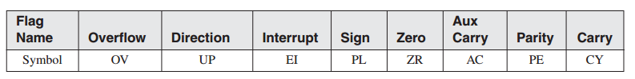

4 数据传输，编址与算术运算
^^^^^^^^^^^^^^^^^^^^^^^^^^^^

本章介绍传输数据与执行算术运算的指令。本章的大部分内容在于基本编址模型，例如直接，立即，以及使得处理数据成为可能的间接。与此同时，我们将会展示如何创建循环，与基本操作符，例如OFFSET，PTR，以及LENGTHOF，的使用。在阅读本章之后，你应该具有除条件语句之外的汇编语言的基本知识。

4.1 数据传输指令
-----------------

4.1.1 简介
>>>>>>>>>>>

当使用Java或C++等语言编程时，对于初学者而言，当编译器生成大量的语法错误信息时，很容易就会变得厌倦。编译器执行严格的类型检查来帮助你避免可能的错误，例如不匹配的变量与数据。与之相对，汇编器可以让你做你想要做的任何事情，只要处理器的指令集能够满足你的要求即可。换句话说，汇编语言强制你关注数据存储以及机器相关的细节。当你编写汇编语言代码时，你必须知道了解处理器的极限。恰好，x86处理器通常被称为复杂指令集，因为提供了多种方法来实现目的。

如果你花费时间按部就班学习本章提供的学习内容，本书的其余部分读起来就会更加容易。随着示例程序变得更复杂，你将会更加依赖对于本章提供的基础工具的掌握。

4.1.2 操作类型
>>>>>>>>>>>>>>>>

第3章介绍了x86指令格式：

.. code-block::

    [label:] mnemonic [operands][ ; comment ]

指令可以有零个，一个，两个，或三个操作数。为清晰起见，在这里我们省略了标签与注释：

.. code-block::

    mnemonic
    mnemonic [destination]
    mnemonic [destination],[source]
    mnemonic [destination],[source-1],[source-2]

有三种基本操作数类型：

* 立即-使用数值字面量表达式
* 寄存器-使用CPU中的命名寄存器
* 内存-引用内存地址

表4-1描述了标签操作数类型。它使用了一种由Intel手册修改而来的操作数（32模式）符号。我们将会使用该符号来描述单个指令的语法。

4.1.3 直接内存操作数
>>>>>>>>>>>>>>>>>>>>>

在数据段内，变量名指向偏移量。例如，下述对于名为var1的变量的声明表明其尺寸属性为byte，并且包含十六进制值10：

.. code-block::

    .data
    var1 BYTE 10h

我们可以使用其地址来编写解引用（查找）内存操作数的指令。如果var1位于偏移量10400h处，则下面的指令将其值拷贝到AL器中：

.. code-block::

    mov al var1

它将会被汇编为下述的机器指令：

.. code-block::

    A0 00010400

机器指令中的第一个字节是操作码（也被称为opcode）。其余部分是var1的32位十六进制地址。尽管可以仅使用数值地址进行编程，但符号名，例如var1，使得引用内存更为简便。

对于直接操作数，一些程序员更喜欢使用如下所示的符号，因为方括号意味着解引用操作：

.. code-block::

    mov al,[var1]

MASM允许该符号，所以你可以在自己的程序中使用该符号。因为如此多的程序（包括Microsoft自己的程序）并不使用方括号，因而在本书中，我们仅在涉及算术表达式时使用该符号：

.. code-block::

    mov al,[var1 + 5]

这被称为直接偏移操作数，我们将会在4.1.8节中讨论该主题。

4.1.4 MOV指令
>>>>>>>>>>>>>>>

MOV指令将数据由源操作数拷贝到目的操作数。作为数据传输指令，它几乎被用于所有的程序中。其基本格式为，第一个操作数为目的操作数，第二个操作数为源操作数：

.. code-block::

    MOV destination,source

目的操作数的内容会发生变化，而源操作保持不变。数据由右向左移动类似于C++或Java中的赋值语句：

.. code-block::

    dest = source;

在几乎所有的汇编语言指令中，左侧操作数为目的操作数，而后右侧操作数为源操作数。MOV在其操作数的使用上非常灵活，但要遵循如下规则：

* 两个操作数必须具有相同的尺寸。
* 两个操作数不能都为内存操作数。
* 指令指针寄存器（IP，EIP或RIP）不能为目的操作数。

如下为标准MOV指令格式列表：

.. code-block::

    MOV reg,reg
    MOV mem,reg
    MOV reg,mem
    MOV mem,imm
    MOV reg,imm

*内存到内存* 不能使用一条MOV指令将数据直接由一处内存移动另一处内存。相反，在将其值赋给内存操作数之前，你必须将源操作数的值移动到寄存器：

.. code-block::

    .data
    var1 WORD ?
    var2 WORD ?
    .code
    mov ax,var1
    mov var2,ax

当将数据拷贝到变量或寄存器时，你必须考虑寄存器常量所要求的最小字节数。对于无符号整数常量，参看第1章中的表1-4。对于带符号整数常量，参看表1-7。

重叠值
:::::::::

下面的示例代码展示了如何使用不同尺寸的数据来修改同一个32位寄存器。当oneWord被拷贝到AX时，它会覆盖AL中已有的值。当oneDword被拷贝到EAX时，它会覆盖AX。最后，当0被拷贝到AX时，它会覆盖EAX的低半部分。

.. code-block::

    .data
    oneByte BYTE 78h
    oneWord WORD 1234h
    oneDword DWORD 12345678h
    .code
    mov eax,0 ; EAX = 00000000h
    mov al,oneByte ; EAX = 00000078h
    mov ax,oneWord ; EAX = 00001234h
    mov eax,oneDword ; EAX = 12345678h
    mov ax,0 ; EAX = 12340000h

4.1.5 整数的零位/符号位扩展
>>>>>>>>>>>>>>>>>>>>>>>>>>>

将小值拷贝到大值
:::::::::::::::::

尽管MOV不能直接将数据由小操作数拷贝到大操作数，程序员可以创建变通方案。如果count（无符号，16位）必须被拷贝到ECX（32位）。我们可以将ECX设置为0，并将count拷贝到CX：

.. code-block::

    .data
    count WORD 1
    .code
    mov ecx,0
    mov cx,count

如果我们对负整数-16尝试同样的方法会发生什么呢？

.. code-block::

    .data
    signedVal SWORD -16 ; FFF0h (-16)
    .code
    mov ecx,0
    mov cx,signedVal ; ECX = 0000FFF0h (+65,520)

ECX中的值（+65,520）与-16完全不同。与之相对，如果我们首先使用FFFFFFFFh填充ECX，然后将signedVal拷贝到CX，则会得到正确的结果：

.. code-block::

    mov ecx,0FFFFFFFFh
    mov cx,signedVal ; ECX = FFFFFFF0h (-16)

该示例的有效结果是使用源操作数的最高位（1）来目的操作数，ECX，的高16位。此种技术被称为符号扩展。当然，我们不能总是假定源操作数的最高位为1。幸运的是，Intel的工程师在设计指令集时已经预见到了该问题，并且引入了MOVZX与MOVSX指令来处理无符号与带符号整数。

MOVZX指令
:::::::::::

MOVZX指令（零扩展移动）将源操作数的内容拷贝到目的操作数，并使用零扩展将值扩展为16位或32位。该指令仅用于无符号整数。有三种变形：

.. code-block::

    MOVZX reg32,reg/mem8
    MOVZX reg32,reg/mem16
    MOVZX reg16,reg/mem8

（操作数符号在表4-1中解释）。在每一种变形中，第一个操作数（寄存器）为目的操作数，而第二个操作数为源操作数。注意，源操作数不能为常量。下述示例使用零扩展将二进制数10001111拷贝到AX：

.. code-block::

    .data
    byteVal BYTE 10001111b
    .code
    movzx ax,byteVal ; AX = 0000000010001111b

图4-1展示了源操作数如何使用零扩展拷贝到16位目的操作数。

.. image/figure-4-1.png

下述示例使用寄存器作为所有操作数，展示了所有尺寸变化：

.. code-block::

    mov bx,0A69Bh
    movzx eax,bx ; EAX = 0000A69Bh
    movzx edx,bl ; EDX = 0000009Bh
    movzx cx,bl ; CX = 009Bh

下面的示例使用内存操作数作为源操作数并得到相同的结果：

.. code-block::

    .data
    byte1 BYTE 9Bh
    word1 WORD 0A69Bh
    .code
    movzx eax,word1 ; EAX = 0000A69Bh
    movzx edx,byte1 ; EDX = 0000009Bh
    movzx cx,byte1 ; CX = 009Bh

MOVSX指令
::::::::::::

MOVSX指令（符号扩展移动）将源操作数的内容拷贝到目的操作数，并使用符号扩展将值扩展为16或32位。该指令仅用于带符号整数。有三种变形：

.. code-block::

    MOVSX reg32,reg/mem8
    MOVSX reg32,reg/mem16
    MOVSX reg16,reg/mem8

操作数的符号扩展是使用小操作数的最高位，并在目的操作数的扩展位中重复（复制）。下面的示例使用符号扩展将二进制数10001111拷贝到AX：

.. code-block::

    .data
    byteVal BYTE 10001111b
    .code
    movsx ax,byteVal ; AX = 1111111110001111b

低8位的拷贝如图4-2所示。源操作数的最高位被拷贝到目的操作数的高8位。

对十六进制常量而言，如果最高位的十六进制数大于7，则设置其最高位。在下面的示例中，被拷贝到BX的十六进制值为A69B，开头的"A"数字告诉我们要设置最高位。（A69B前面的零只是一个符号约定，从而使得汇编器不会将其内容误认作标识符的名字）

.. code-block::

    mov bx,0A69Bh
    movsx eax,bx ; EAX = FFFFA69Bh
    movsx edx,bl ; EDX = FFFFFF9Bh
    movsx cx,bl ; CX = FF9Bh

4.1.6 LAHF与SAHF指令
>>>>>>>>>>>>>>>>>>>>>

LAHF（load status flags into AH）指令将EFLAGS寄存器的低字节拷贝到AH。下列标记会被拷贝：符号，零，辅助进位，校验，与进位。使用该指令，我们可以很容易将标记拷贝保存到变量中以用于安全保护：

.. code-block::

    .data
    saveflags BYTE ?
    .code
    lahf ; load flags into AH
    mov saveflags,ah ; save them in a variable

SAHF（store AH into status flags）指令将AH的内容拷贝到EFLAGS（或RFLAGS）寄存器的低字节。例如，我们可以获取之前保存在变量中的标记值：

.. code-block::

    mov ah,saveflags ; load saved flags into AH
    sahf ; copy into Flags register

4.1.7 XCHG指令
>>>>>>>>>>>>>>>>

XCHG（交换数据）指令交换两个操作数的内容。有三种变形：

.. code-block::

    XCHG reg,reg
    XCHG reg,mem
    XCHG mem,reg

XCHG指令中的操作数规则与MOV指令相同（4.1.4节），所不同的是XCHG不接受立即操作数。在数据排序应用中，XCHG为交换两个数组元素提供了一种简单方法。下面是使用XCHG的一些示例：

.. code-block::

    xchg ax,bx ; exchange 16-bit regs
    xchg ah,al ; exchange 8-bit regs
    xchg var1,bx ; exchange 16-bit mem op with BX
    xchg eax,ebx ; exchange 32-bit regs

要交换两个内存操作数，使用寄存器作为临时容器，并将MOV与XCHG结合使用：

.. code-block::

    mov ax,val1
    xchg ax,val2
    mov val1,ax

4.1.8 直接偏移操作数
>>>>>>>>>>>>>>>>>>>>>

你可以向变量的名字添加一个偏移，创建一个直接偏移操作数。这允许你在没有显式标签的情况访问内存标签。让我们由一个名为arrayB的字节数组开始：

.. code-block::

    arrayB BYTE 10h,20h,30h,40h,50h

如果我们使用arrayB作为MOV的第二个参数，我们自动拷贝数组的第一个字节：

.. code-block::

    mov al,arrayB ; AL = 10h

我们可以通过将arrayB的偏移量加1来访问数组中的第二个字节：

.. code-block::

    mov al,[arrayB+1] ; AL = 20h

通过添加2访问第三个字节：

.. code-block::

    mov al,[arrayB+2] ; AL = 30h

通过向变量的偏移添加一个常量，表达式，例如arrayB+1，可以得到所谓的有效地址（effective address）。使用方括号包装有效地址可以使得表达式被解引用来访问内存地址的内容的目的更为清晰。汇编器并不要求你使用方括号包装地址表达式，但是我们强烈推荐你使用以增强清晰性。

MASM并没有对有效地址提供内建范围支持。在下面的示例中，如果arrayB有五个字节，指令会由数组外的内存中获取一个字节。所得到的结果是一个逻辑bug，所以在检查数据引用时要额外小心：

.. code-block::

    mov al,[arrayB+20] ; AL = ??

*字与双字数组* 在16位字的数组中，每个数组元素的偏移是2个字节，而不是之前的1个字节。这也正是我们在下面的示例中向ArrayW添加2来访问第二个元素的原因：

.. code-block::

    .data
    arrayW WORD 100h,200h,300h
    .code
    mov ax,arrayW ; AX = 100h
    mov ax,[arrayW+2] ; AX = 200h

类似的，双字数组中的第二个元素距离第一个元素的偏移为4个字节：

.. code-block::

    .data
    arrayD DWORD 10000h,20000h
    .code
    mov eax,arrayD ; EAX = 10000h
    mov eax,[arrayD+4] ; EAX = 20000h

4.1.9 示例程序（Move）
>>>>>>>>>>>>>>>>>>>>>>

让我们组合本章目前为止所涉及到的所有指令，包手MOV，XCHG，MOVSX，与MOVZX，来展示如何展示字节，字，与双字是如何被影响的。我们也可以包含一些直接偏移操作数。

.. code-block::

    ; Data Transfer Examples (Moves.asm)
    .386
    .model flat,stdcall
    .stack 4096
    ExitProcess PROTO,dwExitCode:DWORD
    .data
    val1 WORD 1000h
    val2 WORD 2000h
    arrayB BYTE 10h,20h,30h,40h,50h
    arrayW WORD 100h,200h,300h
    arrayD DWORD 10000h,20000h
    .code
    main PROC
    ; Demonstrating MOVZX instruction:
    mov bx,0A69Bh
    movzx eax,bx ; EAX = 0000A69Bh
    movzx edx,bl ; EDX = 0000009Bh
    movzx cx,bl ; CX = 009Bh
    ; Demonstrating MOVSX instruction:
    mov bx,0A69Bh
    movsx eax,bx ; EAX = FFFFA69Bh
    movsx edx,bl ; EDX = FFFFFF9Bh
    mov bl,7Bh
    movsx cx,bl ; CX = 007Bh
    ; Memory-to-memory exchange:
    mov ax,val1 ; AX = 1000h
    xchg ax,val2 ; AX=2000h, val2=1000h
    mov val1,ax ; val1 = 2000h
    ; Direct-Offset Addressing (byte array):
    mov al,arrayB ; AL = 10h
    mov al,[arrayB+1] ; AL = 20h
    mov al,[arrayB+2] ; AL = 30h
    ; Direct-Offset Addressing (word array):
    mov ax,arrayW ; AX = 100h
    mov ax,[arrayW+2] ; AX = 200h
    ; Direct-Offset Addressing (doubleword array):
    mov eax,arrayD ; EAX = 10000h
    mov eax,[arrayD+4] ; EAX = 20000h
    mov eax,[arrayD+4] ; EAX = 20000h
    INVOKE ExitProcess,0
    main ENDP
    END main

此程序并没有生成屏幕输出，但是我们可以（也应该）使用调试器来运行该程序。

在Visual Studio调试中显示CPU标记
:::::::::::::::::::::::::::::::::

要在调试会话中显示CPU状态标记，由Debug菜单中选择Windows，然后由Windows菜单中选择Registers。在Registers窗口中，右键点击并由下拉列表中选择Flags。我们必须调试一个程序才能看到这些选项。下表标识了Registers窗口内所用到的标记符号：

每个标记为赋值为0（无标记）或1（有标记）。如下所示：

随着我们在调试会话中逐行执行你的代码，当指令修改标记的值时，标记会显示为红色。通过逐行执行指令并关注标记值的变化，你可以学习到指令如何影响标记。

4.2 加法与减法
---------------

算术运算是汇编语言中一个神奇的大主题。本章将关注于加法与减法操作。然后我们将会在稍后的第7章中讨论乘法与除法。然后我们会在第12章探讨浮点运算。

让我们由其中最简单、最有效的指令开始：INC（增加）与DEC（减少），分别加1与减1。然后我们将会转移到可以提供更多可能的ADD，SUB与NEG（负号）指令。最后，我们会进入算术运算指令如何影响CPU状态标记（进位，符号，零，等）的讨论。记住，汇编语言即为所有细节。

4.2.1 INC与DEC指令
>>>>>>>>>>>>>>>>>>>>>>

INC（增加）与DEC（减少）指令分别将寄存器或内存操作数加1与减1。其语法为：

.. code-block::

    INC reg/mem
    DEC reg/mem

如下述示例：

.. code-block::

    .data
    myWord WORD 1000h
    .code
    inc myWord ; myWord = 1001h
    mov bx,myWord
    dec bx ; BX = 1000h

依据目的操作数的值，溢出、符号、零、辅助进位，以及校验标记等会发生变化。INC与DEC指令不影响进位标记（这是一件奇怪的事情）。

4.2.2 加法指令
>>>>>>>>>>>>>>>>

ADD指令将源操作数累加到相同尺寸的目的操作数。其语法为：

.. code-block::

    ADD dest,source

该操作不会改变源操作数，而和会被存储到目的操作数。可能的操作数集合与MOV指令（4.1.4）的操作数集合相同。下面是一个相加两个32位整数的简短代码示例：

.. code-block::

    .data
    var1 DWORD 10000h
    var2 DWORD 20000h
    .code
    mov eax,var1 ; EAX = 10000h
    add eax,var2 ; EAX = 30000h

*标记* 依据放置到目的操作数的值，进位、零、符号、溢出、辅助进位，以及校验标记会发生变化。我们将会在4.2.6节中讨论标记是如何起作用的。

4.2.3 SUB指令
>>>>>>>>>>>>>>

SUB指令由目的操作数中减去源操作数。可能的操作数集合与ADD和MOV指令相同。其语法为：

.. code-block::

    SUB dest,source

下面是将两个32位整数相减的简短代码示例：

.. code-block::

    .data
    var1 DWORD 30000h
    var2 DWORD 10000h
    .code
    mov eax,var1 ; EAX = 30000h
    sub eax,var2 ; EAX = 20000h

*标记* 依据存放在目的操作数的值，进位、零、符号、溢出、辅助进位，以及校验标记将会发生变化。

4.2.4 NEG指令
>>>>>>>>>>>>>>

NEG（负数）指令通过将数值转换为其2的补码来反转操作数的符号。下列操作数是被允许的：

.. code-block::

    NEG reg
    NEG mem

（回忆一下，通过反转目的操作数的所有位并加1可以得到数值的2的补码。）

*标记* 依据存放在目的操作数中的值，进位、零、符号、溢出、辅助进位，以及校验标记会发生变化。

4.2.5 实现算术运算表达式
>>>>>>>>>>>>>>>>>>>>>>>>

拥有ADD，SUB与NEG指令的武装，我们就拥有了在汇编语言中实现涉及加法，减法，与取负等的算术表达式的方法。换句话说，你可以模拟C++编译器所执行的操作，例如下面的语句：

.. code-block::

    Rval = -Xval + (Yval - Zval);

让我们看一下示例语句如何在汇编语言中实现。为此将会用到下述的32位变量：

.. code-block::

    Rval SDWORD ?
    Xval SDWORD 26
    Yval SDWORD 30
    Zval SDWORD 40

当翻译表达式时，分别计算每一项，最后将所有项组合。首先，我们将Xval的拷贝取负，并将其存储到寄存器中：

.. code-block::

    ; first term: -Xval
    mov eax,Xval
    neg eax ; EAX = -26

然后，Yval被拷贝到寄存器中，并与Zval相减：

.. code-block::

    ; second term: (Yval - Zval)
    mov ebx,Yval
    sub ebx,Zval ; EBX = -10

最后，将（EAX与EBX中的）两项相加：

.. code-block::

    ; add the terms and store:
    add eax,ebx
    mov Rval,eax ; -36

4.2.6 加法与减法影响的标记
>>>>>>>>>>>>>>>>>>>>>>>>>>

当执行算术运算指令时，我们经常希望知道一些关于结果的信息。它为负数，正数，或是零？对于目的操作数而言，它是否过大或过小？对这些问题的回答有助于我们检测计算错误，否则会引起错误的程序行为。我们使用CPU状态标记的值来检查算术运算的结果。我们同时使用状态标记来激活条件分支指令，这是程序逻辑的基本工具。下面是状态标记的快速浏览。

* 进位标记表明无符号整数溢出。例如，如果一条指令的目的操作数为8位，但是该指令生成大于11111111二进制数的结果，则设置进位标记。
* 溢出标记表明带符号整数溢出。例如，如果指令的目的操作数为16位，但是该指令生成小于-32,768十进制数的负数结果，则设置溢出标记。
* 零标记表明执行结果为零。例如，如果由另一个相等的值减去操作数，则设置零标记。
* 符号标记表明操作生成负数结果。如果目的操作数的最高位（MSB）被设置，则设置符号标记。
* 校验标记表明，在执行算术或布尔指令之后，在目的操作数的最低字节中是否出现偶数个1位。
* 当在目的操作数的最低字节的位置3出现1位进位时，则设置辅助进位标记。

无符号操作：零，进——与辅助进位
::::::::::::::::::::::::::::::

当算术运算的结果等于零时设置零标记。下面的示例展示了在执行SUB，INC，与DEC指令之后，目的寄存器与零标记的状态：

.. code-block::

    mov ecx,1
    sub ecx,1 ; ECX = 0, ZF = 1
    mov eax,0FFFFFFFFh
    inc eax ; EAX = 0, ZF = 1
    inc eax ; EAX = 1, ZF = 0
    dec eax ; EAX = 0, ZF = 1

加法与进位标记
:::::::::::::::

如果我们分别考虑加法也减法，则进位标记操作是最容易解释的。当将两个无符号整数相加时，进位标记是目的操作最高位进位的拷贝。我们可以说，当和超出目的操作数的空间尺寸时，CF=1。在下面的示例中，当和（100h）对于AL过大时，ADD指令会设置进位标记：

.. code-block::

    mov al,0FFh
    add al,1 ; AL = 00, CF = 1

图4-3展示了当将1加到0FFh时发生了什么。AL最高位多出的位会被拷贝到进位标记。

相反，如果将1加到AX中的00FFh，所得到的和可适用于16位，进位标记被清除：

.. code-block::

    mov ax,00FFh
    add ax,1 ; AX = 0100h, CF = 0

但是将1加到AX寄存器中的FFFFh会生成AX最高位的移出（进位）：

.. code-block::

    mov ax,0FFFFh
    add ax,1 ; AX = 0000, CF = 1

减法与进位标记
:::::::::::::::

当较小的无符号数减去较大的无符号数时，减法操作会设置进位标记。图4-4展示了当使用8位操作数，1减去2时会发生什么。下面是相应的汇编代码：

.. code-block::

    mov al,1
    sub al,2 ; AL = FFh, CF = 1

提示：INC与DEC指令不影响进位标记。将NEG指令应用于非零操作数时总是设置进位标记。

*辅助进位* 辅助进位标记（AC）表明目的操作数中位3的进位或借位。它主要用于埂进制编码十进制（BCD）算术操作中，但是也可以用于其他场景。如果我们向0Fh加1，所得到的和在位置4处包含一个1，其为位置3的进位：

.. code-block::

    mov al,0Fh
    add al,1 ; AC = 1

如下为其算术运算：

*校验* 当目的操作数的最低字节有偶数个1时，则设置校验标记（PF）。下述的ADD与SUB指令修改了AL的校验：

.. code-block::

    mov al,10001100b
    add al,00000010b ; AL = 10001110, PF = 1
    sub al,10000000b ; AL = 00001110, PF = 0

在ADD指令执行后，AL包含二进制数10001110（四个0位，四个1位），PF=1。在SUB指令执行之后，AL包含奇数个1位，所以校验标记等于0。

带符号操作：符号与溢出标记
::::::::::::::::::::::::::

*符号标记* 当带符号算术运算的结果为负时，符号标记被设置。下面的示例由一个小数（4）减去一个大数（5）：

.. code-block::

    mov eax,4
    sub eax,5 ; EAX = -1, SF = 1

由机械的角度来看，符号标记是目的操作的最高位的拷贝。下面的示例展示了当生成负数结果时，BL的十六进制值：

.. code-block::

    mov bl,1 ; BL = 01h
    sub bl,2 ; BL = FFh (-1), SF = 1

*溢出标记* 当带符号算术运算的结果使得操作数上溢或下溢时，溢出标记被设置。例如，由第1章我们知道带符号字节的最大可能整数值为+127，将其加1会导致上溢：

.. code-block::

    mov al,+127
    add al,1 ; OF = 1

类似地，带符号字节的最小可能整数值为-128，将其减1会导致下溢。目的操作数并没有保存合法的算术运算结果，并且溢出标记被设置：

.. code-block::

    mov al,-128
    sub al,1 ; OF = 1

*加法测试* 有一种非常简单的方法来测试当两个操作数相加时是否发生带符号溢出。发生溢出的情况：

* 两个正数操作数相加生成一个负数和
* 两个负数操作数相加生成一个正数和

当两个相加的操作数的符号不同时绝不会发生溢出。

*硬件如何检测溢出* 在加法或减法操作之后，CPU会使用一种非常有趣的机制来确定溢出标记的状态。最高位多出的值与最高位进入的值执行异或，所得到的结果被存放在溢出标记中。在图4-5中，我们展示了相加8位二进制整数10000000与11111110导致CF=1，其中carryIn(bit7)=0。换句话说，1 XOR 0得到OF=1。

*NEG指令* 如果目的操作数不能被正确存储时，NEG指令会得到非法的结果。例如，如果我们-128拷贝到AL，并尝试取负时，正确的结果值（+128）并不适合AL。溢出标记被设置，表明AL包含一个非法值：

.. code-block::

    mov al,-128 ; AL = 10000000b
    neg al ; AL = 10000000b, OF = 1

与之相对，如果对+127取负，所得到的结果合法，溢出标记被清除：

.. code-block::

    mov al,+127 ; AL = 01111111b
    neg al ; AL = 10000001b, OF = 0

4.2.7 示例程序（AddSubTest）
>>>>>>>>>>>>>>>>>>>>>>>>>>>>

如下所展示的AddSubTest程序使用ADD，SUB，INC，DEC，与NEG指令实现多种算术表达式，并且展示特定的状态标记是如何被影响的：

.. code-block::

    ; Addition and Subtraction (AddSubTest.asm)
    .386
    .model flat,stdcall
    .stack 4096
    ExitProcess proto,dwExitCode:dword
    .data
    Rval SDWORD ?
    Xval SDWORD 26
    Yval SDWORD 30
    Zval SDWORD 40
    .code
    main PROC
    ; INC and DEC
    mov ax,1000h
    inc ax ; 1001h
    dec ax ; 1000h
    ; Expression: Rval = -Xval + (Yval - Zval)
    mov eax,Xval
    neg eax ; -26
    mov ebx,Yval
    sub ebx,Zval ; -10
    add eax,ebx
    mov Rval,eax ; -36
    ; Zero flag example:
    mov cx,1
    sub cx,1 ; ZF = 1
    mov ax,0FFFFh
    inc ax ; ZF = 1
    ; Sign flag example:
    mov cx,0
    sub cx,1 ; SF = 1
    mov ax,7FFFh
    add ax,2 ; SF = 1
    ; Carry flag example:
    mov al,0FFh
    add al,1 ; CF = 1, AL = 00
    ; Overflow flag example:
    mov al,+127
    add al,1 ; OF = 1
    mov al,-128
    sub al,1 ; OF = 1
    INVOKE ExitProcess,0
    main ENDP
    END main

4.3 数据相关的操作符与指令（Directives）
-----------------------------------------

操作符与指令（directives）并不是可执行的指令（instructions）；相反，它们会被汇编器解释。我们可以大量汇编语言指令来获得关于地址与数据尺寸的信息：

* OFFSET操作符返回变量距离其封闭段起始处的偏移。
* PTR操作符允许你覆盖一个操作数的默认尺寸。
* TYPE操作符返回操作数或数组中每个元素的尺寸（以字节计）。
* LENGTHOF操作符返回数组中元素的个数。
* SIZEOF操作符返回数组初始化器所用的字节个数。

另外，LABEF指令为使用不同的尺寸重新定义同一个变量提供了方法。本章中的操作符与指令仅是MASM所支持的操作符的一个小部分。你可以在附录D中查看完整的列表。

4.3.1 OFFSET操作符
>>>>>>>>>>>>>>>>>>>>

OFFSET操作符返回一个数据标签的偏移量。偏移表示标签与数据段起始处的距离，以字节计。图4-6展示了数据段内一个名为myByte的变量。

OFFSET示例
::::::::::::::

在下面的示例中我们定义了三个不同的变量：

.. code-block::

    .data
    bVal BYTE ?
    wVal WORD ?
    dVal DWORD ?
    dVal2 DWORD ?

如果bVal位于00404000（十六进制）偏移处，OFFSET操作将会返回下列偏移量值：

.. code-block::

    mov esi,OFFSET bVal ; ESI = 00404000h
    mov esi,OFFSET wVal ; ESI = 00404001h
    mov esi,OFFSET dVal ; ESI = 00404003h
    mov esi,OFFSET dVal2 ; ESI = 00404007h

OFFSET也可以用于直接偏移操作数。假定myArray包含5个16位字。下列的MOV指令获取myArray的偏移，增加4，并将所得到的结果地址拷贝到ESI。我们可以看到ESI指向数据中第三个整数：

.. code-block::

    .data
    myArray WORD 1,2,3,4,5
    .code
    mov esi,OFFSET myArray + 4

我们可以使用另一个变量的偏移初始化一个双字变量，实际上创建一个指针。在下面的示例中，pArray指向bigArray的起始处：

.. code-block::

    .data
    bigArray DWORD 500 DUP(?)
    pArray DWORD bigArray

下面的语句将指针的值装入ESI，从而寄存器指向数组的起始处：

.. code-block::

    mov esi,pArray

4.3.2 ALIGN指令
>>>>>>>>>>>>>>>>>

ALIGN指令可以将变量对齐到一个字节，字，双字，或段落的边界。其语法为：

.. code-block::

    ALIGN bound

边界可以为1，2，4，8或16。值1将下一个变量对齐到1字节边界（默认情况）。如果边界为2，下一个变量将会被对齐到偶数地址。如果边界为4，下一个变量的地址将为4的倍数。如果边界为16，下一个变量的地址为16的倍数，即段落边界。为实现对齐，汇编器会在变量之前插入一个或多个空字节。什么关注数据对齐呢？因为CPU处理在偶数地址的数据存取要快于奇数地址的存取。

在下面的示例中，bVal位于00404000偏移处。在wVal之前插入ALIGN 2指令会使得其在偶数地址偏移处对齐：

.. code-block::

    bVal BYTE ? ; 00404000h
    ALIGN 2
    wVal WORD ? ; 00404002h
    bVal2 BYTE ? ; 00404004h
    ALIGN 4
    dVal DWORD ? ; 00404008h
    dVal2 DWORD ? ; 0040400Ch

注意，dVal本应在00404005偏移处，但是ALIGN 4指令使其位于00404008偏移处。

4.3.3 PTR操作符
>>>>>>>>>>>>>>>>>

你可以使用PTR操作覆盖一个操作数的声明尺寸。该操作符仅适用于当我们尝试使用不同于汇编器所认定的尺寸属性访问操作数时。

例如，假定你希望将一个名为myDouble的双字变量的低16位拷贝到AX中。汇编器不会允许下述拷贝，因为操作数的尺寸不匹配：

.. code-block::

    .data
    myDouble DWORD 12345678h
    .code
    mov ax,myDouble ; error

但是WORD PTR操作符使得将低位字（5678h）拷贝到AX成为可能：

.. code-block::

    mov ax,WORD PTR myDouble

为什么不是1234h被拷贝到AX呢？因为x86处理器使用小端存储格式，其中低位字节存储在变量的起始地址。在图4-7中，以三种方法展示了myDouble的内存布局：第一种作为双字，其次作为两个字（5678h，1234h），最后作为四个字节（78h，56h，34h，12h）。

我们可以三种方式之一来访问内存，而独立于变量被定义的方式。例如，如果myDouble由0000偏移处开始，在该地址存储的16位值为5678h。我们也可以使用下面的语句获取1234h，该字位于myDouble+2地址处：

.. code-block::

    mov ax,WORD PTR [myDouble+2] ; 1234h

类似地，我们可以使用BYTE PTR操作符将myDouble中的一个字节移动到BL：

.. code-block::

    mov bl,BYTE PTR myDouble ; 78h

注意，PTR必须是一种标准的汇编器数据类型配合使用：BYTE，SBYTE，WORD，SWORD，DWORD，SDOWRD，FWORD，QWORD或TBYTE。

*将较小值拷贝到较大的目的地址* 我们也许希望由内存中拷贝两个较小的值到一个较大的目的操作数。在下面的示例中，第一个字被拷贝到EAX的低半部分，而第二个字被拷贝到高半部分。DWORD PTR操作符会使其成为可能：

.. code-block::

    .data
    wordList WORD 5678h,1234h
    .code
    mov eax,DWORD PTR wordList ; EAX = 12345678h

4.3.4 TYPE操作符
>>>>>>>>>>>>>>>>>>>

TYPE操作符以字节形式返回一个变量的单个元素的尺寸。例如，一个字节的TYPE为1，一个字的TYPE为2，一个双字的TYPE为4，而一个四字的TYPE为8。如下述示例所示：

.. code-block::

    .data
    var1 BYTE ?
    var2 WORD ?
    var3 DWORD ?
    var4 QWORD ?

下表显示了每种TYPE表达式的值：

4.3.5 LENGTHOF操作符
>>>>>>>>>>>>>>>>>>>>>

LENGTHOF操作符计数与标签位于同一行的数组中元素的个数。如下面的示例所示：

.. code-block::

    .data
    byte1 BYTE 10,20,30
    array1 WORD 30 DUP(?),0,0
    array2 WORD 5 DUP(3 DUP(?))
    array3 DWORD 1,2,3,4
    digitStr BYTE "12345678",0

当在数组定义中使用嵌套DUP操作符时，LENGTHOF返回两个计数器的乘积。下表列出了每个LENGTHOF表达式返回的值：

如果我们声明了一个跨越多个程序行的数组，LENGTHOF仅考虑数组中第一行部分的数据。给定下列数据，LENGTHOF myArray将会返回值5：

.. code-block::

    myArray BYTE 10,20,30,40,50
            BYTE 60,70,80,90,100

或者，你可以使用逗号结束第一行，并继续初始化列表到第二行。给定下列数据，LENGTHOF myArray将会返回值10：

.. code-block::

    myArray BYTE 10,20,30,40,50,
                 60,70,80,90,100

4.3.6 SIZEOF操作符
>>>>>>>>>>>>>>>>>>>>>>>

SIZEOF操作符返回一个与LENGTHOF与TYPE乘积相等的值。在下面的示例中，intArray的TYPE=2，而LENGTHOF=32，所以SIZEOF intArray等于64：

.. code-block::

    .data
    intArray WORD 32 DUP(0)
    .code
    mov eax,SIZEOF intArray ; EAX = 64

4.3.7 LABEL指令
>>>>>>>>>>>>>>>>>>

LABEL指令允许你插入一个标签，同时为其指定一个尺寸属性，而不分配任何空间。所有标准的尺寸属性都可以用于LABEL，例如BYTE，WORD，DWORD，QWORD或TBYTE。LABEL的常见用法是为数据段中下一个声明的变量提供另外的名字与尺寸属性。在下面的示例中，我们在val32之前声明了一个名为val16的标签，并为其提供了一个WORD属性：

.. code-block::

    .data
    val16 LABEL WORD
    val32 DWORD 12345678h
    .code
    mov ax,val16 ; AX = 5678h
    mov dx,[val16+2] ; DX = 1234h

val16是val32存储位置的别名。LABEL本身并不分配任何空间。

有时我们希望由两个较小的整数构建一个较大的整数。在下面的示例中，EAX中的32位值是由两个16位变量拷贝得到的：

.. code-block::

    .data
    LongValue LABEL DWORD
    val1 WORD 5678h
    val2 WORD 1234h
    .code
    mov eax,LongValue ; EAX = 12345678h

4.4. 间接编址
---------------

直接编址很少用于数组处理，因为对于大量的数组元素使用相对于地址的常量偏移并不现实。相反，我们使用寄存器作为指针（被称为间接编址）并维护寄存器的值。当一个操作数使用间接编址时，它就被称为间接操作数。

4.4.1 间接操作数
>>>>>>>>>>>>>>>>>

*保护模式* 间接操作数可以是使用方括号包围的任意32位通用寄存器（EAX，EBX，ECX，EDX，ESI，EDI，EBP，以及ESP）。寄存器被认为包含某个数据的地址。在下面的示例中，ESI包含byteVal的偏移。MOV指令使用间接操作数作为源操作数，ESI中的偏移被解引用，从而一个字节被拷贝到AL中：

.. code-block::

    .data
    byteVal BYTE 10h
    .code
    mov esi,OFFSET byteVal
    mov al,[esi] ; AL = 10h

如果目的操作数使用间接编址，一个新的值将会被存放在由寄存器所指向的内存地址处。在下面的示例中，BL寄存器的内容被拷贝到ESI指向的内存地址处

.. code-block::

    mov [esi],bl

*PTR与间接操作数结合使用* 由指令的当前语境并不能确定操作数的尺寸。下面的指令会使得汇编器生成“操作数必须具有相同尺寸”的错误信息：

.. code-block::

    inc [esi] ; error: operand must have size

汇编器并不知道ESI指向的是字节，字，双字，还是其他尺寸。PTR操作数可以确保操作数尺寸：

.. code-block::

    inc BYTE PTR [esi]

4.4.2 数组
>>>>>>>>>>>>>

间接操作数是在数组中遍历的理想工具。在下面的示例中，arrayB包含3个字节。随着ESI的增加，它依次指向每个字节：

.. code-block::

    .data
    arrayB BYTE 10h,20h,30h
    .code
    mov esi,OFFSET arrayB
    mov al,[esi] ; AL = 10h
    inc esi
    mov al,[esi] ; AL = 20h
    inc esi
    mov al,[esi] ; AL = 30h

如果我们使用16位整数的数组，我们向ESI加2来编址每一个后续数组元素：

.. code-block::

    .data
    arrayW WORD 1000h,2000h,3000h
    .code
    mov esi,OFFSET arrayW
    mov ax,[esi] ; AX = 1000h
    add esi,2
    mov ax,[esi] ; AX = 2000h
    add esi,2
    mov ax,[esi] ; AX = 3000h

假定arrayW位于偏移10200h处。下图演示了ESI的初始值与数组数据的关系：

*示例：32位整数相加* 下面的示例代码将三个双字相加。为使其指向每一个后续数组值，必须向ESI增加4的增量，因为双字是4字节长：

.. code-block::

    .data
    arrayD DWORD 10000h,20000h,30000h
    .code
    mov esi,OFFSET arrayD
    mov eax,[esi] ; first number
    add esi,4
    add eax,[esi] ; second number
    add esi,4
    add eax,[esi] ; third number

假定arrayD位于偏移10200h处。那么下图演示了ESI的初始值与数组数据的关系：

4.4.3 索引操作数
>>>>>>>>>>>>>>>>>>>>

索引操作数向寄存器添加一个常量以生成有效地址。任意一个32位通用寄存器都可以用作索引寄存器。MASM允许不同的符号格式（方括号是符号的一部分）：

.. code-block::

    constant[reg]
    [constant + reg]

第一种符号格式将变量名与寄存器组合使用。变量名被汇编器转换为表示变量偏移的常量。下面是两种符号格式的示例：

索引参数非常适用于数组处理。在访问第一个数组元素之前，索引寄存器应被初始化为零：

.. code-block::

    .data
    arrayB BYTE 10h,20h,30h
    .code
    mov esi,0
    mov al,arrayB[esi] ; AL = 10h

最后一条语句将arrayB的偏移量添加到ESI。表达式[array + ESI]生成的地址被解引用，并且内存中的字节被拷贝到AL。

*增加位移* 第二种索引编址类型将寄存器与常量偏移组合使用。索引寄存器保存数组或结构的基地址，而常量表示各种数组元素的偏移。下面的示例展示了如何处理16位字数组：

.. code-block::

    .data
    arrayW WORD 1000h,2000h,3000h
    .code
    mov esi,OFFSET arrayW
    mov ax,[esi] ; AX = 1000h
    mov ax,[esi+2] ; AX = 2000h
    mov ax,[esi+4] ; AX = 3000h

*使用16位寄存器* 在实地址模式中，通常使用16位寄存器作为索引操作数。在此情况下，我们被限制仅可使用SI，DI，BX或BP：

.. code-block::

    mov al,arrayB[si]
    mov ax,arrayW[di]
    mov eax,arrayD[bx]

对于间接操作数的情况，避免使用BP，除非编址数据位于栈上。

索引操作数中的缩放因子
::::::::::::::::::::::::::

当计算偏移量时，索引操作数必须考虑每个数组元素的尺寸。正如下面的示例所示，使用双字数组时，我们将下标（3）乘以4（双字的尺寸）以生成包含400h的数组元素的偏移量：

.. code-block::

    .data
    arrayD DWORD 100h, 200h, 300h, 400h
    .code
    mov esi,3 * TYPE arrayD ; offset of arrayD[3]
    mov eax,arrayD[esi] ; EAX = 400h

Intel设计者希望使得常见操作对编译器作者更容易，所以他们使用缩放因子为偏移量的计算提供了一种方法。缩放因子是数组元素的尺寸（字为2，双字为4，或四字为8）。让我们再次回顾我们之前的示例，将ESI设置为下标（3），并为双字将ESI乘以缩放因子（4）：

.. code-block::

    .data
    arrayD DWORD 1,2,3,4
    .code
    mov esi,3 ; subscript
    mov eax,arrayD[esi*4] ; EAX = 4

在未来将arrayD重新定义为其他类型，TYPE操作符可以使得索引更为灵活：

.. code-block::

    mov esi,3 ; subscript
    mov eax,arrayD[esi*TYPE arrayD] ; EAX = 4

4.4.4 指令
>>>>>>>>>>>>>

包含另一个变量的地址的变量被称为指针。指针是用于维护数组与数据结构的良好工具，因为它们所保存的地址可以在运行时修改。例如，你可以使用系统调用来分配内存块，并将块的地址保存在变量中。指针的尺寸大小是由处理器的当前模式（32位或64位）所影响的。在下面的32位代码示例中，ptrB包含arrayB的偏移：

.. code-block::

    .data
    arrayB byte 10h,20h,30h,40h
    ptrB dword arrayB

另外，你可以使用OFFSET操作符来声明ptrB来使得关系更为清晰：

.. code-block::

    ptrB dword OFFSET arrayB

本书中的32位模式程序使用近指针，所以它们被存储在双字变量中。如下述两个示例：ptrB包含arrayB的偏移，而ptrW包含arrayW的偏移：

.. code-block::

    arrayB BYTE 10h,20h,30h,40h
    arrayW WORD 1000h,2000h,3000h
    ptrB DWORD arrayB
    ptrW DWORD arrayW

或者，你可以使用OFFSET操作符来使得关系更为清晰：

.. code-block::

    ptrB DWORD OFFSET arrayB
    ptrW DWORD OFFSET arrayW

高级语言故意隐藏指针的物理细节，因为他们的实现会随着机器体系结构而变化。在汇编语言中，因为我们处理单一的实现，我们在物理级别检视并使用指针。这种方法有助于移除一些神奇的局部指针。

使用TYPEDEF操作符
::::::::::::::::::

TYPEDEF操作符允许你创建用户定义类型，使用该类型定义变时具有内建类型的所有状态。TYPEDEF是用于创建指针变量的理想工具。例如，下面的示例声明创建一个指向字节的新的数据类型PBYTE：

.. code-block::

    PBYTE TYPEDEF PTR BYTE

该声明通常被放置在接近程序开始的位置，在数据段之前。然后，可以使用PBYTE定义变量：

.. code-block::

    .data
    arrayB BYTE 10h,20h,30h,40h
    ptr1 PBYTE ? ; uninitialized
    ptr2 PBYTE arrayB ; points to an array

*示例程序：Pointers* 下面的示例程序（pointers.asm）使用TYPEDEF创建三个指针类型（PBYTE，PWORD，PDWORD）。它创建几个指针，赋值几个数组偏移，并解引用指针：

.. code-block::

    TITLE Pointers (Pointers.asm)
    .386
    .model flat,stdcall
    .stack 4096
    ExitProcess proto,dwExitCode:dword
    ; Create user-defined types.
    PBYTE TYPEDEF PTR BYTE ; pointer to bytes
    PWORD TYPEDEF PTR WORD ; pointer to words
    PDWORD TYPEDEF PTR DWORD ; pointer to doublewords
    .data
    arrayB BYTE 10h,20h,30h
    arrayW WORD 1,2,3
    arrayD DWORD 4,5,6
    ; Create some pointer variables.
    ptr1 PBYTE arrayB
    ptr2 PWORD arrayW
    ptr3 PDWORD arrayD
    .code
    main PROC
    ; Use the pointers to access data.
    mov esi,ptr1
    mov al,[esi] ; 10h
    mov esi,ptr2
    mov ax,[esi] ; 1
    mov esi,ptr3
    mov eax,[esi] ; 4
    invoke ExitProcess,0
    main ENDP
    END main

4.5 JMP与LOOP指令
----------------------

默认情况下，CPU载入并顺序执行程序。但是当前指令也许是有条件的，意味着基于CPU状态标记（零，符号，进位，等）的值，它会将控制权传递给程序中的一个新位置处。汇编语言使用条件指令来实现诸如IF语句与循环的高级语句。每一个条件语句是将控制传递（跳转）到不同的内存地址。控制或分支的传递是修改语句执行顺序的方法。两种基本的传递类型：

* 无条件传递：控制会在所有的情况下被传递到一个新位置；新的地址被载入到指令指针，使得程序在新地址处继续执行。JMP指令实现该目的。
* 条件跳转：如果特定条件为真时，程序跳转。多种条件传递指令可以被组合来创建条件逻辑结构。CPU基于ECX与标记寄存器的内容解释真/假条件。

4.5.1 JMP指令
>>>>>>>>>>>>>>>>

JMP指令使得无条件传递到由代码标签标识的目的地址处，该标签被汇编器转换为偏移量。其语法为：

.. code-block::

    JMP destination

当CPU执行无条件传递时，目的的偏移量被拷贝到指令指针，使得程序在新地址处继续执行。

*创建循环* 通过跳转到循环顶部的标签，JMP指令提供一种创建循环的简单方法：

.. code-block::

    top:
    . .
    jmp top ; repeat the endless loop

JMP是无条件传递，所以上面示例中的循环会不断继续，除非找到另一种退出循环的方法。

4.5.2 LOOP指令
>>>>>>>>>>>>>>>>>

LOOP指令，通常也被称为基于ECX计数器的循环（Loop According to ECX Counter），以指定的次数重复执行语句块。ECX被自动用作计数器，并且在每次循环重复时递减。其语法为：

.. code-block::

    LOOP destination

循环的目的地址必须在当前位置计数器的-128字节到+127字节范围内。LOOP指令的执行涉及到两个步骤：首先，由ECX减去1。然后，将ECX与零进行比较。如果ECX不等于零，执行跳转到destination所标识的标签。否则，如果ECX等于零，不发生跳转，控制传递给循环之后的指令。

在实地址模式中，CX是LOOP指令的默认循环计数器。另一方面，LOOPD指令使用ECX作为循环计数器，而LOOPW指令使用CX作为循环计数器。

在下面的示例中，在每次循环重复时，我们向AX加1。当循环结束时，AX=5而ECX=0：

.. code-block::

    mov ax,0
    mov ecx,5
    L1:
    inc ax
    loop L1

一个常见的错误是在循环开始之前并没有预先将ECX初始化为零。如果出现此种错误，LOOP指令递减ECX为FFFFFFFFh，而循环会重复4,294,967,296次。如果CX为循环计数器（实地址模式中），它会重复65,536次。

有时，也许你会创建过大的循环，超出了LOOP指令允许的相对跳转范围。如下所示是MASM生成的错误信息，因为LOOP指令的目标标签太远：

.. code-block::

    error A2075: jump destination too far : by 14 byte(s)

你在循环内部几站不会修改ECX。如果你要这样做，LOOP指令也许并不会按所希望工作。在下面的示例中，ECX在循环内递增。它绝不会到达零，所以循环不会结束：

.. code-block::

    top:
    . .
    inc ecx
    loop top

如果你需要在循环内修改ECX，你可以在循环开始时将其保存到变量中，并在LOOP指令之前将其重新载入：

.. code-block::

    .data
    count DWORD ?
    .code
    mov ecx,100 ; set loop count
    top:
    mov count,ecx ; save the count
    .
    mov ecx,20 ; modify ECX
    .
    mov ecx,count ; restore loop count
    loop top

*嵌入循环* 当在另一个循环内部创建循环时，必须对ECX中的外部循环计数器给以特殊考虑。你可以将其保存到变量中：

.. code-block::

    .data
    count DWORD ?
    .code
    mov ecx,100 ; set outer loop count
    L1:
    mov count,ecx ; save outer loop count
    mov ecx,20 ; set inner loop count
    L2:
    . .
    loop L2 ; repeat the inner loop
    mov ecx,count ; restore outer loop count
    loop L1 ; repeat the outer loop

作为一条通用规则，超过两层深度的嵌入循环很难编写。如果你所使用的算法要求较深的循环嵌套，可以将部分内部循环移到子例程中。

4.5.3 在Visual Stuido调试器中显示数组
>>>>>>>>>>>>>>>>>>>>>>>>>>>>>>>>>>>>>

在调试会话中，如果你希望显示数组的内容，可以按下述步骤执行：由Debug菜单中，选择Windows，选择Memory，然后选择Memory 1。一个内存窗口将会出现，而你可以使用鼠标托拽将其停放在Visual Studio工作空间的任何一侧。你可以右键点击窗口标题栏，以表明你希望窗口悬浮在编辑器窗口之上。在内存窗口顶部的Address域，输入&字符，后跟数组名字，并按下Enter。例如，&myArray是一个合法的地址表达式。内存窗口将会显示数组地址起始处的内存块。如图4-8所示。

如果你的数组值是双字，你可以内存窗口内右键点击，并由弹出菜单中选择4字节整数。你可以由不同的格式中选择，包括十六进制显示，带符号十进制整数（被称为带符号显示），或是无符号十进制整数（被称为无符号显示）格式。完整的选择显示在图4-9中。

4.5.4 整数数组求和
>>>>>>>>>>>>>>>>>>>>

在刚开始编程时，没有比计算数组中元素的和更常见的任务了。在汇编语言中，你可以遵循下述步骤：

1. 将数组地址赋给寄存器，并将其用作索引操作数。
2. 将循环计数器初始化为数组长度。
3. 将累加求和的寄存器赋值为零。
4. 创建一个标签标记循环开始。
5. 在循环体中，将单个元素累加到和中。
6. 指向下一个数组元素。
7. 使用LOOP指令来重复循环。

步骤1至3可以任意顺序执行。下面是一个计算16位整数数组的简短程序：

.. code-block::

    ; Summing an Array (SumArray.asm)
    .386
    .model flat,stdcall
    .stack 4096
    ExitProcess proto,dwExitCode:dword
    .data
    intarray DWORD 10000h,20000h,30000h,40000h
    .code
    main PROC
    mov edi,OFFSET intarray ; 1: EDI = address of intarray
    mov ecx,LENGTHOF intarray ; 2: initialize loop counter
    mov eax,0 ; 3: sum = 0
    L1: ; 4: mark beginning of loop
    add eax,[edi] ; 5: add an integer
    add edi,TYPE intarray ; 6: point to next element
    loop L1 ; 7: repeat until ECX = 0
    invoke ExitProcess,0
    main ENDP
    END main

4.5.5 拷贝字符串
>>>>>>>>>>>>>>>>>

程序经常要从一个内存地址处拷贝大块数据到另一个内存地址处。数据也许是字符串数组，但它们可以包含任意对象类型。让我们来了解一下在汇编语言中如何使用循环来拷贝由字节数组与空字符值表示的字符串。索引编址同样适用于此种操作类型，因为同一个索引器同时指向两个字符串。目标字符串必须有足够的空间以接收拷贝的字符，包括结尾处的空字节：

.. code-block::

    ; Copying a String (CopyStr.asm)
    .386
    .model flat,stdcall
    .stack 4096
    ExitProcess proto,dwExitCode:dword
    .data
    source BYTE "This is the source string",0
    target BYTE SIZEOF source DUP(0)
    .code
    main PROC
    mov esi,0 ; index register
    mov ecx,SIZEOF source ; loop counter
    L1:
        mov al,source[esi] ; get a character from source
        mov target[esi],al ; store it in the target
        inc esi ; move to next character
        loop L1 ; repeat for entire string
        invoke ExitProcess,0
    main ENDP
    END main

MOV指令的两个操作不能都为内存操作数，所以每个字符被由源字符串拷贝到AL，然后由AL拷贝到目标字符串。

4.6 64位编程
------------
64位模式下的MOV指令与32位模式基本相同。在这时我们会讨论其中的一些小区别。即时操作数（常量）可以是8，16，32，或64位。如下为64位的示例：

.. code-block::

    mov rax,0ABCDEFGAFFFFFFFFh ; 64-bit immediate operand   

当你将32位常量拷贝到62位寄存器时，目的寄存器的高32位（32-63位）会被清除（等于零）：

.. code-block::

    mov rax,0FFFFFFFFh ; rax = 00000000FFFFFFFF

当你将16位常量或8位常量拷贝到64寄存器时，高位同样会被清除：

.. code-block::

    mov rax,06666h ; clears bits 16-63
    mov rax,055h ; clears bits 8-63

然而，当你将内存操作数拷贝到64位寄存器时，所得到的结果是混合的。例如，将32位内存操作数拷贝到EAX（RAX的低半部分）使得RAX中的高32位被清除：

.. code-block::

    .data
    myDword DWORD 80000000h
    .code
    mov rax,0FFFFFFFFFFFFFFFFh
    mov eax,myDword ; RAX = 0000000080000000

但是当你将8位或16位内存操作数拷贝到RAX中的低位时，目的寄存器的高位并不会被影响：

.. code-block::

    .data
    myByte BYTE 55h
    myWord WORD 6666h
    .code
    mov ax,myWord ; bits 16-63 are not affected
    mov al,myByte ; bits 8-63 are not affected

MOVSXD指令（带符号扩展拷贝）允许源操作数为32位寄存器或内存操作数。下述指令会使得RAX等FFFFFFFFFFFFFFFFh：

.. code-block::

    mov ebx,0FFFFFFFFh
    movsxd rax,ebx

OFFSET操作符生成64位地址，该地址必须存放在64位寄存器或变量中。在下面的示例中，我们使用RSI寄存器：

.. code-block::

    .data
    myArray WORD 10,20,30,40
    .code
    mov rsi,OFFSET myArray

64位模式中的LOOP指令使用RCX寄存器作为循环计数器。

有了这些基本概论，你就可以编写一个64位模式下的程序。大多数时候，如果你统一使用64位整数变量与64位寄存器，编程会很简单。ASCII字符串是一种特殊情况，因为他们总是包含字节。通常，当处理ASCII字符串时，你使用间接或索引编址。

4.6.2 SumArray的64位版本
>>>>>>>>>>>>>>>>>>>>>>>>>>

让我们在64位模式下重新编写SumArray程序。它计算64位整数数组的和。首先，我们使用QWORD指令来创建四字数组。然后，我们将所有的32位寄存器名改变64位寄存器名。下面是完整的程序列表：

.. code-block::

    ; Summing an Array (SumArray_64.asm)
    ExitProcess PROTO
    .data
    intarray QWORD 1000000000000h,2000000000000h
    QWORD 3000000000000h,4000000000000h
    .code
    main PROC
    mov rdi,OFFSET intarray ; RDI = address of intarray
    mov rcx,LENGTHOF intarray ; initialize loop counter
    mov rax,0 ; sum = 0
    L1: ; mark beginning of loop
        add rax,[rdi] ; add an integer
        add rdi,TYPE intarray ; point to next element
        loop L1 ; repeat until RCX = 0
        mov ecx,0 ; ExitProcess return value
        call ExitProcess
    main ENDP
    END

4.6.3 加法与减法
>>>>>>>>>>>>>>>>>>>>>

ADD，SUB，INC，以及DEC指令在64位模式下影响CPU状态标记的方式与32位模式相同。在下面的示例中，我们将1加到RAX中的32位整数。每一个向左移动，使得1被插入到32位：

.. code-block::

    mov rax,0FFFFFFFFh ; fill the lower 32 bits
    add rax,1 ; RAX = 100000000h

应该总是知道你的操作数的尺寸大小。当你使用部分寄存器操作数时，要小心寄存器的其余部分并没有被修改。在下面的示例中，AX中的16位和变为零，而并没有影响RAX中的高位部分。这是因为该操作使用16位寄存器（AX与BX）：

.. code-block::

    mov rax,0FFFFh ; RAX = 000000000000FFFF
    mov bx,1
    add ax,bx ; RAX = 0000000000000000

类似的，在下面的示例中，AL中的和并不会向RAX中的其他位进位。在ADD指令之后，RAX等于零：

.. code-block::

    mov rax,0FFh ; RAX = 00000000000000FF
    mov bl,1
    add al,bl ; RAX = 0000000000000000

同样的规则也适用于减法操作。在下面的代码片段中，由EAX中的零减去1会使得RAX的低32位变为-1（FFFFFFFFh）。类似地，由AX中的零减去1会使得RAX的低16位变为-1（FFFFh）。

.. code-block::

    mov rax,0 ; RAX = 0000000000000000
    mov ebx,1
    sub eax,ebx ; RAX = 00000000FFFFFFFF
    mov rax,0 ; RAX = 0000000000000000
    mov bx,1
    sub ax,bx ; RAX = 000000000000FFFF

当指令包含间接操作数时，必须使用64位通用寄存器。记住，你必须使用PTR操作符来清晰描述目的操作数的尺寸。如下述示例所示，包含一个64位目的：

.. code-block::

    dec BYTE PTR [rdi] ; 8-bit target
    inc WORD PTR [rbx] ; 16-bit target
    inc QWORD PTR [rsi] ; 64-bit target

在64位模式中，你可以在索引操作数中使用缩放因子，就如同我们在32位模式中所做的那样。如果你正在处理64位整数的数组，使用8作为缩放因子。如下列示例所示：

.. code-block::

    .data
    array QWORD 1,2,3,4
    .code
    mov esi,3 ; subscript
    mov eax,array[rsi*8] ; EAX = 4

在64位模式中，指针变量保存64偏移量。在下面的示例中，ptrB变量保存arrayB的偏移：

.. code-block::

    .data
    arrayB BYTE 10h,20h,30h,40h
    ptrB QWORD arrayB

或者，你可以傅OFFSET操作符来声明ptrB使得其间的关系更为清晰：

.. code-block::

    ptrB QWORD OFFSET arrayB

4.7 本章小结
-------------

数据传输指令MOV将源操作数拷贝到目的操作数。MOVZX指令使用零扩展将小操作数扩展为大操作数。MOVSX指令使用符号扩展将小操作数扩展为大操作数。XCHG指令交换两个操作数的内容。必须至少有一个操作数为寄存器。

*操作数类型* 在本章中探讨了下列操作数类型：

* 直接操作数为变量名，并且表示变量的地址。
* 直接偏移操作数向变量名添加位移，生成一个新的偏移量。新的偏移量可以用来访问内存中的数据。
* 间接操作数是包含数据地址的寄存器。通过使用方括号将寄存器括起来（例如[esi]），程序解引用地址并获取内存数据。
* 索引操作数将常量与间接操作数结合。常量与寄存器值相加，并且得到的结果被解引用。例如，[array+esi]与array[esi]是索引操作数。

下述的算术指令非常重要：

* INC指令向操作数加1。
* DEC指令由操作数减1。
* ADD指令将源操作数加到目的操作数。
* SUB指令由目的操作数减去源操作数。
* NEG指令反转操作数的符号。

当将简单的算术表达式转换为汇编语言时，首先使用标准操作符优先级规则来选择要计算的表达式。

*状态标记* 算术操作会修改下述的CPU状态标记：

* 当算术操作的结果为负数时，符号标记被设置。
* 当无符号算术操作的结果对于目的操作数过大时，进位标记被设置。
* 校验标记表明在算术或布尔指令执行后，目的操作数的低位字节中出现1的位数是否为偶数。
* 当目的操作数的位3出现进位或借位时，辅助进位标记会被设置。
* 当算术运行的结果为零时，零标记会被设置。
* 当带符号算术运算的结果超出目的操作数的范围时，溢出标记会被设置。

*操作符* 汇编语言中常见的操作符如下：

* OFFSET操作符返回一个变量距离其封装段起始处的字节数。
* PTR操作符覆盖变量的声明尺寸。
* TYPE操作符返回单个变量或数组中单个元素的尺寸（以字节计）。
* LENGTHOF操作符返回数组中元素的个数。
* SIZEOF操作符返回数组初始化器所占用的字节数。
* TYPEDEF操作符创建用户定义类型。

*循环* JMP（跳转）指令将程序无条件跳转到另一个位置。LOOP（Loop According to ECX Counter）指令用于计数类型循环。在32位模式中，LOOP使用ECX作为计数器；在64位模式中，RCX作为计数器。在两种模式下，LOOPD使用ECX作为计数器，而LOOPW使用CX作为计数器。

MOV指令在64位模式与32位模式下用法几乎相同。然而，将常量与内存操作数拷贝到64寄存器的规则有一些小技巧。在可能的情况下，在64位模式下使用64位操作数。间接与索引操作数总是使用64寄存器。