5 过程
^^^^^^^^^^^^^^^

本章为你介绍过程，也被称为子例程与函数。任何达到一定规模尺寸的程序都需要被分割为多个部分，而其中特定的部分需要被多次使用。你将会看到参数可以被传递给寄存器，而你将会学习到运行栈的知识，CPU使用运行栈来跟踪过程的调用位置。最后，我们将会向你介绍本书所提供的两个代码库，Irvine32与Irivine64，其中包含了简化输入输出的有用程序。

5.1 栈操作
---------------

如果我们像下图那样将10个碟片叠放在一起，所得到的结果被称为栈。尽管可以由栈中的中间拿掉一个碟片，但是更为常见的是顶部开始取。现在碟片可以被添加到栈的顶部，但是绝不会被添加到底部或中间（图5-1）：

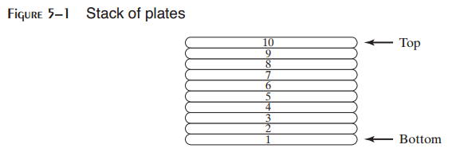

栈数据结构遵循同样的规则：新值被添加到栈的顶部，并由顶部删除已有的值。对于许多程序应用而言，栈都是非常有用的结构，并且使用面向对象程序方法可以很容易实现。如果你曾经参加过使用数据结构的课程，那你已经使用过栈抽象数据类型。栈也被称为LIFO结构（后进先出），因为最后一个被放入栈中的数据总是第一个被移除的数据。

在本章中，我们专注于运行栈。它为CPU中的硬件直接支持，并且是过程调用与返回机制中的核心部分。大多数时候，我们仅是将其称为栈。

5.1.1 运行时栈（32位模式）
>>>>>>>>>>>>>>>>>>>>>>>>>>>

运行时栈是由CPU使用ESP（扩展栈指针），也被称为栈指针寄存器，直接管理的内存数组。在32位模式中，ESP寄存器将一个32位偏移量保存在栈上的某个位置处。我们几乎不会直接操作ESP；相反，它是由指令，例如CALL，RET，PUSH与POP来修改的。

ESP总是指向被添加或压入到栈顶部的最新值。为了演示，让我们由仅包含一个值的栈开始。在图5-2中，ESP包含十六进制数00001000，最近被压入的值（00000006）的偏移量。在我们的图中，当栈指针减小其值时，栈的顶部分向下移动：

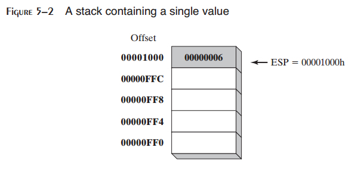

当程序运行于32位模式时，图中的每个栈位置包含32位。

PUSH操作
:::::::::::

32位压入操作将栈指针减去4，然后将值拷贝到栈指针指向的栈中位置。图5-3展示了将000000A5压入已经存有一个值（00000006）的栈的过程。注意，ESP指针总是指向最后被压入栈的项。图中所示的栈的顺序与我们之前看到的碟片栈顺序相反，因为运行时栈在内存中向下增长，由高位地址到低位地址。在压入操作之前，ESP=00001000h；在压入操作之后，ESP=00000FFCh。图5-4展示了相同的栈在压入四个整数之后的样子。

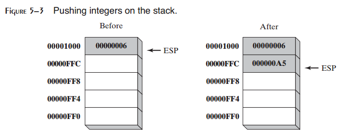

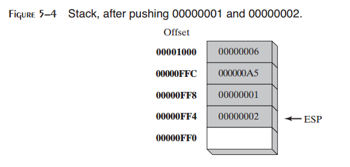

POP操作
::::::::::

弹出操作由栈上移除一个值。值被由栈上移除后，栈指针增加（栈元素尺寸）指向栈中下一个最高位置处。图5-5展示了在值00000002被弹出之前和之后的样子。

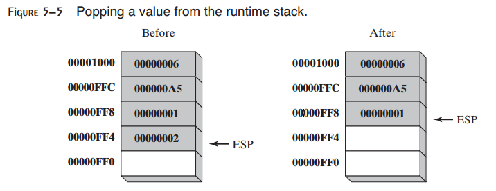

ESP之下的栈空间在逻辑上为空，并且会在当前程序下一次执行压入栈的任何指令时被覆盖。

栈应用
::::::::::

有多种运行时栈的重要应用：

* 当其被应用于多种目的时，栈可以为寄存器提供统一的临时保存空间。在他们被修改后，它们可以被恢复到其原始值。
* 当CALL指令执行时，CPU将当前子例程的返回地址保存在栈上。
* 当调用子例程时，我们通过将所谓的参数压入栈来传递输入值。
* 栈为子例程内部的局部变量提供了临时存储空间。

5.1.2 PUSH与POP指令
>>>>>>>>>>>>>>>>>>>>>>>

PUSH指令
:::::::::::

PUSH指令首先减小ESP，然后将源操作数拷贝到栈上。16位操作数使得ESP被减小2。32位操作数使得ESP被减小4。有三种指令格式：

.. code-block::

    PUSH reg/mem16
    PUSH reg/mem32
    PUSH imm32

POP指令
:::::::::

POP指令首先将ESP所指向的栈顶元素的内容拷贝到16位或32位目的操作数，然后增加ESP。如果操作数为16位，ESP被增加2；如果操作数为32位，ESP被增加4：

.. code-block::

    POP reg/mem16
    POP reg/mem32

PUSHFD与POPFD指令
:::::::::::::::::::

PUSHFD指令将32位EFLAGS寄存器压入栈，而POPFD将栈顶元素弹出到EFLAGS寄存器：

.. code-block::

    pushfd
    popfd

MOV指令不能用于将标记拷贝到变量，从而PUSHFD是保存标记的最好方法。有时生成标记的备份拷贝是有用的，从而你可以在稍后将其恢复为原始值。我们经常在PUSHFD与POPFD之间包含一个代码块：

.. code-block::

    pushfd ; save the flags
    ;
    ; any sequence of statements here...
    ;
    popfd ; restore the flags

当使用这种类型的压入与弹出时，要确保程序的执行路径不会略过POPFD指令。当程序被随着时间而修改时，需要小心地记住所有压入与弹出所在的位置。强烈需要一份精确的文档。

保存与恢复标记的一种更少出错的方法是将标记压入栈，并立即弹出保存到变量中：

.. code-block::

    .data
    saveFlags DWORD ?
    .code
    pushfd ; push flags on stack
    pop saveFlags ; copy into a variable

下面的语句由相同的变量恢复标记：

.. code-block::

    push saveFlags ; push saved flag values
    popfd ; copy into the flags

PUSHAD，PUSHA，POPAD，与POPA
::::::::::::::::::::::::::::::

PUSHAD指令以下述顺序将所有32位通用寄存器压入栈：EAX，ECX，EDX，EBX，ESP（执行PUSHAD之前的值），EBP，ESI，以及EDI。POPAD指令以相反的顺序弹出相同的寄存器。类似地，PUSHA以所列的顺序将16位通用寄存器（AX，CX，DX，BX，SP，BP，SI，DI）压入栈。POPA以相反的顺序弹出相同的栈。你应该仅在16位模式下使用PUSHA与POPA。我们在第14至17章中讨论16位编程。

如果你编写一个修改多个32位整数的过程，在过程的起始处使用PUSHAD，并且在过程的结束处使用POPAD以保存并恢复寄存器。如下面的代码片段所示：

.. code-block::

    MySub PROC
        pushad ; save general-purpose registers
        . .
        mov eax,...
        mov edx,...
        mov ecx,...
        . .
        popad ; restore general-purpose registers
        ret
    MySub ENDP

必须指出上述示例的一个重要例外：返回一个或多个寄存器中的结果的过程不应使用PUSHA与PUSHAD。假定下面的ReadValue过程返回EAX中的一个整数，对POPAD的调用会覆盖EAX中的返回值：

.. code-block::

    ReadValue PROC
        pushad ; save general-purpose registers
        . .
        mov eax,return_value
        . .
        popad ; overwrites EAX!
        ret
    ReadValue ENDP

示例：反转字符串
::::::::::::::::::

让我们看一个名为RevStr的程序，该程序在字符间遍历并将每个字符压入栈。它然后由栈上（以逆序）弹出字符并将其存储到相同的字符串变量中。因为栈是LIFO（后进先出）结构，字符串中的字符被反转：

.. code-block::

    ; Reversing a String (RevStr.asm)
    .386
    .model flat,stdcall
    .stack 4096
    ExitProcess PROTO,dwExitCode:DWORD
    .data
    aName BYTE "Abraham Lincoln",0
    nameSize = ($ - aName) - 1
    .code
    main PROC
    ; Push the name on the stack.
        mov ecx,nameSize
        mov esi,0
        L1: movzx eax,aName[esi] ; get character
        push eax ; push on stack
        inc esi
        loop L1
        ; Pop the name from the stack, in reverse,
        ; and store in the aName array.
        mov ecx,nameSize
        mov esi,0
        L2: pop eax ; get character
        mov aName[esi],al ; store in string
        inc esi
        loop L2
        INVOKE ExitProcess,0
    main ENDP
    END main

5.2 定义并使用过程
--------------------

如果你已经学习一门高级程序语言，你就会知道将程序分解为子例程是多么有用。一个复杂的程序在被理解，实现，以及有效测试之前通常会被分解为单独的任务。在汇编语言中，我们通常使用术语过程（procedure）来表示子例程。在其他语言中，子例程被称为方法或函数。

由面向对象编程的角度来看，单个类中的函数或方法与汇编语言模块中所封装的过程集合和数据几乎完全相同。汇编语言是在远远早于面向对象编程之前被创造的，所以它并没有面向对象语言中所通常见的结构。汇编程序员必须在程序中提供他们自己的表示结构。

5.2.1 PROC指令
>>>>>>>>>>>>>>>>

定义过程
:::::::::::::

通俗地说，我们可以将过程定义为一个返回语句结束的语句块。过程是使用PROC与ENDP指令声明的。它必须被赋予一个名字（合法的标识符）。例如，到目的为止，我们所编写的程序都包含一个名为main的过程：

.. code-block::

    main PROC
    . .
    main ENDP

当你编写程序开始过程之外的过程时，以RET语句结束。RET强制CPU返回到过程被调用时的位置处：

.. code-block::

    sample PROC
    . .
    ret
    sample ENDP

过程中的标签
::::::::::::::::

默认情况下，标签仅在其被声明的过程内可见。这一规则通常会影响跳转与循环指令。在下面的示例中，名为Destination的标签与须与JMP指令位于同一个过程中：

.. code-block::

    jmp Destination

在标签名后标识双冒号（::）声明全局标签可以避开该限制：

.. code-block::

    Destination::

由程序设计的角度来看，在当前过程之外跳转或循环并不是一个好主意。过程拥有返回并调整运行时栈的自动方法。如是你直接跳转到过程之外，运行时栈很容易受到破坏。要了解运行时栈的更多信息，参看8.2节。

示例：三个整数求和
::::::::::::::::::

让我们创建一个名为SumOf的过程来计算三个32位整数的和。我们会假定过程被调用之前，相关的整数已经被赋值给EAX，EBX与ECX。过程返回EAX中的和：

.. code-block::

    SumOf PROC
        add eax,ebx
        add eax,ecx
        ret
    SumOf ENDP

文档过程
:::::::::::::

要注意培养的一个好习惯是为你的程序添加清晰、易读的文档。下面是关于你可以在每个过程顶部放置的信息的一些建议：

* 过程要实现的所有任务的描述。
* 输入参数列表及其用法，以单词标记，例如Receives。输入输入参数的输入值具有特殊的要求，在这里列出。
* 过程返回的所有值的描述，以单词标记，例如Returns。
* 被称为先决条件，在过程调用之前必须满足，的所有特殊需求列表。这些需求可以通过单词Requires标记。例如，对于绘制图线的过程，一个有用的先决条件是视频显示适配器已处于图形模式。

记住这些建议，让我们为SumOf过程添加相应的文档：

.. code-block::

    ;---------------------------------------------------------
    ; sumof
    ;
    ; Calculates and returns the sum of three 32-bit integers.
    ; Receives: EAX, EBX, ECX, the three integers. May be
    ; signed or unsigned.
    ; Returns: EAX = sum
    ---------------------------------------------------------
    SumOf PROC
        add eax,ebx
        add eax,ecx
        ret
    SumOf ENDP

以高级语言，例如C与C++，编写的函数通常返回AL中的8位值，AX中的16位值，EAX中的32位值。

5.2.2 CALL与RET指令
>>>>>>>>>>>>>>>>>>>>>>

CALL指令通过指挥CPU在新的内存地址处开始执行来调用过程。过程使用RET指令（由过程返回）将处理带回到过程被调用时的程序点。由技术上来说，CALL指令将其返回地址压入栈，并将被调用过程的地址拷贝到指令指针。当过程准备返回时，其RET指令将返回地址由栈上弹出到指令指针。在32位模式中，CPU执行EIP（指令指针寄存器）指向的内存指令。在16位模式中，IP指向指令。

调用与返回示例
::::::::::::::::

假定在main中，CALL语句位于偏移00000020处。通常，该指令需要5个字节的机器码，所以下一条语句（此时为MOV）位于偏移00000025处：

.. code-block::

            main PROC
    00000020 call MySub
    00000025 mov eax,ebx

接下来，假定MySub中第一条可执行指令位于偏移00000040处：

.. code-block::

            MySub PROC
    00000040 mov eax,edx
            .
            .
            ret
            MySub ENDP

当CALL指令执行时（图5-6），调用之后的地址（00000025）被压栈，并且MySub的地址被载入到EIP中。执行MySub中的所有指令直到RET指令。当RET指令执行时，ESP所指向的栈中的值被弹出到EIP（图5-7中的步骤1）。在第二步中，ESP被增加，从而其指向栈上的上一个值（步骤2）。

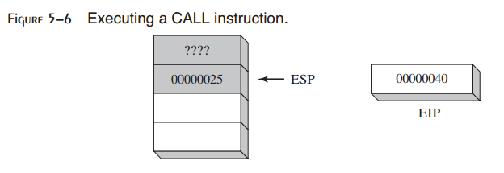

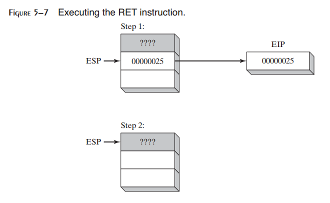

5.2.3 嵌套过程调用
>>>>>>>>>>>>>>>>>>>>>

当调用的过程在返回之前调用另一个过程时会发生嵌套过程调用。假定main调用名为Sub1的过程。当Sub1执行时，它调用Sub2过程。当Sub2执行时，它调用Sub3过程。该调用过程如图5-8所示。

当Sub3结束处的RET指令执行时，它将stack[ESP]位置处的值弹出到指令指针。这会使得Sub3指令调用之后的指令恢复执行。下图显示了由Sub3返回时栈的情况：

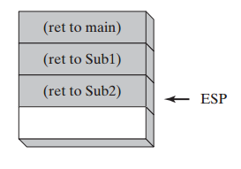

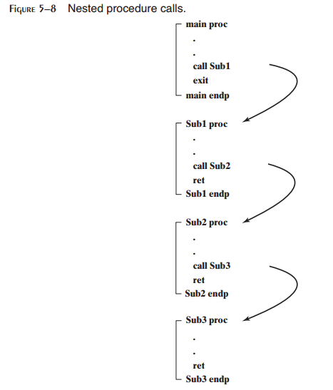

在返回之后，ESP指向下一个最高位栈数据项。当Sub2结束处的RET语句将要执行时，栈情况如下所示：

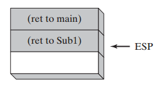

最后，当Sub1返回时，stack[ESP]的值被弹出到指令指针，并恢复main中的执行：

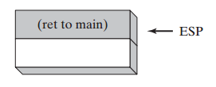

很明显，栈证明了它自身是一个记住信息，包括嵌套过程调用，的有用设置。通常，栈结构被用于程序必须以特定顺序回溯其步骤的场景。

5.2.4 向过程传递寄存器参数
>>>>>>>>>>>>>>>>>>>>>>>>>>>

如果你编写执行某些标准操作，例如计算整数数组的值，的过程，在过程内部包含指向特定变量名的引用并不是一个好主意。如果你这样做，该过程仅能处理一个数组。更好的方法是向过程传递数组的偏移，并传递一个表明数组元素个数的整数。我们将其称为参数（或输入参数）。在汇编语言中，通常传递通用寄存器中的参数。

在前面的章节中，我们创建一个名为SumOf的简单过程计算EXA，EBX，以及ECX寄存器中的整数和。在main中，在调用SumOf之前，我们将值赋值给EAX，EBX，以及ECX：

.. code-block::

    .data
    theSum DWORD ?
    .code
    main PROC
        mov eax,10000h ; argument
        mov ebx,20000h ; argument
        mov ecx,30000h ; argument
        call Sumof ; EAX = (EAX + EBX + ECX)
        mov theSum,eax ; save the sum

在CALL语句之后，我们选择将EAX中的和拷贝到一个变量中。

5.2.5 示例：整数数组求和
>>>>>>>>>>>>>>>>>>>>>>>>>>>>

在C++或Java语言中，你经常编写的常见的循环类型也许就是计算整数数组的和了。这在汇编语言中也很容易实现，而且可以以一种尽可能快速的方法编码。例如，在循环中可以使用寄存器而不是变量。

让我们创建一个名为ArraySum的过程，该过程由调用程序接收两个参数：指向32位数组的指针，以及数组个数。它会计算并在EAX中返回数组的和：

.. code-block::

    ;-----------------------------------------------------
    ; ArraySum
    ;
    ; Calculates the sum of an array of 32-bit integers.
    ; Receives: ESI = the array offset
    ; ECX = number of elements in the array
    ; Returns: EAX = sum of the array elements
    ;-----------------------------------------------------
    ArraySum PROC
        push esi ; save ESI, ECX
        push ecx
        mov eax,0 ; set the sum to zero
        L1: add eax,[esi] ; add each integer to sum
        add esi,TYPE DWORD ; point to next integer
        loop L1 ; repeat for array size
        pop ecx ; restore ECX, ESI
        pop esi
        ret ; sum is in EAX
    ArraySum ENDP

此过程中并没有任何内容与特定的数组名或数组尺寸相关。它可以被用于需要计算32位整数数组和的任何程序中。在可能的情况下，你应该创建灵活且适用的过程。

测试ArraySum过程
::::::::::::::::::::::

下面的示例程序通过传递偏移与32位整数数组的长度调用并测试ArraySum过程。在调用ArraySum之后，它会将过程的返回值保存到一个名为theSum的变量中。

.. code-block::

    ; Testing the ArraySum procedure (TestArraySum.asm)
    .386
    .model flat, stdcall
    .stack 4096
    ExitProcess PROTO, dwExitCode:DWORD
    .data
    array DWORD 10000h,20000h,30000h,40000h,50000h
    theSum DWORD ?
    .code
    main PROC
        mov esi,OFFSET array ; ESI points to array
        mov ecx,LENGTHOF array ; ECX = array count
        call ArraySum ; calculate the sum
        mov theSum,eax ; returned in EAX
        INVOKE ExitProcess,0
    main ENDP
    ;-----------------------------------------------------
    ; ArraySum
    ; Calculates the sum of an array of 32-bit integers.
    ; Receives: ESI = the array offset
    ; ECX = number of elements in the array
    ; Returns: EAX = sum of the array elements
    ;-----------------------------------------------------
    ArraySum PROC
        push esi ; save ESI, ECX
        push ecx
        mov eax,0 ; set the sum to zero
        L1:
        add eax,[esi] ; add each integer to sum
        add esi,TYPE DWORD ; point to next integer
        loop L1 ; repeat for array size
        pop ecx ; restore ECX, ESI
        pop esi
        ret ; sum is in EAX
    ArraySum ENDP
    END main

5.2.6 保存并恢复寄存器
>>>>>>>>>>>>>>>>>>>>>>>>

在ArraySum示例中，在过程的起始处将ECX与ESI压入栈并在结束时弹出。该操作是大多数修改寄存器的过程的通用操作。总是保存并恢复被过程修改的寄存器，从而调用程序可以确保其自身的寄存器不会被覆盖。该规则的一个例外就是返回值，通常为EAX。不要压入并弹出该寄存器的值。

USES操作符
::::::::::::::::

USES操作符，与PROC指令配合，可以允许你在过程中列出被修改的所有寄存器的名字。USES通知汇编器完成两件事：首先，在过程起始处生成PUSH指令将寄存器保存到栈上。其次，在过程结束时生成POP指令恢复寄存器的值。USES操作符紧跟PROC之后，在其后的同一行中跟踪以空格或TAB（非逗号）分割的寄存器列表。

5.2.5节中的ArraySum过程使用PUSH与POP指令来保存并恢复ESI与ECX。USES操作符可以更容易地完成该操作：

.. code-block::

    ArraySum PROC USES esi ecx
        mov eax,0 ; set the sum to zero
        L1:
        add eax,[esi] ; add each integer to sum
        add esi,TYPE DWORD ; point to next integer
        loop L1 ; repeat for array size
        ret ; sum is in EAX
    ArraySum ENDP

汇编器生成的相应代码展示了USES的作用：

.. code-block::

    ArraySum PROC
        push esi
        push ecx
        mov eax,0 ; set the sum to zero
    L1:
        add eax,[esi] ; add each integer to sum
        add esi,TYPE DWORD ; point to next integer
        loop L1 ; repeat for array size
        pop ecx
        pop esi
        ret
    ArraySum ENDP

*例外* 应用该规则保存寄存器的一个重要例外就是当过程返回寄存器（通常为EAX）的值时。此时，返回寄存器不应被压入并弹出。例如，在下面的SumOf过程中，它压入并弹出EAX，使得过程的返回值丢失：

.. code-block::

    SumOf PROC ; sum of three integers
        push eax ; save EAX
        add eax,ebx ; calculate the sum
        add eax,ecx ; of EAX, EBX, ECX
        pop eax ; lost the sum!
        ret
    SumOf ENDP

5.3 链接到外部库
-------------------

如果你花费时间，你可以使用汇编语言为输入输出编写详细的代码。这非常要从头打造你的摩托车，从而可以开到任何地方去。这是一项非常有趣而耗时的工作。在第11章中，你将会有机会看到输入输出在MS-Windows保护模式下是如何被处理。它非常有趣，当你看到可用的工具时会打开一个新的世界。然而就目的而言，在你学习汇编语言基础时，输入输出应该非常简单。5.3节展示了如何由本书的链接库，Irvine32.lib与Irvine64.obj，中调用过程。完整的库源码可以在作者的网站（asmirvine.com）找到。它应该被安装到你的计算机上本书安装文件（通常为C:\Irvine）的Examples\Lib32子目录中。

Irvine32库仅可以被运行在32位模式下的程序所使用。它包含在生成输入输时链接到MS-Windows API的过程。Irvine64库是一个仅用于64位应用的库，并且仅包含的显示与字符串处理。

5.3.1 背景信息
>>>>>>>>>>>>>>>>>>

链接库是一个包含已经被汇编为机器码的过程（子例程）的文件。链接库由一个或多个会被汇编为对象文件的源文件开始。对象文件会被链接程序插入到特殊格式的文件中。假定一个程序通过调用名为WriteString的过程将字符串显示在控制窗口中。程序源码必须包含一个PROTO指令以标明WriteString过程：

.. code-block::

    WriteString proto

然后，CALL指令执行WriteString：

.. code-block::

    call WriteString

当程序被汇编后，汇编器会将CALL指令的目的地址留空，因为已知稍后会被链接器填充。链接器在链接程序中查找WriteString，并将相应的机器指令由库中拷贝到程序的可执行文件中。另外，它会将WriteString地址插入到CALL指令处。如果你正在调用的过程并不在链接库中，链接器会生在一个错误信息，并且不会生成可执行文件。

*链接器命令行选项* 链接器程序会将程序的目标文件与一个或多个对象文件以及链接库组合起来。例如，下面的命令会将hello.obj链接到irvine32.lib与kernel32.lib库：

.. code-block::

    link hello.obj irvine32.lib kernel32.lib

*链接32位程序* 作为Microsoft Windows Platform软件开发工具套件的一部分，kernel32.lib文件包含位于名为kernel32.dll的文件中的系统函数的信息。后者是MS-Windows的基础组成部分，并被称为动态链接库。它包含执行基于字符的输入输出的可执行函数。图5-9展示了kernel32.lib如何过渡到kernel32.dll。

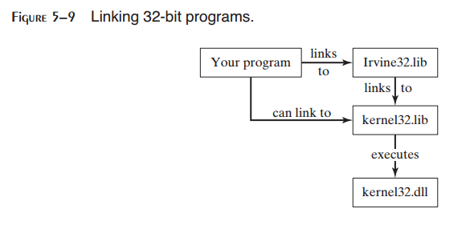

第1到10章，我们的程序链接到Irvine32.lib或者Irvine64.obj。第11章将会展示如何将程序直接链接到kernel32.lib。

5.4 Irvine32库
------------------
5.4.1 创建库的动机
>>>>>>>>>>>>>>>>>>>>>>>

对于汇编语言编程而言并不存在Microsoft制裁的标准库。当程序员们1980年代早期首次为x86处理编写汇编语言时，MS-DOS是被广泛所用的操作系统。16程序能够调用MS-DOS函数（也被称为INT 21h服务）来执行简单的输入输出。即使在那时，如果你要在控制台上显示一个整数，你需要编写非常复杂的过程，从而将整数的内部二进制表示转换为可以在屏幕上显示整数的ASCII字符序列。我们称其为WriteInt，而下面是其逻辑，抽象为过程：

初始化：

.. code-block::

    let n equal the binary value
    let buffer be an array of char[size]

算法：

.. code-block::

    i = size -1 ; last position of buffer
    repeat
        r = n mod 10 ; remainder
        n = n / 10 ; integer division
        digit = r OR 30h ; conver r to ASCII digit
        buffer[i--] = digit ; store in buffer
    until n = 0
    if n is negative
        buffer[i] = "-" ; insert a negative sign
    while i > 0
        print buffer[i]
        i++

注意，在这里以逆序生成数字并由后至前插入到缓冲区中。然后数字以前向顺序输出到控制台。尽管此段代码很容易使用C/C++语言来实现，但是在汇编语言中却需要一些高级技巧。

专业程序经常喜欢构建他们自己的库，这样做是一种极好的学习体验。在Windows下的32位模式中，输入输出库必须直接调用操作系统。学习曲线非常陡峭，对于程序初学者是巨大的挑战。因而，Irvine32库被设计来为初学者提供简单的输入输出接口。随着你继续本书中的其他章节，你将会获得构建自己的库所需要的知识与技巧。只要你尊重其原作者，你可以自由修改并重用该库。另外，在第13章中我们将会探讨由你的汇编语言程序中调用标准C库函数。当然，这需要一些额外的背景知识。

表5-1列出了Irvine32库中的完整过程列表。

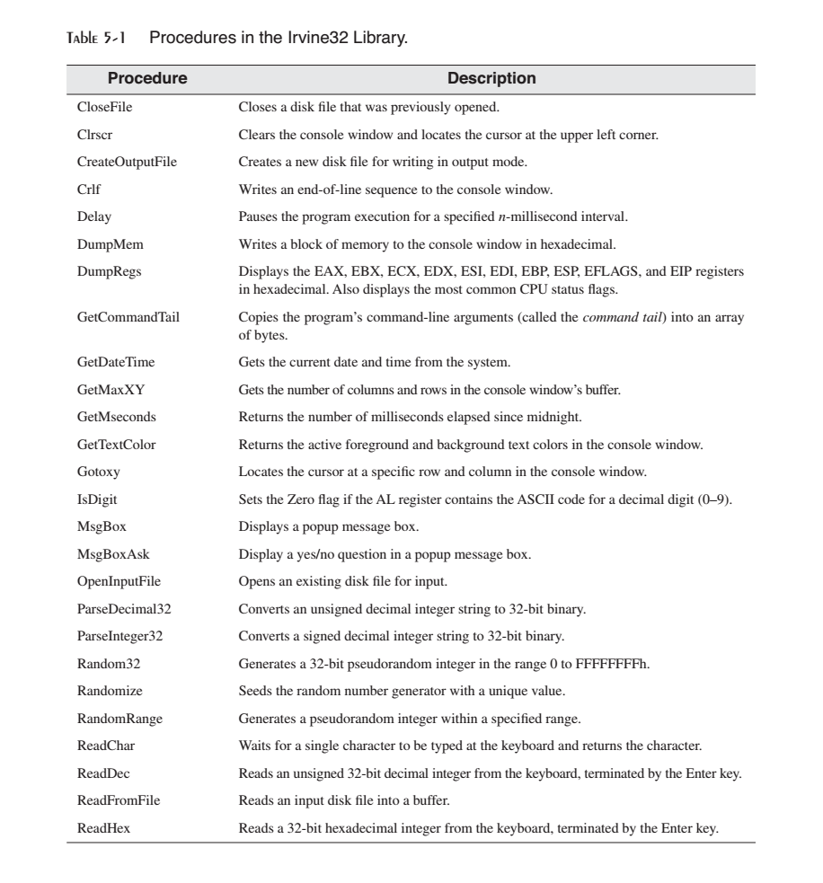

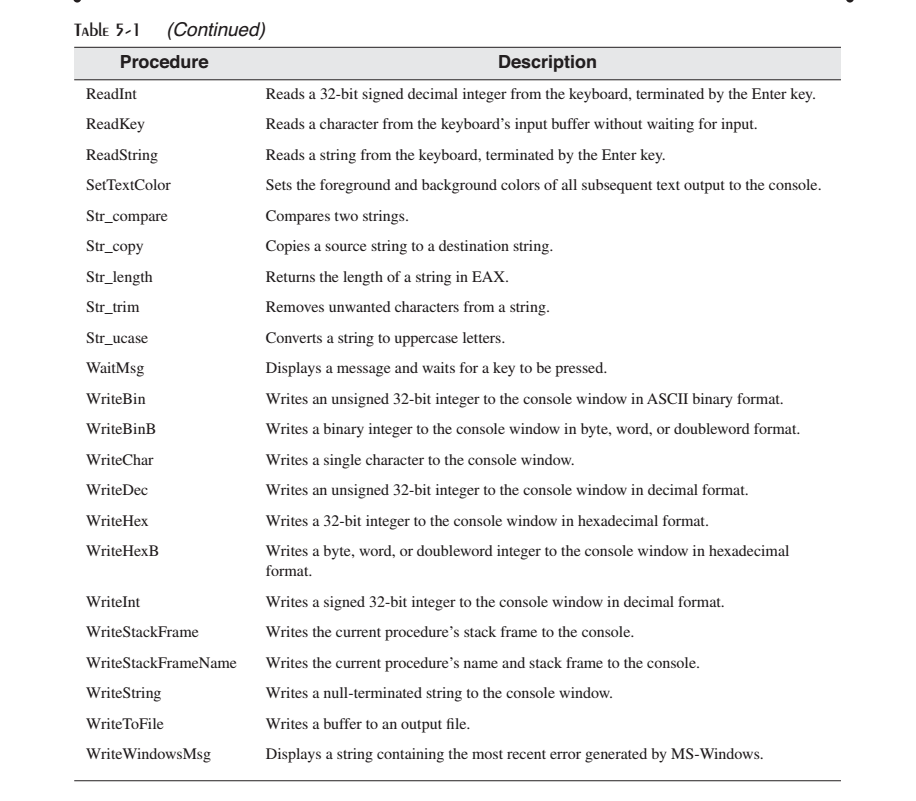

5.4.2 概览
>>>>>>>>>>>>>

*控制台窗口* 控制台窗口（或命令行窗口）是在显示命令行提示符时由MS-Windows所创建的纯文本窗口。

要在Microsoft Windows中显示控制台窗口，在桌面面点击Sart按钮，在Start Search框中输入cmd并回车。一旦打开控制台窗口，你可以通过右键点击窗口的左上角中的系统菜单，由弹出菜单中选择属性，通过修改属性值来调整控制窗口缓冲区的大小，如图5-10所示。

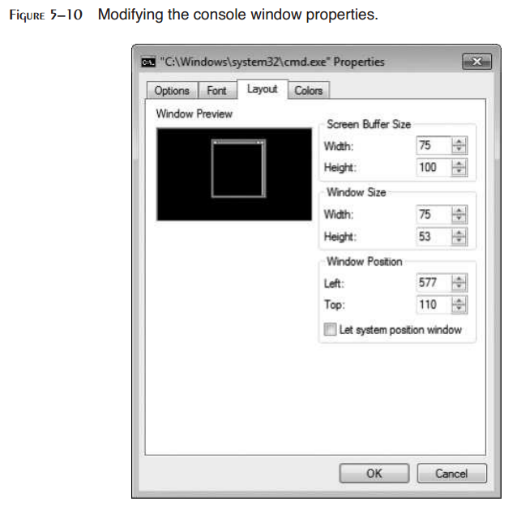

你也可以选择各种字体大小与颜色。控制台窗口默认为25行80列。你可以使用mode命令来修改列数与行数。如下所示，在命令提示符中输入，将控制台窗口设置为40列30行：

.. code-block::

    mode con cols=40 lines=30

Windows操作系统所用的文件句柄是一个32位整数，以标识当前打开的文件。当你的程序调用Windows服务来打开或创建文件时，操作系统会创建一个新的文件句柄并使其对你的程序可用。每次你调用操作系统服务方法来读取或写入文件时，你必须向服务方法提供相同的文件句柄作为参数。

注意：如果你的程序调用Irvine32库中的过程，你必须总是将32位值压入运行时栈；否则，被库调用的Win32控制台函数并不会正常工作。

5.4.3 单个过程描述
>>>>>>>>>>>>>>>>>>>>>>

在本节中，我们描述如何使用Irvine32库中的每个过程。我们将会略过一些高级的过程，这些将会在后面的章节中讨论。

*CloseFile* CloseFile过程会关闭之前创建或打开（参看CreateOutputFile与OpenInputFile）的文件。文件是由拷贝到EAX中的32位整数句柄标识的。如果文件被成功关闭，EAX中返回的值不为零。示例调用：

.. code-block::

    mov eax,fileHandle
    call CloseFile

*Clrscr* Clrscr过程清除控制台窗口。该过程会在程序起始和结束时调用。如果你在其他时候调用，你也许需要首先调用WaitMsg来暂停程序。这样允许用户在屏幕被清除之前查看屏幕上已有的信息。示例调用：

.. code-block::

    call WaitMsg ; "Press any key..."
    call Clrscr

*CreateOutputFile* CreateOutputFile创建一个新的磁盘文件并打开准备写入。当你调用该过程时，将文件名的偏移放置在EDX中。当过程返回时，如果文件被成功创建，EAX将会包含一个合法可用的文件句柄（32位整数）。否则，EAX为INVALID_HANDLE_VALUE（预先定义的常量）。示例调用：

.. code-block::

    .data
    filename BYTE "newfile.txt",0
    .code
    mov edx,OFFSET filename
    call CreateOutputFile

下面的伪代码描述了调用CreateOutputFile之后的可能结果：

.. code-block::

    if EAX = INVALID_HANDLE_VALUE
        the file was not created successfully
    else
        EAX = handle for the open file
    endif

*Crlf* Crlf过程使得光标前进到控制台下一行的起始处。它会输出一个包含ASCII字码0Dh与0Ah的字符串。示例调用：

.. code-block::

    call Crlf

*Delay* Delay过程会将程序暂停指定的秒数。在调用Delay之前，将EAX设置为需要的间隔。示例调用：

.. code-block::

    mov eax,1000 ; 1 second
    call Delay

*DumpMem* DumpMem过程以十六进制将某个范围内的内存输出到控制台窗口。在ESI中为其传递起始地址，在ECX中传递单元数，而在EBX中传递单元尺寸（1=byte，2=word，4=doubleword）。下面的示例调用以十六进制显示了11个双字数组：

.. code-block::

    .data
    array DWORD 1,2,3,4,5,6,7,8,9,0Ah,0Bh
    .code
    main PROC
        mov esi,OFFSET array ; starting OFFSET
        mov ecx,LENGTHOF array ; number of units
        mov ebx,TYPE array ; doubleword format
        call DumpMem

将会得到下面的输出：

.. code-block::

    00000001 00000002 00000003 00000004 00000005 00000006
    00000007 00000008 00000009 0000000A 0000000B

*DumpRegs* DumpRegs过程以十六进制显示EAX，EBX，ECX，EDX，ESI，EDI，EBP，ESP，EIP以及EFL（标记）寄存器。它同时会显示进位，符号，零，溢出，辅助进位以及校验标记的值。示例调用：

.. code-block::

    call DumpRegs

示例输出如下：

.. code-block::

    EAX=00000613 EBX=00000000 ECX=000000FF EDX=00000000
    ESI=00000000 EDI=00000100 EBP=0000091E ESP=000000F6
    EIP=00401026 EFL=00000286 CF=0 SF=1 ZF=0 OF=0 AF=0 PF=1

所显示的EIP的值是DumpRegs之后下一条调用的指令偏移。当调用程序时DumpRegs会非常有用，因为它会显示CPU的一张快照。它不需要输入参数，也没有返回值。

*GetCommandTail* GetCommandTail过程将程序的命令行拷贝到一个以空结束的字符串中。如果命令为空，则进位标记被设置；否则，进位标记会被清除。该过程非常有用，因为它允许程序的用户在命令行传递参数。假定一个名为Encrypt.exe的程序读入名为file1.txt的输入文件，并生成名为file2.txt的输出文件。当运行该程序时，用户可以在命令行同时传递两个文件名：

.. code-block::

    Encrypt file1.txt file2.txt

当程序启动后，Encrypt程序可以调用GetCommandTail并获取两个文件名。当调用GetCommandTail时，EDX必须包含一个至少为129字节的数组的偏移量。示例调用：

.. code-block::

    .data
    cmdTail BYTE 129 DUP(0) ; empty buffer
    .code
    mov edx,OFFSET cmdTail
    call GetCommandTail ; fills the buffer

当在Visual Studio中运行程序时有一种传递命令行参数的方法。由Project菜单中选择<projectname>属性。在属性页窗口中，展开配置属性项，并选择调试。然后在名为命令行参数的右侧面板的文本框中输入你的命令行参数。

*GetMaxXY* GetMaxXY过程获取控制台窗口缓冲区的大小。如果控制台窗口缓冲区大于可视窗口的大小，会自动出现滚动条。GetMaxXY没有输入参数。当它返回时，DX寄存器包含缓冲区的列数，而AX包含缓冲区的行数。每个值的可能范围不能大于255，要小于实际窗口缓冲区的尺寸。示例调用：

.. code-block::

    .data
    rows BYTE ?
    cols BYTE ?
    .code
    call GetMaxXY
    mov rows,al
    mov cols,dl

*GetMseconds* GetMseconds过程获取自主机计算机午夜逝去的毫秒数，并在EAX寄存器中返回该值。该过程是一个度量两个事件之间时间差的有力工具。无需输入参数。下面的示例调用GetMseconds，存储其返回值。在循环执行之后，代码再次调用GetMseconds，并将两个时间值相减。差值即为循环的近似执行时间：

.. code-block::

    .data
    startTime DWORD ?
    .code
    call GetMseconds
    mov startTime,eax
    L1:
        ; (loop body)
        loop L1
    call GetMseconds
    sub eax,startTime ; EAX = loop time, in milliseconds

*GetTextColor* GetTextColor过程获取控制台窗口的前景与背景颜色。它无需输入参数，并在AL的高4位返回背景色，低4位返回前景色。示例调用：

.. code-block::

	.data
	color byte ?
	.code
	call GetTextColor
	mov color,AL
	
*Gotoxy* Gotoxy过程将光标定位到控制台窗口中的指定行与列。默认情况下，控制台窗口的X坐标的范围为0到79，而Y坐标的范围为0至24。当你调用Gotoxy时，在DH中传递Y坐标（行），在DL中传递X坐标（列）。示例调用：

.. code-block::

	mov dh,10 ; row 10
	mov dl,20 ; column 20
	call Gotoxy ; locate cursor
	
用户也许重新调整了控制台窗口的大小，所以你可以调用GetMaxXY来获取当前的行数与列数。

*IsDigit* IsDigit过程确定AL中的值是否为合法十进制数字的ASCII码。当调用该过程时，在AL传递一个ASCII字符。如果AL包含一个合法的十进制数字，该过程会设置零标记；否则，它会清除零标记。示例调用：

.. code-block::

	mov AL,somechar
	call IsDigit
	
*MsgBox* MsgBox过程显示一个带有标题的图形化弹出消息框。（当程序运行在控制台窗口中会起作用）在EDX中向其传递将会显示在消息框中的字符串的偏移量。可以在EBX中传递用作消息框标题的字符串的偏移量。要将标题留空，将EBX设置为零。示例调用：

.. code-block::

	.data
	caption BYTE "Dialog Title", 0
	HelloMsg BYTE "This is a pop-up message box.", 0dh,0ah
	BYTE "Click OK to continue...", 0
	.code
	mov ebx,OFFSET caption
	mov edx,OFFSET HelloMsg
	call MsgBox
	
示例输出：

*MsgBoxAsk* MsgBoxAsk过程会显示一个带有Yes与No按钮的图形化弹出消息框。（当程序运行在控制台窗口中起作用）在EDX中传递将会在消息框中显示的字符串的偏移量。在EBX中传递作为消息框标题的字符串的偏移量。要将标题留空，将EBX设置为零。MsgBoxAsk在EAX中返回一个整数，以通知你用户选择了哪个按钮。该值将会是两个预定义的Windows常量，IDYES（等于6）或IDNO（等于7），中的一个。示例调用：

.. code-block::

	.data
	caption BYTE "Survey Completed",0
	question BYTE "Thank you for completing the survey."
		BYTE 0dh,0ah
		BYTE "Would you like to receive the results?",0
	.code
	mov ebx,OFFSET caption
	mov edx,OFFSET question
	call MsgBoxAsk
	;(check return value in EAX)
	
示例输出：

*OpenInputFile* OPenInputFile过程打开一个已有文件准备写入。在EDX中传递文件名的偏移量。当过程返回时，如果文件被成功打开，EAX将会包含合法的文件句柄。否则，EAX将会等于INVALID_HANDLE_VALUE（预定义常量）。示例调用：

.. code-block::

	.data
	filename BYTE "myfile.txt",0
	.code
	mov edx,OFFSET filename
	call OpenInputFile
	
下述的伪代码描述了在调用OopenInputFile之后的可能结果：

.. code-block::

	if EAX = INVALID_HANDLE_VALUE
		the file was not opened successfully
	else
		EAX = handle for the open file
	endif
	
*ParseDecimal32* ParseDecimal32过程将无符号十进制整数字符串转换为32位二进制数。非数值字符之前出现的所有合法数字将会被转换。前置空格会被忽略。在EDX中为其传递字符串的偏移量，在ECX中为其传递字符串的长度。二进制值在EAX中返回。示例调用：

.. code-block::

	.data
	buffer BYTE "8193"
	bufSize = ($ - buffer)
	.code
	mov edx,OFFSET buffer
	mov ecx,bufSize
	call ParseDecimal32 ; returns EAX
	
* 如果整数为空，则EAX=0而CF=1
* 如果整数仅包含空格，则EAX=0而CF=1
* 如是整数大于2^32-1，则EAX=0而CF=1
* 否则EAX包含所转换的整数而CF=0

参看ReadDec过程的说明以了解进位标记是如何被影响的详细信息。

*ParseInteger32* ParseInteger32过程将一个带符号十进制整数字符转换为32位二进制数。由字符串开始至第一个非数值字符之间的所有合法数字将会被转换。前置空格会被忽略。在EDX中传递字符串的偏移量，而ECX中传递字符串的长度。二进制值在EAX中返回。示例调用：

.. code-block::

	.data
	buffer byte "-8193"
	bufSize = ($ - buffer)
	.code
	mov edx,OFFSET buffer
	mov ecx,bufSize
	call ParseInteger32 ; returns EAX
	
字符串也许会包含一个前置正号或负号，后面仅有一个十进制数字。如果值不能被表示为32位带符号整数（范围：-2,147,483,648至+2,147,483,647），溢出标记会被设置并且在控制台中显示错误信息。

*Random32* Random32过程生成并在EAX中返回一个32位随机整数。当重复调用时，Random32生成一个模拟随机序列。随机数是通过一个带有名为seed的输入参数的简单函数生成的。函数使用种子生成随机数。后续的随机数是使用前一个生成的随机数作为种子生成。下面的代码片段显示了对Random32的示例调用：

.. code-block::

	.data
	randVal DWORD ?
	.code
	call Random32
	mov randVal,eax
	
*Randomize* Randomize过程初始化Random32与RandomRange过程的起始种子值。种子值为当天的时候，精确到百分之一秒。每次你运行调用Random32与RandomRange的程序时，生成的随机数序列将会是唯一的。你仅需要在程序的起始处调用一次Randomize。下面的示例程序生成10个随机整数：

.. code-block::

	call Randomize
	mov ecx,10
	L1: call Random32
	; use or display random value in EAX here...
	loop L1
	
*RandomRange* RandomRange过程生成一个0至n-1范围内的随机数，其中n是在EAX寄存器中传递的输入参数。随机整数在EAX中返回。下述示例生成一个0至4999之间的随机整数，并将其存储在名为randVal的变量中。

.. code-block::

	.data
	randVal DWORD ?
	.code
	mov eax,5000
	call RandomRange
	mov randVal,eax
	
*ReadChar* ReadChar过程由键盘读取单个字符并由AL寄存器返回。所读取的字符并不会在控制台窗口回显。示例调用：

.. code-block::

	.data
	char BYTE ?
	.code
	call ReadChar
	mov char,al
	
如果用户按下扩展键，例如功能键，方向键，Ins或是Del，过程将AL设置为零，而AH包含键盘扫描码。扫描码列在本书的前封页内。EAX高半部分并不会被保存。下面的伪代码显示了在调用ReadChar之后的结果：

.. code-block::

	if an extended key was pressed
		AL = 0
		AH = keyboard scan code
	else
		AL = ASCII key value
	endif
	
*ReadDec* ReadDec过程由键盘读取32位无符号十进制整数，并在EAX中返回值。前置空格会被忽略。返回值是由遇到非数字之前所有合法的数字计算得到。例如，如果用户输入123ABC，由EAX返回的值为123。如下述的示例调用所示：

.. code-block::

	.data
	intVal DWORD ?
	.code
	call ReadDec
	mov intVal,eax
	
ReadDec以下述方式影响进位标记：

* 如果整数为空，则EAX=0，CF=1
* 如果整数仅包含空格，EAX=0，CF=1
* 如果整数大于2^32-1，EAX=0，CF=1
* 否则，EAX保存转换的整数值，CF=0

*ReadFromFile* ReadFromFile过程将磁盘文件读入内存缓冲区中。当你调用ReadFromFile时，在EAX中传递要打开的文件句柄，在EDX中传递缓冲区偏移，在ECX中传递要读取的最大字节数。当ReadFromFile返回时，检查进位标记：如果CF被清除，EAX中包含由文件所读取的字节数。但如果CF被设置，EAX包含一个数字系统错误码。你可以调用WriteWindowsMsg过程来获取错误码的文本表示。

在下面的示例中，多达5000字节被由文件拷贝到缓冲区变量：

.. code-block::

	.data
	BUFFER_SIZE = 5000
	buffer BYTE BUFFER_SIZE DUP(?)
	bytesRead DWORD ?
	.code
	mov edx,OFFSET buffer ; points to buffer
	mov ecx,BUFFER_SIZE ; max bytes to read
	call ReadFromFile ; read the file
	
如果此时进位标记被清除，你可以执行下面的指令：

.. code-block::

	mov bytesRead,eax ; count of bytes actually read
	
但如果进位标记被设置，你可以调用WriteWindowsMsg过程，该过程会显示一个包含错误码以及程序最近生成的错误描述的字符串：

.. code-block::

	call WriteWindowsMsg
	
*ReadHex* ReadHex过程由键盘读取一个32位十六进制整数，并且在EAX中返回对应的二进制值。对单个的字符并不会执行错误检测。对于数字A至F，你可以同时使用大写与小写字符。需要输入8位数字的最大个数（其余字符被忽略）。前置空格被忽略。示例调用：

.. code-block::

	.data
	hexVal DWORD ?
	.code
	call ReadHex
	mov hexVal,eax
	
*ReadInt* ReadInt过程由键盘读取一个32位带符号整数，并由EAX中返回值。用户可以输入前置正号或负号，其余部分仅包含数字。ReadInt设置溢出标记，并且所输入的值不能表示为32位整数时（范围 -2,147,483,648 to 至+2,147,483,647），会显示错误信息。返回值是由遇到非数字字符之前的所有合法数字计算得到。例如，如果用户+123ABC，则会返回值+123。示例调用：

.. code-block::

	.data
	intVal SDWORD ?
	.code
	call ReadInt
	mov intVal,eax
	
*ReadKey* ReadKey过程执行一个非等待的键盘检测。换句话说，它会检查键盘输入缓冲区并确定用户是否按下某个按键。如果没有发现键盘数据，零标记被设置。如果ReadKey发现键盘被按下，零标记被清除，并且AL被赋值零或ASCII码。如果AL包含零，用户也许按下了特殊键（功能键，方向键，等）。AL寄存器包含一个虚拟扫描码，DX包含虚拟键值，而EBX包含键盘标记码。下面的伪代码描述了在调用ReadKey之后的可能结果：

.. code-block::

	if no_keyboard_data then
		ZF = 1
	else
		ZF = 0
		if AL = 0 then
			extended key was pressed, and AH = scan code, DX = virtual
			key code, and EBX = keyboard flag bits
		else
			AL = the key's ASCII code
		endif
	endif
	
当ReadKey被调用时，EAX的高半部分与EDX会被覆盖。

*ReadString* ReadString过程由读取字符串，当用户按下回车键时停止。在EDX 传递缓冲区偏移量，并将ECX设置为用户可以输入的最大字符个数加1（以保存表示结束符的空字节）。过程会在EAX中返回用户输入的字符个数。示例调用：

.. code-block::

	.data
	buffer BYTE 21 DUP(0) ; input buffer
	byteCount DWORD ? ; holds counter
	.code
	mov edx,OFFSET buffer ; point to the buffer
	mov ecx,SIZEOF buffer ; specify max characters
	call ReadString ; input the string
	mov byteCount,eax ; number of characters
	
ReadString会自动在内存中字符串的结尾处插入一个空结束符。如下表示是在用户输入字符串"ABCDEFG"之后，buffer的前8个字节的ASCII输出的十六进制表示：

.. code-block::

	41 42 43 44 45 46 47 00 ABCDEFG
	
变量byteCount等于7。

*SetTextColor* SetTextColor过程（仅Irvine32库提供）为文本输出设置前景与背景颜色。当调用SetTextColor时，为EAX赋值颜色属性。下列预定义的颜色常量可同时用于前景与背景：

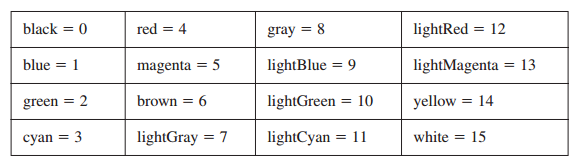

颜色常量定义在Irvine32.inc文件中。要获取完整的颜色字节值，将背景颜色乘以16并将其与前景颜色相加。例如，下列常量表示蓝色背景上的黄色字符：

.. code-block::

	yellow + (blue * 16)
	
下列语句在蓝色背景上设置白色：

.. code-block::

	mov eax,white + (blue * 16) ; white on blue
	call SetTextColor
	
表示颜色常量的另一种方法是使用SHL操作符。在将其前景色相加之前，我们要将背景色左移4位。

.. code-block::

	yellow + (blue SHL 4)
	
位移是在汇编时执行的，所以它仅有常量操作数。在第7章中，我们将会了解如何在运行时对整数进行位移操作。我们将会在16.3.2节中了解到视频属性的详细解释。

*Str_length* Str_length过程返回以空字节结束的字符串的长度。在EDX中传递字符串偏移。该过程会在EAX中返回字符串的长度。示例调用：

.. code-block::

	.data
	buffer BYTE "abcde",0
	bufLength DWORD ?
	.code
	mov edx,OFFSET buffer ; point to string
	call Str_length ; EAX = 5
	mov bufLength,eax ; save length
	
*WaitMsg* WaitMsg过程会显示消息"Press any key to continue..."并等待用户按下按键。当你希望在数据滚出并消息之前暂停屏幕显示时，该过程会非常有用。它没有输入参数。示例调用：

.. code-block::

	call WaitMsg
	
*WriteBin* WriteBin过程以ASCII二进制格式将整数输出到控制台窗口。在EAX中传递整数。所显示的二进制位数以4位为一组，以方便阅读。示例调用：

.. code-block::

	mov eax,12346AF9h
	call WriteBin
	
示例代码会显示如下的输出：

.. code-block::

	0001 0010 0011 0100 0110 1010 1111 1001
	
*WriteBinB* WriteBinB过程以ASCII二进制格式将32位整数输出控制台窗口。在EAX寄存器中传递值，并使用EBX表明显示的字节数尺寸（1，2，或4）。显示的二进制位数4位一组，以方便阅读。示例调用：

.. code-block::

	mov eax,00001234h
	mov ebx,TYPE WORD ; 2 bytes
	call WriteBinB ; displays 0001 0010 0011 0100
	
*WriteChar* WriteChar过程将单个字符输出控制台窗口。在AL中传递字符（或其ASCII码）。示例调用：

.. code-block::

	mov al,'A'
	call WriteChar ; displays: "A"
	
*WriteDec* WriteDec过程将32位无符号整数以无前置零的十进制格式输出到控制台窗口。在EAX中传递整数。示例调用：

.. code-block::

	mov eax,295
	call WriteDec ; displays: "295"
	
*WriteHex* WriteHex过程以8位数字的十六进制格式将32位无符号整数输出到控制台窗口。如果需要则插入前置零。在EAX中传递整数。示例调用：

.. code-block::

	mov eax,7FFFh
	call WriteHex ; displays: "00007FFF"
	
*WriteHexB* WriteHexB过程以十六进制格式将32位无符号整数输出到控制台窗口。如果需要则插入前置零。在EAX中传递整数，并使用EBX以字节数表明二进制格式（1，2，或4）。示例调用：

.. code-block::

	mov eax,7FFFh
	mov ebx,TYPE WORD ; 2 bytes
	call WriteHexB ; displays: "7FFF"
	
*WriteInt* WriteInt过程以带有前置符号而没有前置零的十进制格式将32位带符号整数输出到控制台窗口。在EAX中传递整数。示例调用：

.. code-block::

	mov eax,216543
	call WriteInt ; displays: "+216543"
	
*WriteString* WriteString过程将以空字节结束的字符串输出到控制台窗口。在EDX传递字符串偏移量。示例调用：

.. code-block::

	.data
	prompt BYTE "Enter your name: ",0
	.code
	mov edx,OFFSET prompt
	call WriteString
	
*WriteToFile* WriteToFile过程将缓冲区内容写入输出文件。在EAX中传递合法的文件句柄，在EDX中传递缓冲区偏移量，在ECX中传递要写入的字节数。当过程返回时，如果EAX大于零，它包含已写入的字节数；否则，发生了错误。下面是WriteToFile的示例调用：

.. code-block::

	BUFFER_SIZE = 5000
	.data
	fileHandle DWORD ?
	buffer BYTE BUFFER_SIZE DUP(?)
	.code
	mov eax,fileHandle
	mov edx,OFFSET buffer
	mov ecx,BUFFER_SIZE
	call WriteToFile
	
下面的伪代码描述了在调用WriteToFile之后如何处理EAX中返回的值：

.. code-block::

	if EAX = 0 then
		error occurred when writing to file
		call WriteWindowsMessage to see the error
	else
		EAX = number of bytes written to the file
	endif
	
*WriteWindowsMsg* WriteWindowsMsg过程在执行系统函数调用时将程序最近生成的错误字符串输出到控制台窗口。示例调用：

.. code-block::

	call WriteWindowsMsg
	
如下述的消息字符串示例：

.. code-block::

	Error 2: The system cannot find the file specified.
	
5.4.4 库测试程序
>>>>>>>>>>>>>>>>>>>>>>

Tutorial: 库测试 #1
:::::::::::::::::::::::::::::

在这份动手练习中，你将会编写程序演示带有屏幕颜色的整数输入输出。

步骤1：以标准头开始程序：

.. code-block::

    ; Library Test #1: Integer I/O (InputLoop.asm)
    ; Tests the Clrscr, Crlf, DumpMem, ReadInt, SetTextColor,
    ; WaitMsg, WriteBin, WriteHex, and WriteString procedures.
    INCLUDE Irvine32.inc

步骤2：声明一个COUNT常量以确定程序稍后的循环次数。然后定义两个常量BlueTextOnGray与DefaultColor，当我们在稍后修改控制台窗口颜色时会用到。颜色字节在高4位中存储背景颜色，而在低4位中存储前景（文本）颜色。我们还没有讨论位移指令，但是我们可以将背景色乘以16，以将其移动属性字节的高4位：

.. code-block::

    .data
    COUNT = 4
    BlueTextOnGray = blue + (lightGray * 16)
    DefaultColor = lightGray + (black * 16)

步骤3：使用十六进制常量声明一个带符号的双字整数数组。同时添加一个用作提示符的字符串，以提示用户输入整数：

.. code-block::

    arrayD SDWORD 12345678h,1A4B2000h,3434h,7AB9h
    prompt BYTE "Enter a 32-bit signed integer: ",0

步骤4：在代码区域，声明主过程，并编写代码将ECX初始化为浅灰背景蓝色文本。SetTextColor方法会修改程序执行过程中自此以后输出到控制台窗口的前景与背景颜色属性：

.. code-block::

    .code
    main PROC
        mov eax,BlueTextOnGray
        call SetTextColor

为将控制台窗口的背景设置为新颜色，我们必须使用Clrscr过程来清除屏幕：

.. code-block::

    call Clrscr ; clear the screen

接下来，程序将会显示内存中以arrayD变量标识的双字值的范围。DumpMem过程需要在ESI，EBX，以及ECX寄存器中传递参数。

步骤5：将ESI赋值为arrayD的偏移量，以标识我们要显示的范围的起始处：

.. code-block::

    mov esi,OFFSET arrayD

步骤6：EBX被赋值为表示每个数组元素尺寸的值。因为我们要显示双字数组，EBX的值为4。这是由TYPE arrayD所返回的值：

.. code-block::

    mov ebx,TYPE arrayD ; doubleword = 4 bytes

步骤7：ECX必须使用LENGTHOF操作符设置为要显示的单元数。然后，当DumpMem被调用时，它拥有其需要的所有信息：

.. code-block::

    mov ecx,LENGTHOF arrayD ; number of units in arrayD
    call DumpMem ; display memory

下图显示了DumpMem可以生成的输入类型：

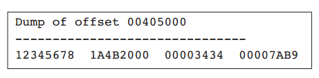

步骤8：通过调用Crlf过程输出一个空行。然后，将ECX初始化为常量值COUNT，从而ECX可以作为循环计数器，如下所示：

.. code-block::

    call Crlf
    mov ecx,COUNT

步骤9：当我们需要显示一个提示用户输入整数的字符串。将字符串的偏移量赋值给EDX，并调用WriteString过程。然后，调用ReadInt过程由用户接收输入。用户输入的值会自动存储在EAX中：

.. code-block::

    L1: mov edx,OFFSET prompt
        call WriteString
        call ReadInt ; input integer into EAX
        call Crlf ; display a newline

步骤10：通过调用WriteInt过程以带符号十进制格式显示存储在EAX中的整数。然后调用Crlf将光标移动下一个输出行：

.. code-block::

    call WriteInt ; display in signed decimal
    call Crlf

步骤11：通过调用WriteHex和WriteBin过程，以十六进制和二进制格式显示相同的整数值（依然位于EAX）：

.. code-block::

    call WriteHex ; display in hexadecimal
    call Crlf
    call WriteBin ; display in binary
    call Crlf
    call Crlf

步骤12：你将会插入一个LOOP指令允许在标签L1处循环。该指令首先减少ECX，当且仅当ECX不为零时跳转到L1标签处：

.. code-block::

    Loop L1 ; repeat the loop

步骤13：在循环结束后，我们希望显示"Press any key..."消息，然后暂停输出并等待用户按下一个按键。要实现该目的，我们调用WaitMsg过程：

.. code-block::

    call WaitMsg ; "Press any key..."

步骤14：在程序结束之前，控制台窗口被恢复为默认颜色（黑背景浅灰字符）。

.. code-block::

    mov eax, DefaultColor
    call SetTextColor
    call Clrscr

下面是程序的最后几行：

.. code-block::

        exit
    main ENDP
    END main

下图显示了程序输出的其余部分，使用了用户输入的四个示例整数：

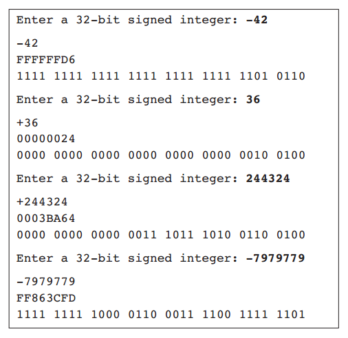

完整的程序代码如下所示，并添加了一些注释行：

.. code-block::

    ; Library Test #1: Integer I/O (InputLoop.asm)
    ; Tests the Clrscr, Crlf, DumpMem, ReadInt, SetTextColor,
    ; WaitMsg, WriteBin, WriteHex, and WriteString procedures.
    include Irvine32.inc
    .data
    COUNT = 4
    BlueTextOnGray = blue + (lightGray * 16)
    DefaultColor = lightGray + (black * 16)
    arrayD SDWORD 12345678h,1A4B2000h,3434h,7AB9h
    prompt BYTE "Enter a 32-bit signed integer: ",0
    .code
    main PROC
    ; Select blue text on a light gray background
        mov eax,BlueTextOnGray
        call SetTextColor
        call Clrscr ; clear the screen
        ; Display an array using DumpMem.
        mov esi,OFFSET arrayD ; starting OFFSET
        mov ebx,TYPE arrayD ; doubleword = 4 bytes
        mov ecx,LENGTHOF arrayD ; number of units in arrayD
        call DumpMem ; display memory
        ; Ask the user to input a sequence of signed integers
        call Crlf ; new line
        mov ecx,COUNT
    L1: mov edx,OFFSET prompt
        call WriteString
        call ReadInt ; input integer into EAX
        call Crlf ; new line
    ; Display the integer in decimal, hexadecimal, and binary
        call WriteInt ; display in signed decimal
        call Crlf
        call WriteHex ; display in hexadecimal
        call Crlf
        call WriteBin ; display in binary
        call Crlf
        call Crlf
        Loop L1 ; repeat the loop
    ; Return the console window to default colors
        call WaitMsg ; "Press any key..."
        mov eax,DefaultColor
        call SetTextColor
        call Clrscr
        exit
    main ENDP
    END main

库测试 #2：随机整数
::::::::::::::::::::::

让我们开始第二个库测试程序，该程序演示了链接库的随机数生成能力，同时介绍了CALL指令（在5.5节中进行完整讨论）。首先它生成10个0至 4,294,967,294范围内的无符号整数。然后，它生成-50至+49范围内的10个带符号整数：

.. code-block::

    ; Link Library Test #2 (TestLib2.asm)
    ; Testing the Irvine32 Library procedures.
    include Irvine32.inc
    TAB = 9 ; ASCII code for Tab
    .code
    main PROC
        call Randomize ; init random generator
        call Rand1
        call Rand2
        exit
    main ENDP
    Rand1 PROC
    ; Generate ten pseudo-random integers.
        mov ecx,10 ; loop 10 times
    L1: call Random32 ; generate random int
        call WriteDec ; write in unsigned decimal
        mov al,TAB ; horizontal tab
        call WriteChar ; write the tab
        loop L1
        call Crlf
        ret
    Rand1 ENDP
    Rand2 PROC
    ; Generate ten pseudo-random integers from -50 to +49
        mov ecx,10 ; loop 10 times
    L1: mov eax,100 ; values 0-99
        call RandomRange ; generate random int
        sub eax,50 ; values -50 to +49
        call WriteInt ; write signed decimal
        mov al,TAB ; horizontal tab
        call WriteChar ; write the tab
        loop L1
        call Crlf
        ret
    Rand2 ENDP
    END main

程序的示例输出如下：

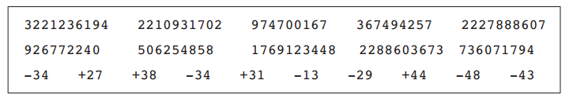

库测试 #3：性能时间
::::::::::::::::::::::

汇编语言经常被用于优化程序性能中的关键代码部分。本书库中的GetMseconds过程返回自午夜逝去的毫秒数。在我们的第三个测试程序中，我们调用GetMseconds，执行一个嵌套循环，并再次调用GetMseconds。这些调用所返回的两个值之间的差值可以告诉我们嵌套循环消耗的时间：

.. code-block::

    ; Link Library Test #3 (TestLib3.asm)
    ; Calculate the elapsed execution time of a nested loop
    include Irvine32.inc
    .data
    OUTER_LOOP_COUNT = 3
    startTime DWORD ?
    msg1 byte "Please wait...",0dh,0ah,0
    msg2 byte "Elapsed milliseconds: ",0
    .code
    main PROC
        mov edx,OFFSET msg1 ; "Please wait..."
        call WriteString
    ; Save the starting time
        call GetMSeconds
        mov startTime,eax
    ; Start the outer loop
        mov ecx,OUTER_LOOP_COUNT
    L1: call innerLoop
        loop L1
    ; Calculate the elapsed time
        call GetMSeconds
    sub eax,startTime
    ; Display the elapsed time
        mov edx,OFFSET msg2 ; "Elapsed milliseconds: "
        call WriteString
        call WriteDec ; write the milliseconds
        call Crlf
        exit
    main ENDP
    innerLoop PROC
        push ecx ; save current ECX value
        mov ecx,0FFFFFFFh ; set the loop counter
    L1: mul eax ; use up some cycles
        mul eax
        mul eax
        loop L1 ; repeat the inner loop
        pop ecx ; restore ECX's saved value
        ret
    innerLoop ENDP
    END main

下面是在Intel双核处理器上所得到的示例输出：

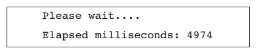

程序的详细分析
::::::::::::::

让我们详细分析一个库测试#3。主过程在控制台窗口中显示字符串"please wait..."：

.. code-block::

    main PROC
        mov edx,OFFSET msg1 ; "Please wait..."
        call WriteString

当GeMSeconds被调用时，它在EAX寄存器中返回自午夜逝去的毫秒数。该值被保存在变量中以备后续的使用：

.. code-block::

    call GetMSeconds
    mov startTime,eax

然后，我们基于OUTER_LOOP_COUNT常量的值创建循环。该值被拷贝到ECX中以用于LOOP指令中的使用：

.. code-block::

    mov ecx,OUTER_LOOP_COUNT

循环由标签L1开始，此时innerLoop过程被调用。CALL指令会重复直到ECX减小至零：

.. code-block::

    L1: call innerLoop
        loop L1

innerLoop过程在设置新值之前使用PUSH指令将ECX保存到栈上。（我们会在接下来的5.4节中讨论PUSH与POP）然后，循环本身有一些指令被设计来用光时钟周期：

.. code-block::

    innerLoop PROC
        push ecx ; save current ECX value
        mov ecx,0FFFFFFFh ; set the loop counter
    L1: mul eax ; use up some cycles
        mul eax
        mul eax
        loop L1 ; repeat the inner loop

此时LOOP指令会将ECX减小至零，所以我们由栈上弹出ECX的值。此时它具有与离开该过程时相同的值。PUSH与POP的顺序是必须的，因为主过程在调用innerLoop过程时使用ECX作为循环计数器。下面是innerLoop的最后几行：

.. code-block::

        pop ecx ; restore ECX's saved value
        ret
    innerLoop ENDP

再回到主过程，在循环结束后，我们调用GetMSeconds，该过程会在EAX中返回其值。我们所需要做的就是由该值减去开始时间，来获得两次GetMSeconds调用之间消耗的毫秒数：

.. code-block::

    call GetMSeconds
    sub eax,startTime

程序显示一个新字符串消息，然后显示EAX中的整数，表示逝去的毫秒数：

.. code-block::

        mov edx,OFFSET msg2 ; "Elapsed milliseconds: "
        call WriteString
        call WriteDec ; display the value in EAX
        call Crlf
        exit
    main ENDP

5.5 64位汇编编程
--------------------
5.5.1 Irvine64库
>>>>>>>>>>>>>>>>>>>>

本书提供了一个短小的库来辅助你进行64位编程，该库包含下述过程：

* Clrf：向控制台输入换行序列。
* Random64：生成0至2^64-1范围内的伪随机整数。随机数在RAX寄存器中返回。
* Randomize：使用唯一的数值为随机数生成数提供种。
* ReadInt64：由键盘读取64位带符号整数，以回车键结束。在RAX寄存器中返回整数值。
* ReadString：由键盘读取字符串，以回车键结束。在RDX传递输入缓冲区的偏移，将RCX设置为用户可以输入的字符最大数加1（用于空结束字节）。该过程返回用户输入的字符个数（在RAX中）。
* Str_compare：比较两个字符串。在RSI中传递指向源字符串的指针，在RDI中传递指向目的的指针。设置零与进位标记的方式与CMP（比较）指令相同。
* Str_copy：将源字符串拷贝到目的指针所标识的位置处。在RSI中传递源偏移量，在RDI中传递目的偏移量。
* Str_length：在RAX寄存器中返回以空字节结尾的字符串的长度。在RCX中传递字符串的偏移量。
* WriteInt64：以带有前置正号或负号的形式将RAX寄存器中的内容显示为64带符号十进制整数。该过程没有返回值。
* WriteHex64：将RAX寄存器中的内容显示为64位十六进制整数。该过程没有返回值。
* WriteHexB：以1字节，2字节，4字节，或8字节格式将RAX中的寄存器显示为十六进制整数。在RBX寄存器中传递显示尺寸（1，2，4，或8）。该过程没有返回值。
* WriteString：显示一个以空结尾的ASCII字符串。在RDX中传递字符串的64位偏移量。该过程没有返回值。

尽管该库要远小于我们的32位库，它却包含许多为使得程序更具有交互性而需要的实用工具。也鼓励你在本书的学习过程中使用你的代码来扩展该库。Irvine64库保留了RBX，RBP，RDI，RSI，R12，R14，以及R15寄存器的值。另一方面，RAX，RCX，RDX，R8，R9，R10，以及R11寄存器的值通常并没有保留。

5.5.2 调用64位子例程
>>>>>>>>>>>>>>>>>>>>

如果你要调用所创建的子例程，或者是调用Irvine64库中的子例程，所你需要做的是将输入参数放置在寄存器中，并执行CALL指令。例如：

.. code-block::

    mov rax,12345678h
    call WriteHex64

另外你还需要做一件小事，即在你的程序起始处使用RPOTO指令来标识你计划调用的程序外的过程：

.. code-block::

    ExitProcess PROTO ; located in the Windows API
    WriteHex64 PROTO ; located in the Irvine64 library

5.5.3 x64调用约定
>>>>>>>>>>>>>>>>>>>

Microsoft遵循在64位程序中传递参数与调用过程的统一约定，被称为Microsoft x64调用约定。该约定被C/C++编译器，以及Windows API所采用。你仅需要在调用Windows API中的函数，或是调用以C或C++编写的函数时使用该调用约定。下面是该调用约定的一些基本特点：

1. CALL由RSP（栈指针）寄存器减去8，因为地址为64位长。
2. 要传递给过程的前四个参数依次被放置在RCX，RDX，R8与R19寄存器中。如果仅传递一个参数，它会被放置在RCX中。如果有第二个参数，它将会被放置在RDX中，依次类推。其余的参数以由左到右的顺序被压入栈。
3. 调用者负责在运行时栈上至少分配32字节的影子空间，从而被调用的过程可以将寄存器参数保存在该区域。
4. 当调用一个子例程时，栈指针（RSP）必须对齐到16字节边界（乘以16）。CALL指令将8字节返回地址压入栈，所以调用程序必须由栈指针减去8，另外它已为影子空间减去了32字节。我们很快会在示例程序中了解如何来做。

将于x86调用约定的其他们细节会在第8章中介绍，界时我们会详细讨论运行时栈。这里的好消息是：当调用Irvine64库中的子例程时，你不必使用Microsoft x64调用约定。你仅需要在调用Windows API函数时使用。

5.5.4 调用过程的示例程序
>>>>>>>>>>>>>>>>>>>>>>>>>

让我们创建一个名为AddFour的使用Microsoft x64调用约定的简短程序来调用子例程。该子例程将四个参数寄存器（RCX，RDX，R8，以R9）中的值相加，并将和保存在RAX中。因为过程通常在RAX中返回整数值，当子例程返回时，调用程序希望返回值在该寄存器中。由这一角度来看，我们可以说子例程是一个函数，因为它接收四个输入，并（确定）产生一个输出。

.. code-block::

    1: ; Calling a subroutine in 64-bit mode (CallProc_64.asm)
    2: ; Chapter 5 example
    3:
    4: ExitProcess PROTO
    5: WriteInt64 PROTO ; Irvine64 library
    6: Crlf PROTO ; Irvine64 library
    7:
    8: .code
    9: main PROC
    10: sub rsp,8 ; align the stack pointer
    11: sub rsp,20h ; reserve 32 bytes for shadow params
    12:
    13: mov rcx,1 ; pass four parameters, in order
    14: mov rdx,2
    15: mov r8,3
    16: mov r9,4
    17: call AddFour ; look for return value in RAX
    18: call WriteInt64 ; display the number
    19: call Crlf ; output a CR/LF
    20:
    21: mov ecx,0
    22: call ExitProcess
    23: main ENDP
    24:
    25: AddFour PROC
    26: mov rax,rcx
    27: add rax,rdx
    28: add rax,r8
    29: add rax,r9 ; sum is in RAX
    30: ret
    31: AddFour ENDP
    32:
    33: END

让我们检视一个示例程序中的其他细节信息：第10行将栈指针对齐到偶数16字节边界。为什么会这样呢？因为OS调用main，我们假定栈指针被对齐到16字节边界。然后，当OS调用main时，CALL指令将8字节返回值压入栈。由栈指针减去8，使其向下到达16的整倍数处。

你可以在Visual Studio调试器中运行该程序，并查看RSP寄存器（栈指针）值的变化。当我们执行时，我们可以看到图5-11中所示的十六进制值。该值仅显示了每个地址的低32位，因为高32位为零：

1. 在第10行执行之前，RSP=01AFE48。在告诉我们在OS调用我们的程序之前，RSP等于01AFE50。（CALL指令由栈指针减去8.）
2. 在第10行执行之后，RSP=01AFE40，表明栈被正确的对齐到16字节边界。
3. 在第11行执行之后，RSP=01AFE20，表明由01AFE20至01AFE3f之间的32字节影子空间被保留。
4. 在AddFour过程中，RSP=01AFE18，表明调用者的返回地址被压入栈。
5. 在AddFour返回后，RSP的值再次等于01AFE20，即其调用AddFour之前的值。

除了调用ExitProcess来结束程序，我们也可以选择执行RET指令，这会返回到调用我们程序的进程。然而，它要求我们将栈指针恢复到main过程开始执行时的地址。下面的示例代码行可以作为CallProc_64程序中第21至22行的替代：

.. code-block::

    21: add rsp,28 ; restore the stack pointer
    22: mov ecx,0 ; process return code
    23: ret ; return to the OS

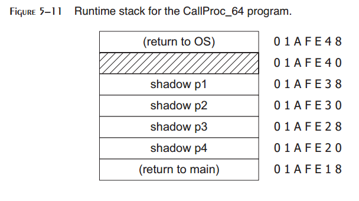

5.6 本章小结
----------------

