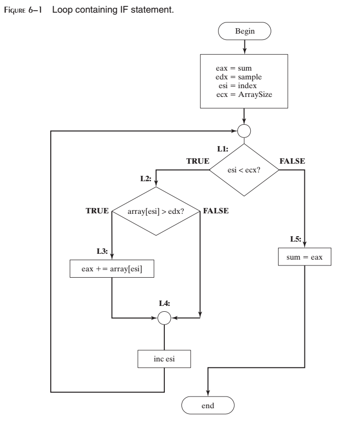

6 条件处理
^^^^^^^^^^^^^^^^

本章将会为你的汇编语言工具集引入一个重要工具，从而使得你的程序具有做出决策的能力。几乎所有的程序都需要这一能力。首先，我们将会向你们介绍作为所有决策语句核心的布尔操作，因为它们会影响CPU状态标记。然后，我们将会纳展示如何使用解析CPU状态标记的条件跳转与循环指令。接下来，我们将会展示如何使用本章的工具来实现理论计算机科学中最重要的基础结构之一：有限状态机。最后我们将会演示MASM用于32位编程的内建逻辑结构。

6.1 条件分支
------------------

允许决策制定的编程语言使用一种名为条件分支的技术让你能够修改控制流程。高级语言中可以见到的所有if语句，switch语句，或是条件循环语句都具有内建的分支逻辑。作为基础的汇编语言将会为你提供决策制定逻辑所需要的所有工具。在本章中，我们将会看到由高级条件语句到低级实现的转换是如何实现的。

处理硬件设置的程序必须能够处理数值中的单个位。单个位必须进行测试，清除，与测试。数据加密与压缩同样依赖于位操作。我们将会展示如何在汇编语言中执行这些操作。

本章将会回答一些基本问题：

* 我如何使用第1章介绍的布尔操作（AND，OR，NOT）？
* 我如何在汇编语言中编写IF语句？
* 嵌套IF语句是如何被编译器转换为机器语言的？
* 我如何设置与清除二进制数中的单个位？
* 我如何执行简单的二进制数据加密？
* 在布尔表达式中，带符号数与无符号数有哪些区别？

本章遵循一种自底向上的方法，首先由程序逻辑背后的二进制基础开始。接下来你将会看到CPU如何使用CMP指令与处理器状态标记比较指令操作数。最后，我们将所有组合在一起，并展示如何使用汇编语言实现高级语言的逻辑结构特点。

6.2 布尔与比较指令
------------------

在第1章中，我们介绍了布尔代数的四种基本操作：AND，OR，XOR与NOT。使用汇编语言指令，这些操作可以在二进制位级别上进行运算。这些操作在布尔表达式级别也同样重要，例如在IF语句中。首先，我们将会了解位操作指令。这里所用到的技术可以用于操作硬件的控制位，实现通信协议或加密数据。Intel指令包含了可直接在二进制位上实现布尔操作的AND，OR，XOR，以及NOT指令，如表6-1所示。另外，TEST指令是一个无损的AND操作。

6.2.1 CPU状态标记
>>>>>>>>>>>>>>>>>>>>

布尔指令影响零，进位，符号，溢出，以及校验标记。下面是其含义的快速浏览：

* 当操作的结果等于零时，零标记会被设置。
* 当操作导致目的操作数的最高位移出时，进位标记会被设置。
* 符号标记是目的操作数最位的拷贝，如果被设置，则表明其负数，如果被清除，则为正数。（零被认为是正数）
* 当指令生成的结是超出目的操作数的带符号范围内，溢出标记被设置。
* 当指令在目的操作数的低字节中生成偶数个1时，校验位被设置。

6.2.2 AND指令
>>>>>>>>>>>>>>>>>

AND指令在两个操作数的匹配位之间执行布尔（按位）AND操作，并将结果放入目的操作数中：

.. code-block::

    AND destination,source

下述为允许的操作数组合，尽管立即操作数不能大于32位：

.. code-block::

    AND reg,reg
    AND reg,mem
    AND reg,imm
    AND mem,reg
    AND mem,imm

操作数可以为8，16，32，或64位，而且它们必须具有相同的尺寸。对于两个操作数中的每个匹配位，适用于下列规则：如果两个二进制位均为1，则结果位为1；否则，结果位为0。下述第1章中的真值表列出了输入位x与y。第三列显示了表达式x^y表达式的值：

AND指令可以让你清除操作数中的1位或多位，而不影响其他们位。该技术被称为位屏蔽（bit masking），类似于你在粉刷屋子时使用屏蔽胶带来保护不需要被粉刷的区域（例如窗户）。例如，控制字节将由AL寄存器被拷贝到硬件设备。而且我们将会假定当控制字节中的位0与位3被清除时，硬件会进行自身重置。如果我们希望重置硬件而不影响AL中的其他位，我们可以编写下面的语句：

.. code-block::

    and AL,11110110b ; clear bits 0 and 3, leave others unchanged

假如AL被初始化为10101110二进制数，在与1110110 AND操作之后，AL等于10100110：

.. code-block::

    mov al,10101110b
    and al,11110110b ; result in AL = 10100110

*标记* AND指令总是会清除溢出与进位标记。它修改符号，零，与校验标记的方式与将带符号值赋值给目的操作数的方式相一致。例如，如果下述语句会将EAX寄存器中的值变为零，些时，零标记会被设置：

.. code-block::

    and eax,1Fh

将字符转换为大写
:::::::::::::::::

AND指令提供了一种非常简单的方法来将字符由小写转换为大写。如果我们比较大写A与小写a的ASCII码，就会看得很清楚，仅有位5不同：

.. code-block::

    0 1 1 0 0 0 0 1 = 61h ('a')
    0 1 0 0 0 0 0 1 = 41h ('A')

其余的字符具有同样的关系。如是我们将任意字符与11011111二进制数相与，除了位5以外其他位会保持不变。在下面的示例中，数组中的所有字符都被转换为大写：

.. code-block::

    .data
    array BYTE 50 DUP(?)
    .code
        mov ecx,LENGTHOF array
        mov esi,OFFSET array
    L1: and BYTE PTR [esi],11011111b ; clear bit 5
        inc esi
        loop L1

6.2.3 OR指令
>>>>>>>>>>>>>>>>>

OR指令在两个操作数的每一对匹配位之间执行布尔OR操作，并将结果放置在目的操作数中：

.. code-block::

    OR destination,source

OR指令与AND指令使用相同的操作数组合：

.. code-block::

    OR reg,reg
    OR reg,mem
    OR reg,imm
    OR mem,reg
    OR mem,imm

操作数可以为8，16，32，或64位，而且它们必须具有相同的尺寸。对于两个操作数中的每个匹配位，当至少一个输入位为1时，结果为1。下述的真值表（来自第1章）描述了布尔表达式x v y的值：

当你需要将操作数中1位或多位而不影响其他位时，OR指令将会特别有用。例如，如果你的计算机已经安装了一个伺服电机，当设置控制字节中的位2时会将其激活。假定AL寄存器包含一个控制字节，其中的每一个位都包含某些重要消息，下列的代码可以仅设置位2：

.. code-block::

    or AL,00000100b ; set bit 2, leave others unchanged

例如，如果AL被初始设置为11100011二进制数，然后我们将其与00000100进行OR操作，所得到的结果为11100111：

.. code-block::

    mov al,11100011b
    or al,00000100b ; result in AL = 11100111

*标记* OR指令总是清除进位与溢出标记。它修改符号，零，以及校验标记的方式与将带值值赋值给操作数的方式相同。例如，你可以将操作数与其自身执行OR操作来获取特定信息：

.. code-block::

    or al,al

对于AL寄存器中的值，会得到如下零与符号标记：

6.2.4 位映射集合
>>>>>>>>>>>>>>>>>>>

某些应用要操作由限定尺寸的通用集合中选取的数据项集合。例如一个公司的员工，或者是由一个气象站获取的环境数据。此时，二进制位可以表示集合关系。无需在窗口，例如Java HashSet，中保存指向对象的指针或引用，一个程序可以使用位向量（或位映射）将二进制数中的位遇到对象数组。

例如，下列的二进制数字使用右侧的0位到左侧的31位来表示数组元素0，1，2，与31是SetX集合的元素：

.. code-block::

    SetX = 10000000 00000000 00000000 00000111

（字节被分割以增加可读性。）我们可以很容易将一个特定的成员位与1进行AND操作以检测其成员关系：

.. code-block::

    mov eax,SetX
    and eax,10000b ; is element[4] a member of SetX?

如果此例中的AND指令清除零标记，我们就可以知道元素[4]是SetX的成员。

集合补
:::::::::::

集合的补集可以通过使用NOT指令生成，该指令会反转所有位。所以，我们所引入的SetX的补集可以通过下述语句在EAX中生成：

.. code-block::

    mov eax,SetX
    not eax ; complement of SetX

集合交集
:::::::::::

ADN指令生成一个表示两个集合交集的位向量。下面的代码生成SetX与SetY的交集，并将结果存储在EAX中：

.. code-block::

    mov eax,SetX
    and eax,SetY

下面显示了SetX与SetY的交集是如何生成的：

.. code-block::

        1000000000000000000000000000111 (SetX)
    AND 1000001010100000000011101100011 (SetY)
    ----------------------------------------------------------
        1000000000000000000000000000011 (intersection)

很难想像还会有生成集合交集更快的方法。较大的数会需要更多的位而不能存储到单个寄存器中，因而必须使用循环对所有位执行AND操作。

集合并集
::::::::::::

OR指令生成一个表示两个集合并集的位映射。下面的代码会在EAX中生成SetX与SetY的并集：

.. code-block::

    mov eax,SetX
    or eax,SetY

下面展示了如何通过OR指令生成SetX与SetY的并集：

.. code-block::

        1000000000000000000000000000111 (SetX)
    OR 1000001010100000000011101100011 (SetY)
    ----------------------------------------------------
        1000001010100000000011101100111 (union)

6.2.5 XOR指令
>>>>>>>>>>>>>>>>>

XOR指令在两个操作数的匹配位之间执行布尔异或操作，并将结果保存在目的操作数中：

.. code-block::

    XOR destination,source

XOR指令使用与AND及OR指令相同的操作数组合与数据尺寸相求。对于两个操作数中的每个匹配位，适用下列规则：如果两个位相同（均为0或均为1），结果为0；否则结果为1。下面的真值表描述了布尔表达式的值：

与0的按位异或会保持值不变，而与1的按位异或反转（补）。当对相同的操作数执行两次XOR操作时，会保持其自身不变。下面的真值表显示了位x与位y执行两个异或时，它会保持其原始值：

正如我们在6.3.4节中会看到，XOR的反转属性使其为简单对称加密的理想工具。

*标记* XOR指令总是清除溢出与进位标记。XOR修改符号，零，以及校验标记的方式与将值赋值给目的操作数的方式相同。

*检测校验标记* 校验检测是一种在二进制数上执行的函数，计数数字中所包含的1的个数；如果所得到的结果为偶数，我们说数据具有偶校验；如果结果为奇数，则数据具有奇校验。在x86处理器中，当按位或算术操作所得到的目的操作数的最低字节具有偶校验时，校验标记被设置。相应地，当操作数具有奇校验时，标记被清除。检测数字的校验而不修改其值的一种有效方法是使用零进行异或操作：

.. code-block::

    mov al,10110101b ; 5 bits = odd parity
    xor al,0 ; Parity flag clear (odd)
    mov al,11001100b ; 4 bits = even parity
    xor al,0 ; Parity flag set (even)

Visual Studio使用PE=1来表示偶校验，PE=0表明奇校验。

*16位校验* 我们可以通过高字节与低字节之间执行异或操作来检测16位整数的校验：

.. code-block::

    mov ax,64C1h ; 0110 0100 1100 0001
    xor ah,al ; Parity flag set (even)

将每个寄存器中的集合位（位等于1）想像为8位集合的成员。XOR指令将所有属于集合交集的位清零。XOR同时得到其余位之间的并集。该并集的校验与整个16位整数的校验相同。

32位值会如何呢？如果我们计数由B0至B3的字节数，我们可以计算校验为B0 XOR B1 XOR B2 XOR B3。

6.2.6 NOT指令
>>>>>>>>>>>>>>>>>>>>>

NOT指令反转操作数中的所有位。所得到的结果被称为该值的补。所允许的操作数类型如下：

.. code-block::

    NOT reg
    NOT mem

例如，F0h的补为0Fh：

.. code-block::

    mov al,11110000b
    not al ; AL = 00001111b

*标记* NOT指令不会影响任何标记。

6.2.7 TEST指令
>>>>>>>>>>>>>>>>>>>>

TEST指令会在两个操作数的匹配位之间执行隐式AND操作，并基于目的操作数设置符号，零，以及校验标记。TEST与AND之间的唯一区别在于TEST不会修改目的操作数。TEST指令允许与AND指令相同的操作数组合。TEST对于确定操作数中的单个位是否被设置特别有用。

*示例：测试多个位* TEST指令可以一次检测多个位。假定我们要知道AL寄存器中的位0或位3是否被设置。我们可以使用下述指令来确定：

.. code-block::

    test al,00001001b; test bits 0 and 3

（示例中的值00001001被称为位掩码。）由下面的示例数据集，我们可以推断仅当所有的测试位被清除时，零标记会被设置：

.. code-block::

    0 0 1 0 0 1 0 1 <- input value
    0 0 0 0 1 0 0 1 <- test value
    0 0 0 0 0 0 0 1 <- result: ZF = 0

    0 0 1 0 0 1 0 0 <- input value
    0 0 0 0 1 0 0 1 <- test value
    0 0 0 0 0 0 0 0 <- result: ZF = 1

*标记* TEST指令总是清除溢出与进位标记。它修改符号，零，以及校验标记的方式与AND指令相同。

6.2.8 CMP指令
>>>>>>>>>>>>>>>>>

在探讨过所有的位指令后，让我们转向逻辑（布尔）表达式中所用的指令。最常用的布尔表达式是比较。下述的伪代码片段展示了该思想：

.. code-block::

    if A > B ...
    while X > 0 and X < 200 ...
    if check_for_error( N ) = true

在x86汇编语言中，我们使用CMP指令来比较整数。字符码也是整数，所以它们也适用于CMP指令。浮点值需要特殊的比较指令，我们会在第12章中探讨。

CMP（比较）指令执行一个隐式的减法操作，由目的操作数减去源操作数。两个操作数都不会被修正：

.. code-block::

    CMP destination,source

CMP使用与AND指令相同的操作数组合。

*标记* 基于如果发生真正的减法操作时目的操作数的值，CMP指令修改溢出，符号，零，进位，辅助进位，以及校验标记。当比较两个无符号操作数时，零以及进位标记会标识两个操作数之间的如下关系：

当比较两个带符号操作数时，符号、零、以及溢出标记会标识两个操作数之间的如下关系：

CMP是创建条件逻辑结构的重要工具。当你在CMP指令后跟条件跳转指令时，所得到的结果就是汇编言中IF语句的等效语句。

*示例* 让我们来看三个代码片段，展示CMP指令是如何影响标记位的。当AX等于5，并与10进行比较时，进位标记会被设置，因为由5减去10需要借位：

.. code-block::

    mov ax,5
    cmp ax,10 ; ZF = 0 and CF = 1

比较1000与1000会设置零标记，因为由源操作数减去目的操作数会得到0：

.. code-block::

    mov ax,1000
    mov cx,1000
    cmp cx,ax ; ZF = 1 and CF = 0

比较105与0会同时清除零与进位标记，因为由105减去0得到一个正的非零值。

.. code-block::

    mov si,105
    cmp si,0 ; ZF = 0 and CF = 0

6.2.9 设置并清除单个CPU标记
>>>>>>>>>>>>>>>>>>>>>>>>>>>

你如何简单地设置或清除零，符号，进位，与溢出标记呢？有多种方法，其中一些方法需要修改目的操作数。要测试零标记，将操作数与零进行TEST或AND操作；要清除零标记，将操作数与1执行OR操作：

.. code-block::

    test al,0 ; set Zero flag
    and al,0 ; set Zero flag
    or al,1 ; clear Zero flag

TEST不会修改目的操作数，而AND会。要设置符号坊，将操作数的最高位与1执行OR操作。要清除符号位，将最高位与0执行AND操作：

.. code-block::

    or al,80h ; set Sign flag
    and al,7Fh ; clear Sign flag

要设置进位标记，使用STC指令；要清除进位标记，使用CLC：

.. code-block::

    stc ; set Carry flag
    clc ; clear Carry flag

要设置溢出标记，相加两个可以得到负数的正数。要清除溢出标记，将操作数与0执行OR操作：

.. code-block::

    mov al,7Fh ; AL = +127
    inc al ; AL = 80h (-128), OF=1
    or eax,0 ; clear Overflow flag

6.2.10 64位模式中的布尔指令
>>>>>>>>>>>>>>>>>>>>>>>>>>>>>

对于64位模式下的64位指令，其作用方式与32位模式相同。例如，如果源操作数是一个小于32位的常量，而目的操作数是64位寄存器或内存操作数，目的操作数的所有位都会受到影响：

.. code-block::

    .data
    allones QWORD 0FFFFFFFFFFFFFFFFh
    .code
    mov rax,allones ; RAX = FFFFFFFFFFFFFFFF
    and rax,80h ; RAX = 0000000000000080
    mov rax,allones ; RAX = FFFFFFFFFFFFFFFF
    and rax,8080h ; RAX = 0000000000008080
    mov rax,allones ; RAX = FFFFFFFFFFFFFFFF
    and rax,808080h ; RAX = 0000000000808080

但当源操作数是32位常量或寄存器时，仅会影响目的操作数的低32位。在下面的示例中，仅有RAX的低32位会被修改：

.. code-block::

    mov rax,allones ; RAX = FFFFFFFFFFFFFFFF
    and rax,80808080h ; RAX = FFFFFFFF80808080

当目的操作数为内存操作数时也是同样的结是。显然，除了操作数尺寸，32位操作数是你需要考虑的一种特殊情况。

6.3 条件跳转
--------------

6.3.1 条件结构
>>>>>>>>>>>>>>>>>>

在x86指令集中并不存在显式的高级逻辑结构，但是你可以使用比较与跳转的组合来实现。在执行条件语句中涉及到两个步骤：首先，修改CPU状态标记的操作，例如CMP，AND，或SUB。其次，条件跳转指令测试标记并分支到一个新位置处。让我们看一些示例。

*示例1* 下面示例中的CMP指令将EAX与零比较。如果CMP指令设置了零标记，则JZ（如果零跳转）指令跳转到L1标签处：

.. code-block::

        cmp eax,0
        jz L1 ; jump if ZF = 1
        . .
    L1:

*示例2* 下面示例中的AND指令在DL寄存器上执行按位与，并修改零标记。如果零标记被清除，JNZ（如果零跳转）指令跳转：

.. code-block::

        and dl,10110000b
        jnz L2 ; jump if ZF = 0
        . .
    L2:

6.3.2 Jcond指令
>>>>>>>>>>>>>>>>>>

当一个状态标记条件为真时，条件跳转指令分支到目的标签处。否则，如果标记条件为假，条件跳转指令之后的指令会被执行。其语法为：

.. code-block::

    Jcond destination

cond指标识一个或多个标记状态的标记条件。下述示例基于进位与零标记：

CPU标记通常被算术运算，比较，以及布尔指令所修改。条件跳转指令评估这些标记状态，依据状态值确定是否跳转。

*使用CMP指令* 假定你要在EAX等于5时跳转到标签L1处。在下面的示例中，如果EAX等于5，CMP指令设置零标记；然后，JE指令跳转到L1，因为零标记被设置：

.. code-block::

    cmp eax,5
    je L1 ; jump if equal

（JE指令总是基于零标记的值进行跳转。）如果EAX不等于5，CMP会清除零标记，从而JE指令不会跳转。

在下面的示例中，JL指令跳转到L1标签处，因为AX小于6：

.. code-block::

    mov ax,5
    cmp ax,6
    jl L1 ; jump if less

在下面的示例中，发生跳转的原因在于AX大于4：

.. code-block::

    mov ax,5
    cmp ax,4
    jg L1 ; jump if greater

6.3.3 条件跳转指令类型
>>>>>>>>>>>>>>>>>>>>>>

x86指令集合拥有大量的条件跳转指令。它们可以比较带符号与无符号整数，并依据单个的CPU状态执行动作。条件跳转指令可以分为四类：

* 基于特定标记值的跳转
* 基于两个操作数或（E）CX值之间相相等性的跳转
* 基于无符号操作数比较的跳转
* 基于有符号操作数比较的跳转

表6-2列出了基于零，进位，溢出，校验，以及符号标记的跳转列表。

相等比较
::::::::::::

表6-3列出了基于相等比较的条件跳转。在某些情况下，两个操作数进行比较；而在另一些情况下，基于CX，ECX，或RCX的值进行跳转。在表中，符号leftOp与rightOp指CMP指令中的左（目的）与右（源）操作数：

.. code-block::

    CMP leftOp,rightOp

操作数的名字反映了算术中相关操作符的操作数顺序。例如，在表达式X<Y中，X被称为leftOp，而Y被称为rightOp。

尽管JE指令与JZ（零时跳转）指令等同，而JNE与JNZ（非零跳转）等同，最好选择最能标识你意图的助记符，以表明是否比较两个操作数，还是检测某个特定标记。

下述为使用JE，JNE，JCXZ以及JECXZ指令的代码示例。仔细查看注释以确保你理解为什么条件跳转会发生（或不发生）。

*示例1*：

.. code-block::

    mov edx,0A523h
    cmp edx,0A523h
    jne L5 ; jump not taken
    je L1 ; jump is taken

*示例2*：

.. code-block::

    mov bx,1234h
    sub bx,1234h
    jne L5 ; jump not taken
    je L1 ; jump is taken

*示例3*：

.. code-block::

    mov cx,0FFFFh
    inc cx
    jcxz L2 ; jump is taken

*示例4*：

.. code-block::

    xor ecx,ecx
    jecxz L2 ; jump is taken

无符号比较
:::::::::::::::::

表6-4中展示了基于无符号数比较的跳转。正如表达式（leftOp<rightOp）中所示，操作数的名字反映了操作数的顺序。表6-4中的跳转仅当比较无符号数时才有意义。有符号操作数使用不同的跳转指令集。

带符号比较
:::::::::::::

表6-5显示了有符号比较的跳转列表。下述指令序列展示了两个带符号数的比较：

.. code-block::

    mov al,+127 ; hexadecimal value is 7Fh
    cmp al,-128 ; hexadecimal value is 80h
    ja IsAbove ; jump not taken, because 7Fh < 80h
    jg IsGreater ; jump taken, because +127 > -128

为无符号比较而设计的JA指令并不会发生跳转，因为无符号的7Fh要小于无符号的80h。与之相对，JG指令被设计用于带符号比较，它会发生跳转，因为+127大于-128。

在下面的代码示例中，仔细查看注释以确保你理解跳转为什么发生（或不发生）：

*示例1*

.. code-block::

    mov edx,-1
    cmp edx,0
    jnl L5 ; jump not taken (-1 >= 0 is false)
    jnle L5 ; jump not taken (-1 > 0 is false)
    jl L1 ; jump is taken (-1 < 0 is true)

*示例2*

.. code-block::

    mov bx,+32
    cmp bx,-35
    jng L5 ; jump not taken (+32 <= -35 is false)
    jnge L5 ; jump not taken (+32 < -35 is false)
    jge L1 ; jump is taken (+32 >= -35 is true)

*示例3*

.. code-block::

    mov ecx,0
    cmp ecx,0
    jg L5 ; jump not taken (0 > 0 is false)
    jnl L1 ; jump is taken (0 >= 0 is true)

*示例4*

.. code-block::

    mov ecx,0
    cmp ecx,0
    jl L5 ; jump not taken (0 < 0 is false)
    jng L1 ; jump is taken (0 <= 0 is true)

6.3.4 条件跳转应用
>>>>>>>>>>>>>>>>>>>>>>

*测试状态位* 汇编语言最适用做的事情之一就是位测试。通常，我们并不希望修改正被测试的位的值，但我们却希望修改CPU的状态标记值。条件跳转指令经常使用这些状态标记来确定是否将控制权传递到指定标签处。例如，假定一个名为status的8位内存操作数包含有关于连接到计算机的外部设备的信息。如果位5被设置则下述指令跳转到某个标签处，表明设备当前处理离线状态：

.. code-block::

    mov al,status
    test al,00100000b ; test bit 5
    jnz DeviceOffline

如果位0，位1，或位4被设置，则下述语句跳转到某个标签：

.. code-block::

    mov al,status
    test al,00010011b ; test bits 0,1,4
    jnz InputDataByte

如果AND与CMP指令所要求的位2，位3，与位7均被设置，则跳转到某个标签处：

.. code-block::

    mov al,status
    and al,10001100b ; mask bits 2,3,7
    cmp al,10001100b ; all bits set?
    je ResetMachine ; yes: jump to label

*两个整数中的较大值* 下述代码比较EAX与EBX中的无符号整数，并将两者中的较大值拷贝到EDX：

.. code-block::

    mov edx,eax ; assume EAX is larger
    cmp eax,ebx ; if EAX is >= EBX
    jae L1 ; jump to L1
    mov edx,ebx ; else move EBX to EDX
    L1: ; EDX contains the larger integer

*三个整数中的最小值* 下述指令比较变量V1，V2以及V3中的无符号16位值，并将三者中的最小值拷贝到AX：

.. code-block::

    .data
    V1 WORD ?
    V2 WORD ?
    V3 WORD ?
    .code
        mov ax,V1 ; assume V1 is smallest
        cmp ax,V2 ; if AX <= V2
        jbe L1 ; jump to L1
        mov ax,V2 ; else move V2 to AX
    L1: cmp ax,V3 ; if AX <= V3
        jbe L2 ; jump to L2
        mov ax,V3 ; else move V3 to AX
    L2:

*循环直到按下按键* 在下述32位代码中，循环会持续运行，直到用户按下某个标准的字母键为止。Irvine32中的ReadKey方法会在输入缓冲区中没有按键时设置零标记：

.. code-block::

    .data
    char BYTE ?
    .code
    L1: mov eax,10 ; create 10 ms delay
        call Delay
        call ReadKey ; check for key
        jz L1 ; repeat if no key
        mov char,AL ; save the character

上述代码在循环中插入了一人10毫秒的延时，从而为MS-Windows处理事消息提供时间。如果你丢弃该延时，则击键消息会被忽略。

应用：数组的序列查找
:::::::::::::::::::::::

一个常见的编程任务即是在数组中查找满足特定条件的值。例如，下面的程序会在一个16位整数的数组中查找第一个不为零的值。如果查找成功，则显示该值；否则，它会显示一条表明非零值没有找到的消息。

.. code-block::

    ; Scanning an Array (ArrayScan.asm)
    ; Scan an array for the first nonzero value.
    INCLUDE Irvine32.inc
    .data
    intArray SWORD 0,0,0,0,1,20,35,-12,66,4,0
    ;intArray SWORD 1,0,0,0 ; alternate test data
    ;intArray SWORD 0,0,0,0 ; alternate test data
    ;intArray SWORD 0,0,0,1 ; alternate test data
    noneMsg BYTE "A non-zero value was not found",0
    .code
    main PROC
        mov ebx,OFFSET intArray ; point to the array
        mov ecx,LENGTHOF intArray ; loop counter
    L1: cmp WORD PTR [ebx],0 ; compare value to zero
        jnz found ; found a value
        add ebx,2 ; point to next
        loop L1 ; continue the loop
        jmp notFound ; none found
    found: ; display the value
        movsx eax,WORD PTR[ebx] ; sign-extend into EAX
        call WriteInt
        jmp quit
    notFound: ; display "not found" message
        mov edx,OFFSET noneMsg
        call WriteString
    quit:
        call Crlf
        exit
    main ENDP
    END main

*应用：简单字符串加密*

XOR指令具有一种有趣的属性。如果整数X与Y进行异或操盘，所得到的结果再次与Y进行异或，则所得到的值为X：

.. code-block::

    ((X ⊗ Y)  ⊗ Y)  = X

XOR的可异属性为执行简单的数据加密提供了一种简便的方法：通过将普通文本中的每个字符与名为key的第三个字符串的每个字符执行异或操作，可以得到被称为密文的加密字符串。查看者可以使用密码对密文进行解密，从而得到原始文本。

*示例程序* 我们将会演示一个使用对称加密的简单程序，即在加密与解密中使用相同的密码。下述步骤会在运行时依次执行：

1. 用户输入普通文本。
2. 程序使用单个字符密码加密普通文本，生成密文并显示在屏幕上。
3. 程序解密密文文本，生成并显示原始文本。

下图是程序的示例输出：

下面是完整的程序源码：

.. code-block::

    ; Encryption Program (Encrypt.asm)
    INCLUDE Irvine32.inc
    KEY = 239 ; any value between 1-255
    BUFMAX = 128 ; maximum buffer size
    .data
    sPrompt BYTE "Enter the plain text:",0
    sEncrypt BYTE "Cipher text: ",0
    sDecrypt BYTE "Decrypted: ",0
    buffer BYTE BUFMAX+1 DUP(0)
    bufSize DWORD ?
    .code
    main PROC
        call InputTheString ; input the plain text
        call TranslateBuffer ; encrypt the buffer
        mov edx,OFFSET sEncrypt ; display encrypted message
        call DisplayMessage
        call TranslateBuffer ; decrypt the buffer
        mov edx,OFFSET sDecrypt ; display decrypted message
        call DisplayMessage
        exit
    main ENDP
    ;-----------------------------------------------------
    InputTheString PROC
    ;
    ; Prompts user for a plaintext string. Saves the string
    ; and its length.
    ; Receives: nothing
    ; Returns: nothing
    ;-----------------------------------------------------
        pushad ; save 32-bit registers
        mov edx,OFFSET sPrompt ; display a prompt
        call WriteString
        mov ecx,BUFMAX ; maximum character count
        mov edx,OFFSET buffer ; point to the buffer
        call ReadString ; input the string
        mov bufSize,eax ; save the length
        call Crlf
        popad
        ret
    InputTheString ENDP
    ;-----------------------------------------------------
    DisplayMessage PROC
    ;
    ; Displays the encrypted or decrypted message.
    ; Receives: EDX points to the message
    ; Returns: nothing
    ;-----------------------------------------------------
        pushad
        call WriteString
        mov edx,OFFSET buffer ; display the buffer
        call WriteString
        call Crlf
        call Crlf
        popad
        ret
    DisplayMessage ENDP
    ;-----------------------------------------------------
    TranslateBuffer PROC
    ;
    ; Translates the string by exclusive-ORing each
    ; byte with the encryption key byte.
    ; Receives: nothing
    ; Returns: nothing
    ;-----------------------------------------------------
        pushad
        mov ecx,bufSize ; loop counter
        mov esi,0 ; index 0 in buffer
    L1:
        xor buffer[esi],KEY ; translate a byte
        inc esi ; point to next byte
        loop L1
        popad
        ret
    TranslateBuffer ENDP
    END main

你绝应使用单个字符加密密钥来加密重要的数据，因为它很容易被解密。相反，本章的练习会建议你使用包含多个字符的加密密钥来加密和解密文本。

6.4 条件循环指令
------------------

6.4.1 LOOPZ与LOOPE指令
>>>>>>>>>>>>>>>>>>>>>>>>>>>>>

LOOPZ（零时循环）指令的工作方式类似于LOOP指令，不同之处在于它有一个额外的参数：为了将控制传递到目的标签处，必须设置零标记。其语法为：

.. code-block::

    LOOPZ destination

LOOPE（如果相等循环）指令与LOOPZ等同，并且它们具有相同的操作码。它们执行下述任务：

.. code-block::

    ECX = ECX - 1
    if ECX > 0 and ZF = 1, jump to destination

否则不发生跳转，并将控制传递到下一条指令。LOOPZ与LOOPE不会影响状态标记。在32位模式中，ECX为循环计数器寄存器，而64位模式中，RCX为计数器。

6.4.2 LOOPNZ与LOOPNE指令
>>>>>>>>>>>>>>>>>>>>>>>>>>>>>>

LOOPNZ（非零时循环）指令是LOOPZ的相反面。循环会在ECX的无符号值大于零时（递减后）持续，并且零标记被清除。其语法为：

.. code-block::

    LOOPNZ destination

LOOPNE（如果不相等循环）指令与LOOPNZ等同，并且它们具有相同的操作码。它们执行下述任务：

.. code-block::

    ECX = ECX - 1
    if ECX > 0 and ZF = 0, jump to destination

否则，不执行任务操作，并且控制传递给下一条指令。

*示例* 下面的代码片段依次扫描数组中的每个值，直到遇到一个非负值（当符号位被清除）。注意，我们在ADD指令之前将标记压入栈，因为ADD会修改标记。然后，在LOOPNZ指令执行之前通过POPFD指令恢复标记：

.. code-block::

    .data
    array SWORD -3,-6,-1,-10,10,30,40,4
    sentinel SWORD 0
    .code
        mov esi,OFFSET array
        mov ecx,LENGTHOF array
    L1: test WORD PTR [esi],8000h ; test sign bit
        pushfd ; push flags on stack
        add esi,TYPE array ; move to next position
        popfd ; pop flags from stack
        loopnz L1 ; continue loop
        jnz quit ; none found
        sub esi,TYPE array ; ESI points to value
    quit:

如果遇到一个非负数，ESI会指向该值。如果没有找到正数值，则循环失败，当ECX等于零时，循环终止。此时，JNZ指令跳转到标签quit，而且ESI指向标记值（0），位于紧随数组后的内存处。

6.5 条件结构
-----------------

我们将条件结构定义为在不同逻辑分支之间触发选择的一个或多个条件表达式。每一个分支会导致不同的指令执行序列。毫无疑问，你已经在高级程序语言中使用过了条件结构。但是也许你并不知道语言编译器如何将条件结构转换为底层机器码。让我们来探索这是如何实现的。

6.5.1 块结构的IF语句
>>>>>>>>>>>>>>>>>>>>>>>>

IF结构意味着一个布尔表达式后跟有两个语句列表，其中一组在表达式为真时执行，而另一组在表达式为假时执行：

.. code-block::

    if( boolean-expression )
        statement-list-1
    else
        statement-list-2

语句的else部分是可选的。在汇编语言中，我们分几步编写这种结构。首先我们通过确定哪一个CPU状态标记被影响的方式来计算布尔表达式。其次，我们构建一系列的跳转，基于相关的CPU状态标记，将控制传递到两组语句处。

*示例1* 在下面的C++代码中，如果op1等于op2，则执行两个赋值语句：

.. code-block::

    if( op1 == op2 )
    {
        X = 1;
        Y = 2;
    }

我们通过CMP指令后跟条件跳转的方式来将此IF语句转换为汇编语言。因为op1与op2是内存操作数（变量），在执行CMP指令之前，其中一个变量必须被拷贝到寄存器中。下面的代码以一种尽可能高效的方式实现IF语句，即当布尔表达式为真时，允许代码直接到达我们希望执行的两条MOV指令处：

.. code-block::

        mov eax,op1
        cmp eax,op2 ; op1 == op2?
        jne L1 ; no: skip next
        mov X,1 ; yes: assign X and Y
        mov Y,2
    L1:

如果我们使用JE指令实现==操作符，则实现代码就会有些不紧凑（六条指令而不是五条）：

.. code-block::

        mov eax,op1
        cmp eax,op2 ; op1 == op2?
        je L1 ; yes: jump to L1
        jmp L2 ; no: skip assignments
    L1: mov X,1 ; assign X and Y
        mov Y,2
    L2:

*示例2* 在NTFS文件存储系统中，磁盘簇的尺寸依赖于磁盘卷的整体容量。在下面的伪代码中，如果卷尺寸（存储在terrabytes变量中）小于16TBytes时，我们将簇尺寸设置为4096.否则，我们将簇尺寸设置为8192：

.. code-block::

    clusterSize = 8192;
    if terrabytes < 16
        clusterSize = 4096;

下面是以汇编语言实现伪代码的一种方法：

.. code-block::

        mov clusterSize,8192 ; assume larger cluster
        cmp terrabytes, 16 ; smaller than 16 TB?
        jae next
        mov clusterSize,4096 ; switch to smaller cluster
    next:

*示例3* 下面的伪代码语句有两个分支：

.. code-block::

    if op1 > op2
        call Routine1
    else
        call Routine2
    end if

在下面的伪代码的汇编语言转换中，我们假定op1与op2为带符号双字变量。当比较变量时，其中一个必须被拷贝到寄存器：

.. code-block::

        mov eax,op1 ; move op1 to a register
        cmp eax,op2 ; op1 > op2?
        jg A1 ; yes: call Routine1
        call Routine2 ; no: call Routine2
        jmp A2 ; exit the IF statement
    A1: call Routine1
    A2:

白盒测试
:::::::::::::

复杂的条件语句通常具有多条执行路径，使其很难通过代码查看进行调试。程序经常实现一种被称为白盒测试的技术，它会验证子例程的输入与相应的输出。然而白盒测试要求你拥有一份源代码的拷贝。我们输入变量赋予多个不同的值。对于每一个输入组合，我们手动在代码中跟踪并验证执行路径以及子例程的输出结果。让我们看一下如何在汇编语言中实现下面的嵌套IF语句：

.. code-block::

    if op1 == op2
        if X > Y
            call Routine1
        else
            call Routine2
        end if
    else
        call Routine3
    end if

下面是一种可能的汇编转换，为了说明，我们添加了行号。它保存初始条件（op1==op2）并且立即跳转到ELSE部分。剩下需要转换的是内部IF-ELSE语句：

.. code-block::

    1:      mov eax,op1
    2:      cmp eax,op2 ; op1 == op2?
    3:      jne L2 ; no: call Routine3
    ; process the inner IF-ELSE statement.
    4:      mov eax,X
    5:      cmp eax,Y ; X > Y?
    6:      jg L1 ; yes: call Routine1
    7:      call Routine2 ; no: call Routine2
    8:      jmp L3 ; and exit
    9: L1: call Routine1 ; call Routine1
    10:     jmp L3 ; and exit
    11: L2: call Routine3
    12: L3:

列表6-6显示了示例代码的白盒测试结果。在前四列中，测试值被赋值给op1，op2，X与Y。在第5列与第6列中验证执行路径。

6.5.2 组合表达式

逻辑与操作符
::::::::::::::

汇编语言可以很容易实现包含AND操作符的组合布尔表达式。考虑下面的伪代码，其中用于比较的值被假定为无符号整数：

.. code-block::

    if (al > bl) AND (bl > cl)
        X = 1
    end if

*短路计算* 下述代码是使用短路代码的一种直接实现，其中，如果第一个表达式为假，则第二个表达式不会进行计算。这对于高级语言同样如此：

.. code-block::

        cmp al,bl ; first expression...
        ja L1
        jmp next
    L1: cmp bl,cl ; second expression...
        ja L2
        jmp next
    L2: mov X,1 ; both true: set X to 1
    next:

通过将初始JA指令改变JBE，我们可以将代码精简为五条指令：

.. code-block::

        cmp al,bl ; first expression...
        jbe next ; quit if false
        cmp bl,cl ; second expression
        jbe next ; quit if false
        mov X,1 ; both are true
    next:

在第一个JBE指令没有执行时，使CPU直接进入第二条CMP指令，可以将代码尺寸降低29%（七条指令降为五条指令）。

逻辑或操作符
:::::::::::::::

当组合表达式包含由OR操作符连接的子表达式时，如果任意一个子表达式为真，则整体结果为真。让我们使用下面的伪代码示例：

.. code-block::

    if (al > bl) OR (bl > cl)
        X = 1

在下面的实现中，如果第一个表达式为真，则代码分支到L1处；否则，它会进入第二个CMP指令。第二个表达式并没有使用>操作而，而是使用JBE指令：

.. code-block::

        cmp al,bl ; 1: compare AL to BL
        ja L1 ; if true, skip second expression
        cmp bl,cl ; 2: compare BL to CL
        jbe next ; false: skip next statement
    L1: mov X,1 ; true: set X = 1
    next:

对于给定的组合表达式，在汇编语言中有多种实现方式。

6.5.3 WHILE循环
>>>>>>>>>>>>>>>>>>>>

WHILE循环在执行语句块之前首先测试条件。只要循环条件为真，语句块就会重复。下面是使用C++编写的循环代码：

.. code-block:: cpp

    while( val1 < val2 )
    {
        val1++;
        val2--;
    }

当在汇编语言中实现该结构时，如果条件为假，则放弃循环条件并跳转到endwhile处。假定val1与val2为两个变量，我们必须在起始时将其中一个变量拷贝到寄存器中，并在结束时恢复该变量：

.. code-block::

        mov eax,val1 ; copy variable to EAX
    beginwhile:
        cmp eax,val2 ; if not (val1 < val2)
        jnl endwhile ; exit the loop
        inc eax ; val1++;
        dec val2 ; val2--;
        jmp beginwhile ; repeat the loop
    endwhile:
        mov val1,eax ; save new value for val1

EAX是循环内部val1的一个代理（替代）。必须通过EAX访问val1。使用JNL意味着vl1与val2是有符号整数。

*示例：循环内部嵌套的IF语句*

高级语言很容易表示嵌套控制结构。在下面的C++代码中，在WHILE循环内部有一个嵌套的IF语句。它会计算所有大于smaple的数组元素的和：

.. code-block:: cpp

    int array[] = {10,60,20,33,72,89,45,65,72,18};
    int sample = 50;
    int ArraySize = sizeof array / sizeof sample;
    int index = 0;
    int sum = 0;
    while( index < ArraySize )
    {
        if( array[index] > sample )
        {
            sum += array[index];
        }
        index++;
    }

在使用汇编语言编写该循环之前，让我们使用图6-1中的流程图来描述该逻辑。为了通过减少内存访问次数来简化转换并提高执行速度，使用寄存器来代替变量，EDX=sample，EAX=sum，ESI=index，ECX=数组尺寸（常量）。标签名已经添加到图形中。

*汇编代码* 由流程图生成汇编代码的最简单的方法就是为每个流程图形实现单独的代码。注意流程图中的标签以及下述源码中所用标签之间的直接关系：

.. code-block::

    .data
    sum DWORD 0
    sample DWORD 50
    array DWORD 10,60,20,33,72,89,45,65,72,18
    ArraySize = ($ - Array) / TYPE array
    .code
    main PROC
        mov eax,0 ; sum
        mov edx,sample
        mov esi,0 ; index
        mov ecx,ArraySize
    L1: cmp esi,ecx ; if esi < ecx
        jl L2
        jmp L5
    L2: cmp array[esi*4], edx ; if array[esi] > edx
        jg L3
        jmp L4
    L3: add eax,array[esi*4]
    L4: inc esi
        jmp L1
    L5: mov sum,eax

6.5节结尾的问题会为你提供改进该代码的机会。

6.5.4 表驱动选择
>>>>>>>>>>>>>>>>>>>

表驱动选择是使用表查询来代替多路选择结构的一种方法。要使用表驱动选择，你必须创建一个包含查询值，以及标签或过程偏移的表，然后必须使用循环来查询该表。这特别适用于需要大量比较的情况。

例如，下面是包含单个字符查询值以及过程地址的表的一部分：

.. code-block::

    .data
    CaseTable BYTE 'A' ; lookup value
        DWORD Process_A ; address of procedure
        BYTE 'B'
        DWORD Process_B
        (etc.)

让我们假定Process_A，Process-B，Process-C以及Process-D分别位于地址120h，130h，140h，以及150h处。表在内存中的排列如图6-2所示。

*示例程序* 在下面的示例程序中，用户由键盘输入一个字符。通过循环，字符会与查询表中的每一项进行比较。在表中查找到的第一个匹配会使得程序调用紧随查询值之后的过程偏移。每个过程将不同字符串的偏移量拷贝到EDX，从而在循环过程中显示：

.. code-block::

    ; Table of Procedure Offsets (ProcTable.asm)
    ; This program contains a table with offsets of procedures.
    ; It uses the table to execute indirect procedure calls.
    INCLUDE Irvine32.inc
    .data
    CaseTable BYTE 'A' ; lookup value
              DWORD Process_A ; address of procedure
    EntrySize = ($ - CaseTable)
                BYTE 'B'
                DWORD Process_B
                BYTE 'C'
                DWORD Process_C
                BYTE 'D'
                DWORD Process_D
    NumberOfEntries = ($ - CaseTable) / EntrySize
    prompt BYTE "Press capital A,B,C,or D: ",0

为每个过程定义单独的字符串：

.. code-block::

    msgA BYTE "Process_A",0
    msgB BYTE "Process_B",0
    msgC BYTE "Process_C",0
    msgD BYTE "Process_D",0

    .code
    main PROC
        mov edx,OFFSET prompt ; ask user for input
        call WriteString
        call ReadChar ; read character into AL
        mov ebx,OFFSET CaseTable ; point EBX to the table
        mov ecx,NumberOfEntries ; loop counter
    L1:
        cmp al,[ebx] ; match found?
        jne L2 ; no: continue
        call NEAR PTR [ebx + 1] ; yes: call the procedure

CALL指令调用存储在EBX+1所指向的内存地址处的过程。这样的间接调用需要NEAR PTR操作符：

.. code-block::

        call WriteString ; display message
        call Crlf
        jmp L3 ; exit the search
    L2:
        add ebx,EntrySize ; point to the next entry
        loop L1 ; repeat until ECX = 0
    L3:
        exit
    main ENDP

下面的每个过程将不同的字符串偏移拷贝到EDX：

.. code-block::

    Process_A PROC
        mov edx,OFFSET msgA
        ret
    Process_A ENDP
    Process_B PROC
        mov edx,OFFSET msgB
        ret
    Process_B ENDP
    Process_C PROC
        mov edx,OFFSET msgC
        ret
    Process_C ENDP
    Process_D PROC
        mov edx,OFFSET msgD
        ret
    Process_D ENDP
    END main

表驱动选择方法涉及一些实始化操作，但是可以减少你所编写的代码量。表可以处理大量的比较，并且相比于长长的比较，跳转与CALL指令，表驱动选择方法更易于修改。表甚至可以在运行时重新配置。

6.6 应用：有限状态机
---------------------

有限状态机（FSM）是一种基于某些输入改变状态的机器或程序。它很容易使用图来表示FSM，其中方框（或圆）被称为节点，而圆之间带有箭头的线被称为边（或弧）。

图6-3显示了一个简单的程序。每个节点表示一个程序状态，而每条边表示由一个状态到另一个状态的变换。一个节点被指定作为初始状态，在我们的图中以进入箭头表示。其余的状态可以通过数字或字符来标识。一个或多个状态被指定作为结束状态，以粗方框表示。结束状态表示程序停止而不会产生错误的一种状态。FSM是一种被称为有向图的通用结构类型的特定实例。后者是通过具有特定方向的边相连拉的节点的集合。

6.6.1 验证输入字符串
>>>>>>>>>>>>>>>>>>>>>>>>

读取输入流的程序通常必须通过执行特定数量的错误检测来验证其输入。例如，程序语言编译器，可以使用FSM来扫描源程序，并将单词与符号转换为标记，通常为关键字，算术操作符以及标识符。

当使用FSM来检测输入字符串的合法性时，我们通常依次读取输入字符。每个字符被表示为图中的一条边（转换）。FSM使用下述两种方法之一来检测非法的输入序列：

* 下一个输入字符并不与当前状态的任一转换相对应。
* 遇到输入结束，但是当前状态并不是结束状态。

*字符串示例* 让我们依据下列两条规则来检测输入字符串的合法性：

* 字符串必须以字符x开始，并且字符z结束。
* 在首个与最后一个字符之间，可以有零个或多个{'a'...'y'}范围之间的字符。

图6-4中的FSM框图描述了该语法。每个转换是通过特定的输入类型来标识的。例如，由状态A到状态B的转换仅在字符x已由输入流读取时发生。状态B到其自身的转换是通过除字符z之外的字符输入来实现的。状态B到状态C的转换仅在由输入流中读取字符z时发生。

如果到达输入流结束，而程序位于状态A或状态B，则发生错误，因为只有状态C被标识为结束状态。下面的输入字符串可以为FSM所识别：

.. code-block::

    xaabcdefgz
    xz
    xyyqqrrstuvz

6.6.2 验证有符号整数
>>>>>>>>>>>>>>>>>>>>>>>>>>>

图6-5中显示了用于分析有符号整数的FSM。输入有可选的前置符号后跟数字序列构成。该图并没有限制数字的最大个数。

有限状态机可以很容易转换为汇编语言代码。图中的每一个状态（A，B，C，…）通过程序中的一个标识来表示。在每个标签处执行下述动作：

1. 输入过程调用由输入中读取下一个字符。
2. 如果状态为结束状态，检测用户是否按下回车键来结束输入。
3. 对于导致离开状态的每种变换执行一个或多个比较指令检测。每个比较后跟随条件跳转指令。

例如，在状态A时，下述代码读取下一个输入字符，并检测到状态B的可能转换：

.. code-block::

    StateA:
        call Getnext ; read next char into AL
        cmp al,'+' ; leading + sign?
        je StateB ; go to State B
        cmp al,'-' ; leading - sign?
        je StateB ; go to State B
        call IsDigit ; ZF = 1 if AL contains a digit
        jz StateC ; go to State C
        call DisplayErrorMsg ; invalid input found
        jmp Quit

让我们详细检视该代码。首先，它调用Getnext来由控制台读取下一个字符并存储在AL寄存器中。代码会检测前置+或-符号。它首先将AL中的值与+字符比较。如果匹配成功，则跳转到StateB标签处：

.. code-block::

    StateA:
        call Getnext ; read next char into AL
        cmp al,'+' ; leading + sign?
        je StateB ; go to State B

此时，我们再看一下图6-5，可以发现由状态A到状态B的转换仅在由输入中读取一个+或-字符时才发生。因而，代码必须同时检测负号：

.. code-block::

    cmp al,'-' ; leading - sign?
    je StateB ; go to State B

如果不存在到状态B的转换，我们可以检测AL寄存器是否为数字，从而转换到状态C。对 IsDigit过程的调用（本书的链接库）会在AL包含数字时设置零标记：

.. code-block::

    call IsDigit ; ZF = 1 if AL contains a digit
    jz StateC ; go to State C

最后，由状态A并没有其他的可能转换。如果AL中的字符并没有发现前置符号或数字，程序调用DisplayErrorMsg（在控制台显示错误信息），然后跳转到Quit标签处：

.. code-block::

    call DisplayErrorMsg ; invalid input found
    jmp Quit

主过程结束处的标签Quit标记程序的结束点。

.. code-block::

    Quit:
        call Crlf
        exit
    main ENDP

*完整有限状态机程序* 下面的程序实现了图6-5中的有符号FSM：

.. code-block::

    ; Finite State Machine (Finite.asm)
    INCLUDE Irvine32.inc
    ENTER_KEY = 13
    .data
    InvalidInputMsg BYTE "Invalid input",13,10,0
    .code
    main PROC
        call Clrscr
    StateA:
        call Getnext ; read next char into AL
        cmp al,'+' ; leading + sign?
        je StateB ; go to State B
        cmp al,'-' ; leading - sign?
        je StateB ; go to State B
        call IsDigit ; ZF = 1 if AL contains a digit
        jz StateC ; go to State C
        call DisplayErrorMsg ; invalid input found
        jmp Quit
    StateB:
        call Getnext ; read next char into AL
        call IsDigit ; ZF = 1 if AL contains a digit
        jz StateC
        call DisplayErrorMsg ; invalid input found
        jmp Quit
    StateC:
        call Getnext ; read next char into AL
        call IsDigit ; ZF = 1 if AL contains a digit
        jz StateC
        cmp al,ENTER_KEY ; Enter key pressed?
        je Quit ; yes: quit
        call DisplayErrorMsg ; no: invalid input found
        jmp Quit
    Quit:
        call Crlf
        exit
    main ENDP
    ;-----------------------------------------------
    Getnext PROC
    ;
    ; Reads a character from standard input.
    ; Receives: nothing
    ; Returns: AL contains the character
    ;-----------------------------------------------
        call ReadChar ; input from keyboard
        call WriteChar ; echo on screen
        ret
    Getnext ENDP
    ;-----------------------------------------------
    DisplayErrorMsg PROC
    ;
    ; Displays an error message indicating that
    ; the input stream contains illegal input.
    ; Receives: nothing.
    ; Returns: nothing
    ;-----------------------------------------------
        push edx
        mov edx,OFFSET InvalidInputMsg
        call WriteString
        pop edx
        ret
    DisplayErrorMsg ENDP
    END main

*IsDigit过程* 有限状态示例程序调用了本书链接库中的IsDigit过程。让我们来看一下IsDigit的源码。它接收AL寄存器作为输入，而其返回值则是设置零标记：

.. code-block::

    ;---------------------------------------------------------------------
    IsDigit PROC
    ;
    ; Determines whether the character in AL is a valid decimal digit.
    ; Receives: AL = character
    ; Returns: ZF = 1 if AL contains a valid decimal digit; otherwise, ZF = 0.
    ;---------------------------------------------------------------------
        cmp al,'0'
        jb ID1 ; ZF = 0 when jump taken
        cmp al,'9'
        ja ID1 ; ZF = 0 when jump taken
        test ax,0 ; set ZF = 1
    ID1: ret
    IsDigit ENDP

在检视IsDigit的代码之前，我们可以回顾十进制数字的十六进制ASCII码集合，如下表所示。由于值是连续的，我们仅需要检测起始与结束范围值：

在IsDigit过程中，前两条指令将AL寄存器中的字符与数字0的ASCII码相比较。如果字符的ASCII码小于0的ASCII码，程序跳转到ID1：

.. code-block::

    cmp al,'0'
    jb ID1 ; ZF = 0 when jump taken

也许有人会问题，如果JB将控制传递到ID1标签处，我们如何知道零标记的状态呢？答案就在于CMP的工作方式，它会执行一个隐式的减法，由AL寄存器的字符中减去零的ASCII码（30h）。如果AL中的值较小，则进位标记会被设置，而零标记会被清除。（你也许要使用调试器逐步执行代码来验证这一事实。）JB指令被设计用来在CF=1而ZF=0时将控制传递到标签处。

接下来，IsDigit过程中的代码会将AL与数字9的ASCII码进行比较。如果值较大，代码会跳转到同一个标签处：

.. code-block::

    cmp al,'9'
    ja ID1 ; ZF = 0 when jump taken

如果AL中字符的ASCII码大于数字9的ASCII码（39h），进位标记与零标记会被清除。这也正是导致JA指令将控制传递到目的标签处的标记组合。

如果没有发生跳转（JA或JB），我们即可认为AL中的字符确实是一个数字。所以，我们插入一个指令以确保设置零标记。使用零测试一个值意味着使用所有零位执行一个隐式AND操作。结果一定为零：

.. code-block::

    test ax,0 ; set ZF = 1

我们之前在IsDigit过程中看到的JB与JA指令所跳转到的标签在TEST指令之外。所以如果发生这些跳转，零标记会被清队。下面是完整的过程代码：

.. code-block::

    Isdigit PROC
        cmp al,'0'
        jb ID1 ; ZF = 0 when jump taken
        cmp al,'9'
        ja ID1 ; ZF = 0 when jump taken
        test ax,0 ; set ZF = 1
    ID1: ret
    Isdigit ENDP

在实时或高性能应用中，程序员通常会利用硬件特性以充分优化代码。IsDigit过程即为此方法的一个示例，因为它利用了JB，JA以及TEST的标记设置来返回一个布尔结果。

6.7 条件控制流指令
---------------------

在32位模式中，MASM包含了一系列高级条件控制流指令以帮助简化条件语句的编写。不幸的是，它们不能用于64位模式。在汇编你的代码之前，汇编器执行一个预处理过程。在此过程中，它会识别诸如.CODE，.DATA以及其他可以用作条件控制流的指令。表6-7列出了这些指令。

6.7.1 创建IF语句
>>>>>>>>>>>>>>>>>>

.IF，.ELSE，.ELSEIF，以及.ENDIF指令可以使你更容易地编写多路分支逻辑。它会使得汇编器自动生成CMP与条件跳转指令，如列表文件(progname.lst)的输出所示。其语法为：

.. code-block::

    .IF condition1
        statements
    [.ELSEIF condition2
        statements ]
    [.ELSE
        statements ]
    .ENDIF

方括号表明.ELSEIF与.ELSE是可选的，而.IF与.ENDIF必需的。条件是一个布尔表达式，其中所用的操作符与C++和Java中所用的操作符相同（例如，<，>，==，以及!=）。表达式在运行时计算。下面是使用32位整数与变量的合法表达式的示例：

.. code-block::

    eax > 10000h
    val1 <= 100
    val2 == eax
    val3 != ebx

下面是组合条件的示例：

.. code-block::

    (eax > 0) && (eax > 10000h)
    (val1 <= 100) || (val2 <= 100)
    (val2 != ebx) && !CARRY?

关系与逻辑操作符的完整列表如表6-8所示。

在使用MASM的条件指令之前，确保你完全理解如何使用纯汇编语言实现条件分支指令。另外，当包含决策指令的程序被汇编时，检查列表文件，以确保MASM所生成的代码正是你所需要的。

*生成ASM代码* 当你使用诸如.IF与.ELSE的高级指令时，汇编器会为你编写代码。例如，让我们编写一个比较EAX与变量val1的.IF指令：

.. code-block::

    mov eax,6
    .IF eax > val1
        mov result,1
    .ENDIF

val1与result被认为是32位无符号整数。当汇编器读取接下来的代码行时，它会将其扩展为如下的汇编语言指令，如果你在Visual Studio调试器中运行程序，你可以通过右键点击，并选择Go to Disassembly来查看。

.. code-block::

        mov eax,6
        cmp eax,val1
        jbe @C0001 ; jump on unsigned comparison
        mov result,1
    @C0001:

标签名@C0001是由汇编器生成的。这种方式可以确保同一个过程中所有的标签名都是唯一的。

6.7.2 有符号与无符号比较
>>>>>>>>>>>>>>>>>>>>>>>>>>>

当你使用.IF指令来比较值时，你必须清楚MASM如何生成条件跳转。如果涉及无符号变量的比较，在生成的代码中会被插入无符号条件跳转指令。下面的示例是前一个示例的重复，使用无符号双字比较EAX与val1的值：

.. code-block::

    .data
    val1 DWORD 5
    result DWORD ?
    .code
        mov eax,6
        .IF eax > val1
        mov result,1
        .ENDIF

汇编器会使用JBE（无符号跳转）指令将其展开：

.. code-block::

        mov eax,6
        cmp eax,val1
        jbe @C0001 ; jump on unsigned comparison
        mov result,1
    @C0001:

*比较有符号整数* 然而如果.IF指令比较有符号变量，有符号条件跳转指令会被插入到生成的代码中。例如，val2是一个有符号双字：

.. code-block::

    .data
    val2 SDWORD -1
    result DWORD ?
    .code
        mov eax,6
        .IF eax > val2
        mov result,1
        .ENDIF

相应地，汇编器使用JLE指令生成代码，基于有符号比较进行跳转：

.. code-block::

        mov eax,6
        cmp eax,val2
        jle @C0001 ; jump on signed comparison
        mov result,1
    @C0001:

*比较寄存器* 我们也许会问的问题是，如果两个寄存器进行比较时会怎样呢？很明显，汇编器不能确定是有符号值还是无符号值：

.. code-block::

    mov eax,6
    mov ebx,val2
    .IF eax > ebx
        mov result,1
    .ENDIF

所生成的代码如下，表明汇编器默认为无符号比较（注意JBE指令的使用）：

.. code-block::

        mov eax,6
        mov ebx,val2
        cmp eax, ebx
        jbe @C0001
        mov result,1
    @C0001:

6.7.3 组合表达式
>>>>>>>>>>>>>>>>>>>>

许多组合布尔表达式傅逻辑OR与AND操作符。当使用.IF指令时，||符号表示逻辑OR操作符：

.. code-block::

    .IF expression1 || expression2
        statements
    .ENDIF

与之类似，&&符号为逻辑AND操作符：

.. code-block::

    .IF expression1 && expression2
        statements
    .ENDIF

逻辑OR操作符将会用在下一个程序示例中。

SetCursorPosition示例
:::::::::::::::::::::::::::

下面示例中展示的SetCursorPositon示例，在其两个输入参数，DH与DL，上执行范围检测。Y坐标（DH）必须位于0与24之间。X坐标（DL）必须位于0与79之间。如果其中一个超出范围，则会显示错误信息：

.. code-block::

    SetCursorPosition PROC
    ; Sets the cursor position.
    ; Receives: DL = X-coordinate, DH = Y-coordinate.
    ; Checks the ranges of DL and DH.
    ; Returns: nothing
    ;------------------------------------------------
    .data
    BadXCoordMsg BYTE "X-Coordinate out of range!",0Dh,0Ah,0
    BadYCoordMsg BYTE "Y-Coordinate out of range!",0Dh,0Ah,0
    .code
        .IF (dl < 0) || (dl > 79)
            mov edx,OFFSET BadXCoordMsg
            call WriteString
            jmp quit
        .ENDIF
        .IF (dh < 0) || (dh > 24)
            mov edx,OFFSET BadYCoordMsg
            call WriteString
            jmp quit
        .ENDIF
        call Gotoxy
    quit:
        ret
    SetCursorPosition ENDP

下面是MASM预处理SetCursorPosition时所生成的代码：

.. code-block::

    .code
    ; .IF (dl < 0) || (dl > 79)
        cmp dl, 000h
        jb @C0002
        cmp dl, 04Fh
        jbe @C0001
    @C0002:
        mov edx,OFFSET BadXCoordMsg
        call WriteString
        jmp quit
    ; .ENDIF
    @C0001:
    ; .IF (dh < 0) || (dh > 24)
        cmp dh, 000h
        jb @C0005
        cmp dh, 018h
        jbe @C0004
    @C0005:
        mov edx,OFFSET BadYCoordMsg
        call WriteString
        jmp quit
    ; .ENDIF
    @C0004:
        call Gotoxy
    quit:
        ret

学院注册示例
::::::::::::::::

假定学院学生要注册课程。我们将会使用两个条件来判断学生是否能注册：第一为个人的评分平均值，在0至400范围之间，其中400为可能的最高分。第二是个人的信用总数。可以使用应用.IF，ELSEIF，以及;.ENDIF的多路分支结构。如下所示（参看Regist.asm）：

.. code-block::

    .data
    TRUE = 1
    FALSE = 0
    gradeAverage WORD 275 ; test value
    credits WORD 12 ; test value
    OkToRegister BYTE ?
    .code
    mov OkToRegister,FALSE
    .IF gradeAverage > 350
        mov OkToRegister,TRUE
    .ELSEIF (gradeAverage > 250) && (credits <= 16)
        mov OkToRegister,TRUE
    .ELSEIF (credits <= 12)
        mov OkToRegister,TRUE
    .ENDIF

表6-9列出了汇编器生成的对应代码，你可以通过Microsoft Visual Studio调试器的反汇编窗口查看。如果你在汇编程序时使用/Sg命令行选项，MASM生成的代码将会出现在源列表文件中。所定义的常量（例如当前代码示例中的TRUE与FALSE）尺寸为32位。所以，当一个常量被拷贝到BYTE地址时，MASM会插入BYTE PTR操作符。

6.7.4 使用.REPEAT与.WHILE创建循环
>>>>>>>>>>>>>>>>>>>>>>>>>>>>>>>>>>>>>>>>

.REPEAT与.WHILE为你提供了另一个种来编写需要CMP与条件跳转指令实现的循环。它们使用前面表6-8中所列的条件表达式。.REPEAT在测试.UNTIL指令之后的条件之前会执行循环体：

.. code-block::

    .REPEAT
        statements
    .UNTIL condition

.WHILE指令在执行循环之前测试条件：

.. code-block::

    .WHILE condition
        statements
    .ENDW

*示例* 下面的语句使用.WHILE语句显示1至10的值。在循环开始之前，计数器寄存器（EAX）被初始化为零。然后，在循环内部的第一条语句中，EAX被加1。当EAX等于10时，.WHILE指令分支退出循环：

.. code-block::

    mov eax,0
    .WHILE eax < 10
        inc eax
        call WriteDec
        call Crlf
    .ENDW

下面的语句使用.REPEAT指令显示1至10的值：

.. code-block::

    mov eax,0
    .REPEAT
        inc eax
        call WriteDec
        call Crlf
    .UNTIL eax == 10

示例：包含IF语句的循环
::::::::::::::::::::::::

在本章之前的6.5.3节中，我们展示了如何为嵌套在WHILE循环内部的IF语句编写汇编代码。下面是其伪代码：

.. code-block::

    while( op1 < op2 )
    {
        op1++;
        if( op1 == op3 )
            X = 2;
        else
            X = 3;
    }

下面是使用.WHILE与.IF指令的伪代码实现。因为op1，op2以及op3均为变量，它们会被拷贝到寄存器中，以避免在任意一条指令中有两个操作数：

.. code-block::

    .data
    X DWORD 0
    op1 DWORD 2 ; test data
    op2 DWORD 4 ; test data
    op3 DWORD 5 ; test data
    .code
    mov eax,op1
    mov ebx,op2
    mov ecx,op3
    .WHILE eax < ebx
        inc eax
        .IF eax == ecx
            mov X,2
        .ELSE
            mov X,3
        .ENDIF
    .ENDW

6.8 本章小结
-------------------

AND，OR，XOR，NOT，以及TEST指令被位指令，因为它们作用于位别。源操作数中的每一位与目的操作数相同位置的位进行匹配：

* 当两个输入位均为1时，AND指令的结果为1。
* 当至少一个输入位为1时，OR指令的结果为1。
* 当两个输入位不同时，XOR指令的结果为1。
* TEST指令在目的操作数上执行一个隐式的AND操作，设置相应的标记。目的操作数不发生变化。
* NOT指令反转目的操作数的所有位。

CMP指令将目的操作数与源操作数相比较。它隐式地由目的操作数中减去源操作数，并修改相应的CPU状态标记。CMP指令通常后跟一个条件跳转指令，将控制传递到标签代码处。

在本章中探讨了四种条件跳转指令类型：

* 表6-2包含了基于特定标记值的跳转示例，例如JC（进位时跳转），JZ（零时跳转），以及JO（溢出时跳转）。
* 表6-3包含了基于相等性的跳转示例，例如JE（相等时跳转），JNE（不相等时跳转），JECXZ（ECX=0时跳转），以及JRCXZ（RCX=0时跳转）。
* 表6-4包含了基于无符号整数比较的条件跳转示例，例如JA（大于时跳转），JB（小于时跳转），以及JAE（大于或等于时跳转）。
* 表6-5包含了基于有符号比较的条件跳转示例，例如JL（小于时跳转），以及JG（大于时跳转）。

在32位模式下，当零标记被设置且ECX大于零时，LOOPZ（LOOPE）指令会重复执行。当零标记被清除且ECX大于零时，LOOPNZ（LOOPNE）指令会重复执行。在64位模式下，RCX寄存器被用作LOOPZ与LOOPNZ指令的计数器。

加密是数据编码的过程，而解密是数据解码的过程。XOR指令可以用于执行简单的加密与解密。

流程图是程序逻辑可视化的有效工具。将流程图用作模式，你可以很容易编写汇编语言代码。为每个流程图符号关联一个标签并在你的汇编源码中使用相同的标签会非常有帮助。

有限状态机（FSM）是验证包含可识别字符，例如有符号整数，的字符串的有效工作。如果将每个状态表示为标签，很容易使用汇编语言实现FSM。

.IF，.ELSE，.ELSEIF，以及.ENDIF指令计算运行时表达式，并极大地简化了汇编语言编码。当编写复杂组合布尔表达式时，它们会特别有用。你也可以使用.WHILE与.REPEAT指令来创建条件循环。