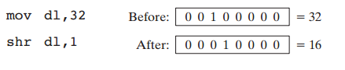
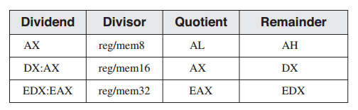

7 整数算术运算
^^^^^^^^^^^^^^^^^^

本章介绍基础二进制位移与旋转技术，把玩汇编语言最强大的力量之一。事实上，位操作是计算机图形学，数据加密，以及硬件操控的内部组成之一。完成这些操作的指令是强大的工具，并且在高级语言中仅有部分实现，并且有时为其平台独立性的需要而淹没。我们会展示应用位移的多种方法，包括乘法与除法优化。

对任意长度的整数进行算术运算并不被所有的高级语言所支持。但汇编语言却使得任意尺寸整数的加法与减法操作成为可能。同时你也可以使用在封装十进制整数与整数字符串上执行算术运算的特殊指令。

7.1 位移与旋转指令
-----------------------

尽管在第6章中介绍了位操作指令，但是位移指令是汇编语言中最具特性的指令之一。位移意味着在操作数内部向左或向右移位。x86处理器为该操作提供了非常丰富的指令集（表7-1），所有指令都会影响溢出与进位标记。

7.1.1 逻辑移位与算术移位
>>>>>>>>>>>>>>>>>>>>>>>>>

有两种移动操作数位的方法。第一种，逻辑移位，在新的位置上填充零。在下面的演示中，一个字节向右逻辑移动1位。换句话说，每一个位被移动到下一个最低位位置处。注意，位7被赋值为0：

下图显示在二进制数11001111上的一次逻辑右移，得到01100111。最低位被移动到进位标记：

另一种移位类型被称为算术移位。新的位置被填充原始值的符号位：

例如，二进制值11001111，在符号位的值为1。当向右算术移动一位时，它会变成11100111：

7.1.2 SHL指令
>>>>>>>>>>>>>>>>

SHL（左移）指令在目的操作数上执行一次逻辑左移，将最低位填充为0。最高位被移动进位标记，而进位标记中的位会被丢弃：

如果你将11001111向左移动1位，它会变成10011110：

SHL中的第一个操作数为目的操作数，而第二个操作数为位移数量：

.. code-block::

    SHL destination,count

下面列表了该指令所允许的操作数类型：

.. code-block::

    SHL reg,imm8
    SHL mem,imm8
    SHL reg,CL
    SHL mem,CL

x86处理器允许imm8为0至255之间的任意整数。另外，CL寄存器可以包含移位数量。这里所显示的格式同样适用于SHR，SAL，SAR，ROR，ROL，RCR，以及RCL指令。

在下述指令中，BL被左移一位。最高位被拷贝到进位标记，而最低位被赋值为零：

.. code-block::

    mov bl,8Fh ; BL = 10001111b
    shl bl,1 ; CF = 1, BL = 00011110b

当一个值被左移多次时，进位标记包含最后一次被移出的最高位（MSB）。在下面的示例中，位7并不会出现在进位标记中，因为它会被位6所代替（零）：

.. code-block::

    mov al,10000000b
    shl al,2 ; CF = 0, AL = 00000000b

类似地，当一个值被右移多次时，时位标记包含最后一次被移出的最低位（LSB）。

*位乘法* 当你向左（朝向MSB）移动一个数值的位时会执行位乘法。例如，SHL可以执行2的幂次乘法。将一个操作数左移n位会将操作数乘以2^n。例如，将整数5左移1位会得到5x2^1=10：

如果二进制00001010（十进制10）被左移两位时，所得到的结果与10乘以2^2相同：

.. code-block::

    mov dl,10 ; before: 00001010
    shl dl,2 ; after: 00101000

7.1.3 SHR指令
>>>>>>>>>>>>>>>>>>>

SHR（右移）指令在目的操作数上执行一次逻辑右移操作，将最高位替换为0。最低位被拷贝到进位标记，而进位标记中以前的位会丢失：

SHR使用与SHL相同的指令格式。在下面的示例中，AL中的最低位0会被拷贝到进位标记，而AL的最高位会被填充为零：

.. code-block::

    mov al,0D0h ; AL = 11010000b
    shr al,1 ; AL = 01101000b, CF = 0

在多次移位操作中，最后一位由位0（LSB）移出的位会出现在进位标记中：

.. code-block::

    mov al,00000010b
    shr al,2 ; AL = 00000000b, CF = 1

*位除法* 当你向右（朝向LSB）移动一个数字的位时执行位除法。将无符号整数右移n位会将操作数除以2^n。在下面的语句中，我们将32除以2^1，得到16：

在下面的示例中，64被除以2^3：

.. code-block::

    mov al,01000000b ; AL = 64
    shr al,3 ; divide by 8, AL = 00001000b

有符号数的位移除法是通过SAR指令实现的，因为它会保留数字的符号位。

7.1.4 SAL与SAR指令
>>>>>>>>>>>>>>>>>>>>>>>

SAL（算术左移）的工作方式与SHL指令相同。对于每个移位数量，SAL将目的操作数中的每一位移动到下一个最高位处。最低位被赋值为0。最高位被移动到进位标记，而进位标记的已有位会被丢弃：

如果你将二进制11001111左移一位，它会变成10011110：

SAR（算术右移）指令会在目的操作数上执行一次算术右移操作：

SAL与SAR的操作数与SHL和SHR的操作数相同。依据第二个操作数中的位移次数，位移操作也许会重复多次：

.. code-block::

    SAR destination,count

下面的示例显示了SAR如何复制符号位。在被右移一位之前与之后，AL均为负数：

.. code-block::

    mov al,0F0h ; AL = 11110000b (-16)
    sar al,1 ; AL = 11111000b (-8), CF = 0

*符号除法* 你可以使用SAR指令将有符号操作数除以2的幂次。在下面的示例中，-128被除以2^3，得到结果-1，得到16：

.. code-block::

    mov dl,-128 ; DL = 10000000b
    sar dl,3 ; DL = 11110000b

*AX符号扩展到EAX* 假定AX包含一个有符号整数，而你希望将其符号扩展到EAX。首先将EAX左移16位，然后算术右移16位：

.. code-block::

    mov ax,-128 ; EAX = ????FF80h
    shl eax,16 ; EAX = FF800000h
    sar eax,16 ; EAX = FFFFFF80h

7.1.5 ROL指令
>>>>>>>>>>>>>>>>>>

当你以循环方式移动位时会发生位旋转。在某些版本中，离开数值一端的位会被立即拷贝到另一端。另一种旋转类型使用进位标记作为移动位的中间点。

ROL（向左旋转）指令将每一位向左移动。最高位被拷贝到进位标记与最低位。指令格式与SHL相同：

位旋转并不会丢失位。由数值的一端旋转出的位会再次出现在另一端。注意，在下面的示例中高位如何被同时拷贝到进位标记与位0处：

.. code-block::

    mov al,40h ; AL = 01000000b
    rol al,1 ; AL = 10000000b, CF = 0
    rol al,1 ; AL = 00000001b, CF = 1
    rol al,1 ; AL = 00000010b, CF = 0

*多次旋转* 当使用大于1的旋转计数时，时位标记包含最后一个由MSB位置旋转出的位：

.. code-block::

    mov al,00100000b
    rol al,3 ; CF = 1, AL = 00000001b

*交换位群* 你可以使用ROL来交换一个字节的高半部分（位4-7）与低半部分（位0-3）。例如，以任意方向将26h旋转4位可以得到62h：

.. code-block::

    mov al,26h
    rol al,4 ; AL = 62h

当将一个多字节整数旋转4位时，其作用是将每个十六进制数字向右或向左旋转一位。例如，我们持续将6A4Bh左旋4位，将会得到原始值：

.. code-block::

    mov ax,6A4Bh
    rol ax,4 ; AX = A4B6h
    rol ax,4 ; AX = 4B6Ah
    rol ax,4 ; AX = B6A4h
    rol ax,4 ; AX = 6A4Bh

7.1.6 ROR指令
>>>>>>>>>>>>>>>>>

ROR（向右旋转）将每一位向右移动并将最低位拷贝到进位标记与最高位。指令格式与SHL相同：

在下面的示例中，注意最低位是如何被同时拷贝到进位标记与结果的最高位的：

.. code-block::

    mov al,01h ; AL = 00000001b
    ror al,1 ; AL = 10000000b, CF = 1
    ror al,1 ; AL = 01000000b, CF = 0

*多次旋转* 当使用大于1的旋转计数时，进位标记中包含最后一次由LSB位旋转出的位：

.. code-block::

    mov al,00000100b
    ror al,3 ; AL = 10000000b, CF = 1

7.1.7 RCL与RCR指令
>>>>>>>>>>>>>>>>>>>>>>>

RCL（向左进位旋转）指令将每一位向左移动，将进位标记拷贝到LSB，并将MSB拷贝到进位标记：

如果我们将进位标记想像为加在操作数最高端的额外一位，则RCL看起来就像左旋操作。在下面的示例中，CLC指令清除进位标记。第一条RCL指令将BL的最高位移动到进位标记，并且其他们左移。第二条RCL指令将进位标记移动到最低位，并左移其他位：

.. code-block::

    clc ; CF = 0
    mov bl,88h ; CF,BL = 0 10001000b
    rcl bl,1 ; CF,BL = 1 00010000b
    rcl bl,1 ; CF,BL = 0 00100001b

*由进位标记恢复位* RCL可以恢复之前被移动到进位标记中的位。下面的示例通过将testval的最低位移动到进位标记来检测其最低位。如果testval的最低位为1，则发生跳转；如果最低位为0，RCL将其恢复为原始值：

.. code-block::

    .data
    testval BYTE 01101010b
    .code
    shr testval,1 ; shift LSB into Carry flag
    jc exit ; exit if Carry flag set
    rcl testval,1 ; else restore the number

*RCR指令* RCR（向右进位旋转）指令右移每一位，将进位标记拷贝到MSB，并将LSB拷贝到进位标记：

与RCL的情况类似，将进位标记放在LSB的右侧，将此图中的整数可视化为9位值会有助于理解。

下面的示例代码使用STC来设置进位标记；然后，在AH寄存器上执行向右进位旋转操作：

.. code-block::

    stc ; CF = 1
    mov ah,10h ; AH, CF = 00010000 1
    rcr ah,1 ; AH, CF = 10001000 0

7.1.8 有符号溢出
>>>>>>>>>>>>>>>>>>>>

如果将有符号整数移位或旋转1位，所得到的结果超出目的操作数有符号整数范围，则会设置溢出标记。但数字的符号会被反转。在下面的示例中，正数（+127）存储在一个8位寄存器中，当向左旋转时会变成负数（-2）：

.. code-block::

    mov al,+127 ; AL = 01111111b
    rol al,1 ; OF = 1, AL = 11111110b

与之类似，当-128向右移动1位时，溢出标记会被设置。AL（;+64）中的结果为正号：

.. code-block::

    mov al,-128 ; AL = 10000000b
    shr al,1 ; OF = 1, AL = 01000000b

当位移或旋转的次数大于1时，溢出标记的值未定义。

7.1.9 SHLD/SHRD指令
>>>>>>>>>>>>>>>>>>>>>>>

SHLD（双左移）指令将目的操作数向左移动指定的位数。移动空出的位会使用源操作数的最高位填充。源操作数不受影响，但是符号，零，辅助，校验，以及进位标记会受影响：

.. code-block::

    SHLD dest, source, count

下图显示了移动1位的SHLD指令的执行。源操作数的最高位被拷贝到目的操作数的最低位。所有目的操作数位向左移动：

SHRD（双右移）指令将目的操作数向右移动指定的位数。位移空出的位会使用源操作数的最低位填充：

.. code-block::

    SHRD dest, source, count

下图显示了移动1位的SHRD指令的执行：

下面的指令格式同时适用于SHLD与SHRD。目的操作数可以为寄存器或内存操作数，而源操作数必须为寄存器。计数操作数可以为CL寄存器或8位立即操作数：

.. code-block::

    SHLD reg16,reg16,CL/imm8
    SHLD mem16,reg16,CL/imm8
    SHLD reg32,reg32,CL/imm8
    SHLD mem32,reg32,CL/imm8

*示例1* 下述语句将wval左移四位，并将AX的高4位插入到wval的低4位：

.. code-block::

    .data
    wval WORD 9BA6h
    .code
    mov ax,0AC36h
    shld wval,ax,4 ; wval = BA6Ah

数据移动如下图所示：

*示例2* 在下面的示例中，AX被右移4位，而DX的低4位被移动到AX的高4位：

当位集合必须左移或右移以重新定位屏幕上的图像时，SHLD与SHRD可以用于操纵位映射图像。另一个潜在应用不是数据加密，其中加密算法涉及位移。最后，这个指令可以用于对长整数进行快速乘法与除法。

下面的示例代码通过将双字数组右移4位来演示SHRD的作用：

.. code-block::

    .data
    array DWORD 648B2165h,8C943A29h,6DFA4B86h,91F76C04h,8BAF9857h
    .code
        mov bl,4 ; shift count
        mov esi,OFFSET array ; offset of the array
        mov ecx,(LENGTHOF array) – 1 ; number of array elements
    L1: push ecx ; save loop counter
        mov eax,[esi + TYPE DWORD]
        mov cl,bl ; shift count
        shrd [esi],eax,cl ; shift EAX into high bits of
        [ESI]
        add esi,TYPE DWORD ; point to next doubleword pair
        pop ecx ; restore loop counter
        loop L1
        shr DWORD PTR [esi],COUNT ; shift the last doubleword

7.2 移位与旋转应用
----------------------

当程序需要将寄存器中的部分位移动到另一部分，汇编语言将会是此工作的理想工具。有时我们一个数值的位的子集移到位0处，使其更易于分割位的值。在本节中，我们将会展示一些很容易实现的常见的位移与旋转应用。在本章中练习可以看到更多的应用。

7.2.1 移位多个双字
>>>>>>>>>>>>>>>>>>>>

你可以对分割为字节，字，或双字数组的扩展精度整数进行移位操作。在操作之前，你必须知道数组元素是如何存储的。一种常见的存储整数的方法被称为小端序。其工作方式类似于：将字节的低序放置在数组的起始地址。然后，由该字节向上至高序字节，在接下来的序列内存地址中存储每个字节。无需将数组存储为字节序列，你可以将其存储为字或双字序列。如果你使用这种存储，单个字节依然位于小端序，因为x86机器以小端序存储字与双字。

下述步骤展示了如何将字节数组右移1位：

*步骤1：* 将[ESI+2]处的最高字节右移，自动将其最低位拷贝到进位标记。

*步骤2：* 将[ESI+1]处的值右旋，将最高位填充为进位标记的值，而将最低位移动到进位标记：

*步骤3：* 将[ESI]处的值右旋，将最高位填充为进位标记的值，而将最低位移动到进位标记：

在步骤3完成之后，所有位右移一位：

下面的Multishift.asm中的代码片段实现我们刚刚所列出的步骤：

.. code-block::

    .data
    ArraySize = 3
    array BYTE ArraySize DUP(99h) ; 1001 pattern in each nybble
    .code
        main PROC
        mov esi,0
        shr array[esi+2],1 ; high byte
        rcr array[esi+1],1 ; middle byte, include Carry flag
        rcr array[esi],1 ; low byte, include Carry flag

尽管我们当前的示例仅移动了3位，该示例可以被修改来移动字或双字数组。使用循环，你可以移动任意尺寸的数组。

7.2.2 二进制乘法
>>>>>>>>>>>>>>>>>>

有时程序员会追求程序性能，他们可以使用移位而不使用MUL指令来处理整数乘法。SHL指令执行乘数为2的幂次的无符号乘法。将无符号整数左移n位即是将其乘以2^n。其他的乘数可以表示2的幂次的和。例如，将无符号EAX乘以36，我们可以将36写为2^5+2^2，并使用乘法分配率：

.. code-block::

    EAX * 36 = EAX * (25 + 22)
             = EAX * (32 + 4)
             = (EAX * 32) + (EAX * 4)

下图显示了123*36的乘法过程，所得结果为4428：

要注意的有趣的一点是，在乘数（36）中位2与位5为1，而整数2与5同时也是所要求的位移数量。使用该信息，下面的代码片段使用SHL与ADD指令实现123与36的乘法：

.. code-block::

    mov eax,123
    mov ebx,eax
    shl eax,5 ; multiply by 25
    shl ebx,2 ; multiply by 22
    add eax,ebx ; add the products

作为本章的程序练习，你被要求对该程序进行归纳，并创建一个使用移位和加法对任意32位无符号整数执行乘法的过程。

7.2.3 显示二进制位
>>>>>>>>>>>>>>>>>>>>

一个常见的编程任务是将二进制整数转换为ASCII二进制字符串，并将后者显示。SHL指令在此任务非常有用，因为它会在操作数每次左移时将操作数的最高位拷贝到进位标记。下面的BinToAsc过程是一个简单的实现：

.. code-block::

    ;---------------------------------------------------------
    BinToAsc PROC
    ;
    ; Converts 32-bit binary integer to ASCII binary.
    ; Receives: EAX = binary integer, ESI points to buffer
    ; Returns: buffer filled with ASCII binary digits
    ;---------------------------------------------------------
    push ecx
        push esi
        mov ecx,32 ; number of bits in EAX
    L1: shl eax,1 ; shift high bit into Carry flag
        mov BYTE PTR [esi],'0' ; choose 0 as default digit
        jnc L2 ; if no Carry, jump to L2
        mov BYTE PTR [esi],'1' ; else move 1 to buffer
    L2: inc esi ; next buffer position
        loop L1 ; shift another bit to left
        pop esi
        pop ecx
        ret
    BinToAsc ENDP

7.2.4 提取文件日期域
>>>>>>>>>>>>>>>>>>>>>>>>>>

当存储空间很紧张时，系统级软件通常将多个数据域压缩为一个整数。为解释数据，应用通常需要抽取名为位字符串的位序列。例如，在实地址模式中，MS-DOS函数57h返回DX中的文件的时间戳。（时间戳显示了文件最后被修改的时间。）位0至位4表示1到31之间的天数，位5至位8为月份，而位9至位15为年份。如果一个文件最后被修改的时间为1999年3月10日，文件的时间戳在DX寄存器的显示为（年份相对于1980）：

要提取单个位字符串，将其位移动到寄存器的低位部分，并清除不相同的部分。下面的代码示例通过拷贝DL中的内容并掩盖不属于该域的位来提取日期时间戳整数的数字域：

.. code-block::

    mov al,dl ; make a copy of DL
    and al,00011111b ; clear bits 5-7
    mov day,al ; save in day

要提取月份域，我们在掩盖其他位之前，将位5至位8移动到AL的低位部分。然后AL被拷贝到变量中：

.. code-block::

    mov ax,dx ; make a copy of DX
    shr ax,5 ; shift right 5 bits
    and al,00001111b ; clear bits 4-7
    mov month,al ; save in month

年份数字（位9至15）域完全位于DH寄存器中。我们将其拷贝到AL中并右移1位：

.. code-block::

    mov al,dh ; make a copy of DH
    shr al,1 ; shift right one position
    mov ah,0 ; clear AH to zeros
    add ax,1980 ; year is relative to 1980
    mov year,ax ; save in year

7.3 乘法与除法指令
----------------------

在32位模式中，整数乘法可以作为32位，16位或是8位操作。在64位模式中，你也可以使用64位操作数。MUL与IMUL指令分别执行无符号与有符号整数乘法。DIV指令执行无符号整数除法，而IDIV执行有符号整数除法。

7.3.1 MUL指令
>>>>>>>>>>>>>>>>>>>

在32位模式中，MUL（无符号乘）指令有三种版本：第一种版本将8位操作数与AL寄存器相乘。第二种版本将16位操作数与AL寄存器相乘，而第三种版本将32位操作数与EAX寄存器相乘。乘数与被乘数必须具有相同的尺寸，而结果尺寸翻倍。这三种格式接受寄存器与内存操作数，但是不能使用立即操作数：

.. code-block::

    MUL reg/mem8
    MUL reg/mem16
    MUL reg/mem32

MUL指令中的单个操作数是乘数。表7-2依据乘数的尺寸显示了默认被乘数与积。由于目的操作数是被乘数与乘数的两倍速，因而不会发生溢出。如果乘积的上半部分不等于零，MUL会设置进位与溢出标记。进位标记通常用于无符号算术运算，因而在这里我们会关注进位标记。例如，如果AX与16位操作数相乘，乘积会组合存储在DX与AX寄存器中。如果DX不等于零，则设置进位标记，从而让我们知道乘积并不适应于隐式目的操作数的低半部分。

在执行MUL指令之后检查进位标记的原因在于可以知道乘积的高半部分是否可以被安全忽略。

MUL示例
:::::::::::::

下列语句将AL与BL相乘，将乘积存储在AX中。进位标记被清除（CF=0），因为AH（乘积的高半部分）等于零：

.. code-block::

    mov al,5h
    mov bl,10h
    mul bl ; AX = 0050h, CF = 0

下图显示了寄存器之间的移动：

下列语句将16位值2000h与0100h相乘。进位标记被设置，因为乘积的高半部分（位于DX中）不等于零：

.. code-block::

    .data
    val1 WORD 2000h
    val2 WORD 0100h
    .code
    mov ax,val1 ; AX = 2000h
    mul val2 ; DX:AX = 00200000h, CF = 1

下列语句半12345h与1000h相乘，得到的64位乘积组合存储在EDX与EAX寄存器中。进位标记被清除，因为EDX中乘积的高半部分等于0：

.. code-block::

    mov eax,12345h
    mov ebx,1000h
    mul ebx ; EDX:EAX = 0000000012345000h, CF = 0

下图显示了寄存器之间的移动：

在64位模式下使用MUL
::::::::::::::::::::

在64位模式下，我们可以在MUL指令中使用64位操作数。64位寄存器与内存操作数与RAX相乘，所得到的128乘积存储在RDX:RAX中。在下面的示例中，由于RAX与2相乘，RAX中的每一位左移一位。RAX的最高位扩展到RDX寄存器，其结果为十六进制的0000000000000001：

.. code-block::

    mov rax,0FFFF0000FFFF0000h
    mov rbx,2
    mul rbx ; RDX:RAX = 0000000000000001FFFE0001FFFE0000

在下面的示例中，我们将RAX与64位内存操作数相乘。将值乘以16，所以数字中的每个十六进制位左移一位。

.. code-block::

    .data
    multiplier QWORD 10h
    .code
    mov rax,0AABBBBCCCCDDDDh
    mul multiplier ; RDX:RAX = 00000000000000000AABBBBCCCCDDDD0h

7.3.2 IMUL指令
>>>>>>>>>>>>>>>>>>>>>>>

IMUL（有符号乘）指令执行有符号整数乘法。不同于MUL指令，IMUL会保留乘积的符号。通过将乘积低半部分的最高位符号扩展到乘积的高位，实现符号保留。x86指令集支持三种IMUL指令格式：一个操作数，两个操作数，以及三个操作数。在一位操作数格式中，乘数与被乘数具有相同的尺寸，而乘积尺寸翻倍。

*单操作数格式* 单操作数格式将乘积存储在AX，DX:AX，或EDX:EAX中：

.. code-block::

    IMUL reg/mem8 ; AX = AL * reg/mem8
    IMUL reg/mem16 ; DX:AX = AX * reg/mem16
    IMUL reg/mem32 ; EDX:EAX = EAX * reg/mem32

与MUL的情况相同，乘积的存储尺寸使得不可能溢出。如果乘积的高半部分并不是低半部分的符号扩展，进位与溢出标记会被设置。你可以使用该信息来确定是否忽略乘积的高半部分。

*两操作数格式（32位模式）* 32位模式中IMUL指令的两操作数版本将乘积存储在第一个操作数中，因而第一个操作数必须被寄存器。第二个操作数（乘数）可以为寄存器，内存操作数，或是立即操作数。下述为16位格式：

.. code-block::

    IMUL reg16,reg/mem16
    IMUL reg16,imm8
    IMUL reg16,imm16

下述为32位操作数类型，表明乘数可以为32位寄存器，32位内存操作数，或是立即数（8或32位）：

.. code-block::

    IMUL reg32,reg/mem32
    IMUL reg32,imm8
    IMUL reg32,imm32

两操作数格式将乘积截断为目的操作数的长度。如果最高位丢失，则会设置溢出与进位标记。确保在执行两操作数的IMUL操作之后检查其中一个标记。

*三操作数格式* 32位格式中的三操作数格式在第一个操作数中存储乘积。第二个操作数可以为16位寄存器或内存操作数，该操作数会被第三个操作数，8位或16位立即值，相乘：

.. code-block::

    IMUL reg16,reg/mem16,imm8
    IMUL reg16,reg/mem16,imm16

32位寄存器或内存操作数可以与8位或32位立即数相乘：

.. code-block::

    IMUL reg32,reg/mem32,imm8
    IMUL reg32,reg/mem32,imm32

如果IMUL执行后最高位丢失，溢出与进位标记会被设置。确保在执行三操作数IMUL操作之后检查其中一个标记。

在64位模式下使用IMUL
::::::::::::::::::::::::

在64位模式下，你可以在MUL指令中使用64位操作数。在两操作数格式中，64位寄存器或内存操作数与RAX相乘，在RDX:RAX中得到128位符号扩展乘积。在下面的示例中，RBX与RAX相乘，得到128位的乘积-16。

.. code-block::

    mov rax,-4
    mov rbx,4
    imul rb ; RDX = 0FFFFFFFFFFFFFFFFh, RAX = -16

换句话说，十进制-16表示为RAX中的FFFFFFFFFFF0，而RDX包含RAX的高位扩展，也被称为符号位。

在64位模式下同样要以使用三操作数格式。在下面的示例中，我们将乘数（-16）乘以4，得到RAX寄存器中的-64：

.. code-block::

    .data
    multiplicand QWORD -16
    .code
    imul rax, multiplicand, 4 ; RAX = FFFFFFFFFFFFFFC0 (-64)

*无符号乘法* 两操作数与三操作数的IMU格式也可以用于无符号乘法，因为乘积的低半部分对于有符号和无符号数值相同。这样做有一个小小的缺点：进位与溢出标记并不会表明乘积的高半部分是否等于零。

IMUL示例
::::::::::::::

下列语句将48乘以4，在AX中得到乘积+192。尽管乘积是正确的，但AH并不AL的符号扩展，因而溢出标记被设置：

.. code-block::

    mov al,48
    mov bl,4
    imul bl ; AX = 00C0h, OF = 1

下列指令将-4乘以4，在AX中得到-16。AH是AL的符号扩展，所以溢出标签被清除：

.. code-block::

    mov al,-4
    mov bl,4
    imul bl ; AX = FFF0h, OF = 0

下列指令将48乘以4，在DX:AX得到乘积+192。DX是AX的符号扩展，所以举出标记被清除：

.. code-block::

    mov ax,48
    mov bx,4
    imul bx ; DX:AX = 000000C0h, OF = 0

下列指令执行32位有符号乘法（4,823,424 * -423），在EDX:EAX中得到乘积-2,040,308,352。溢出标记被清除，因为EDX是EAX的符号扩展：

.. code-block::

    mov eax,+4823424
    mov ebx,-423
    imul ebx ; EDX:EAX = FFFFFFFF86635D80h, OF = 0

下述指令演示了两操作数格式：

.. code-block::

    .data
    word1 SWORD 4
    dword1 SDWORD 4
    .code
    mov ax,-16 ; AX = -16
    mov bx,2 ; BX = 2
    imul bx,ax ; BX = -32
    imul bx,2 ; BX = -64
    imul bx,word1 ; BX = -256
    mov eax,-16 ; EAX = -16
    mov ebx,2 ; EBX = 2
    imul ebx,eax ; EBX = -32
    imul ebx,2 ; EBX = -64
    imul ebx,dword1 ; EBX = -256

两操作数与三操作数指令使用一个具有相同尺寸的目的操作数作为乘数。所以，有可能发生溢出。在执行这些类型的IMUL指令之后要检查溢出标记。下面的两操作数指令演示了有符号溢出，因为-64,000不适用于16位目的操作数：

.. code-block::

    mov ax,-32000
    imul ax,2 ; OF = 1

下述指令演示了三操作数格式，包括一个有符号溢出示例：

.. code-block::

    .data
    word1 SWORD 4
    dword1 SDWORD 4
    .code
    imul bx,word1,-16 ; BX = word1 * -16
    imul ebx,dword1,-16 ; EBX = dword1 * -16
    imul ebx,dword1,-2000000000 ; signed overflow!

7.3.3 度量程序执行时间
>>>>>>>>>>>>>>>>>>>>>>>>>

程序员经常会发现通过度量代码的运行时来比较不同代码的实现性能是非常有用的。Microsoft Windows API为此提供了必需的工具，我们通过Irvin32库中的GetMseconds过程使其更易于使用。该过程会获得自午夜逝去的系统时毫秒数。在下面的示例代码中，首先调用GetMseconds，从而我们可以记录系统开始时间。然后我们调用需要度量其执行时间的过程（FirstProcedureToTest）。最后，再次调用GetMseconds，并计算当前毫秒数与开始时间之间的差值：

.. code-block::

    .data
    startTime DWORD ?
    procTime1 DWORD ?
    procTime2 DWORD ?
    .code
    call GetMseconds ; get start time
    mov startTime,eax
    .
    call FirstProcedureToTest
    .
    call GetMseconds ; get stop time
    sub eax,startTime ; calculate the elapsed time
    mov procTime1,eax ; save the elapsed time

当然，有少量的执行时间被两次调用GetMseconds过程的占用。但是当我们度量不同代码实现之是的执行时间比率时，这点消耗并不重要。下面，我们调用希望测试的另一个过程，并保存其执行时间（procTime2）：

.. code-block::

    call GetMseconds ; get start time
    mov startTime,eax
    .
    call SecondProcedureToTest
    .
    call GetMseconds ; get stop time
    sub eax,startTime ; calculate the elapsed time
    mov procTime2,eax ; save the elapsed time

现在procTime1相对于procTime2的比率表明了两个过程之间的相对性能。

MUL和IMUL与位移的比较
::::::::::::::::::::::::

在老的x86处理器中，位移乘法与MUL和IMLUL指令乘法之间存在巨大的性能差异。我们可以使用GetMseconds过程来比较两种乘法类型的执行时间。下面两个过程使用LOOP_COUNT常量来确定重复次数，重复多次执行道法操作：

.. code-block::

    mult_by_shifting PROC
    ;
    ; Multiplies EAX by 36 using SHL, LOOP_COUNT times.
    ;
    mov ecx,LOOP_COUNT
    L1: push eax ; save original EAX
        mov ebx,eax
        shl eax,5
        shl ebx,2
        add eax,ebx
        pop eax ; restore EAX
        loop L1
        ret
    mult_by_shifting ENDP

    mult_by_MUL PROC
    ;
    ; Multiplies EAX by 36 using MUL, LOOP_COUNT times.
    ;
    mov ecx,LOOP_COUNT
    L1: push eax ; save original EAX
        mov ebx,36
        mul ebx
        pop eax ; restore EAX
        loop L1
        ret
    mult_by_MUL ENDP

下面的代码调用mult_by_shifting并显示时间结果。查看本书第7章示例中的Mult.asm程序可以得到完整实现：

.. code-block::

    .data
    LOOP_COUNT = 0FFFFFFFFh
    .data
    intval DWORD 5
    startTime DWORD ?
    .code
    call GetMseconds ; get start time
    mov startTime,eax
    mov eax,intval ; multiply now
    call mult_by_shifting
    call GetMseconds ; get stop time
    sub eax,startTime
    call WriteDec ; display elapsed time

在以同样的方式调用mult_by_MUL之后，在一个旧4GHz奔腾4上的测试时间结果显示，SHL方法的执行时间为6.078秒，而MUL方法的执行时间为20.718秒。换句话说，使用MUL指令会慢241个百分点。然而，当在相对较新的处理器运行同样的程序时，两个函数的调用时间几乎相同。该示例表明Intel在最近的处理器中已经成功优化了MUL与IMUL指令。

7.3.4 DIV指令
>>>>>>>>>>>>>>>>>>>

在32位模式下，DIV（无符号除法）指令执行8位，16位以及32位无符号整数除法。单个寄存器或内存操作数为除数。其格式为：

.. code-block::

    DIV reg/mem8
    DIV reg/mem16
    DIV reg/mem32

下表显示了被除数，除数，商以及余数之间的关系：

在64位模式下，DIV指令使用RDX:RAX作为被除数，并且允许64位寄存器或内存操作数作为除数。商被存储在RAX中，而余数被存储在RDX中。

DIV示例
::::::::::::::

下列的语句执行8位无符号除法（83h/2），得到商41h和余数1：

.. code-block::

    mov ax,0083h ; dividend
    mov bl,2 ; divisor
    div bl ; AL = 41h, AH = 01h

下图显示了寄存器之间的移动：

下述指令执行16位无符号除法（8003h/100h），得到商80h与余数3。DX包含被除数的高半部分，所以在DIV指令执行之前，它必须被清除：

.. code-block::

    mov dx,0 ; clear dividend, high
    mov ax,8003h ; dividend, low
    mov cx,100h ; divisor
    div cx ; AX = 0080h, DX = 0003h

下图显示了寄存器之间的移动：

下述指令使用内存操作数作为除数执行32位无符号除法：

.. code-block::

    .data
    dividend QWORD 0000000800300020h
    divisor DWORD 00000100h
    .code
    mov edx,DWORD PTR dividend + 4 ; high doubleword
    mov eax,DWORD PTR dividend ; low doubleword
    div divisor ; EAX = 08003000h, EDX = 00000020h

下图显示了寄存器之间的移动：

下面的64位除法在RAX中得到商（0108000000003330h），在RDX中得到余数（0000000000000020h）：

.. code-block::

    .data
    dividend_hi QWORD 0000000000000108h
    dividend_lo QWORD 0000000033300020h
    divisor QWORD 0000000000010000h
    .code
    mov rdx, dividend_hi
    mov rax, dividend_lo
    div divisor ; RAX = 0108000000003330
    ; RDX = 0000000000000020

注意，被除数中的每个十六进制数字是如何右移4位的，因为它被除以64。（除以16会使得每个数字右移1位。）

7.3.5 有符号整数除法
>>>>>>>>>>>>>>>>>>>>>

有符号整数除法与无符号除法几乎相同，不同之处在于：在执行除法之前，被除数必须进行符号扩展。符号扩展是将最值的最高位拷贝到包含它的变量或寄存器的所有高位的过程。为展示为什么这是必需的，让我们尝试一下如何不这样做会发生什么。下面的代码使用MOV将-101赋值给AX，它是EAX的低半部分：

.. code-block::

    .data
    wordVal SWORD -101 ; 009Bh
    .code
    mov eax,0 ; EAX = 00000000h
    mov ax,wordVal ; EAX = 0000009Bh (+155)
    mov bx,2 ; EBX is the divisor
    idiv bx ; divide EAX by BX (signed operation)

不幸的是，EAX中的009Bh并不等于-101，而是等于+155，所以除法得到的商为+77，这并不是我们所希望的。相反，解决该问题的正确方法是使用CWD指令（将字转换为双字），从而在执行除法之前将AX符号扩展到EAX：

.. code-block::

    .data
    wordVal SWORD -101 ; 009Bh
    .code
    mov eax,0 ; EAX = 00000000h
    mov ax,wordVal ; EAX = 0000009Bh (+155)
    cwd ; EAX = FFFFFF9Bh (-101)
    mov bx,2 ; EBX is the divisor
    idiv bx ; divide EAX by BX

我们在第4章中随MOVSX指令介绍了符号扩展的概念。x86指令集包含多种符号扩展的方法。首先，我们来了解一下这些指令，然后，我们将其应于有符号整数除法指令，IDIV。

符号扩展指令（CBW，CWD，CDQ）
:::::::::::::::::::::::::::::::

Intel提供了三种符号扩展指令：CBW，CWD，以及CDQ。CBW指令（将字节转换为字）将AL的符号位扩展到AH，以保持数字的符号。在下面的示例中，9Bh（AL中）与FF9Bh（AX中）均等于十进制的-101：

.. code-block::

    .data
    byteVal SBYTE -101 ; 9Bh
    .code
    mov al,byteVal ; AL = 9Bh
    cbw ; AX = FF9Bh

cwd（将字转换为双字）指令将AX的符号位扩展到DX：

.. code-block::

    .data
    wordVal SWORD -101 ; FF9Bh
    .code
    mov ax,wordVal ; AX = FF9Bh
    cwd ; DX:AX = FFFFFF9Bh

CDQ（将双字转换为四字）指令将EAX的符号位扩展到EDX：

.. code-block::

    .data
    dwordVal SDWORD -101 ; FFFFFF9Bh
    .code
    mov eax,dwordVal
    cdq ; EDX:EAX = FFFFFFFFFFFFFF9Bh

IDIV指令
::::::::::::

IDIV（有符号除）指令使用与DIV相同的操作数执行有符号除法。在执行8位除法之前，被除数（AX）必须进行完全符号扩展。余数总是与被除数具有相同的符号。

*示例1* 下述指令将-48除以5。在IDIV指令执行之后，AL中的商为9，而AH中的余数为-3：

.. code-block::

    .data
    byteVal SBYTE -48 ; D0 hexadecimal
    .code
    mov al,byteVal ; lower half of dividend
    cbw ; extend AL into AH
    mov bl,+5 ; divisor
    idiv bl ; AL = -9, AH = -3

下图显示了通过CBW指令，AL如何被符号扩展到AX：

为了理解为什么被除数的符号扩展是必需的，我们不进行符号扩展重复前面的示例。下面的代码将AH初始化为零，从而它具有已知值，然后不使用CBW来准备被除数：

.. code-block::

    .data
    byteVal SBYTE -48 ; D0 hexadecimal
    .code
    mov ah,0 ; upper half of dividend
    mov al,byteVal ; lower half of dividend
    mov bl,+5 ; divisor
    idiv bl ; AL = 41, AH = 3

在进行除法之前，AX=00D0h（十进制208）。IDIV将其除以5，得到商为十进制41，余数为3。显然这并不是正确答案。

*示例2* 16位除法要求AX被符号扩展到DX。下面的示例将-5000除以256：

.. code-block::

    .data
    wordVal SWORD -5000
    .code
    mov ax,wordVal ; dividend, low
    cwd ; extend AX into DX
    mov bx,+256 ; divisor
    idiv bx ; quotient AX = -19, rem DX = -136

*示例3* 32位除法要求EAX被符号扩展到EDX。下面的示例将50000除以-256：

.. code-block::

    .data
    dwordVal SDWORD +50000
    .code
    mov eax,dwordVal ; dividend, low
    cdq ; extend EAX into EDX
    mov ebx,-256 ; divisor
    idiv ebx ; quotient EAX = -195, rem EDX = +80

在DIV与IDIV执行之后，所有算术运算的状态标记值为未定义。

除法溢出
:::::::::::::::

如果除法操作数得到的商不适用于目的操作数，则出现除法溢出。这会导致处理器异常并终止当前程序。例如，下面的指令会产生除法溢出，因为对于8位AL目的寄存器而言，商（100h）过大：

.. code-block::

    mov ax,1000h
    mov bl,10h
    div bl ; AL cannot hold 100h

当该代码执行时，图7-1显示了Visual Studio生成的结果错误对话框。当你尝试执行除以零的代码时也会出现类似的对话框窗口。

建议如下：使用32位除数与64位被除数来减少除法溢出的可能性。在下面的代码中，除数为EBX，而被除数放置在64位组合EDX与EAX寄存器：

.. code-block::

    mov eax,1000h
    cdq
    mov ebx,10h
    div ebx ; EAX = 00000100h

为了防止除以零，在除法之前测试被除数：

.. code-block::

    mov ax,dividend
    mov bl,divisor
    cmp bl,0 ; check the divisor
    je NoDivideZero ; zero? display error
    div bl ; not zero: continue
    . .
    NoDivideZero: ;(display "Attempt to divide by zero")

7.3.6 实现算术表达式
>>>>>>>>>>>>>>>>>>>>>>>>>>>

在第4章中展示了如何使用加法与减法实现算术表达式。我们现在可以包含乘法与除法。初看起来实现算术表达式似乎是留给编译器作者的最佳活动，但是通过动手练习会得到更多东西。你可以了解到编译器如何优化代码。通过在乘法之后检测乘积的尺寸，你可以实现比普通编译器更好的错误检测。当执行两个32位操作数乘法时，大多数高级语言编译器会忽略乘积的高32位部分。然而在汇编语言中，你可以使用进位与溢出标记来区别乘积是否适应于32位。这些标记的使用会在7.4.1与7.4.2节中进行解释。

*示例1* 使用无符号32位整数，在汇编语言中实现下面的C++语句：

.. code-block::

    var4 = (var1 + var2) * var3;

这是一个直接的问题，因为我们可以由左至右解决（加法，然后乘法）。在第二条指令之后，EAX包含var1与var2的和。在第三条指令中，EAX被乘以3，而乘积存储在EAX中：

.. code-block::

        mov eax,var1
        add eax,var2
        mul var3 ; EAX = EAX * var3
        jc tooBig ; unsigned overflow?
        mov var4,eax
        jmp next
    tooBig: ; display error message

如果MUL指令得到的乘积大于32位，JC指令跳转到处理错误的标签处。

*示例2* 使用无符号32位整数，实现下面的C++语句：

.. code-block::

    var4 = (var1 * 5) / (var2 - 3);

在此示例中，括号内有两个子表达式。左侧表达式可以赋值给EDX:EAX，从而无需检测溢出。右侧表达式赋值给EBX，而最终的除法完成表达式：

.. code-block::

    mov eax,var1 ; left side
    mov ebx,5
    mul ebx ; EDX:EAX = product
    mov ebx,var2 ; right side
    sub ebx,3
    div ebx ; final division
    mov var4,eax

*示例3* 使用有符号32位整数实现下面的C++语句：

.. code-block::

    var4 = (var1 * -5) / (-var2 % var3);

此示例要比前面的示例麻烦一些。我们由右侧的表达式开始，并将其值存储在EBX中。因为操作数是有符号的，将被除数符号扩展到EDX是很重的，然后使用IDIV指令：

.. code-block::

    mov eax,var2 ; begin right side
    neg eax
    cdq ; sign-extend dividend
    idiv var3 ; EDX = remainder
    mov ebx,edx ; EBX = right side

接下来我们计算左侧的表达式，将结果存储在EDX:EAX中：

.. code-block::

    mov eax,-5 ; begin left side
    imul var1 ; EDX:EAX = left side

最后，左侧（EDX:EAX）除以右侧（EBX）：

.. code-block::

    idiv ebx ; final division
    mov var4,eax ; quotient

7.4 扩展加法与减法
----------------------

扩展精度加法与减法是对几乎无限尺寸的数字进行加法与减法操作的技术。例如，在C++中，并没有允许对两个1024位整数进行加法操作的标准操作符。但是在汇编语言中，ADC（进位加）与SBB（借位减）指令特别适用于此种操作类型。

7.4.1 ADC指令
>>>>>>>>>>>>>>>>>>>>>

ADC（进位加）指令同时将源操作数与进位标记的内容加到目的操作数。指令格式与ADD指令格式相同，而操作数必须具有相同尺寸：

.. code-block::

    ADC reg,reg
    ADC mem,reg
    ADC reg,mem
    ADC mem,imm
    ADC reg,imm

例如，下面的指令将两个8位整数相加（FFh+FFh），在DL:AL中得到16位和，结果为01FEh：

.. code-block::

    mov dl,0
    mov al,0FFh
    add al,0FFh ; AL = FEh
    adc dl,0 ; DL/AL = 01FEh

下图显示了两个加法步骤中数据的移动。首先，FFh被加到AL，在AL寄存器中得到FE，并设置进位标记。然后，0与进位标记内容被加到DL寄存器：

类似地，下面的指令将两个32位整数相加（FFFFFFFFh + FFFFFFFFh），在EDX:EAX中得到6位和，00000001FFFFFFFEh：

.. code-block::

    mov edx,0
    mov eax,0FFFFFFFFh
    add eax,0FFFFFFFFh
    adc edx,0

7.4.2 扩展加法示例
>>>>>>>>>>>>>>>>>>>>>>

接下我们将会展示一个将两个相同尺寸的扩展整数相加的过程Extended_Add。使用循环在两个扩展整数中遍历，就如两个并行数组一样。由于它将数组中每个匹配值对相加，它会包含在前一次迭代循环中执行的加法操作所产生的进位值。我们的实现假定整数被存储为字节数组，但是该示例可以很容易被修改来执行双字数组相加。

此过程会在ESI与EDI中接收两个指向要相加的两个整数的指针。EBX寄存器指向将会存储和字节的缓冲区，并且要求此缓冲区要比两个整数大一个字节。同时，过程在ECX中接收最长整数的长度。 数字必须以小端序存储，即最低序字节位于数组的起始偏移处。代码如下所示，我们为了详细讨论而添加了行号：

.. code-block::

    1: ;--------------------------------------------------------
    2: Extended_Add PROC
    3: ;
    4: ; Calculates the sum of two extended integers stored
    5: ; as arrays of bytes.
    6: ; Receives: ESI and EDI point to the two integers,
    7: ; EBX points to a variable that will hold the sum,
    8: ; and ECX indicates the number of bytes to be added.
    9: ; Storage for the sum must be one byte longer than the
    10: ; input operands.
    11: ; Returns: nothing
    12: ;--------------------------------------------------------
    13:     pushad
    14:     clc ; clear the Carry flag
    15:
    16: L1: mov al,[esi] ; get the first integer
    17:     adc al,[edi] ; add the second integer
    18:     pushfd ; save the Carry flag
    19:     mov [ebx],al ; store partial sum
    20:     add esi,1 ; advance all three pointers
    21:     add edi,1
    22:     add ebx,1
    23:     popfd ; restore the Carry flag
    24:     loop L1 ; repeat the loop
    25:
    26:     mov byte ptr [ebx],0 ; clear high byte of sum
    27:     adc byte ptr [ebx],0 ; add any leftover carry
    28:     popad
    29:     ret
    30: Extended_Add ENDP

当第16与17行将前两个低序字节相加时，加法也许会设置进位标记。所以，在第18行将进位标记压入栈保存是很重要的，因为当循环重复时我们需要该值。第19行保存和的第一个字节，而第20至22行前移三个指针（两个操作数与和数组）。第23行恢复进位标记，而第24行继续循环到第16行。（LOOP指令不会修改CPU状态标记。）随着循环的重复执行，第17行将下一对字节相加，并且包含进位标记的值。所以如果在第一次经过循环时生成了进位，则会在第二次经过循环时包含进位。循环以此方式重复执行直到所有的字节被相加完成。然后，最后的第26与27行会查看两个操作数的最高字节被相加时生成的进位，并将该进位相加到和操作数的额外字节中。

下面的示例代码调用Extended_Add，为其传递两个8字节整数。我们需要小心地为和多分配一个字节：

.. code-block::

    .data
    op1 BYTE 34h,12h,98h,74h,06h,0A4h,0B2h,0A2h
    op2 BYTE 02h,45h,23h,00h,00h,87h,10h,80h
    sum BYTE 9 dup(0)
    .code
        main PROC
        mov esi,OFFSET op1 ; first operand
        mov edi,OFFSET op2 ; second operand
        mov ebx,OFFSET sum ; sum operand
        mov ecx,LENGTHOF op1 ; number of bytes
        call Extended_Add
    ; Display the sum.
        mov esi,OFFSET sum
        mov ecx,LENGTHOF sum
        call Display_Sum
        call Crlf

下面是程序产生的输出。加法会产生进位：

.. code-block::

    0122C32B0674BB5736

**Display_Sum** 过程（来自同一程序）以正确顺序显示和，由高序字节开始，直到低序字节：

.. code-block::

    Display_Sum PROC
        pushad
        ; point to the last array element
        add esi,ecx
        sub esi,TYPE BYTE
        mov ebx,TYPE BYTE
    L1: mov al,[esi] ; get an array byte
        call WriteHexB ; display it
        sub esi,TYPE BYTE ; point to previous byte
        loop L1
        popad
        ret
    Display_Sum ENDP

7.4.3 SBB指令
>>>>>>>>>>>>>>>>>>>

SBB（借位减）指令同目的操作数中同时减去源操作数与进位标记。其操作数与ADC指令相同。下面的示例代码执行了64位与32位操作数的减法操作。它将EDX:EAX设置为0000000700000001h，并由该值中减去2。首先执行低32位相减，设置进位标记。然后执行高32位相减，包括进位标记：

.. code-block::

    mov edx,7 ; upper half
    mov eax,1 ; lower half
    sub eax,2 ; subtract 2
    sbb edx,0 ; subtract upper half

图7-2显示了两个减法步骤之间的数据移动。首先，由EAX中减去2，在EAX中得到FFFFFFFFh。进位标记会被设置，因为由一个小数中减去一个大数会产生借位。然后，SBB指令由EDX中同时减去0与进位标记的内容。

7.5 ASCII与解包十进制算术运算
-------------------------------

（7.5节讨论的指令仅适用于32位模式编程。）本书目前为止所展示的整数算术运算仅处理二进制值。CPU以二进制计算，但是也能够处理ASCII十进制串上的算术运算。后者对于用户在控制台中输入与显示非常方便，而不需要将其转换为二进制。假定程序要求用户输入两个数值，并将其相加。如下为其示例输出，其中用户输入了3402与1256：

.. code-block::

    Enter first number: 3402
    Enter second number: 1256
    The sum is: 4658

当计算并显示和时，我们有两种选择：

1. 将两个操作数转换为二进制，将二进制值相加，并将和由二进制转换为ASCII数字串。
2. 将每一对ASCII数字依次相加（2+6，0+5，4+2，以及3+1）而将数字串直接相加。所得到的和是一个ASCII数字串，从而它可以直接显示在屏幕上。

第二种选择要求使用特殊的指令在相加每一对ASCII数字后调整和。处理ASCII加法，减法，乘法与除法的四个指令如下所示：

*ASCII十进制与解包十进制* 解包十进制整数的高4位总零，而ASCII十进制数字的相同位等于0011b。在任一情况下，两种整数类型均在每个字节存储一个数字。下面的示例显示了3402在两种格式下是如何存储的：

尽管ASCII算术运算的执行要远远慢于二进制算术运算，它有两个独特的优点：

* 在执行算术运算之前并不需要由字符串格式转换。
* 使用假定的十进制句点可以在实数上执行操作，而不存在浮点数中会出现的近似误差的危险。

ASCII加法与减法允许操作操作数为ASCII格式或解包十进制格式。只有解包十进制数字可以用于乘法与除法。

7.5.1 AAA指令
>>>>>>>>>>>>>>>>

在32位模式下，AAA（相加后ASCII调整）指令调整ADD或ADC指令的二进制结果。假定AL中包含两个ASCII数字相加后得到的二进制值，AAA将AL转换为两个解包十进制值，并将其存储在AH与AL中。一旦处于解包格式，通过30h进行或（OR）操作，AH与AL可以很容易被转换为ASCII。

下面的示例显示了如何使用AAA指令正确地执行ASCII数字8与2的加法操作。你必须在执行加法操作之前将AH清零，否则它会影响AAA返回的值。最后一条指令将AH与AL转换为ASCII数字：

.. code-block::

    mov ah,0
    mov al,'8' ; AX = 0038h
    add al,'2' ; AX = 006Ah
    aaa ; AX = 0100h (ASCII adjust result)
    or ax,3030h ; AX = 3130h = '10' (convert to ASCII)

使用AAA的多字节加法
::::::::::::::::::::::

让我们看一个将ASCII十进制值与隐式十进制点相加的过程。该实现要比我们想像的复杂一些，因为每个数字加法的进位必须被传播到下一个最高位。在下面的伪代码中，名字acc指8位累加寄存器：

.. code-block::

    esi (index) = length of first_number - 1
    edi (index) = length of first_number
    ecx = length of first_number
    set carry value to 0
    Loop
        acc = first_number[esi]
        add previous carry to acc
        save carry in carry1
        acc += second_number[esi]
        OR the carry with carry1
        sum[edi] = acc
        dec edi
    Until ecx == 0
    Store last carry digit in sum

进位数字位必须被转换为ASCII。当你将进位数字与第一个操作数相加，你必须使用AAA对结果进行调整。代码如下：

.. code-block::

    ; ASCII Addition (ASCII_add.asm)
    ; Perform ASCII arithmetic on strings having
    ; an implied fixed decimal point.
    INCLUDE Irvine32.inc
    DECIMAL_OFFSET = 5 ; offset from right of string
    .data
    decimal_one BYTE "100123456789765" ; 1001234567.89765
    decimal_two BYTE "900402076502015" ; 9004020765.02015
    sum BYTE (SIZEOF decimal_one + 1) DUP(0),0
    .code
    main PROC
    ; Start at the last digit position.
        mov esi,SIZEOF decimal_one - 1
        mov edi,SIZEOF decimal_one
        mov ecx,SIZEOF decimal_one
        mov bh,0 ; set carry value to zero
    L1: mov ah,0 ; clear AH before addition
        mov al,decimal_one[esi] ; get the first digit
        add al,bh ; add the previous carry
        aaa ; adjust the sum (AH = carry)
        mov bh,ah ; save the carry in carry1
        or bh,30h ; convert it to ASCII
        add al,decimal_two[esi] ; add the second digit
        aaa ; adjust the sum (AH = carry)
        or bh,ah ; OR the carry with carry1
        or bh,30h ; convert it to ASCII
        or al,30h ; convert AL back to ASCII
        mov sum[edi],al ; save it in the sum
        dec esi ; back up one digit
        dec edi
        loop L1
        mov sum[edi],bh ; save last carry digit
    ; Display the sum as a string.
        mov edx,OFFSET sum
        call WriteString
        call Crlf
        exit
    main ENDP
    END main

下面是程序输出，显示了没有十进制点的和：

.. code-block::

    1000525533291780

7.5.2 AAS指令
>>>>>>>>>>>>>>>

在32位模式下，AAS（相减后ASCII调整）指令遵循SUB或SBB指令格式，由另一个数中减去一个解包十进制值，并将结果存储在AL中。它会使得AL中的结果与ASCII数字表示相一致。仅在减法得到负数结果时才需要调整。例如，下面的语句由ASCII 8减去9：

.. code-block::

    .data
    val1 BYTE '8'
    val2 BYTE '9'
    .code
    mov ah,0
    mov al,val1 ; AX = 0038h
    sub al,val2 ; AX = 00FFh
    aas ; AX = FF09h
    pushf ; save the Carry flag
    or al,30h ; AX = FF39h
    popf ; restore the Carry flag

在SUB指令之后，AX等于00FFh。AAS指令将AL转换为09h，并由AH中减去1，将其设置为FFh并设置进位标记。

7.5.3 AAM指令
>>>>>>>>>>>>>>>>>>

在32位模式下，AAM（相乘后ASCII调整）指令将MUL得到的二进制积转换为解包十进制。乘法仅能使用解包十进制。在下面的示例中，我们将5乘以6，并调整AX中的结果。在调整之后，AX=0300h，30的解包十进制表示：

.. code-block::

    .data
    AscVal BYTE 05h,06h
    .code
    mov bl,ascVal ; first operand
    mov al,[ascVal+1] ; second operand
    mul bl ; AX = 001Eh
    aam ; AX = 0300h

7.5.4 AAD指令
>>>>>>>>>>>>>>

在32位模式下，AAD（相除后ASCII调整）指令将AX中的解包十进制被除数转换为二进制从而为DIV指令作准备。下面的示例将解包0307h转换为二进制，然后除以5。DIV在AL中得到商07h，在AH中得到余数02h：

.. code-block::

    .data
    quotient BYTE ?
    remainder BYTE ?
    .code
    mov ax,0307h ; dividend
    aad ; AX = 0025h
    mov bl,5 ; divisor
    div bl ; AX = 0207h
    mov quotient,al
    mov remainder,ah

7.6 包装十进制算术运算
----------------------------

（7.6节中讨论的指令仅适用于32位模式下的编程。）包装十进制整数在每个字节中存储两位十进制数字。每个数字表示为4位。如果存在奇数个数字，则最高的n位被填充为零。空间尺寸会发生变化：

.. code-block::

    bcd1 QWORD 2345673928737285h ; 2,345,673,928,737,285 decimal
    bcd2 DWORD 12345678h ; 12,345,678 decimal
    bcd3 DWORD 08723654h ; 8,723,654 decimal
    bcd4 WORD 9345h ; 9,345 decimal
    bcd5 WORD 0237h ; 237 decimal
    bcd6 BYTE 34h ; 34 decimal

包装十进制存储至少有两项长处：

* 数字可以拥有任意数量的有效位。这使得高精度计算能成为可能。
* 包装十进制数字到ASCII（或相反）的转换相对简单。

DAA（相加后十进制调整）与DAS（相减后十进制调整）两条指令调整包装十进制数字的加法与减法操作的结果。不幸的是，对于乘法与除法并不存在这样的指令。在这些情况下，数字必须解包，相乘或相除，然后重新包装。

7.6.1 DAA指令
>>>>>>>>>>>>>>>>>>

在32位模式下，DAA（相加后十进制调整）指令将AL中ADD或ADC指令得到的二进制和转换为包装十进制格式。例如，下面的指令会将包装十进制35与48相加。二进制和（7Dh）被调整为83h，即35与48的包装十进制和。

.. code-block::

    mov al,35h
    add al,48h ; AL = 7Dh
    daa ; AL = 83h (adjusted result)

DAA的内部逻辑在Intel指令集参考手册中进行了说明。

*示例* 下面的程序将两个16位包装十进制整数相加，并将和存储在包装双字中。加法操作要求存储和的变量的空间要比操作数多1位：

.. code-block::

    ; Packed Decimal Example (AddPacked.asm)
    ; Demonstrate packed decimal addition.
    INCLUDE Irvine32.inc
    .data
    packed_1 WORD 4536h
    packed_2 WORD 7207h
    sum DWORD ?
    .code
    main PROC
    ; Initialize sum and index.
        mov sum,0
        mov esi,0
    ; Add low bytes.
        mov al,BYTE PTR packed_1[esi]
        add al,BYTE PTR packed_2[esi]
        daa
        mov BYTE PTR sum[esi],al
    ; Add high bytes, include carry.
        inc esi
        mov al,BYTE PTR packed_1[esi]
        adc al,BYTE PTR packed_2[esi]
        daa
        mov BYTE PTR sum[esi],al
    ; Add final carry, if any.
        inc esi
        mov al,0
        adc al,0
        mov BYTE PTR sum[esi],al
    ; Display the sum in hexadecimal.
        mov eax,sum
        call WriteHex
        call Crlf
        exit
    main ENDP
    END main

无需多说，该程序包含重复代码，建议使用循环。后面的章节练习会要求你创建一个将任意尺寸的包装十进制整数相加的过程。

7.6.2 DAS指令
>>>>>>>>>>>>>>>>

在32位模式下，DAS（相减后十进制调整）指令将AL中SUB或SBB得到的二进制结果转换为包装十进制格式。例如，下面的语句由包装85减去48，并调整结果：

.. code-block::

    mov bl,48h
    mov al,85h
    sub al,bl ; AL = 3Dh
    das ; AL = 37h (adjusted result)

DAS的内部逻辑在Intel指令集参考手册中进行了说明。

7.7 本章小结
----------------

除了前一章的位操作指令以外，移位指令是汇编语言中最有特点的指令之一。将一个数字移位即将其位向左或向右移动。

SHL（左移）指令将目的操作数中的每一位向左移动，并将最低位填充为零。SHL的最佳用处之一是执行快速的2的幂次的乘法。将操作数左移n位意味着将操作数乘以2^n。SHR（右移）将每一位向右移动，将最高位填充为零。将操作数右移n位意味着将操作数除以2^n。

SAL（算术左移）与SAR（算术右移）是特别为移动有符号数而设计的移位指令。

ROL（左旋）指令将每一位向左移动，同时将最高位拷贝到进位标记与最低位。ROR（右旋）指令将每一位向右移动，并且将最低位同时拷贝到进位标记与最高位。

RCL（进位左旋）指令将每一位向左移动，并将最高位拷贝到进位标记，然后拷贝到结果的最低位。RCR（进位右旋）指令将每一位向右移动，并将最低位拷贝到时位标记，然后将进位标记拷贝到结果的最高位。

x86处理器中的SHLD（双左移）与SHRD（双右移）指令对于大整数中的移位非常有效。

在32位模式下，MUL指令将AL，AX，或EAX乘以8位，16位，或32位操作数。在64位模式下，也可以乘以RAX寄存器。IMUL指令执行有符号整数乘法。它有三种格式：单操作数，双操作数，以及三操作数。

在32位模式下，DIV指令在无符号整数上执行8位，16位，或32位除法。在64位模式下，你可以执行64位除法。IDIV指令使用与DIV指令相同的操作数执行有符号整数除法。

CBW（字节转换为字）指令将AL符号扩展到AH寄存器。CDQ（转换双字为四字）指令将EAX符号扩展到EDX寄存器。CWD（转换字为双字）指令将AX符号扩展到DX寄存器。

扩展加法与减法指任意尺寸整数的加法与减法。ADC与SBB指令可以用于实现这样的加法与减法。ADC（进位加）指令同时将源操作数与进位标记内容加到目的操作数。SBB（借位减）指令由目的操作数中同时减去源操作数与进位标记内容。

ASCII十进制整数每个字节存储一个数字，将其编码为ASCII数字。AAA（相加后ASCII调整）指令将ADD或ADC指令的二进制结果转换为ASCII十进制。AAS（相减后ASCII调整）指令将SUB或SBB指令的二进制结果转换为ASCII十进制。所有这些指令仅用于32位模式下。

解包十进制整数作为二进制值在每个字节存储一个十进制数字。AAM（相乘后ASCII调整）指令将MUL指令的二进制积转换为解包十进制。AAD（相除前ASCII调整）指令将解包十进制除数转换为二进制，以用于DIV指令。所有这些指令仅用于32位模式。

包装十进制整数每个字节存储两个十进制数字。DAA（相加后十进制调整）指令将ADD或ADC指令的二进制结果转换为包装十进制。DAS（相减后十进制调整）指令将SUB或SBB指令的二进制结果转换为包装十进制。所有这些指令仅用于32位模式。