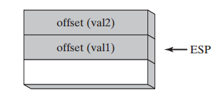
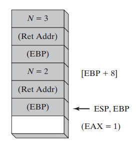

8 高级过程
^^^^^^^^^^^^^^^^

8.1 简介
--------------

本章介绍子例程调用的底层结构，关注于运行时玫。本章的内容对于C和C++程序员非常有价值，当调试作于操作系统或设备驱动级别的底层例程时，他们必须经常查看运行时栈的内容。

大多数现代语言在调用子例程之前将参数压入栈。同时，子例程通常将其局部变量存储在栈上。你在本章所了解的细节信息是与你的语言学习，例如C++与Java，相关的。我们将会展示参数是如何通过传值与传引用来传递的，局部变量是如何创建与销毁的，以及递归是如何这现的。在本章结束时，我们将会解释MASM所用的不同的内存模型与语言说明符。参数可以同时通过寄存器与栈进行传递。这正是64位模式下的情况下，其中Microsoft建立了MIcrosoft x64调用约定。

编程语言使用不同的语言来指代子例程。例如，在C和C++中，子例程被称为函数。在Java，子例程被称为方法。在MASM中，子例程被称为过程。在本章中我们的目的是展示C与C++中通常子例程调用的底层实现。在本章开始时，当指代通用原则时，我们将会使用通用术语子例程。当指代特定的汇编语言代码示例时，我们会经常使用术语过程来指代子例程。

通过调用程序传递给子例程的值被称为参数（arguments）。当值被所调用的子例程接收时，他们被称为参数（parameters）。

8.2 栈帧（Stack Frames）
---------------------------

8.2.1 栈参数（Stack Parameters）
>>>>>>>>>>>>>>>>>>>>>>>>>>>>>>>>>>>

在前面的章节中，我们的子例程接收寄存器参数。例如，在Irvin32库中即是如此。在本章中，我们将会展示子例程如何能够接收运行时栈上的参数。在32位模式下，栈参数通常被Windows API函数所使用。然而在64位模式下，接收寄存器参数与栈参数的组合。

栈帧（Stack Frame）（或活动记录）是用于保存传递的参数，子例程返回地址，局部变量，以及保存的寄存器的栈区域。栈帧是通过下述步骤来创建的：

1. 传递的参数，如果存，被压入栈。
2. 子例程被调用，导致子例程的返回地址被压入栈。
3. 当子例程开始执行时，EBP被压入栈。
4. EBP被设置等于ESP。由此开始，EBP扮演所有子例程参数的基础引用的角色。
5. 如果存在局部变量，ESP被递减，为栈上的变量保留空间。
6. 如果存在需要保存的寄存器，则它们被压入栈。

栈帧的结构直接受到程序的内存模型及其参数传递约定选择的影响。

有一个学习了解在栈上传递参数的良好理由，因为几乎所有的高级语言都会用到。例如，如果你要调用32位Windows应用程序接口（API）中的函数，你必须将参数传递到栈上。与之相对，64位程序使用一种不同的参数传递约定，我们将会在第11章中讨论。

8.2.2 寄存器参数的缺点
>>>>>>>>>>>>>>>>>>>>>>>>

多年以来，Microsoft已经包含一个在32位程序中的参数传递约定，被称为快速调用（fastcall）。正如其名字所显示的，在调用子例程之简单地将参数放置在寄存器上，有一定的运行效率优势。与之相对，将参数压入栈，运行则要慢得多。用于参数的寄存器通常包括EAX，EBX，ECX与EDX，以及较少用到的EDI与ESI。不幸的是，这些同样的寄存器的会被用于存储诸如循环计数器以及计算中的操作数等数据值。所以，在过程被调用之前，被用作参数的寄存器必须首先被压入栈，赋过程参数的值，并且稍后在过程返回之后恢复其原始值。例如，调用Irvine32库中的DumpMem过程即是如此：

.. code-block::

    push ebx ; save register values
    push ecx
    push esi
    mov esi,OFFSET array ; starting OFFSET
    mov ecx,LENGTHOF array ; size, in units
    mov ebx,TYPE array ; doubleword format
    call DumpMem ; display memory
    pop esi ; restore register values
    pop ecx
    pop ebx

不仅所有的额外的压入与弹出会使得代码杂乱，它会也会抵销我们希望通过回避寄存器参数所获得的性能优势。而且，程序员必须非常小心确保寄存器的PUSH与对应的POP相匹配，甚至是在代码中存在多条执行路径时也是同样如此。例如，在下面的代码，如果在第8行EAX等于1，则过程不会在第17行返回到其调用者，因为有三个寄存器值被留在了运行栈上。

.. code-block::

    1: push ebx ; save register values
    2: push ecx
    3: push esi
    4: mov esi,OFFSET array ; starting OFFSET
    5: mov ecx,LENGTHOF array ; size, in units
    6: mov ebx,TYPE array ; doubleword format
    7: call DumpMem ; display memory
    8: cmp eax,1 ; error flag set?
    9: je error_exit ; exit with flag set
    10:
    11: pop esi ; restore register values
    12: pop ecx
    13: pop ebx
    14: ret
    15: error_exit:
    16: mov edx,offset error_msg
    17: ret

你也许会同意类似这样的Bug很难被定位，除非你在代码上花费了相当数量的时间。

栈参数提供了一种无需寄存器参数的灵活方法。仅是在子例程被调用之前，参数被压入栈。例如，如果DumpMem使用栈参数，我们可以使用下面的代码进行调用：

.. code-block::

    push TYPE array
    push LENGTHOF array
    push OFFSET array
    call DumpMem

在子例程调用过程中，有两种通用类型参数被压入栈：

* 值参数（变量与常量的值）
* 引用参数（变量的地址）

*值传递* 当一个参数是以传值方式传递时，值的拷贝被压入栈。假定我们调用一个名为AddTwo的子例程，为其传递两个32位整数：

.. code-block::

    .data
    val1 DWORD 5
    val2 DWORD 6
    .code
    push val2
    push val1
    call AddTwo

下面是CALL指令之前的栈示意图：

等同的C++函数调用如下：

.. code-block::

    int sum = AddTwo( val1, val2 );

可以观察到，参数是以逆序被压入栈的，这正是C与C++语言的常见做法。

*引用传递* 按引用传递的参数是由对象的地址（偏移）构成。下面的语句调用Swap，通过引用传递两个参数：

.. code-block::

    push OFFSET val2
    push OFFSET val1
    call Swap

如下为调用Swap之间的栈示意图：

等效的C/C++函数调用将会传递val1与val2参数的地址：

.. code-block::

    Swap( &val1, &val2 );

*传递数组* 高级语言总是通过引用向子例程传递数组。也就是，它们将数组的地址压入栈。然后子例程由栈获取地址并用其访问数组。很容易理解为什么不通过传值传递数组，因为这样会导致每个数组元素被分别压入栈。这样的操作会非常慢，并且它会耗光之前的栈空间。下面的语句正是这样来做的，将数组的偏移量传递给名为ArrayFill的子例程：

.. code-block::

    .data
    array DWORD 50 DUP(?)
    .code
    push OFFSET array
    call ArrayFill

8.2.3 访问栈参数
>>>>>>>>>>>>>>>>>>>

高级语言在函数调用中有多种初始化与访问参数的方法。我们将使用C和C++语言作为示例。它们以保存EBP寄存器并将EBP指向栈顶部的语句组成开场白。作为可选项，它们也可以将特定的寄存器压入栈，并且在函数返回时恢复其值。函数的最后以EBP寄存器恢复以及RET指令返回到调用者结束。

*AddTwo示例* 下面以C编写的AddTwo函数以传值方式接收两个整数并返回其和：

.. code-block::

    int AddTwo( int x, int y )
    {
        return x + y;
    }

让我们使用汇编语言创建一个等效的实现。在开场白中，AddTwo将EBP压入栈以保存其已有值：

.. code-block::

    AddTwo PROC
        push ebp

接下来EBP被设置为与ESP相同的值，从而EBP可以作为AddTwo的栈帧的基指针：

.. code-block::

    AddTwo PROC
        push ebp
        mov ebp,esp

在这两条语句执行之后，下图显示了栈帧的内容。函数调用，例如AddTwo(5,6)，将使得第二个参数被压入栈，然后第一个参数被压入栈：

AddTwo也可以将其他的寄存器压入栈而不会修改EBP中栈参数的偏移量。ESP会改变值，但EBP不会。

*基偏移地址* 我们将会使用基偏移地址来访问栈参数。EBP是基寄存器，而偏移是一个常量 。通常在EAX中返回32位值。下面的AddTwo实现添加两个参数并且在EAX中返回两者之和：

.. code-block::

    AddTwo PROC
        push ebp
        mov ebp,esp ; base of stack frame
        mov eax,[ebp + 12] ; second parameter
        add eax,[ebp + 8] ; first parameter
        pop ebp
        ret
    AddTwo ENDP

显式栈参数
:::::::::::::::::

当栈参数以类似[ebp+8]这样的表达式引用时，我们将其称为显式栈参数。这一术语的原因在于显式将参数的偏移量表示为常量值。有些程序员定义符号常量来表示显式栈参数，从而使其代码更易读：

.. code-block::

    y_param EQU [ebp + 12]
    x_param EQU [ebp + 8]
    AddTwo PROC
        push ebp
        mov ebp,esp
        mov eax,y_param
        add eax,x_param
        pop ebp
        ret
    AddTwo ENDP

清空栈
:::::::::::

当子例程返回时，必须有一种由栈上删除参数的方法。否则会导致内存泄漏，而栈会被破坏。例如，假定下列语句在main中调用AddTwo：

.. code-block::

    push 6
    push 5
    call AddTwo

如果AddTwo将这两个参数遗忘在栈上，下图显示由调用中返回后栈的示意图：

在main内部，我们也许会尝试忽略该问题，并期待程序正常结束。但如果我们在循环内调用AddTwo，则栈会溢出。每次调用会使用12个字节的栈空间－每个参数占4个字节，CALL指令的返回地址占4个字节。如果我们在main内部调用Example1，该过程会调用AddTwo，则会导致更严重的问题：

.. code-block::

    main PROC
        call Example1
        exit
    main ENDP
    Example1 PROC
        push 6
        push 5
        call AddTwo
        ret ; stack is corrupted!
    Example1 ENDP

当Example1中的RET指令要执行时，ESP指向整数5，而不是将其带回main的返回地址：

RET指令将数值5载入到指令寄存器，并且尝试将控制传递到内存地址5处。如果该地址超出了程序的代码边界，处理器会触发运行时异常，通知OS结束程序。

8.2.4 32位调用约定
>>>>>>>>>>>>>>>>>>>>

在本节中，我们会介绍在Windows环境下进行32位编程时最常用到的两种调用约定。首先，C调用约定是由C语言所建立的，该语言被用来创建了Unix与Windows。STDCALL调用约定描述了用于调用Windows API函数的协议。两者同样重要，因为你也许会发现你要由C与C++程序中调用汇编函数，而你的汇编语言函数也会调用大量的Windows API函数。

*C调用约定* C调用约定为C和C++编程语言所使用。子例程参数被以逆序压入栈，所以类似如下的C程序函数调用会首先将B压入栈，然后将A压入栈：

.. code-block::

    AddTwo( A, B )

C调用约定以一种简单方法解决清理运行时栈的问题：当一个程序调用子例程时，CALL指令之后的语句向栈指针（ESP）增加一个值，所增加的值等于子例程参数的组合尺寸。在下面的示例中，在执行CALL指令之前，两个参数（5和6）被压入栈：

.. code-block::

    Example1 PROC
    push 6
    push 5
    call AddTwo
    add esp,8 ; remove arguments from the stack
    ret
    Example1 ENDP

所以，以C/C++编写的程序在子例程返回后，在调用程序中将参数由栈上删除。

*STDCALL调用约定* 另一种由栈上删除参数的常见方法就是使用名为STDCALL的调用约定。在下面的AddTwo过程中，我们为RET指令提供一个整数参数，从而会使得在返回调用过程之后将ESP增加8。所传递的整数必须等于过程的参数所占用的栈空间的字节数：

.. code-block::

    AddTwo PROC
        push ebp
        mov ebp,esp ; base of stack frame
        mov eax,[ebp + 12] ; second parameter
        add eax,[ebp + 8] ; first parameter
        pop ebp
        ret 8 ; clean up the stack
    AddTwo ENDP

应该指出的是，类似于C，STDCALL以逆序将参数压入栈。通过为RET指令提供参数，STDCALL减少了为子例程调用所生成的代码量（少1条指令），并且可以确保调用程序不会忘记清理栈。另一方面，C调用约定允许子例程声明变化的参数数量。调用者可以决定传递多个参数。C编程语言中的printf函数就是一个例子，其参数个数依赖于在初始字符串参数中格式标识符的个数：

.. code-block::

    int x = 5;
    float y = 3.2;
    char z = 'Z';
    printf("Printing values: %d, %f, %c", x, y, z);

C编译器以逆序将参数压入栈，后跟一个表明实际参数个数的计数参数。函数取得参数个数，并依次访问参数。函数的实现并不存在一种简便的方法在RET指令中编码一个常量来清理栈，所以栈清理的责任就留给了调用者。

Irvine32库在调用32位Windows API函数时使用STDCALL调用约定。Irvine64库使用x64调用约定。

保存与恢复寄存器
::::::::::::::::::::

子例程经常会在修改寄存器之前将当前寄存器的内容保存到栈上。这是一个好习惯，因为在子例程返回之前可以恢复其原始值。理想情况下，讨论中的寄存器应该在EBP被设置为ESP之后，在为局部变量保留空间之前，被压入栈。这有助于我们避免修改已有栈参数的偏移量。例如，假定下面的MySub过程有一个栈参数。它在将EBP设置为栈帧的基地址之后将ECX与EDX压入栈，并将栈参数载入到EAX中：

.. code-block::

    MySub PROC
        push ebp ; save base pointer
        mov ebp,esp ; base of stack frame
        push ecx
        push edx ; save EDX
        mov eax,[ebp+8] ; get the stack parameter
        . .
        pop edx ; restore saved registers
        pop ecx
        pop ebp ; restore base pointer
        ret ; clean up the stack
    MySub ENDP

在其初始化之后，EBP的内容会在过程中保持固定。将ECX与EDX压入栈不会影响已经位于栈上的参数距离EBP的偏移，因为栈是在EBP之下增长（如图8-1所示）。

8.2.5 局部变量
>>>>>>>>>>>>>>>>>>>

在高级语言中，在一个过程内部创建，使用，与销毁的变量被称为局部变量。局部变量在运行时栈上创建，通常是在基指针（EBP）之下。尽管不能在汇编时被为其赋默认值，它们可以在运行时被初始化。我们可以使用与C和C++相同的技术在汇编语言中创建局部变量。

*示例* 下面的C++函数声明了局部变量X与Y：

.. code-block::

    void MySub()
    {
        int X = 10;
        int Y = 20;
    }

如果该代码被编译为机器语言，我们可以看到局部变量是如何被分配的。每个栈项默认为32字节，所以每个变量的存储空间尺寸为4的倍数。为两个局部变量共保留8字节空间：

.. image:: _images/8-6.png

下面的MySub函数的反汇编显示了C++程序是如何创建局部变量，赋值，并由栈上删除变量的。它使用C调用约定：

.. code-block::

    MySub PROC
        push ebp
        mov ebp,esp
        sub esp,8 ; create locals
        mov DWORD PTR [ebp-4],10 ; X
        mov DWORD PTR [ebp-8],20 ; Y
        mov esp,ebp ; remove locals from stack
        pop ebp
        ret
    MySub ENDP

图8-2显示了在局部变量被初始化之后函数的栈帧情况。

在完成之前，函数通过为栈指针赋为EBP的值来重置栈。其作用是由栈上释放局部变量：

.. code-block::

    mov esp,ebp ; remove locals from stack

如果忽略此步骤，POP EBP会将EBP设置为20，而RET指令将会分支到内存地址10处，从而导致处理器异常退出。如下的MySub版本实现正是如此：

.. code-block::

    MySub PROC
        push ebp
        mov ebp,esp
        sub esp,8 ; create locals
        mov DWORD PTR [ebp4],10 ; X
        mov DWORD PTR [ebp8],20 ; Y
        pop ebp
        ret ; return to invalid address!
    MySub ENDP

*局部变量符号* 为了使得程序更易于阅读，你可以为每个变量的偏移定义一个符号，并在你的代码中使用该符号：

.. code-block::

    X_local EQU DWORD PTR [ebp4]
    Y_local EQU DWORD PTR [ebp8]
    MySub PROC
        push ebp
        mov ebp,esp
        sub esp,8 ; reserve space for locals
        mov X_local,10 ; X
        mov Y_local,20 ; Y
        mov esp,ebp ; remove locals from stack
        pop ebp
        ret
    MySub ENDP

8.2.6 引用参数
>>>>>>>>>>>>>>>>>>>

引用参数通常是被过程通过使用偏移量地址（距离EBP）来访问的。因为每个引用参数是一个指针，它通常被载入到寄存器中作为间接操作数使用。例如，假定一个指向数组的指针位于栈地址[ebp+12]处，下面的语句将指针拷贝到ESI中：

.. code-block::

    mov esi,[ebp+12] ; points to the array

*ArrayFill示例* 我们将要展示的ArrayFill过程使用16位整数的伪序列填充数组。它接收两个参数：一个指向数组的指针以及数组长度。第一个参数通过引用传递，而第二个参数通过值传递。下面是示例调用：

.. code-block::

    .data
    count = 100
    array WORD count DUP(?)
    .code
    push OFFSET array
    push count
    call ArrayFill

在ArrayFill内部，下面的开场白代码初始化栈帧指针（EBP）：

.. code-block::

    ArrayFill PROC
        push ebp
        mov ebp,esp

现在栈帧包含数组偏移，计数，返回地址，以及保存的EBP：

ArrayFill保存通用寄存器，接收参数，并填充数组：

.. code-block::

    ArrayFill PROC
        push ebp
        mov ebp,esp
        pushad ; save registers
        mov esi,[ebp+12] ; offset of array
        mov ecx,[ebp+8] ; array length
        cmp ecx,0 ; ECX == 0?
        je L2 ; yes: skip over loop
    L1:
        mov eax,10000h ; get random 0  FFFFh
        call RandomRange ; from the link library
        mov [esi],ax ; insert value in array
        add esi,TYPE WORD ; move to next element
        loop L1
    L2: popad ; restore registers
        pop ebp
        ret 8 ; clean up the stack
    ArrayFill ENDP

8.2.7 LEA指令
>>>>>>>>>>>>>>>>>

LEA指令返回间接操作数的地址。因为间接操作数包含一个或多个寄存器，因而在运行时计算其偏移量。为了展示LEA指令的用法，让我们看一下下面的C++程序，该程序声明一个局部字符数组并且在为其赋值时引用myString：

.. code-block::

    void makeArray( )
    {
        char myString[30];
        for( int i = 0; i 30; i++ )
            myString[i] = '*';
    }

等效的汇编语言代码在栈上为myString分配空间，并将地址赋给ESI作为一个间接操作数。尽管数组只有30个字节，ESP被减少32以保持其对齐对双字边界。注意LEA是如何被用来将数组的地址赋给ESI的：

.. code-block::

    makeArray PROC
        push ebp
        mov ebp,esp
        sub esp,32 ; myString is at EBP30
        lea esi,[ebp–30] ; load address of myString
        mov ecx,30 ; loop counter
    L1: mov BYTE PTR [esi],'*' ; fill one position
        inc esi ; move to next
        loop L1 ; continue until ECX = 0
        add esp,32 ; remove the array (restore ESP)
        pop ebp
        ret
    makeArray ENDP

不能使用OFFSET来获取栈参数的地址，因为OFFSET仅用于编译时的已知地址。下面的语句不会被汇编：

.. code-block::

    mov esi,OFFSET [ebp30] ; error

8.2.8 ENTER与LEAVE指令
>>>>>>>>>>>>>>>>>>>>>>>

ENTER指令自动为所调用的过程创建栈帧。它会局部变量保留栈空间，并将EBP保存到栈上。特别是，它会执行三个动作：

* 将EBP压入栈（push ebp）
* 将EBP设置为栈帧的基地址（mov ebp, esp）
* 为局部为量保留空间（sub esp, numbytes）

ENTER有两个操作数：第一个是指明要为局部变量保留的栈空间的字节数的常量，第二个指明过程的语法嵌套层次。

.. code-block::

    ENTER numbytes, nestinglevel

两个参数都是立即值。Numbytes总是被近似为4的倍数以使得ESP对齐到双字边界。Nestinglevel确定了由调用过程的栈帧拷贝到当前栈帧的栈帧指针的数量。在我们的程序中，netstinglevel总为零。Intel手册解释了ENTER指令如何支持块结构语言中的嵌套层次。

*示例1* 下面的示例声明了一个没有局部变量的过程：

.. code-block::

    MySub PROC
        enter 0,0

它等效于下述指令：

.. code-block::

    MySub PROC
        push ebp
        mov ebp,esp

*示例2* ENTER指令为局部变量保留8个字节栈空间：

.. code-block::

    MySub PROC
        enter 8,0

它等效于下述指令：

    MySub PROC
        push ebp
        mov ebp,esp
        sub esp,8

图8-3显示ENTER指令执行前与执行后的栈示意图：

如果你使用ENTER指令，强烈建议你在相同过程的结束处使用LEAVE指令。否则，你为局部变量创建的栈空间也许不会被释放。这会导致RET指令由栈上弹出错误的返回地址。

*LEAVE指令* LEAVE命令结束过程的栈帧。它通过将ESP与EBP恢复为过程被调用时它们所被赋值的值来反转前面ENTER指令的动作。再使用MySub过程作为示例，我们可以编写下面的代码：

.. code-block::

    MySub PROC
        enter 8,0
        .
        .
        leave
        ret
    MySub ENDP

下述等效的指令集为局部变量保留与丢弃8个字节的空间：

.. code-block::

    MySub PROC
        push ebp
        mov ebp,esp
        sub esp,8
        .
        .
        mov esp,ebp
        pop ebp
        ret
    MySub ENDP

8.2.9 LOCAL指令
>>>>>>>>>>>>>>>>>>>

我们可以猜想Microsoft创建LOCAL指令作为ENTER指令的高层代替。LOCAL通过名字声明一个或多个局部变量，为其赋尺寸属性。（与之相对，ENTER仅为局部变量保留一块未命名的栈空间块。）如果使用该指令，LOCAL必须出现在紧随PROC指令之后的位置。其语法为：

.. code-block::

    LOCAL varlist

varlist是一个变量定义列表，以逗号分隔，可以跨越多行。每个变量的定义格式如下：

.. code-block::

    label:type

标签可以是任意合法的标识符，而类型可以是标准类型（WORD，DWORD，等）或者用户定义类型。（第10章中描述的结构以及其他用户定义类型。）

*示例* MySub过程包含一个名为var1的BYTE类型的局部变量：

.. code-block::

    MySub PROC
        LOCAL var1:BYTE

BubbleSort过程包含一个名为temp的双字局部变量以及一个名为SwapFlag的BYTE类型的变量：

.. code-block::

    BubbleSort PROC
        LOCAL temp:DWORD, SwapFlag:BYTE

Merge过程包含一个名为pArray的PTR WORD局部变量，这是一个指向16位整数的指针：

.. code-block::

    Merge PROC
        LOCAL pArray:PTR WORD

局部变量TempArray是一个10个双字的数组。注意方括号用来显示数组尺寸：

.. code-block::

    LOCAL TempArray[10]:DWORD

MASM代码生成
::::::::::::::::::

查看在使用LOCAL指令时MASM所生成的代码是一个很好的主意。下面的Example1过程只有一个双字局部变量：

.. code-block::

    Example1 PROC
        LOCAL temp:DWORD
        mov eax,temp
        ret
    Example1 ENDP

MASM为Example1生成下面的代码，表明ESP被减小4以为双字变量保留空间：

.. code-block::

    push ebp
    mov ebp,esp
    add esp,0FFFFFFFCh ; add 4 to ESP
    mov eax,[ebp4]
    leave
    ret

Example1的栈帧如下图所示：

8.2.10 Microsoft x64调用约定
>>>>>>>>>>>>>>>>>>>>>>>>>>>>>>>>>>

在64位程序中，Microsoft为传递参数与调用子例程遵循一种统一的规范，被称为Microsoft x64调用约定。该约定被C和C++编译器，以及Windows API库所使用。你仅需要在调用Windows函数，或是调用以C或C++编写的函数时使用该约定。下面是此调用约定的特点与要求：

1. CALL指令由RSP（栈指针）寄存器减去8，因为地址为64位长。
2. 传递给子例程的前四个参数被依次放置在RCX，RDX，R8，以及R9寄存器中。所以如果仅传递一个参数，它位被放置于RCX中。如果有第二个参数，它会被放置在RDX中，依次类推。其他的参数按照由左至右的顺序被压入栈。
3. 小于64位长度的参数不会被零扩展，因而高位具有不确定的值。
4. 如果寄存器中的返回值的尺寸小于或等于64位，它必须在RAX寄存器返回。
5. 调用者负责在运行时栈上分配至少32个字节的影子空间，从而被调用的子例程可以将寄存器参数保存在该区域。
6. 当调用子例程时，栈指针（RSP）必须对齐到16字节边界。CALL指令将8字节返回地址压入栈，所以调用程序必须由栈指针减去8，另外为寄存器参数减去32。
7. 在所调用的子例程完成之后，调用程序负责由运行时栈上清除所有的参数与影子空间。
8. 大于64位的返回值被放置在运行时栈上，并且RCX指向该地址。
9. RAX，RCX，RDX，R8，R9，R10，以及R11寄存器经常被子例程所修改，所以调用程序希望这些寄存器的值被保存，它会在子例程调用之前将它们压入栈，并在之后由栈中弹出。
10. RBX，RBP，RDI，RSI，R12，R13，R14，以及R15寄存器必须被子例程保留。

8.3 递归
-------------

递归子例程是直接或间接调用其自身的子例程。递归，调用递归子例程的方法，是处理具有重复模式的数据结构的一种强有力的工具。例如链表以及必须跟踪其路径的各种类型的连接图。

*无终止递归* 最常见的递归类型是子例程调用其自身。例如，下面的程序中包含一个名为Endless的过程，该过程会重复调用其身自而不终止：

.. code-block::

    ; Endless Recursion (Endless.asm)
    INCLUDE Irvine32.inc
    .data
    endlessStr BYTE "This recursion never stops",0
    .code
    main PROC
        call Endless
        exit
    main ENDP
    Endless PROC
        mov edx,OFFSET endlessStr
        call WriteString
        call Endless
        ret ; never executes
    Endless ENDP
    END main

当然，该示例并没有任何实际价值。过程每次调用自身时，它会占用4个字节的栈空间，因为CALL指令会压入返回地址。RET指令永远不会执行，而程序会在栈溢出时终止。

8.3.1 递归求和
>>>>>>>>>>>>>>>>>>>>>>

有用的递归子例程总是包含一个终止条件。当终止条件为真时，程序执行所有等待的RET指令，栈被释放。为了演示了递归调用，让我们考虑一个名为CalcSum的递归过程，该过程会计算1到n的和，其中n是在ECX中传递的输入参数。CalcSum在EAX中返回和：

.. code-block::

    ; Sum of Integers (RecursiveSum.asm)
    INCLUDE Irvine32.inc
    .code
    main PROC
        mov ecx,5 ; count = 5
        mov eax,0 ; holds the sum
        call CalcSum ; calculate sum
        L1: call WriteDec ; display EAX
        call Crlf ; new line
        exit
    main ENDP
    ;----------------------------------------------------
    CalcSum PROC
    ; Calculates the sum of a list of integers
    ; Receives: ECX = count
    ; Returns: EAX = sum
    ;----------------------------------------------------
        cmp ecx,0 ; check counter value
        jz L2 ; quit if zero
        add eax,ecx ; otherwise, add to sum
        dec ecx ; decrement counter
        call CalcSum ; recursive call
    L2: ret
    CalcSum ENDP
    end Main

CalcSum的前两行会检查计算数，并且在ECX=0时退出过程。此时代码会略过后面的递归调用。当第一次到达RET指令时，它会返回对CalcSum的前一次调用，然后依次返回其前一次调用。表8-1显示了通过CALL指令返回地址（作为标签）以及ECX（计数器）和EAX（和）的值被压入栈。

8.3.2 计算阶乘
>>>>>>>>>>>>>>>>>>>>>>

递归子例程通常将临时数据存储在栈参数中。当递归调用展开时，保存在栈上的数据会可用。我们将下来要看的是一个计算整数n阶乘的示例。阶乘算法计算n!，其中n是一个无符号整数。factorial函数第一次被调用时，参数n是起始值，下面显示了以C/C++/Java语法编写的示例代码：

.. code-block::

    int function factorial(int n)
    {
        if(n == 0)
            return 1;
        else
            return n * factorial(n1);
    }

给定任意一个数字n，我们认为可以计算n-1的阶乘。如果可以，我们可以继续减小n直到零。通过定义，0!等于1。在返回到原始表达式n!的过程中，我们对每次乘法的积进行累乘。例如，要计算5!，递归算法沿着图8-4的左侧下沉并沿着右侧返回。

*示例程序* 下面的汇编语言程序包含一个名为Factorial的过程，使用递归来计算阶乘。我们将n（0与12之间的无符号整数）压入栈传递给Factorial过程，并且在EAX中返回值。因为EAX是一个32位寄存器，它可以保存的最大阶乘为12!（479,001,600）。

.. code-block::

    ; Calculating a Factorial (Fact.asm)
    INCLUDE Irvine32.inc
    .code
    main PROC
        push 5 ; calc 5!
        call Factorial ; calculate factorial (EAX)
        call WriteDec ; display it
        call Crlf
        exit
    main ENDP
    ;----------------------------------------------------
    Factorial PROC
    ; Calculates a factorial.
    ; Receives: [ebp+8] = n, the number to calculate
    ; Returns: eax = the factorial of n
    ;----------------------------------------------------
        push ebp
        mov ebp,esp
        mov eax,[ebp+8] ; get n
        cmp eax,0 ; n  0?
        ja L1 ; yes: continue
        mov eax,1 ; no: return 1 as the value of 0!
        jmp L2 ; and return to the caller
    L1: dec eax
        push eax ; Factorial(n1)
        call Factorial
    ; Instructions from this point on execute when each
    ; recursive call returns.
    ReturnFact:
        mov ebx,[ebp+8] ; get n
        mul ebx ; EDX:EAX = EAX * EBX
    L2: pop ebp ; return EAX
        ret 4 ; clean up stack
    Factorial ENDP
    END main

让我们使用初始值N=3，通过跟踪调用来近距离检视Factorial过程。正如在规范中所说明的，Factorial将其返回值赋给EAX寄存器：

.. code-block::

    push 3
    call Factorial ; EAX = 3!

Factorial接收一个栈参数，N，即要计算机的阶乘数。调用程序的返回地址被CALL指令自动压入栈。Factorial所做的第一件事是将EBP压入栈，以保存指向调用程序栈的基指针：

.. code-block::

    Factorial PROC
        push ebp

接下来，它必须将EBP设置为当前栈帧的起始处：

.. code-block::

    mov ebp,esp

现在EBP与ESP均指向栈顶部，运行时栈包含下列栈帧。它包含参数N，调用者的返回地址，以及EBP的保存值。

同样的示意图显示为了由栈上获取N的值并将其载入EAX中，代码必须使用基偏移地址将EBP的值加8：

.. code-block::

    mov eax,[ebp+8] ; get n

接下来代码检查停止递归的条件。如果N（当前位于EAX中）等于零，函数返回1，即所定义的0!：

.. code-block::

    cmp eax,0 ; is n > 0?
    ja L1 ; yes: continue
    mov eax,1 ; no: return 1 as the value of 0!
    jmp L2 ; and return to the caller

（我们稍后检视标签L2处的代码。）由于EAX的当前值等于3，Factorial会递归调用其自身。首先，它由N中减去1，并将新的值压入栈。该值是传递给对Factorial的再次调用的参数：

.. code-block::

    L1: dec eax
        push eax ; Factorial(n - 1)
        call Factorial

现在执行被传递给Factorial的第一行，并使用新的N值：

.. code-block::

    Factorial PROC
        push ebp
        mov ebp,esp

现在运行时栈拥有第二个栈帧，其中N等于2：

N的值，现在为2，被载入EAX并比零进行比较：

.. code-block::

    mov eax,[ebp+8] ; N = 2 at this point
    cmp eax,0 ; compare N to zero
    ja L1 ; still greater than zero
    mov eax,1 ; not executed
    jmp L2 ; not executed

它大于零，所以继续执行标签L1处。

在L1处，我们将会使用递归过程调用来获得N-1的。代码首先由EAX中减去1，将其压入栈，然后调用Factorial：

.. code-block::

    L1: dec eax ; N = 1
        push eax ; Factorial(1)
        call Factorial

现在第三次进入Factorial，有三个活动栈帧：

Factorial过程将N与零进行比较，发现N大于0，于是使用N=0再次调用Factorial。随着它最后一次进行Factorial过程，现在运行时栈包含第四个栈帧：

当使用N=0调用Factorial时，事情变得有趣了。下面的语句会导致分到L2标签处。值1被赋给EAX，因为0!=1，而EAX必须被赋值为Factorial的返回值：

.. code-block::

    mov eax,[ebp+8] ; EAX = 0
    cmp eax,0 ; is n > 0?
    ja L1 ; yes: continue
    mov eax,1 ; no: return 1 as the value of 0!
    jmp L2 ; and return to the caller

下面的标签L2的语句会使得Factorial返回到它上次被调用的位置：

.. code-block::

    L2: pop ebp ; return EAX
        ret 4 ; clean up stack

此时，下图展示了最近的帧并不在运行时栈中，并且EAX包含1（零的阶乘）：

下述行是Factorial调用的返回点。它们获取N的当前值（存储在EBP+8位置处），将其与EAX相乘（Factorial的返回值）。EAX中的积是Factorial此次迭代的当前返回值：

.. code-block::

    ReturnFact:
        mov ebx,[ebp+8] ; get n
        mul ebx ; EAX = EAX * EBX
    L2: pop ebp ; return EAX
        ret 4 ; clean up stack
    Factorial ENDP

（EDX中积的上半部分全为零并被忽略。）所以，第一次到达上述行时，EAX被赋值为表达式1x1的积。随着RET语句的执行，另一个帧被由栈上移除：

再次，CALL指令之后的语句被执行，将EAX中的值（等于1）乘以N（现在等于2）：

.. code-block::

    ReturnFact:
        mov ebx,[ebp+8] ; get n
        mul ebx ; EDX:EAX = EAX * EBX
    L2: pop ebp ; return EAX
        ret 4 ; clean up stack
    Factorial ENDP

现在EAX等于2，RET语句由栈上移除另一帧：

最后，CALL指令的语句最后一次执行，将EAX中的值（等于2）乘以N（等于3）：

.. code-block::

    ReturnFact:
        mov ebx,[ebp+8] ; get n
        mul ebx ; EDX:EAX = EAX * EBX
    L2: pop ebp ; return EAX
        ret 4 ; clean up stack
    Factorial ENDP

EAX中的返回值，6，即为计算得到的3的阶乘。这正是我们第一次调用Factorial时所看到的计算结果。当RET语句执行时，最后一个栈帧会消失。

8.4 INVOKE，ADDR，PORC，以及PROTO
--------------------------------------

在32位模式下，INVOKE，PROC，以及PROTO指令为定义与调用过程提供了强大工具。与这些指令一起，ADDR操作符是定义过程参数的有力工具。在许多方在这些提供实现了高级编程语言所提供的便利。由方法的角度来看，它们的使用是存在争议的，因为它们掩盖了运行时栈的底层结构。在使用这些指令之前，你需要对子例程调用的底层机制有细致的理解。

但有一种情况，使用高级过程指令可以实现更好地编程，即你的程序执行跨越模块边界的过程调用时。在这些情况下，PROTO指令可以帮助汇编器通过检测过程声明所需要的参数列表来验证过程调用。这一特性可以鼓励高级汇编语言程序员利用高级MASM指令所提供的便利。

8.4.1 INVOKE指令
>>>>>>>>>>>>>>>>>>>>>

INVOKE指令，仅用于32位模式，将参数压入栈（以MODEL指令的语言规范所表明的顺序），并调用过程。INVOKE是一种对CALL指令的方便替换，因为它允许你在一行代码中传递多个参数。下面是其通用语法：

.. code-block::

    INVOKE procedureName [, argumentList]

argumentList是一种可选的，以逗号分隔，传递给过程的参数列表。例如，使用CALL指令，我们在执行多条PUSH指令后调用名为DumpArray的过程：

.. code-block::

    push TYPE array
    push LENGTHOF array
    push OFFSET array
    call DumpArray

使用INVOKE的等效语句将会减少为一行代码，其中参数以逆序排列（假定使用STDCALL）：

.. code-block::

    INVOKE DumpArray, OFFSET array, LENGTHOF array, TYPE array

INVOKE允许几乎任意参数个数，而每个参数可以出现在单独的代码行中。下面的INVOKE语句包含有助于理解的注释：

.. code-block::

    INVOKE DumpArray, ; displays an array
        OFFSET array, ; points to the array
        LENGTHOF array, ; the array length
        TYPE array ; array component size

表8-2中列出参数类型。

*EAX，EDX覆写* 如果你向过程传递小于32位的参数，INVOKE经常会使得汇编器在将参数压入栈之前对参数进行扩展，从而导致EAX与EDX被覆写。你可以通过总是向INVOKE传递32位参数来避免这一行为，或者是你在过程调用之前与之后保存并恢复EAX与EDX。

8.4.2 ADDR操作符
>>>>>>>>>>>>>>>>>>>>

ADDR操作符，也仅用于32位模式，可以用于在使用INVOKE调用过程时向其传递指针参数。例如，下面的INVOKE语句，向FillArray过程传递myArray的地址：

.. code-block::

    INVOKE FillArray, ADDR myArray

传递给ADDR的参数必须是汇编时常量。下面的语句则会导致错误：

.. code-block::

    INVOKE mySub, ADDR [ebp+12] ; error

ADDR操作仅与INVOKE组合使用。下面的语句会导致错误：

.. code-block::

    mov esi, ADDR myArray ; error

*示例* 下面的INVOKE指令调用Swap，向其传递双字数组中前两个元素的地址：

.. code-block::

    .data
    Array DWORD 20 DUP(?)
    .code
        ...
        INVOKE Swap,
        ADDR Array,
        ADDR [Array+4]

下面是由汇编器生成的对应代码，假定使用STDCALL：

.. code-block::

    push OFFSET Array+4
    push OFFSET Array
    call Swap

8.4.3 PROC指令

PROC指令的语法
::::::::::::::::::::

在32位模式下，PROC指令具有如下的基本语法格式：

.. code-block::

    label PROC [attributes] [USES reglist], parameter_list

label是用户定义的标签，遵循第3章中解释的标记规则。属性如下：

.. code-block::

    [distance] [langtype] [visibility] [prologuearg]

表8-3描述了每种属性。

参数列表
:::::::::::

PROC指令允许你声明带有逗号分隔的命名参数列表的过程。你的实现代码可以通过名字引用这些参数，而无需计算诸如[ebp+8]之类的栈偏移：

.. code-block::

    label PROC [attributes] [USES reglist],
        parameter_1,
        parameter_2,
        . .
        parameter_n

如果参数列表显示在同一行，则PROC之后的逗号可以省略：

.. code-block::

    label PROC [attributes], parameter_1, parameter_2, ..., parameter_n

参数语法如下：

.. code-block::

    paramName:type

paramName是你赋给参数的任意的名字。其作用域仅限于当前过程（称为局部作用域）。相同的参数可以用于多个过程，但是它不能是全局变量名或代码标签名。类型可以是如下类型之一：BYTE，SBYTE，WORD，SWORD，DWORD，SDWORD，FWORD，QWORD或TBYTE。它也可以是限定类型，即可以为指向已有类型的指针。下面的示例即为限定类型：

.. code-block::

    PTR BYTE    PTR SBYTE
    PTR WORD    PTR SWORD
    PTR DWORD   PTR SDWORD
    PTR QWORD   PTR TBYTE

尽管可以为这些变量添加NEAR或FAR属性，但它们通常仅用于更为特定的应用中。也可以使用TYPEDEF或STRUCT指令创建限定类型，我们会在第10章中解释。

*示例1* AddTwo过程接收两个双字值并在EAX中返回其和：

.. code-block::

    AddTwo PROC,
        val1:DWORD,
        val2:DWORD
        mov eax,val1
        add eax,val2
        ret
    AddTwo ENDP

当汇编AddTwo时由MASM所生成的汇编语言展示了参数名如何被转换为距离EBP的偏移。由于使用STDCALL，一个常量参数被添加到RET指令：

.. code-block::

    AddTwo PROC
        push ebp
        mov ebp, esp
        mov eax,dword ptr [ebp+8]
        add eax,dword ptr [ebp+0Ch]
        leave
        ret 8
    AddTwo ENDP

注意：将AddTwo过程中的下列语句替换为ENTER 0,0指令也是正确的：

.. code-block::

    push ebp
    mov ebp,esp

*示例2* FillArray过程接收一个指向字节数组的指针：

.. code-block::

    FillArray PROC,
        pArray:PTR BYTE
        . . .
    FillArray ENDP

*示例3* Swap过程接收两个指向双字的指针：

.. code-block::

    Swap PROC,
        pValX:PTR DWORD,
        pValY:PTR DWORD
        . . .
    Swap ENDP

*示例4* Read_File过程接收一个名为pBuffer的字节指针。它有一个名为fileHandle的局部双字变量，并且将两个寄存器保存在栈上（EAX与EBX）：

.. code-block::

    Read_File PROC USES eax ebx,
        pBuffer:PTR BYTE
        LOCAL fileHandle:DWORD
        mov esi,pBuffer
        mov fileHandle,eax
        . .
        ret
    Read_File ENDP

MASM为Read_File生成的代码展示了在压入EAX与EBX（在USES语句中指定）之前如何在栈上为局部变量（fileHandle）保留空间：

.. code-block::

    Read_File PROC
        push ebp
        mov ebp,esp
        add esp,0FFFFFFFCh ; create fileHandle
        push eax ; save EAX
        push ebx ; save EBX
        mov esi,dword ptr [ebp+8] ; pBuffer
        mov dword ptr [ebp4],eax ; fileHandle
        pop ebx
        pop eax
        leave
        ret 4
    Read_File ENDP

注意：尽管Microsoft并不没有选择这样做，但为Read_File生成代码的另一种方式如下：

.. code-block::

    Read_File PROC
        enter 4,0
        push eax
        (etc.)

ENTER指令保存EBP，将其设置为栈指针的值，并为局部变量保留空间。

*被PROC修改的RET指令* 使用PROC使用一个或多个参数，并且默认使用STDCALL时，MASM会生成下面的进入与退出代码，假定PROC有n个参数：

.. code-block::

    push ebp
    mov ebp,esp
    . .
    leave
    ret (n*4)

出现在RET指令中的常量是参数个数乘以4（因为每个参数为双字）。当你执行INCLUDE Irvine32.inc时，STDCALL是默认调用约定，而这也正是所有Windows API函数所采用的调用约定。

指定传递给协议的参数
:::::::::::::::::::::::

一个程序也许会调用Irvine32库过程，并且包含可以由C++程序调用的过程。为了提供这种灵活性，PROC指令的属性域允许你为所传递的参数指定语言约定。它会覆盖在.MODEL指令指定的默认语言约定。下面的示例声明了一个使用C调用约定的过程：

.. code-block::

    Example1 PROC C,
        parm1:DWORD, parm2:DWORD

如果你使用INVOKE执行Example1，汇编器生成与C调用约定一致的代码。类似地，如果我们使用STDCALL声明Example1，INVOKE生成与语言约定一致的代码：

.. code-block::

    Example1 PROC STDCALL,
        parm1:DWORD, parm2:DWORD

8.4.4 PROTO指令
>>>>>>>>>>>>>>>>>>

在64位模式下，我们使用PROTO指令来标识一个程序外部的过程，如下所示：

.. code-block::

    ExitProcess PROTO
    .code
    mov ecx,0
    call ExitProcess

然而在32位模式下，PROTO更为强大，因为它可以包含过程的参数列表。我们说PROTO指令为已有的过程创建了一个原型（prototype）。原型声明了过程的名字与参数列表。它允许你在定义过程之前调用该过程，并且验证参数个数与类型是否与过程定义匹配。

MASM要求为INVOKE调用的每个过程声明原型。PROTO必须出现在INVOKE之前。换句话说，这些指令的标准顺序为：

.. code-block::

    MySub PROTO ; procedure prototype
    .
    INVOKE MySub ; procedure call
    .
    MySub PROC ; procedure implementation
    . .
    MySub ENDP

与之不同的应用场景也是可能的：程序中的过程实现出现在调用该过程的INVOKE语句之前的位置。在这种情况下，PROC扮演其自身原型的角色：

.. code-block::

    MySub PROC ; procedure definition
    . .
    MySub ENDP
    .
    INVOKE MySub ; procedure call

假定你已经编写了一个特定的过程，你可以通过拷贝PROC语句简单地创建其原型，并做出下面的修改：

* 将PROC改变PROTO
* 如果存在，则移除USES操作及其寄存器列表

例如，假定我们已经创建了ArraySum过程：

.. code-block::

    ArraySum PROC USES esi ecx,
        ptrArray:PTR DWORD, ; points to the array
        szArray:DWORD ; array size
        ; (remaining lines omitted...)
    ArraySum ENDP

下面是匹配的PROTO声明：

.. code-block::

    ArraySum PROTO,
        ptrArray:PTR DWORD, ; points to the array
        szArray:DWORD ; array size

PROTO指令允许你修改.MODEL指令中的默认参数传递协议。它必须与过程的PROC声明一致：

.. code-block::

    Example1 PROTO C,
        parm1:DWORD, parm2:DWORD

汇编时参数检测
:::::::::::::::::::::

PROTO指令帮助汇编器比较过程调用中的参数列表与过程定义。错误检测并不会像C与C++语言中的错误检测那样精确。相反，MASM检测正确的参数个数，以及有限程度的参数类型匹配。例如，假定Sub1的原型声明如下：

.. code-block::

    Sub1 PROTO, p1:BYTE, p2:WORD, p3:PTR BYTE

我们可以定义如下的变量：

    .data
    byte_1 BYTE 10h
    word_1 WORD 2000h
    word_2 WORD 3000h
    dword_1 DWORD 12345678h

下面是对于Sub1的合法调用：

.. code-block::

    INVOKE Sub1, byte_1, word_1, ADDR byte_1

MASM为此INVOKE生成的代码表明以逆序将参数压入栈：

.. code-block::

    push 404000h ; ptr to byte_1
    sub esp,2 ; pad stack with 2 bytes
    push word ptr ds:[00404001h] ; value of word_1
    mov al,byte ptr ds:[00404000h] ; value of byte_1
    push eax
    call 00401071

EAX被覆盖，而sub esp,2指令将后续的栈项补充了32位。

*MASM可检测的错误* 如果参数超出声明参数的尺寸，MASM会生成错误：

.. code-block::

    INVOKE Sub1, word_1, word_2, ADDR byte_1 ; arg 1 error

如果我们使用过少或过多的参数调用Sub1，MASM会生成错误：

.. code-block::

    INVOKE Sub1, byte_1, word_2 ; error: too few arguments
    INVOKE Sub1, byte_1, ; error: too many arguments
    word_2, ADDR byte_1, word_2

*MASM不可检测的错误* 如果参数的类型小于声明参数，MASM不会检测到错误：

.. code-block::

    INVOKE Sub1, byte_1, byte_1, ADDR byte_1

相反，MASM会将较小的参数扩展为声明参数的尺寸。在下面为INVOKE示例生成的代码中，第二个参数（byte_1）在被压入栈之前被扩展到EAX：

.. code-block::

    push 404000h ; addr of byte_1
    mov al,byte ptr ds:[00404000h] ; value of byte_1
    movzx eax,al ; expand into EAX
    push eax ; push on stack
    mov al,byte ptr ds:[00404000h] ; value of byte_1
    push eax ; push on stack
    call 00401071 ; call Sub1

当需要一个指针却传递一个双字时，不会检测到错误。这种类型的错误通常会在子例程尝试将栈参数用作指针时导致运行时错误：

.. code-block::

    INVOKE Sub1, byte_1, word_2, dword_1 ; no error detected

ArraySum示例
:::::::::::::::::::::

让我们回顾第5章中的ArraySum过程，该过程计算双字数组的和。在最初实现中，我们在寄存器中传递参数；现在我们可以使用PROC指令来声明栈参数：

.. code-block::

    ArraySum PROC USES esi ecx,
        ptrArray:PTR DWORD, ; points to the array
        szArray:DWORD ; array size
        mov esi,ptrArray ; address of the array
        mov ecx,szArray ; size of the array
        mov eax,0 ; set the sum to zero
        cmp ecx,0 ; length = zero?
        je L2 ; yes: quit
    L1: add eax,[esi] ; add each integer to sum
        add esi,4 ; point to next integer
        loop L1 ; repeat for array size
    L2: ret ; sum is in EAX
    ArraySum ENDP

INVOKE语句调用ArraySum，传递数组的地址以及数组中的元素个数：

.. code-block::

    .data
    array DWORD 10000h,20000h,30000h,40000h,50000h
    theSum DWORD ?
    .code
    main PROC
        INVOKE ArraySum,
            ADDR array, ; address of the array
            LENGTHOF array ; number of elements
        mov theSum,eax ; store the sum

8.4.5 参数分类
>>>>>>>>>>>>>>>>>>>>

通常依据调用程序与被调用过程之间的数据传输方法对过程参数进行分类：

* 输入：输入参数是调用程序向过程传递的数据。被调用程序并不会被期望修改对应的参数变量，而即使它修改了，修改也仅限于过程自身。
* 输出：当调用程序向过程传递变量的地址时会创建输出参数。过程使用该地址定位变量并为其赋值。例如，Win32控制台库有一个名为ReadConsole的函数，该函数由键盘读取字符串。调用程序传递一个指向字符串缓冲区的指针，ReadConsole会在此缓冲区中存储用户输入的文本：

.. code-block::

    .data
    buffer BYTE 80 DUP(?)
    inputHandle DWORD ?
    .code
    INVOKE ReadConsole, inputHandle, ADDR buffer,
        (etc.)

* 输入输出：输入输出参数与输出参数相同，但有一点例外：被调用过程希望参数引用的变量包含某些数据。过程同时期望通过指针修改变量。

8.4.6 示例：交换两个整数
>>>>>>>>>>>>>>>>>>>>>>>>>

下面的程序交换两个32位整数的内容。Swap过程有两个名为pValX与pValY的输入输出变量，包含要交换的数据的地址：

.. code-block::

    ; Swap Procedure Example (Swap.asm)
    INCLUDE Irvine32.inc
    Swap PROTO, pValX:PTR DWORD, pValY:PTR DWORD
    .data
    Array DWORD 10000h,20000h
    .code
    main PROC
    ; Display the array before the exchange:
        mov esi,OFFSET Array
        mov ecx,2 ; count = 2
        mov ebx,TYPE Array
        call DumpMem ; dump the array values
        INVOKE Swap, ADDR Array, ADDR [Array+4]
        ; Display the array after the exchange:
        call DumpMem
        exit
    main ENDP
    ;-------------------------------------------------------
    Swap PROC USES eax esi edi,
    pValX:PTR DWORD, ; pointer to first integer
    pValY:PTR DWORD ; pointer to second integer
    ;
    ; Exchange the values of two 32-bit integers
    ; Returns: nothing
    ;-------------------------------------------------------
        mov esi,pValX ; get pointers
        mov edi,pValY
        mov eax,[esi] ; get first integer
        xchg eax,[edi] ; exchange with second
        mov [esi],eax ; replace first integer
        ret ; PROC generates RET 8 here
    Swap ENDP
    END main

Swap过程的两个参数，pValX与pValY，是输入输出参数。它们的已有值是过程的输入，而它们的新值同时也是过程的输出。因为我们使用带有参数的PROC，汇编器在Swap的结束处将RET指令修改为RET 8（假定使用STDCALL调用约定）。

8.4.7 调试提示
>>>>>>>>>>>>>>>>>>>>>>>>

在本节中，我们关注于在汇编语言中向过程传递参数时会遇到的常见错误。我们希望你永远不会犯这些错误。

参数尺寸不匹配
::::::::::::::::::::

数组地址是基于其元素尺寸的。例如，要定位一个双字数组中第二个元素的地址，需要将数组的起始地址加4。假如我们调用8.4.6节中的Swap过程，向其传递DoubleArray的前两个元素的指针。如果我们将第二个元素的地址错误地计算为DoubleArray+1，则调用Swap后在DoubleArray中得到的十六进制值则是不正确的：

.. code-block::

    .data
    DoubleArray DWORD 10000h,20000h
    .code
    INVOKE Swap, ADDR [DoubleArray + 0], ADDR [DoubleArray + 1]

传递错误的指针类型
:::::::::::::::::::::::::::

当使用INVOKE时，记住，汇编器不会验证你向过程传递的指针类型。例如，8.4.6节中的Swap过程希望接收两个双字指针。如果我们误向其传递指向字节的指针：

.. code-block::

    .data
    ByteArray BYTE 10h,20h,30h,40h,50h,60h,70h,80h
    .code
    INVOKE Swap, ADDR [ByteArray + 0], ADDR [ByteArray + 1]

程序将被汇编并运行，但是当ESI与EDI被解引用时，32位值被交换。

传递立即数
::::::::::::::::::

如果过程有一个引用参数，不要向其传递立即参数。考虑下面的过程，它有一个引用参数：

.. code-block::

    Sub2 PROC, dataPtr:PTR WORD
        mov esi,dataPtr ; get the address
        mov WORD PTR [esi],0 ; dereference, assign zero
        ret
    Sub2 ENDP

下面的INVOKE语句可以正常汇编，但会导致运行时错误。Sub2过程接收1000h作为指针值并且解引用内存地址1000h：

.. code-block::

    INVOKE Sub2, 1000h

该程序可能会导致通用保护错误，因为内存地址1000h并不在程序的数据段中。

8.4.8 WriteStackFrame过程
>>>>>>>>>>>>>>>>>>>>>>>>>>>

Irvine32库中包含一个名为WriteStackFrame的有用过程，它可以显示当前过程的栈帧的内容。它会显示过程的栈参数，返回地址，局部以及保存的寄存器。它是由Pacific Lutheran University的James Brink教授提供的。下面是其原型：

.. code-block::

    WriteStackFrame PROTO,
        numParam:DWORD, ; number of passed parameters
        numLocalVal: DWORD, ; number of DWordLocal variables
        numSavedReg: DWORD ; number of saved registers

下面是一个演示WriteStackFrame的程序片段：

.. code-block::

    main PROC
        mov eax, 0EAEAEAEAh
        mov ebx, 0EBEBEBEBh
        INVOKE myProc, 1111h, 2222h ; pass two integer arguments
        exit
    main ENDP
    myProc PROC USES eax ebx,
        x: DWORD, y: DWORD
        LOCAL a:DWORD, b:DWORD
        PARAMS = 2
        LOCALS = 2
        SAVED_REGS = 2
        mov a,0AAAAh
        mov b,0BBBBh
        INVOKE WriteStackFrame, PARAMS, LOCALS, SAVED_REGS

程序产生的输出如下所示：

.. image:: _images/8-16.png

第二个过程，名为WriteStackFrameName，有一个保存过程所拥有的栈帧的名字的可选参数：

.. code-block::

    WriteStackFrameName PROTO,
        numParam:DWORD, ; number of passed parameters
        numLocalVal:DWORD, ; number of DWORD local variables
        numSavedReg:DWORD, ; number of saved registers
        procName:PTR BYTE ; null-terminated string

你可以在本书安装目录（通常为C:\Irvine）下的\Eamples\Lib32下找到Irvine32库的源码。查找名为Irvine32.asm的文件。

8.5 创建多模块程序
-------------------

较大的源文件难于管理并且汇编较慢。你可以将一个文件分为多个包含文件，但是要将所有文件进行完整汇编则需要对每个文件进行一些修改。一个较好的方法是将一个程序分为模块（汇编单元）。每个模块被单独汇编，所以对一个模块源代码的修改仅需要重新汇编单个源文件。链接器将所有的汇编模块（OBJ文件）组合为一个可执行文件要快速得多。链接大量的目标模块所需要时间要远远少于汇编同样数量的源码文件。

有两种创建多模块程序的方法：一种是使用EXTERN指令的传统方法，该方法或多或少地可在不同的x86汇编器上移植。第二种方法是使用Microsoft的高级INVOKE与PROTO指令，这种方法简化了过程调用并隐藏了某些底层细节。我们会同时展示两种方法，由你来决定使用哪一种。

8.5.1 隐藏与导出过程名
>>>>>>>>>>>>>>>>>>>>>>>>>>>>>

默认情况下，MASM会使得所有过程公开，允许它们被相同程序内的其他模块调用。你可以PRIVATE标识来覆盖此行为：

.. code-block::

    mySub PROC PRIVATE

通过使得过程私有，你使用封装原则将过程隐藏在模块内部，并且避免了不同模块中的过程具有相同名字所导致的潜在的命名冲突。

*OPTION PROC:PRIVATE指令* 将过程隐藏在源模块内部的另一种方法是在文件的顶部放置OPTION PROC:PRIVATE指令。默认情况下所有过程会变为私有。然后，你使用PUBLIC指令来标识你希望导出的过程：

.. code-block::

    OPTION PROC:PRIVATE
    PUBLIC mySub

PUBLIC指令使用一个以逗号贫富的命名列表：

.. code-block::

    PUBLIC sub1, sub2, sub3

或者，你可以将单个过程设计为公开：

.. code-block::

    mySub PROC PUBLIC
    .
    mySub ENDP

如果你在程序的开始模块中使用OPTION PROC:PRIVATE，记得将你的开始过程（通常为main）标记为PUBLIC，否则操作系统的装载器不能找到它。例如：

.. code-block::

    main PROC PUBLIC

8.5.2 调用外部过程
>>>>>>>>>>>>>>>>>>>>>>

当调用当前模块以外的过程时，EXTERN指令标识过程名与栈帧尺寸。下面的程序示例调用外部模块中的sub1：

.. code-block::

    INCLUDE Irvine32.inc
    EXTERN sub1@0:PROC
    .code
    main PROC
        call sub1@0
        exit
    main ENDP
    END main

当汇编器发现源文件中的缺失过程时（通常以CALL指令标识），其默认行为是触发错误信息。相反，EXTERN告诉汇编器为该过程创建一个空地址。链接器在创建程序的可执行时会解析缺失地址。

过程名后面的@n后缀标识声明的参数所占用的栈空间（参看8.4中的PROC指令）。如果你使用不带有声明参数的基本PROC指令，EXTERN名的每个过程名的后缀为@0。如果你使用扩展PROC指令声明过程，为每个参数添加4个字节。假定如我们声明一个带有两个双字参数的AddTwo：

.. code-block::

    AddTwo PROC,
        val1:DWORD,
        val2:DWORD
        . . .
    AddTwo ENDP

对应的EXTERN指令为EXTERN AddTwo@8:PROC。或者，你可以使用PROTO指令代替EXTERN：

.. code-block::

    AddTwo PROTO,
        val1:DWORD,
        val2:DWORD

8.5.3 使用跨模块边界的变量与符号
>>>>>>>>>>>>>>>>>>>>>>>>>>>>>>>>

导出变量与符号
:::::::::::::::::::

默认情况下，变量与符号对于其封装模块是私有的。你可以使用PUBLIC指令来导出特定的名字，如下面的示例所示：

.. code-block::

    PUBLIC count, SYM1
    SYM1 = 10
    .data
    count DWORD 0

访问外部变量与符号
:::::::::::::::::::::::::

你可以使用EXTERN推为访问外部模块中的变量与符号：

.. code-block::

    EXTERN name : type

对于符号（使用EQU和=定义），类型应为ABS。对于变量，类型可以是数据定义属性，例如，BYTE，WORD，DWORD以及SDWORD，包括PTR。如下述示例所示：

.. code-block::

    EXTERN one:WORD, two:SDWORD, three:PTR BYTE, four:ABS

通过EXTERNDEF使用包含文件
::::::::::::::::::::::::::::

MASM有一个名为EXTERNDEF的有用指令，同时代替PUBLIC与EXTERN。可以将其放置在一个文本文件中，并将其拷贝到使用INCLUDE指令的每个程序模块中。例如，让我们定义一个名为vars.inc的文件，包含下列声明：

.. code-block::

    ; vars.inc
    EXTERNDEF count:DWORD, SYM1:ABS

接下来，我们创建一个名为sub1.asm的源文件包含count与SYM1，INCLUDE语句可以将vars.inc拷贝到编译流中。

.. code-block::

    ; sub1.asm
    .386
    .model flat,STDCALL
    INCLUDE vars.inc
    SYM1 = 10
    .data
    count DWORD 0
    END

由于这并不是程序的启动模块，我们在END指令之后忽略了程序的入口点，并且我们并不需要声明运行时栈。

然后我们创建一个名为main.asm的启动模块，包含vars.inc文件并且引用count与SYM1：

.. code-block::

    ; main.asm
    .386
    .model flat,stdcall
    .stack 4096
    ExitProcess proto, dwExitCode:dword
    INCLUDE vars.inc
    .code
    main PROC
        mov count,2000h
        mov eax,SYM1
        INVOKE ExitProcess,0
    main ENDP
    END main

8.5.4 示例：ArraySum程序
>>>>>>>>>>>>>>>>>>>>>>>>>>

第5章中首次出现的ArraySum程序可以很容易分成模块。为了快速浏览程序的设计，让我们看一下结构图（图8-5）。深色框表示本书链接库中的过程。main过程调用PromptForIntegers，后者依次调用WriteString与ReadInt。为文件创建单独的磁盘目录，最容易跟踪多模块程序中的各种文件。这正是我们对ArraySum所采用的方法，显示在下一节中。

8.5.5 使用Extern创建模块
>>>>>>>>>>>>>>>>>>>>>>>>>>

我们将会展示ArraySum程序的两个多模块版本。本节将会使用传统的EXTERN指令来引用单独模块中的函数。稍后，在8.5.6节中，我们将会使用INVOKE，PROTO以及PROC的高级功能实现同样的程序。

*PromptForIntegers* _prompt.asm包含PromptForIntegers的源码文件。它会显示提示符要求用输入三个整数，通过调用ReadInt输入这些值，并将其插入到数组中：

.. code-block::

    ; Prompt For Integers (_ prompt.asm)
    INCLUDE Irvine32.inc
    .code
    ;----------------------------------------------------
    PromptForIntegers PROC
    ; Prompts the user for an array of integers and fills
    ; the array with the user's input.
    ; Receives:
    ; ptrPrompt:PTR BYTE ; prompt string
    ; ptrArray:PTR DWORD ; pointer to array
    ; arraySize:DWORD ; size of the array
    ; Returns: nothing
    ;-----------------------------------------------------
        arraySize EQU [ebp+16]
        ptrArray EQU [ebp+12]
        ptrPrompt EQU [ebp+8]
        enter 0,0
        pushad ; save all registers
        mov ecx,arraySize
        cmp ecx,0 ; array size = 0?
        jle L2 ; yes: quit
        mov edx,ptrPrompt ; address of the prompt
        mov esi,ptrArray
    L1: call WriteString ; display string
        call ReadInt ; read integer into EAX
        call Crlf ; go to next output line
        mov [esi],eax ; store in array
        add esi,4 ; next integer
        loop L1
    L2: popad ; restore all registers
        leave
        ret 12 ; restore the stack
    PromptForIntegers ENDP
    END

*ArraySum* _arraysum.asm模块包含ArraySum过程，该过程计算数组元素的和并在EAX中返回结果：

.. code-block::

    ; ArraySum Procedure (_arrysum.asm)
    INCLUDE Irvine32.inc
    .code
    ;-----------------------------------------------------
    ArraySum PROC
    ;
    ; Calculates the sum of an array of 32-bit integers.
    ; Receives:
    ; ptrArray ; pointer to array
    ; arraySize ; size of array (DWORD)
    ; Returns: EAX = sum
    ;-----------------------------------------------------
        ptrArray EQU [ebp+8]
        arraySize EQU [ebp+12]
        enter 0,0
        push ecx ; don't push EAX
        push esi
        mov eax,0 ; set the sum to zero
        mov esi,ptrArray
        mov ecx,arraySize
        cmp ecx,0 ; array size = 0?
        jle L2 ; yes: quit
    L1: add eax,[esi] ; add each integer to sum
        add esi,4 ; point to next integer
        loop L1 ; repeat for array size
    L2: pop esi
        pop ecx ; return sum in EAX
        leave
        ret 8 ; restore the stack
    ArraySum ENDP
    END

*DisplaySum* _display.asm模块包含DisplaySum过程，该过程会显示一个标签，在其后显示数组和：

.. code-block::

    ; DisplaySum Procedure (_display.asm)
    INCLUDE Irvine32.inc
    .code
    ;-----------------------------------------------------
    DisplaySum PROC
    ; Displays the sum on the console.
    ; Receives:
    ; ptrPrompt ; offset of prompt string
    ; theSum ; the array sum (DWORD)
    ; Returns: nothing
    ;-----------------------------------------------------
        theSum EQU [ebp+12]
        ptrPrompt EQU [ebp+8]
        enter 0,0
        push eax
        push edx
        mov edx,ptrPrompt ; pointer to prompt
        call WriteString
        mov eax,theSum
        call WriteInt ; display EAX
        call Crlf
        pop edx
        pop eax
        leave
        ret 8 ; restore the stack
    DisplaySum ENDP
    END

*启动模块* Sum_main.asm模块包含启动模块（main）。它包含三个外部模块的EXTERN指令。为了使得源码更为友好，EQU指令重新定义了过程名：

.. code-block::

    ArraySum EQU ArraySum@0
    PromptForIntegers EQU PromptForIntegers@0
    DisplaySum EQU DisplaySum@0

在每个过程调用之前，注释描述了参数顺序。该程序使用STDCALL参数传递约定：

.. code-block::

    ; Integer Summation Program (Sum_main.asm)
    ; Multimodule example:
    ; This program inputs multiple integers from the user,
    ; stores them in an array, calculates the sum of the
    ; array, and displays the sum.
    INCLUDE Irvine32.inc
    EXTERN PromptForIntegers@0:PROC
    EXTERN ArraySum@0:PROC, DisplaySum@0:PROC
    ; Redefine external symbols for convenience
    ArraySum EQU ArraySum@0
    PromptForIntegers EQU PromptForIntegers@0
    DisplaySum EQU DisplaySum@0
    ; modify Count to change the size of the array:
    Count = 3
    .data
    prompt1 BYTE "Enter a signed integer: ",0
    prompt2 BYTE "The sum of the integers is: ",0
    array DWORD Count DUP(?)
    sum DWORD ?
    .code
    main PROC
        call Clrscr
    ; PromptForIntegers( addr prompt1, addr array, Count )
        push Count
        push OFFSET array
        push OFFSET prompt1
        call PromptForIntegers
    ; sum = ArraySum( addr array, Count )
        push Count
        push OFFSET array
        call ArraySum
        mov sum,eax
    ; DisplaySum( addr prompt2, sum )
        push sum
        push OFFSET prompt2
        call DisplaySum
        call Crlf
        exit
    main ENDP
    END main

该程序的源文件存储在名为ch08\ModSum32_traditional目录下的示例程序目录中。

接下来，我们将会展示如果使用Microsoft的INVOKE和PROTO指令则需要对程序做出哪些修改。

8.5.6 使用INVOKE和PROTO创建模块
>>>>>>>>>>>>>>>>>>>>>>>>>>>>>>>>>>>

在32位模式下，可以使用Microsoft的高级INVOKE，PROTO以及扩展PROC指令（8.4节）创建多模块程序。相对于使用CALL与EXTERN的传统方法，该方法的主要优点在于其将传递给INVOKE的参数列表与PROC声明的对应参数列表相匹配的能力。

让我们使用INVOKE，PROTO，以及高级PROC指令重新创建ArraySum程序。第一步是为每个外部过程创建一个包含PROTO指令的包含文件。每个模块都会包含该文件（使用INCLUDE指令）而不会增加代码尺寸与运行时负载。如果一个模块并没有调用特定的过程，则对应的PROTO指令会被汇编器所忽略。该程序的源码位于\ch08\ModSum32_advanced目录下。

*sum.inc包含文件* 下面是该程序的sum.inc包含文件：

.. code-block::

    ; (sum.inc)
    INCLUDE Irvine32.inc
    PromptForIntegers PROTO,
        ptrPrompt:PTR BYTE, ; prompt string
        ptrArray:PTR DWORD, ; points to the array
        arraySize:DWORD ; size of the array
    ArraySum PROTO,
        ptrArray:PTR DWORD, ; points to the array
        arraySize:DWORD ; size of the array
    DisplaySum PROTO,
        ptrPrompt:PTR BYTE, ; prompt string
        theSum:DWORD ; sum of the array

*_prompt模块* _prompt.asm文件包含用于声明PromptForIntegers过程的参数的PROC指令。它使用INCLUDE来将sum.inc拷贝到此文件中：

.. code-block::

    ; Prompt For Integers (_ prompt.asm)
    INCLUDE sum.inc ; get procedure prototypes
    .code
    ;-----------------------------------------------------
    PromptForIntegers PROC,
        ptrPrompt:PTR BYTE, ; prompt string
        ptrArray:PTR DWORD, ; pointer to array
        arraySize:DWORD ; size of the array
    ;
    ; Prompts the user for an array of integers and fills
    ; the array with the user's input.
    ; Returns: nothing
    ;-----------------------------------------------------
        pushad ; save all registers
        mov ecx,arraySize
        cmp ecx,0 ; array size = 0?
        jle L2 ; yes: quit
        mov edx,ptrPrompt ; address of the prompt
        mov esi,ptrArray
    L1: call WriteString ; display string
        call ReadInt ; read integer into EAX
        call Crlf ; go to next output line
        mov [esi],eax ; store in array
        add esi,4 ; next integer
        loop L1
    L2: popad ; restore all registers
        ret
    PromptForIntegers ENDP
    END

与PromptForIntegers的前一个版本相比，现在不需要enter 0,0与leave指令，因为在遇到带有声明参数的PROC指令时，MASM会自动生成相应的代码。同时，RET指令不需要常量参数（PROC会为其处理）。

*_arraysum模块* 接下来，_arraysum.asm文件包含ArraySum过程：

.. code-block::

    ; ArraySum Procedure (_arrysum.asm)
    INCLUDE sum.inc
    .code
    ;-----------------------------------------------------
    ArraySum PROC,
        ptrArray:PTR DWORD, ; pointer to array
        arraySize:DWORD ; size of array
    ;
    ; Calculates the sum of an array of 32-bit integers.
    ; Returns: EAX = sum
    ;-----------------------------------------------------
        push ecx ; don't push EAX
        push esi
        mov eax,0 ; set the sum to zero
        mov esi,ptrArray
        mov ecx,arraySize
        cmp ecx,0 ; array size = 0?
        jle L2 ; yes: quit
    L1: add eax,[esi] ; add each integer to sum
        add esi,4 ; point to next integer
        loop L1 ; repeat for array size
    L2: pop esi
        pop ecx ; return sum in EAX
        ret
    ArraySum ENDP
    END

*_display模块* _display.asm文件包含DisplaySum过程：

.. code-block::

    ; DisplaySum Procedure (_display.asm)
    INCLUDE Sum.inc
    .code
    ;-----------------------------------------------------
    DisplaySum PROC,
        ptrPrompt:PTR BYTE, ; prompt string
        theSum:DWORD ; the array sum
    ;
    ; Displays the sum on the console.
    ; Returns: nothing
    ;-----------------------------------------------------
        push eax
        push edx
        mov edx,ptrPrompt ; pointer to prompt
        call WriteString
        mov eax,theSum
        call WriteInt ; display EAX
        call Crlf
        pop edx
        pop eax
        ret
    DisplaySum ENDP
    END

*Sum_main模块* Sum_main.asm（启动模块）包含main并调用其他模块。它使用INCLUDE由sum.inc中拷贝过程原型：

.. code-block::

    ; Integer Summation Program (Sum_main.asm)
    INCLUDE sum.inc
    Count = 3
    .data
    prompt1 BYTE "Enter a signed integer: ",0
    prompt2 BYTE "The sum of the integers is: ",0
    array DWORD Count DUP(?)
    sum DWORD ?
    .code
    main PROC
        call Clrscr
        INVOKE PromptForIntegers, ADDR prompt1, ADDR array, Count
        INVOKE ArraySum, ADDR array, Count
        mov sum,eax
        INVOKE DisplaySum, ADDR prompt2, sum
        call Crlf
        exit
    main ENDP
    END main

*总结* 我们展示了创建多模块程序的两种方法－首先使用更为传统的EXTERN指令，其次使用32位模式下INVOKE，PROTO以及PROC的高级功能。后者简化了许多细节，并且为调用Windows API函数进行优化。它们同时隐藏了大量细节，从而你也许会更喜欢配合CALL与EXTERN使用显式栈参数。

8.6 参数的高级使用
---------------------

在本节中，我们探讨在32位模式下，当向运行时栈传递参数时，会遇到的一些特殊情况。例如，如果你要检视C与C++编译器生成的示例代码，你也许会遇到一些这里所展示的技术。

8.6.1 USES操作符影响栈
>>>>>>>>>>>>>>>>>>>>>>>>>>>

第5章中介绍了USES操作符，列出了过程开始时要保存而在过程结束时要恢复的寄存器名字。汇编器会自动为每个命名寄存器生成相应的PUSH与POP指令。但是有一些你需要了解的内容：当声明使用常量偏移，例如[ebp+8]，访问其栈参数的过程时，不应使用USES操作符。让我们看一个展示为什么的示例。下面的MySub1过程使用USES操作符来保存并恢复ECX与EDX：

.. code-block::

    MySub1 PROC USES ecx edx
    ret
    MySub1 ENDP

下面是当汇编MySub1时MASM生成的代码：

.. code-block::

    push ecx
    push edx
    pop edx
    pop ecx
    ret

假定我们将USES与栈参数相结合，正如下面的MySub2过程所示。其参数本应位于栈上的EBP+8处：

.. code-block::

    MySub2 PROC USES ecx edx
        push ebp ; save base pointer
        mov ebp,esp ; base of stack frame
        mov eax,[ebp+8] ; get the stack parameter
        pop ebp ; restore base pointer
        ret 4 ; clean up the stack
    MySub2 ENDP

下面是MASM为MySub2生成的对应代码：

.. code-block::

    push ecx
    push edx
    push ebp
    mov ebp,esp
    mov eax,dword ptr [ebp+8] ; wrong location!
    pop ebp
    pop edx
    pop ecx
    ret 4

由于汇编器在过程开始处为ECX与EDX插入了PUSH指令，改变了栈参数的偏移量，因而会产生错误。图8-6显示了现在[EBP+16]所引用的栈参数。USES在保存EBP之前修改了栈，从而破坏了通常用于子例程的初始代码。

提示：在本章稍前的内容中，我们了解了声明栈参数的高级语法的指令。在此种情况下，USES操作符不会引起任何问题。

8.6.2 在栈上传递8位与16位参数
>>>>>>>>>>>>>>>>>>>>>>>>>>>>>

当在32位模式下向过程传递栈参数时，最好压入32位操作数。尽管你可以在栈上压入16位参数，但这样做会阻止ESP与双字边界对齐。也许会发生页错误，并且会降低运行时性能。在将他们压入栈之前，你应该将其扩展为32位。下面的Uppercase过程接收一个字符参数，并在AL中返回对应的大写字符：

.. code-block::

    Uppercase PROC
        push ebp
        mov ebp,esp
        mov al,[esp+8] ; AL = character
        cmp al,'a' ; less than 'a'?
        jb L1 ; yes: do nothing
        cmp al,'z' ; greater than 'z'?
        ja L1 ; yes: do nothing
        sub al,32 ; no: convert it
    L1:
        pop ebp
        ret 4 ; clean up the stack
    Uppercase ENDP

如果我们向Uppercase传递字符字面量，PUSH指令自动将字符扩展为32位：

.. code-block::

    push 'x
    call Uppercase

但是传递字符变量时需要更为小心，因为PUSH指令并不允许8位操作数：

.. code-block::

    .data
    charVal BYTE 'x'
    .code
    push charVal ; syntax error!
    call Uppercase

相应地，我们使用MOVZX将字符扩展到EAX：

.. code-block::

    movzx eax,charVal ; move with extension
    push eax
    call Uppercase

16位参数示例
::::::::::::::::::

假定我们要向之前显示的AddTwo过程传递两个16位整数。过程期望32位值，因而下面的调用会导致错误：

.. code-block::

    .data
    word1 WORD 1234h
    word2 WORD 4111h
    .code
    push word1
    push word2
    call AddTwo ; error!

相反，我们在将其压入栈之前零扩展每个参数。下面的代码可以正确调用AddTwo：

.. code-block::

    movzx eax,word1
    push eax
    movzx eax,word2
    push eax
    call AddTwo ; sum is in EAX

过程的调用者必须确保它所传递的参数与过程期望的匹配相一致。在栈参数的情况下，参数的顺序与尺寸非常重要。

8.6.3 传递64位参数
>>>>>>>>>>>>>>>>>>>>>>>>

在32位模式下，当将子例程的64位整数传递到栈上时，首先压入参数的高序双字，然后是低序双字。这样可以小端序（低序字节位于最低地址处）将整数放入栈。子例程可以很容易地接收这些值，正如下面的WriteHex64过程所示，该过程会以十六进制显示64位整数：

.. code-block::

    WriteHex64 PROC
        push ebp
        mov ebp,esp
        mov eax,[ebp+12] ; high doubleword
        call WriteHex
        mov eax,[ebp+8] ; low doubleword
        call WriteHex
        pop ebp
        ret 8
    WriteHex64 ENDP

下面对WriteHex64的示例调用首先压入longVal的高半部分，然后压入低半部分：

.. code-block::

    .data
    longVal QWORD 1234567800ABCDEFh
    .code
    push DWORD PTR longVal + 4 ; high doubleword
    push DWORD PTR longVal ; low doubleword
    call WriteHex64

图8-7显示了在EBP被压入栈并且ESP被拷贝到EBP之间，WriteHex64内部的栈帧。

8.6.4 非双字局部变量
>>>>>>>>>>>>>>>>>>>>>>

当你声明不同尺寸的变量时，LOCAL指令会有一些有趣的行为。每个变量会依据其尺寸分配空间：8位变量会被赋为下一个可用的字节，16位变量被赋为下一个偶数地址（字对齐），而32位变量会会在下一个双字对齐边界处分配。让我们看一些示例。首先，Example1过程包含一为var1的BYTE类型的局部变量：

.. code-block::

    Example1 PROC
    LOCAL var1:byte
    mov al,var1 ; [EBP - 1]
    ret
    Example1 ENDP

因为在32位模式下，栈偏移默认为32位，你也许会认为var1会位于EBP-4处。如图8-8所示，正相反，MASM将ESP减4，而将var1放置在EBP-1处，而使得其下的三个字节未被使用（以字符nu标记，意为未使用）。在图中，每个块表示一个字节。

Example2过程包含一个双字与一个字节：

.. code-block::

    Example2 PROC
        local temp:dword, SwapFlag:BYTE
        . .
        ret
    Example2 ENDP

下面是汇编器为Example2生成的代码。ADD指令将ESP加8，在ESP与EBP之间为两个局部变量开辟栈空间：

.. code-block::

    push ebp
    mov ebp,esp
    add esp,0FFFFFFF8h ; add -8 to ESP
    mov eax,[ebp-4] ; temp
    mov bl,[ebp-5] ; SwapFlag
    leave
    ret

尽管SwapFlag仅为一个字节变量，ESP被近似到下一个双字栈位置处。栈的细节以及单个字节显示在图8-9中，展示了SwapFlag的精确位置以及其下未被使用的空间（以nu标识）。在图中，每个块等于一个字节。

如果你计划创建几百字节的数组作为局部变量，确保使用STACK指令为运行时栈保留足够的空间。例如在Irvine32库中，我们为栈空间保留4096字节空间：

.. code-block::

    .stack 4096

如果过程被嵌套调用，运行时栈必须足够大以保存程序执行中任意点时的所有活动的局部变量。例如，在下面的代码中，Sub1调用Sub2，而Sub2调用Sub3，每个都有一个局部数组变量：

.. code-block::

    Sub1 PROC
    local array1[50]:dword ; 200 bytes
    callSub2
    . .
    ret
    Sub1 ENDP
    Sub2 PROC
    local array2[80]:word ; 160 bytes
    callSub3
    . .
    ret
    Sub2 ENDP
    Sub3 PROC
    local array3[300]:dword ; 1200 bytes
    . .
    ret
    Sub3 ENDP

当程序进入Sub3时，运行时栈保存Sub1，Sub2以及Sub3的局部变量。栈需要1560字节来保存这些局部变量，两个过程返回地址（8字节），以及过程中被压入栈的寄存器。如果一个过程被递归调用，它所使用的栈空间近似等于局部变量及其参数的尺寸乘以估计的递归深度。

8.7 Java字节码
----------------------

8.7.1 Java虚拟机
>>>>>>>>>>>>>>>>>>>>

Java虚拟机（JVM）是运行已编译的Java字节码的软件。它是Java平台的重要组成部分，将程序，规范，库以及数据结构组合在一起。Java字节码是为已编译Java程序内部的机器语言所指定的名字。

尽管本书教授x86处理器上原生汇编语言，学习了解其他的机器体系结构也是非常有益处的。JVM是基于栈的机器在的最好示例。JVM不使用寄存器来存储操作数（正如x86那样），而是使用栈用于数据移动，算术运算，比较，以及分支操作。

由JVM执行的编译程序包含Java字节码。所有的Java源程序在它运行之前必须被编译为Java字节码（以.class文件的格式）。包含Java字节码的相同程序可以运行于安装有Java运行软件的任何计算系统上。

例如，名为Account.java的Java源文件，被编译为名为Account.class的文件。在文件内部是用于类中每个方法的字节码的流。JVM可以选择使用一种名为just-in-time编译的技术将类字节码编译为计算机的原生机器语言。

一个运行的Java方法有其自己的栈帧，包含局部变量，操作数栈，输入参数，返回地址，以及返回值。栈的操作数区域实际上位于栈的顶部，所以压入的值可以用作算术操作数与逻辑操作数，以及传递给类方法的参数。

在局部变量可以用于算术或比较指令之前，它们必须被压入栈帧的操作数区域。以后，我们会将该区域称为操作数栈。

在Java字节码中，每个指令包含一个1字节操作码，后跟零个或多个操作数。当使用Java反汇编程序显示时，操作码具有名字，例如iload，istore，以及goto。每个栈元素为4字节（32位）。

查看反汇编的字节码
>>>>>>>>>>>>>>>>>>>>>>>>

Java开发套件（JDK）中包含一个名为javap.exe的程序，可以显示java.class文件中的字节码。我们将其称为文件的反汇编。其命令行语法为：

.. code-block::

    javap –c classname

例如，如果你的类文件名为Account.class，则相应在的javap命令行如下所示：

.. code-block::

    javap –c Account

你可以在已安装的Java开发套件中的\bin目录下找到javap.exe程序。

8.7.2 指令集
>>>>>>>>>>>>>>>>>>>>>

基本数据类型
:::::::::::::::

JVM可以识别七种基本数据类型，如表8-4所示。所有有符号整数以2的补码形式表示，类似于x86整数。但是它们以大端序存储，高序字节位于每个寄存器的起始地址处（x86指令以小端序存储）。IEEE实数格式将会在第12章中描述。

比较指令
:::::::::::::::

比较指令由操作数栈的顶部弹出两个操作数，比较其大小，并将比较的结果压回栈。让我们假定操作数以下列顺序被压入栈：

下表显示了在比较op1与op2之后被压入栈上的值：

分支指令
:::::::::::::::::::

分支指令可以分为条件分支和无条件分支。Java字节码中无条件分支的示例如goto与jsr。

goto指令无条件跳转到标签处：

.. code-block::

    goto label

jsr指令调用label标识的子例程：

.. code-block::

    jsr label

条件分支指令通常会检查由操作数栈顶部弹出的数值。然后，基于该数值，指令决定是否分支到指定标签处。例如，如果弹出的值小于或等于零，ifle指令会分支到标签处。其语法为：

.. code-block::

    ifle label

类似地，如果弹出值大于等于零，ifgt指令分支到标签处。其语法为：

.. code-block::

    ifgt label

8.7.3 Java反汇编示例
>>>>>>>>>>>>>>>>>>>>>>>>>>

为了有助于你理解Java字节码是如何工作的，我们将会提供一系列以Java编写的简短代码示例。请注意，在下面的示例中所列出的Java字节码会因为不同的Java发布版本而略有不同。

示例：两整数相加
:::::::::::::::::::::

下面的Java源代码将两个整数相加，并将其和放置在第三个变量中：

.. code-block::

    int A = 3;
    int B = 2;
    int sum = 0;
    sum = A + B;

如下是Java代码的反汇编：

.. code-block::

    0: iconst_3
    1: istore_0
    2: iconst_2
    3: istore_1
    4: iconst_0
    5: istore_2
    6: iload_0
    7: iload_1
    8: iadd
    9: istore_2

每个代码行表示Java字节码指令的字节偏移。在当前的示例中，我们可以知道每条指令仅有一个字节长，因为其指令偏移是顺序编号的。

尽管字节码反汇编通常并不包含注释，我们会加入自己的注释。局部变量在运行时栈上有其自己的保留区域。还有另一个名为操作数栈的栈空间，为执行算术运行与数据移动的指令所使用。为了避免两个栈之间的混淆，我们将会使用索引值0，1，2，等来指代变量位置。

现在我们将详细分析字节码。前两条指令将一个常量值压入操作数栈，同时将相同值弹出到位置0处的局部变量中：

.. code-block::

    0: iconst_3 // push constant (3) onto operand stack
    1: istore_0 // pop into local variable 0

接下的四行将另两个常量压入操作数栈，并将它们弹出到位置1与2处的局部变量中：

.. code-block::

    2: iconst_2 // push constant (2) onto stack
    3: istore_1 // pop into local variable 1
    4: iconst_0 // push constant (0) onto stack
    5: istore_2 // pop into local variable 2

既然已经看到了生成字节码的Java源代码，现在显示三个变量的位置索引的下表则会非常清晰：

接下来，为了执行加法，两个操作数必须被压入操作数栈。iload_0指令将变量A压入栈。iload_1指令为变量B执行同样的操作：

.. code-block::

    6: iload_0 // push A onto the stack
    7: iload_1 // push B onto the stack

操作数栈现在包含两个值：

我们并不关心这些示例中真实的机器表示，所以图中的运行时栈向上增长。每个栈图中最上部的值为栈顶。

iadd指令将栈顶部的两个值相加，并将所得到的和压回栈：

.. code-block::

    8: iadd

现在操作数栈包含A与B的和：

istore_2指令将栈元素弹出到位置2处，即变量sum中：

.. code-block::

    9: istore_2

现在操作数栈为空。

示例：两个双精度数相加
>>>>>>>>>>>>>>>>>>>>>>>>>>>>>

下面的代码片段将两个双精度数相加并将和存储在sum中。它执行与前面两个整数相加的示例相同的操作，所以我们将关注于整数与双精度浮点数处理之间的区别：

.. code-block::

    double A = 3.1;
    double B = 2;
    double sum = A + B;

下面是我们示例的反汇编字节码。右边显示的是由javap实用程序所插入的注释：

.. code-block::

    0: ldc2_w #20; // double 3.1d
    3: dstore_0
    4: ldc2_w #22; // double 2.0d
    7: dstore_2
    8: dload_0
    9: dload_2
    10: dadd
    11: dstore_4

我们将会逐步讨论这些代码。偏移0处的ldc_w指令将常量池中的浮点数常量（3.1）压入操作数栈。ldc2指令总是向常量池区域包含一个2字节索引：

.. code-block::

    0: ldc2_w #20; // double 3.1d

偏移量3处的dstore指令由操作栈弹出一个精度浮点数到位置0处的局部变量。指令的起始偏移（3）反映了第一个指令（操作码加2字节索引）所使用的字节数：

.. code-block::

    3: dstore_0 // save in A

接下来位置4与7偏移处的两条指令初始化变量B：

.. code-block::

    4: ldc2_w #22; // double 2.0d
    7: dstore_2 // save in B

dload_0与dload_2指令将局部变量压入栈。索引指向64位位置处（两个栈变量元素），因为双字值为8个字节长：

.. code-block::

    8: dload_0
    9: dload_2

下一条指令（dadd）将栈顶部的两个双精度浮点数相加，并将其和重新压入栈：

.. code-block::

    10: dadd

最后的dstore_4指令将栈顶元素弹出到位置4处的局部变量中：

.. code-block::

    11: dstore_4

8.7.4 示例：条件分支
>>>>>>>>>>>>>>>>>>>>>>>>>>>>>

理解Java字节码的一个重要部分与JVM如何处理条件分支相关。比较操作总是由栈中弹出两个元素，比较，并将整数结果重新压入栈。条件分支指令，通常位于比较操作之后，使用栈顶的整数值来确定是否跳转到目标标签处。例如，下面的Java代码包含一个简单的IF语句，将其中一个值赋给布尔变量：

.. code-block::

    double A = 3.0;
    boolean result = false;
    if( A > 2.0 )
        result = false;
    else
        result = true;

如下是对应的Java代码的反汇编：

.. code-block::

    0: ldc2_w #26; // double 3.0d
    3: dstore_0 // pop into A
    4: iconst_0 // false = 0
    5: istore_2 // store in result
    6: dload_0
    7: ldc2_w #22; // double 2.0d
    10: dcmpl
    11: ifle 19 // if A <= 2.0, goto 19
    14: iconst_0 // false
    15: istore_2 // result = false
    16: goto 21 // skip next two statements
    19: iconst_1 // true
    20: istore_2 // result = true

前两条指令由常量池中拷贝3.0到运行时栈，然后将其由栈中弹出到变量A中：

.. code-block::

    0: ldc2_w #26; // double 3.0d
    3: dstore_0 // pop into A

接下来两条指令由常量区域拷贝布尔值false（等于0）到栈上，然后将其弹出到变量result中：

.. code-block::

    4: iconst_0 // false = 0
    5: istore_2 // store in result

A的值（位置0处）被压入操作数栈，然后是值2.0：

.. code-block::

    6: dload_0 // push A onto the stack
    7: ldc2_w #22; // double 2.0d

操作数栈现在包含两个值：

dcmpl指令由栈上弹出两个双精度浮点数并进行比较。由于栈顶的值（2.0）小于其下面的值（3.0），整数1被压入栈：

.. code-block::

    10: dcmpl

当弹出的栈顶值小于或等于零，则ifle指令跳转到指定的偏移处：

.. code-block::

    11: ifle 19 // if stack.pop() <= 0 goto 19

此时我们可以回忆起我们初始时的Java源码示例在A>2.0时将结果赋为false：

.. code-block::

    if( A > 2.0 )
        result = false;
    else
        result = true;

Java字节码将此IF语句转换为，如果A<=2，跳转到偏移19处。在偏移19处，result被赋值为true。同时，如果分支没有跳转到偏移19处，则通过后面几条语句可以将result赋值为false：

.. code-block::

    14: iconst_0 // false
    15: istore_2 // result = false
    16: goto 21 // skip next two statements

偏移16处的goto语句会略过后面的两行，将true赋值给result：

.. code-block::

    19: iconst_1 // true
    20: istore_2 // result = true

总结
:::::::::

Java虚拟机与x86处理器家族具有完全不同的指令集。其面向栈进行计算，比较以及分支的方法与x86指令集中使用寄存器与内存操作数的方法正相反。尽管字节码的符号反汇编不好x86汇编语言那样易于阅读，但对于编译器而言，字节码相对更易于生成。每个操作都是原子的，意味着它只执行一个操作。在JVM使用即时（just-in-time）编译器时，Java字节码在执行之前被转换为原生机器语言。在这方面而言，Java字节码与基于精简指令集（RISC）模块具有许多相似之处。

8.8 本章小结
--------------------

有两种基本的过程参数类型：寄存器参数与栈参数。Irvine32与Irvine64库使用寄存器参数，可为程序执行速度进行优化。寄存器参数会使得调用程序内部的代码变得混乱。栈参数正好相反。过程参数必须被由调用程序压入栈。

栈帧（或活动记录）是为过程的返回地址，传递的参数，局部变量，以及保存寄存器设置的栈区域。栈帧是在运行程序开始执行过程时创建的。

当过程参数的拷贝被压入栈时，它是通过值传递的。当参数的地址被压入栈时，它是通过引用传递的；过程可以通过地址修改变量。数组应通过引用传递，以避免将所有的数组元素压入栈。

过程参数可以通过使用EBP寄存器的间接地址访问。表达式，例如[ebp+8]，为你提供了对栈参数地址的高级控制。LEA指令返回间接操作数类型的偏移量。LEA是配合栈参数使用的理想工具。

ENTER指令通过将EBP保存到栈上同时为局部变量保留空间来完成栈帧创建。LEAVE指令通过反转之前ENTER指令的动作结束过程的栈帧。

递归例程是直接或间接调用其自身的过程。递归以及调用递归的实践方法是处理具有重复模式的数据结构的强力工具。

LOCAL指令在过程内部声明一个或多个局部变量。它必须位于PROC指令之后。相对于全局变量，局部变量具有独特的优点：

* 对局部变量名字及其内容的访问可以被限制在其包含过程之内。当调试程序时局部变量会非常有用，因为仅有有限数量的程序语句可以修改局部变量。
* 局部变量的生命周期仅为其包含过程的执行作用域。局部变量是对内存的有效利用，因为相同的存储空间可以用于其他变量。
* 在多个过程中可以使用相同的变量名而不会造成命名冲突。
* 局部变量可以用于递归过程中以将值存储在栈上。相反如果使用全局变量，则在每次过程调用其自身时，它们的值会被覆盖。

INVOKE指令（仅用于32位模式）是对CALL指令的更为强力的替代，可以允许你传递多个参数。当使用INVOKE指令调用过程时，可以使用ADDR操作符传递指针。

PROC指令声明带有命名参数列表的过程名。PROTO指令为已存在的过程创建原型。原型声明了过程的名字与参数列表。

当所有的源代码位于同一个文件中，任何规模的应用程序都会难于管理。更为方便地是将程序分为多个源码文件（称为模块），从而使得每个文件更易于查看与编辑。

*Java字节码* Java字节码是指已编译的Java程序内部的机器语言。Java虚拟机（JVM）是执行已编译Java字节码的软件。在Java字节码中，每条指令包含一个字节操作码，后跟零个或多个操作数。JVM使用面向栈的模型用于执行算术运算，数据移动，比较以及分支等操作。Java开发套件（JDK）中包含一个名为javap.exe的实用程序，可以显示一个Java .class文件中的字节码的反汇编。

