9 字符串与数组
^^^^^^^^^^^^^^^^^^^^^^^

9.1 简介
---------------

如果你了解有效处理字符串与数组，那么你就可以掌握代码优化的最为常见的领域。研究表明大多数程序花费其运行时间的90%执行其10%的代码。毫无疑问，10%通常发生在循环中，而循环是处理字符串与数组所必需的。在本章中，我们将会展示字符串与数组处理的技术，以实现编写高效的代码。

我们首先由设计用于移动，比较，载入，以及存储数据块的字符串基础指令开始。接下来我们将会介绍Irvine32与Irvine64库中的字符串处理过程。它们的实现与标准C字符串库的代码实现非常类似。本章的第三部分展示如何使用高级间接地址模型操纵二维数组：基索引（base-index）以及基索引位移（base-index-displacement）。简单的编址已经在4.4节中进行了介绍。

9.5节，搜索与排序整数数组，是最为有趣的。你将会了解实现计算机科学中的两个常见基础数组处理算法是多么容易：冒泡排序与二分查找。学习Java或C++以及汇编语言中的这些算法是非常好的想法。

9.2 字符串基础指令
----------------------

x86指令有五组用于处理字节，字，以及双字数组的指令。尽管它们被称为字符串基本元素，但是它们不仅限于字符数组。在32位模式下，图9-1中的每条指令隐式使用ESI，EDI或是同时使用两个字寄存器来编址内存。依据于指令数据尺寸，对累加器的引用隐式使用AL，AX或EAX。字符串基本元素高效执行的原因在于它们会自动重复并递增数组索引。

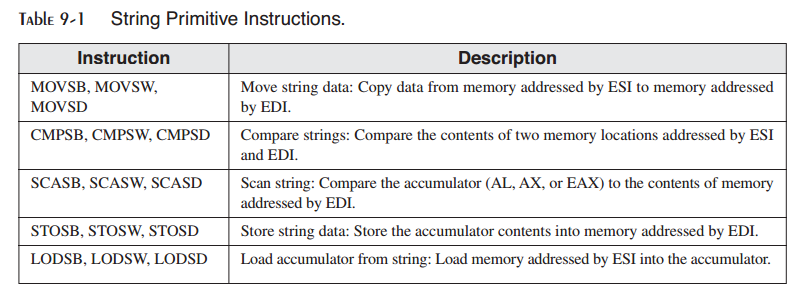

*使用重复前缀* 就其自身而言，字符串基本元素指令仅处理单个内存值或是一对值。如果你添加一个重复前缀，指令会重复，并使用ECX作为计数器。重复前缀允许你使用一条指令处理整个数组。可以使用下述的重复前缀：

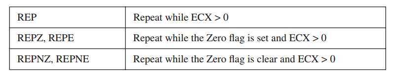

*示例：拷贝字符串* 在下面的示例中，MOVSB将10个字节由string1拷贝到string2。在执行MOVSB指令之前，重复前缀首先测试ECX>0。如果ECX=0，指令会被忽略，而控制传递给程序中的下一行。如果ECX>0，ECX被递减而指令重复：

.. code-block::

    cld ; clear direction flag
    mov esi,OFFSET string1 ; ESI points to source
    mov edi,OFFSET string2 ; EDI points to target
    mov ecx,10 ; set counter to 10
    rep movsb ; move 10 bytes

当MOVSB重复时，ESI与EDI会被自动递增。该行为是由CPU的方向标记控制的。

*方向标记* 字符串基本指令基于方向标记（参看表9-2）的状态递增或递减ESI与EDI。方向标记可以显式地使用CLD与STD指令进行修改：

.. code-block::

    CLD ; clear Direction flag (forward direction)
    STD ; set Direction flag (reverse direction)

在字符串基本指令之前忘记设置方向标记将会是一件头疼的事情，因为ESI与EDI寄存器并不会按预期进行递增或递减。

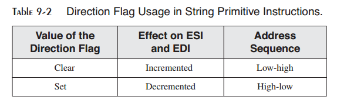

9.2.1 MOVSB，MOVSW以及MOVSD
>>>>>>>>>>>>>>>>>>>>>>>>>>>>>>>

MOVSB，MOVSW以及MOVSD指令将数据由ESI指向的内存地址处拷贝到EDI指向的内存地址处。这两个寄存器会自动进行递增或递减（基于方向标记的值）：

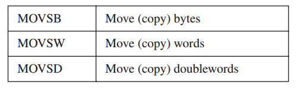

你可以对MOVSB，MOVSW以及MOVSD使用重复前缀。方向标记确定ESI与EDI是否被递增或递减。递增/递减的尺寸如下表所示：

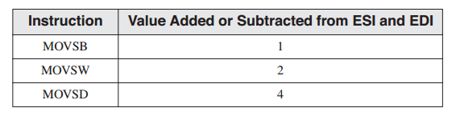

*示例：拷贝双字数组* 假定我们要由source拷贝20个双字到target。在数组被拷贝之后，ESI与EDI指向数组结束之后的一个位置（4字节）：

.. code-block::

    .data
    source DWORD 20 DUP(0FFFFFFFFh)
    target DWORD 20 DUP(?)
    .code
    cld ; direction = forward
    mov ecx,LENGTHOF source ; set REP counter
    mov esi,OFFSET source ; ESI points to source
    mov edi,OFFSET target ; EDI points to target
    rep movsd ; copy doublewords

9.2.2 CMPSB，CMPSW以及CMPSD
>>>>>>>>>>>>>>>>>>>>>>>>>>>>>>>>

CMPSB，CMPSW以及CMPSD指令将ESI所指向的内存操作数与EDI所指向的内存操作数进行比较：

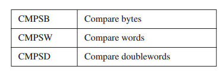

你可以对CMPSB，CMPSW以及CMPSD使用重复前缀。方向标记确定ESI与EDI是否为递增或递减。

*示例：比较双字* 如果你要使用CMPSD比较两个双字。在下面的示例中，source的值要小于target的值，所以JA指令不会跳转到标签L1处。

.. code-block::

    .data
    source DWORD 1234h
    target DWORD 5678h
    .code
    mov esi,OFFSET source
    mov edi,OFFSET target
    cmpsd ; compare doublewords
    ja L1 ; jump if source > target

要比较多个双字，将方向标记清空（前向），初始化ECX作为计数器，并对CMPSD使用重复前缀：

.. code-block::

    mov esi,OFFSET source
    mov edi,OFFSET target
    cld ; direction = forward
    mov ecx,LENGTHOF source ; repetition counter
    repe cmpsd ; repeat while equal

REPE前缀重复比较，自动递增ESI与EDI，直到ECX等于零或者发现一对双字不相同。

9.2.3 SCASB，SCASW以及SCASD
>>>>>>>>>>>>>>>>>>>>>>>>>>>>>>>>>>

SCASB，SCASW以及SCASD指令分别将AL/AX/EAX中的值与EDI所指向的字节，字，或双字进行比较。当在一个字符串或数组中查找一个值时，这些指令会非常有用。与REPE（或REPZ）前缀配合使用，当ECX>0时，字符串或数组会被扫描，直到找到AL/AX/EAX中的值与内存相匹配的值。

*扫描匹配字符* 在下面的示例中，我们搜索字符串alpha，查找字符F。如果查找成功，EDI指向匹配字符之后的一个位置处。如果没有找到字符，则执行JNZ：

.. code-block::

    .data
    alpha BYTE "ABCDEFGH",0
    .code
    mov edi,OFFSET alpha ; EDI points to the string
    mov al,'F' ; search for the letter F
    mov ecx,LENGTHOF alpha ; set the search count
    cld ; direction = forward
    repne scasb ; repeat while not equal
    jnz quit ; quit if letter not found
    dec edi ; found: back up EDI

在循环之后添加JNZ来测试循环停止的可能性，直到ECX=0或没有找到AL中的字符。

9.2.4 STOSB，STOSW以及STOSD
>>>>>>>>>>>>>>>>>>>>>>>>>>>>>>>>>

STOSB，STOSW以及STOSD指令分别将AL/AX/EAX中的内容存储到EDI指向的内存偏移处。基于方向标记的状态，EDI会递增或递减。当使用REP前缀时，这些指令对于使用单个值填充字符串或数组元素非常有用。例如，下面的代码将字符串string1中的每个字节初始化为0FFh：

.. code-block::

    .data
    Count = 100
    string1 BYTE Count DUP(?)
    .code
    mov al,0FFh ; value to be stored
    mov edi,OFFSET string1 ; EDI points to target
    mov ecx,Count ; character count
    cld ; direction = forward
    rep stosb ; fill with contents of AL

9.2.5 LODSB，LODSW以及LODSD
>>>>>>>>>>>>>>>>>>>>>>>>>>>>>>>>>>>

LODSB，LODSW以及LODSD指令分别由ESI指向的内存位置处载入字节或字到AL/AX/EAX中。基于方向标记状态，ESI会被递增或递减。REP前缀很少与LODS类指令配合使用，因为新载入到累加器中的值会覆盖前一次的内容。相反，LODS类指令用于载入一个值。在下面的示例中，LODSB可以代替下面两条指令（假定方向标记被清除）：

.. code-block::

    mov al,[esi] ; move byte into AL
    inc esi ; point to next byte

*数组相乘示例* 下面的程序将双字数组中的每个元素乘以一个常量值。LODSD与STOSD配合工作：

.. code-block::

    ; Multiply an Array (Mult.asm)
    ; This program multiplies each element of an array
    ; of 32-bit integers by a constant value.
    INCLUDE Irvine32.inc
    .data
    array DWORD 1,2,3,4,5,6,7,8,9,10 ; test data
    multiplier DWORD 10 ; test data
    .code
    main PROC
        cld ; direction = forward
        mov esi,OFFSET array ; source index
        mov edi,esi ; destination index
        mov ecx,LENGTHOF array ; loop counter
    L1: lodsd ; load [ESI] into EAX
        mul multiplier ; multiply by a value
        stosd ; store EAX into [EDI]
        loop L1
        exit
    main ENDP
    END main

9.3 所选择的字符串过程
-----------------------------

在本节中，我们将会演示Irvine32库中用于处理以空字节结束的字符串的过程。这些过程与标准C库中的函数非常类似：

.. code-block::

    ; Copy a source string to a target string.
    Str_copy PROTO,
        source:PTR BYTE,
        target:PTR BYTE
    ; Return the length of a string (excluding the null byte) in EAX.
    Str_length PROTO,
        pString:PTR BYTE
    ; Compare string1 to string2. Set the Zero and
    ; Carry flags in the same way as the CMP instruction.
    Str_compare PROTO,
        string1:PTR BYTE,
        string2:PTR BYTE
    ; Trim a given trailing character from a string.
    ; The second argument is the character to trim.
    Str_trim PROTO,
        pString:PTR BYTE,
        char:BYTE
    ; Convert a string to upper case.
    Str_ucase PROTO,
        pString:PTR BYTE

9.3.1 Str_compare过程
>>>>>>>>>>>>>>>>>>>>>>>>

Str_compare过程比较两个字符串。其调用格式为：

.. code-block::

    INVOKE Str_compare, ADDR string1, ADDR string2

它以前向顺序，由第一个字节开始，比较字符串。比较是大小写第三的，因为大写与小写字符的ASCII码不同。过程并不会返回值，但可以通过进位与零标记进行解释，比较结果如表9-3所示，其中使用string1与string2作为参数。

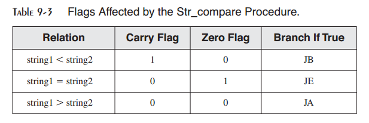

参看6.2.8节中CMP如何设置进位与零标记的解释。下面是Str_compare过程的完整代码。查看Compare.asm的演示程序：

.. code-block::

    ;-----------------------------------------------------------
    Str_compare PROC USES eax edx esi edi,
    string1:PTR BYTE,
    string2:PTR BYTE
    ;
    ; Compares two strings.
    ; Returns nothing, but the Zero and Carry flags are affected
    ; exactly as they would be by the CMP instruction.
    ;-----------------------------------------------------------
        mov esi,string1
        mov edi,string2
    L1: mov al,[esi]
        mov dl,[edi]
        cmp al,0 ; end of string1?
        jne L2 ; no
        cmp dl,0 ; yes: end of string2?
        jne L2 ; no
        jmp L3 ; yes, exit with ZF = 1
    L2: inc esi ; point to next
        inc edi
        cmp al,dl ; characters equal?
        je L1 ; yes: continue loop
        ; no: exit with flags set
    L3: ret
    Str_compare ENDP

当实现Str_compare时我们本可以使用CMPSB指令，但是它要求知道较长字符串的长度，需要两次调用Str_length过程。在此特例中，可以很容易在同一个循环中检测两个字符串中的空字节。当处理已知长度的大字符串或数组时，CMPSB是最有效的。

9.3.2 Str_length过程
>>>>>>>>>>>>>>>>>>>>>>>>>

Str_length过程在EAX寄存器中返回字符串的长度。当你调用该过程时，要传递字符串的偏移。例如：

.. code-block::

    INVOKE Str_length, ADDR myString

下面是过程实现：

.. code-block::

    Str_length PROC USES edi,
        pString:PTR BYTE ; pointer to string
        mov edi,pString
        mov eax,0 ; character count
    L1: cmp BYTE PTR[edi],0 ; end of string?
        je L2 ; yes: quit
        inc edi ; no: point to next
        inc eax ; add 1 to count
        jmp L1
    L2: ret
    Str_length ENDP

查看Length.asm程序了解该过程的演示。

9.3.3 Str_copy过程
>>>>>>>>>>>>>>>>>>>>>>

Str_copy过程将以空字节结束的字符串由源位置拷贝到目标位置。在调用该过程之前，你必须确保目的操作数足够容纳拷贝的字符串。调用Str_copy的语法为：

.. code-block::

    INVOKE Str_copy, ADDR source, ADDR target

该过程并没有返回值。下面为其实现：

.. code-block::

    ;--------------------------------------------------------
    Str_copy PROC USES eax ecx esi edi,
    source:PTR BYTE, ; source string
    target:PTR BYTE ; target string
    ;
    ; Copies a string from source to target.
    ; Requires: the target string must contain enough
    ; space to hold a copy of the source string.
    ;--------------------------------------------------------
        INVOKE Str_length,source ; EAX = length source
        mov ecx,eax ; REP count
        inc ecx ; add 1 for null byte
        mov esi,source
        mov edi,target
        cld ; direction = forward
        rep movsb ; copy the string
        ret
    Str_copy ENDP

该过程的演示可以参看CopyStr.asm程序。

9.3.4 Str_trim过程
>>>>>>>>>>>>>>>>>>>>>>>>

Str_trim过程由空字节结束的字符串移除所有选定的结束字符。调用的语法格式为：

.. code-block::

    INVOKE Str_trim, ADDR string, char_to_trim

该过程的逻辑比较有趣，因为你必须检测多种可能的情况（假定以#作为结尾字符）：

1. 字符串为空。
2. 字符串包含其他字符，其后有一个或多个结束字符，例如“Hello##”。
3. 字符串仅包含一个结束字符，例如“#”。
4. 字符串不包含结束字符，例如“Hello”或“H”。
5. 字符串中包含一个或多个结束字符，后跟一个或多个非结束字符，例如“#H”或“###字符串不包含结束字符，例如“Hello”或“H”。

你可以使用Str_trim来移除字符串结尾处的所有空格（或是其他重复的字符）。截断字符串最简单的方法是在你希望保留的字符之后插入一个空字节。空字节之后的所有字符会被忽略。

表9-4例出了一些有用的测试用例。对于每个用例，假定#是要由字符串移除的字符，并显示了所期望的输出。

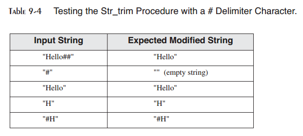

让我们看一下测试Str_trim过程的代码。INVOKE语句向Str_trim传递字符串的地址：

.. code-block::

    .data
    string_1 BYTE "Hello##",0
    .code
    INVOKE Str_trim,ADDR string_1,'#'
    INVOKE ShowString,ADDR string_1

ShowString过程，这里并没有显示，显示移除后的字符串，并在字符串的两边加上方括号。如下面的输出示例：

.. code-block::

    [Hello]

要了解更多的示例，参看第9章示例中的Trim.asm。下面所显示的Str_trim的实现，在字符串中我们希望保留的最后一个字符之后插入一个空字节。空字节之后的所有字符会被字符串处理函数所忽略。

.. code-block::

    ;------------------------------------------------------------
    ; Str_trim
    ; Remove all occurrences of a given delimiter
    ; character from the end of a string.
    ; Returns: nothing
    ;------------------------------------------------------------
    Str_trim PROC USES eax ecx edi,
        pString:PTR BYTE, ; points to string
        char: BYTE ; character to remove
        mov edi,pString ; prepare to call Str_length
        INVOKE Str_length,edi ; returns the length in EAX
        cmp eax,0 ; is the length equal to zero?
        je L3 ; yes: exit now
        mov ecx,eax ; no: ECX = string length
        dec eax
        add edi,eax ; point to last character
    L1: mov al,[edi] ; get a character
        cmp al,char ; is it the delimiter?
        jne L2 ; no: insert null byte
        dec edi ; yes: keep backing up
        loop L1 ; until beginning reached
    L2: mov BYTE PTR [edi+1],0 ; insert a null byte
    L3: ret
    Stmr_trim ENDP

详细描述
::::::::::::::::

让我们仔细检视Str_trim。算法由字符串的结束处开始反向扫描，查找第一个非分隔字符。当查找成功，在该字符之后的位置插入一个空字节：

.. code-block::

    ecx = length(str)
    if length(str) > 0 then
        edi = length – 1
        do while ecx > 0
            if str[edi] ≠ delimiter then
                str[edi+1] = null
                break
            else
                edi = edi – 1
            end if
            ecx = ecx – 1
        end do

接下让我们逐行查看代码实现。首先，pString包含要处理的字符串的地址。我们需要知道字符串的长度，并且Str_length过程在EDI寄存器中接收其输入：

.. code-block::

    mov edi,pString ; prepare to call Str_length
    INVOKE Str_length,edi ; returns the length in EAX

Str_length在EAX寄存器中返回字符串的长度，所以下面的代码行与零进行比较，如果字符串为空则略过其余的代码：

.. code-block::

    cmp eax,0 ; is the length equal to zero?
    je L3 ; yes: exit now

由此开始，我们可以认为字符串不为空。ECX作为循环计数器，所以它被赋值为字符串长度的拷贝。然后，因为我们希望EDI指向字符串的最后一个字符，EAX（包含字符串长度）被减1，并加到EDI：

.. code-block::

    mov ecx,eax ; no: ECX = string length
    dec eax
    add edi,eax ; point to last character

EDI现在指向字符串的最后一个字符，我们将字符拷贝到AL寄存器，并将其与分隔进行比较：

.. code-block::

    L1: mov al,[edi] ; get a character
        cmp al,char ; is it the delimiter?

如果字符并不是分隔符，我们退出循环，知道在标签L2处将插入空字节：

.. code-block::

    jne L2 ; no: insert null byte

否则，如果找到分隔字符，循环继续反向查找字符串。这是通过将EDI后移一个位置并重复循环来实现的：

.. code-block::

    dec edi ; yes: keep backing up
    loop L1 ; until beginning reached

如果整个字符串仅有分隔字符填充，循环将会计数到零，而执行将会在循环之后的下一行继续。当然，下面标签L2处的代码在字符串中插入空字节：

.. code-block::

    L2: mov BYTE PTR [edi+1],0 ; insert a null byte

如果由于循环计数到零而到达此位置，EDI指向字符串开始前的一个位置。这也正是表达式[edi+1]指向第一个字符串位置的原因。

执行以两种方式到达标签L2：通过查找字符串中非处理字符，或者循环计数到零。标签L2之后是位于标签L3处的RET指令来结束过程：

.. code-block::

    L3: ret
    Str_trim ENDP

9.3.5 Str_ucase过程
>>>>>>>>>>>>>>>>>>>>>>>>>

Str_ucase过程将字符串转换为全大写字符。它没有返回值。当你调用时，为其传递字符串偏移量：

.. code-block::

    INVOKE Str_ucase, ADDR myString

下面是过程实现：

.. code-block::

    ;-------------------------------------------------------
    ; Str_ucase
    ; Converts a null-terminated string to uppercase.
    ; Returns: nothing
    ;-------------------------------------------------------
    Str_ucase PROC USES eax esi,
        pString:PTR BYTE
        mov esi,pString
    L1:
        mov al,[esi] ; get char
        cmp al,0 ; end of string?
        je L3 ; yes: quit
        cmp al,'a' ; below "a"?
        jb L2
        cmp al,'z' ; above "z"?
        ja L2
        and BYTE PTR [esi],11011111b ; convert the char
    L2: inc esi ; next char
        jmp L1
    L3: ret
    Str_ucase ENDP

该过程的演示可以查看Ucase.asm程序。

9.3.6 字符串库演示程序
>>>>>>>>>>>>>>>>>>>>>>>>>>

下面的32位程序（StringDemo.asm）展示了Irvine32库中的Str_trim，Str_ucase，Str_compare以及Str_length过程的调用示例：

.. code-block::

    ; String Library Demo (StringDemo.asm)
    ; This program demonstrates the string-handling procedures in
    ; the book's link library.
    INCLUDE Irvine32.inc
    .data
    string_1 BYTE "abcde////",0
    string_2 BYTE "ABCDE",0
    msg0 BYTE "string_1 in upper case: ",0
    msg1 BYTE "string_1 and string_2 are equal",0
    msg2 BYTE "string_1 is less than string_2",0
    msg3 BYTE "string_2 is less than string_1",0
    msg4 BYTE "Length of string_2 is ",0
    msg5 BYTE "string_1 after trimming: ",0
    .code
    main PROC
        call trim_string
        call upper_case
        call compare_strings
        call print_length
        exit
    main ENDP
    trim_string PROC
    ; Remove trailing characters from string_1.
        INVOKE Str_trim, ADDR string_1, '/'
        mov edx,OFFSET msg5
        call WriteString
        mov edx,OFFSET string_1
        call WriteString
        call Crlf
        ret
    trim_string ENDP
    upper_case PROC
    ; Convert string_1 to upper case.
        mov edx,OFFSET msg0
        call WriteString
        INVOKE Str_ucase, ADDR string_1
        mov edx,OFFSET string_1
        call WriteString
        call Crlf
        ret
    upper_case ENDP
    compare_strings PROC
    ; Compare string_1 to string_2.
        INVOKE Str_compare, ADDR string_1, ADDR string_2
        .IF ZERO?
        mov edx,OFFSET msg1
        .ELSEIF CARRY?
        mov edx,OFFSET msg2 ; string 1 is less than...
        .ELSE
        mov edx,OFFSET msg3 ; string 2 is less than...
        .ENDIF
        call WriteString
        call Crlf
        ret
    compare_strings ENDP
    print_length PROC
    ; Display the length of string_2.
        mov edx,OFFSET msg4
        call WriteString
        INVOKE Str_length, ADDR string_2
        call WriteDec
        call Crlf
        ret
    print_length ENDP
    END main

通过调用Str_trim由string_1中移除指定字符。通过调用Str_ucase过程将字符串转换大写。

*程序输出* 下面是字符串库演示程序的输出：

.. code-block::

    string_1 after trimming: abcde
    string_1 in upper case: ABCDE
    string1 and string2 are equal
    Length of string_2 is 5

9.3.7 Irvine64库的字符串过程
>>>>>>>>>>>>>>>>>>>>>>>>>>>>>>>>

在本节中，我们将会展示如何将Irvine32库中较为重要的一些字符串处理过程转换为64位模式。变化非常简单－栈参数被去除，所有的32位寄存器被替换为64位寄存器。表9-5列出了字符串过程，及其输与输出。

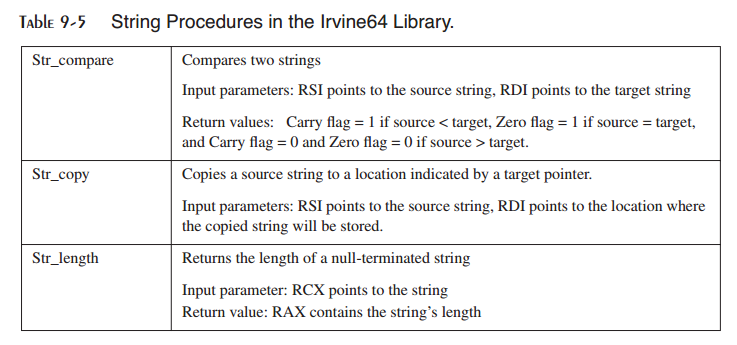

在Str_compare过程中，RSI与RDI是输入参数的逻辑选择，因为它们被字符串比较循环所使用。使用这些寄存器参数允许我们避免在过程开始时将输入参数拷贝到这些寄存器：

.. code-block::

    ; -------------------------------------------------
    ; Str_compare
    ; Compares two strings
    ; Receives: RSI points to the source string
    ; RDI points to the target string
    ; Returns: Sets ZF if the strings are equal
    ; Sets CF if source < target
    ; -------------------------------------------------
    Str_compare PROC USES rax rdx rsi rdi
    L1: mov al,[rsi]
        mov dl,[rdi]
        cmp al,0 ; end of string1?
        jne L2 ; no
        cmp dl,0 ; yes: end of string2?
        jne L2 ; no
        jmp L3 ; yes, exit with ZF = 1
    L2: inc rsi ; point to next
        inc rdi
        cmp al,dl ; chars equal?
        je L1 ; yes: continue loop
    ; no: exit with flags set
    L3: ret
    Str_compare ENDP

注意，PROC指令包含USES参数来列出在过程开始时必须被压入栈以及在过程返回之前由栈弹出的所有寄存器。

Str_copy过程在RSI与RDI中接收其字符串指针：

.. code-block::

    ;------------------------------------------------------
    ; Str_copy
    ; Copies a string
    ; Receives: RSI points to the source string
    ; RDI points to the target string
    ; Returns: nothing
    ;------------------------------------------------------
    Str_copy PROC USES rax rcx rsi rdi
        mov rcx,rsi ; get length of source string
        call Str_length ; returns length in RAX
        mov rcx,rax ; loop counter
        inc rcx ; add 1 for null byte
        cld ; direction = up
        rep movsb ; copy the string
        ret
    Str_copy ENDP

Str_length过程在RCX中接收一个字符串指针，并且在字符串中遍历，直到遇到空字节。它在RAX中返回字符串长度：

.. code-block::

    ;-------------------------------------------------------
    ; Str_length
    ; Gets the length of a string
    ; Receives: RCX points to the string
    ; Returns: length of string in RAX
    ;-------------------------------------------------------
        Str_length PROC USES rdi
        mov rdi,rcx ; get pointer
        mov eax,0 ; character count
    L1:
        cmp BYTE PTR [rdi],0 ; end of string?
        je L2 ; yes: quit
        inc rdi ; no: point to next
        inc rax ; add 1 to count
        jmp L1
    L2: ret ; return count in RAX
    Str_length ENDP

*一个简单的测试程序* 下述的测试程序调用64位的Str_length，Str_copy以及Str_compare过程。尽管我们没有编写显示字符串的语句，在Visual Studio调试器中运行该程序是一个好意思，从而你可以检视内存窗口，寄存器以及标记。

.. code-block::

    ; Testing the Irvine64 string procedures (StringLib64Test.asm)
    Str_compare proto
    Str_length proto
    Str_copy proto
    ExitProcess proto
    .data
    source BYTE "AABCDEFGAABCDFG",0 ; size = 15
    target BYTE 20 dup(0)
    .code
    main PROC
        mov rcx,offset source
        call Str_length ; returns length in RAX
        mov rsi,offset source
        mov rdi,offset target
        call str_copy
    ; We just copied the string, so they should be equal.
        call str_compare ; ZF = 1, strings are equal
    ; Change the first character of the target string, and
    ; compare them again.
        mov target,'B'
        call str_compare ; CF = 1, source < target
        mov ecx,0
    call ExitProcess
    main ENDP

9.4 二维数组
------------------

9.4.1 行序与列序
>>>>>>>>>>>>>>>>>>>>>>

由汇编语言程序员的角度来看，二维数组是一级数据的高级抽象。高级语言会选择行主序或列主序中的一种方法在内存中排列行或列，如图9-1所示。当使用行主序时（最为常见的情况），第一行位于内存块的起始处。内存中第一行的最后一个元素后为第二行的第一个元素。当使用列主序时，第一列中的元素出现在内存块的起始位置处。内存中第一列的最后一个元素后为第二列的第一个元素。

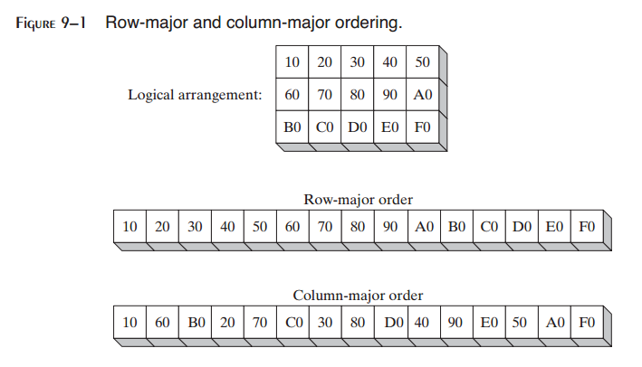

如果你使用汇编语言实现二维数组，你可以选择任意一种排序方法。在本章中，我们将会使用行主序。如果你为高级语言编写汇编语言子例程，你需要遵循其文档中指明的排列方法。

x86指令集包含两种操作数类型，基-索引与基-索引-偏移，两者都适用于数组应用。我们将会展示一些如何高效使用的示例。

9.4.2 基-索引操作数
>>>>>>>>>>>>>>>>>>>>>>>>

基-索引操作数将两个寄存器（称为基与索引）的值相加，得到偏移地址：

.. code-block::

    [base + index]

此处的方括号是必需的。在32位模式下，任意的32位通用寄存器可以用作基与索引寄存器。（通常，我们避免使用EBP，除非是在编址栈时。）下面是32位模式下基与索引参数的多种组合的示例：

.. code-block::

    .data
    array WORD 1000h,2000h,3000h
    .code
    mov ebx,OFFSET array
    mov esi,2
    mov ax,[ebx+esi] ; AX = 2000h
    mov edi,OFFSET array
    mov ecx,4
    mov ax,[edi+ecx] ; AX = 3000h
    mov ebp,OFFSET array
    mov esi,0
    mov ax,[ebp+esi] ; AX = 1000h

*二维数组* 当访问行主序的二维数组时，行偏移保存在基寄存器中，而列偏移保存在索引寄存器中。例如，下表包含三行五列：

.. code-block::

    tableB BYTE 10h, 20h, 30h, 40h, 50h
    Rowsize = ($ - tableB)
    BYTE 60h, 70h, 80h, 90h, 0A0h
    BYTE 0B0h, 0C0h, 0D0h, 0E0h, 0F0h

表使用行主序，而常量RowSize由汇编器计算为每一个表行中的字节数目。假定我们希望使用行与列坐标访问表中的特定项。假定坐标由零开始，行1列2处的项为80h。我们将EBX设置为表偏移，相加（RowSize * row_index）来计算行偏移，将ESI设置为列索引：

.. code-block::

    row_index = 1
    column_index = 2
    mov ebx,OFFSET tableB ; table offset
    add ebx,RowSize * row_index ; row offset
    mov esi,column_index
    mov al,[ebx + esi] ; AL = 80h

假定数组位于偏移0150h处。则EBX+ESI表示的有效地址为0157h。图9-2显示了相加EBX与ESI如何得到tableB[1,2]处的字节偏移。如果有效地址指向程序数据区域之外的地方，则发生运行时错误。

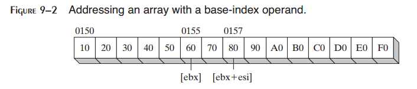

计算行元素之和
::::::::::::::::::::

基索引编址简化了许多与二维数组相关的任务。例如，我们也许希望计算一个整数矩阵中某行元素的和。下面的32位calc_row_sum过程（参看RowSum.asm）计算一个8位整数的矩阵中选定行的元素之和：

.. code-block::

    ;-----------------------------------------------------------
    ; calc_row_sum
    ; Calculates the sum of a row in a byte matrix.
    ; Receives: EBX = table offset, EAX = row index,
    ; ECX = row size, in bytes.
    ; Returns: EAX holds the sum.
    ;-----------------------------------------------------------
        calc_row_sum PROC USES ebx ecx edx esi
        mul ecx ; row index * row size
        add ebx,eax ; row offset
        mov eax,0 ; accumulator
        mov esi,0 ; column index
    L1: movzx edx,BYTE PTR[ebx + esi] ; get a byte
        add eax,edx ; add to accumulator
        inc esi ; next byte in row
        loop L1
        ret
    calc_row_sum ENDP

需要BYTE PTR来标明MOVZX指令中的操作数尺寸。

缩放因子
::::::::::::::

如果你正在为WORD数组编写代码，要将索引参数乘以缩放因子2。下面的示例定位行1列2处的值：

.. code-block::

    tableW WORD 10h, 20h, 30h, 40h, 50h
    RowsizeW = ($ - tableW)
    WORD 60h, 70h, 80h, 90h, 0A0h
    WORD 0B0h, 0C0h, 0D0h, 0E0h, 0F0h
    .code
    row_index = 1
    column_index = 2
    mov ebx,OFFSET tableW ; table offset
    add ebx,RowSizeW * row_index ; row offset
    mov esi,column_index
    mov ax,[ebx + esi*TYPE tableW] ; AX = 0080h

该示例中所用的缩放因子（TYPE tableW）等于2。类似地，如果数组包含双字，你必须使用缩放因子4：

.. code-block::

    tableD DWORD 10h, 20h, ...etc.
    .code
    mov eax,[ebx + esi*TYPE tableD]

9.4.3 基-索引-偏移操作数
>>>>>>>>>>>>>>>>>>>>>>>>>>>>>>>>

基-索引-偏移操作数组合偏移，基寄存器，索引寄存器以及可选的缩放因子来得到有效地址。其格式如下：

.. code-block::

    [base + index + displacement]
    displacement[base + index]

偏移可以是变量或常量表达式名。在32位上，任意通常32位寄存器可以用作基与索引。基-索引-偏移操作也适用于处理二维数组。偏移可以是数组名，基操作数可以保存行偏移，而索引操作数可以保存列偏移。

*双字数组示例* 下面的二维数组包含三行列列双字：

.. code-block::

    tableD DWORD 10h, 20h, 30h, 40h, 50h
    Rowsize = ($ - tableD)
    DWORD 60h, 70h, 80h, 90h, 0A0h
    DWORD 0B0h, 0C0h, 0D0h, 0E0h, 0F0h

RowSize等于20（14h）。假定坐标以零开始，行1列2位置处的项包含80h。为访问该项，我们将EBX设置为行索引，而将ESI设置为列索引：

.. code-block::

    mov ebx,Rowsize ; row index
    mov esi,2 ; column index
    mov eax,tableD[ebx + esi*TYPE tableD]

假定tableD由偏移0150h处开始。图9-3显示了EBX与ESI相对于数组的位置。偏移为十六进制。

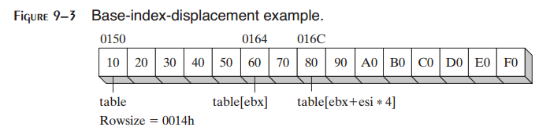

9.4.4 64位模式下的基-索引操作数
>>>>>>>>>>>>>>>>>>>>>>>>>>>>>>>>>>

在64位模式下，使用寄存器索引的操作数必须使用64位寄存器。你可以使用基-索引操作数和基-索引-偏移操作也适用于处理二维数组。偏移可以是数组名，基操作数可以保存行偏移，而索引操作数可以保存列偏移。

下面是一个使用名为get_tableVal的过程来定位二维64位整数表中的值的简短程序。如果你将其与前面的32位代码相比，可以注意到ESI被修改为RSI，而EAX与EBX现在为RAX与RBX。

.. code-block::

    ; Two-dimensional arrays in 64-bit mode (TwoDimArrays.asm)
    Crlf proto
    WriteInt64 proto
    ExitProcess proto
    .data
    table QWORD 1,2,3,4,5
    RowSize = ($ - table)
        QWORD 6,7,8,9,10
        QWORD 11,12,13,14,15
    .code
    main PROC
    ; base-index-displacement operands
        mov rax,1 ; row index (zero-based)
        mov rsi,4 ; column index (zero based)
        call get_tableVal ; returns the value in RAX
        call WriteInt64 ; and display it
        call Crlf
        mov ecx,0 ; end program
        call ExitProcess
    main ENDP

    ;---------------------------------------------------
    ; get_tableVal
    ; Returns the array value at a given row and column
    ; in a two-dimensional array of quadwords.
    ; Receives: RAX = row number, RSI = column number
    ; Returns: value in RAX
    ;---------------------------------------------------
        get_tableVal PROC USES rbx
        mov rbx,RowSize
        mul rbx ; product(low) = RAX
        mov rax,table[rax + rsi*TYPE table]
        ret
    get_tableVal ENDP
    end

9.5 搜索与排序整数数组
--------------------------

计算机科学家已经花费了大量的时间和精力以发现搜索与排序海量数据的更好的方法。已经证明，为特定选择最好的算法要比购买更快速的计算机更加有用。大多数学生使用高级语言，例如C++和Java研究搜索与排序。通过使你看到底层实现细节，汇编语言为算法的研究提供了一种完全不同的角度。

搜索与排序为你提供了尝试本章所介绍的编址模型的机会。特别是，基-索引编址会变得非常有用，因为你可以将一个寄存器（例如EBX）指向数组的基，而使用另一个寄存器（例如ESI）指向其他任意数组位置。

9.5.1 冒泡排序
>>>>>>>>>>>>>>>>>>>>>>>

冒泡排序由位置0和位置1开始比较一对数组值。如果比较的值为逆序，则交换两个值。图9-4显示了一次遍历整数数组的过程。

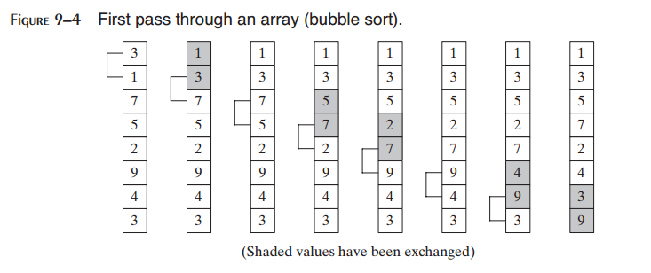

在一次遍历之后，数组仍然未被排序，但是最大值位于最高索引处。外层循环开始另一次数组遍历。在n-1次遍历之后，数组可以保证变为排序状态。

冒泡排序对于小数组可以工作得很发，但是对于大数组则变得极端低效。当计算机科学度量算法的相对效率时，他们经常使用被称为“大O”的符号来描述平均运行时间相对于要处理的数据的增加量如何增加。冒泡排序已知为O(n^2)的算法，意味着其运行时间相对于数组元素的数量成平方增长。例如，假定它排序1000个元素需要0.1秒。当元素数量以10倍增长时，排序数组所需要的时间以10^2（100）倍数增长。假定排序1000个数组元素需要0.1秒，下表列出了各种数组尺寸的排序时间：

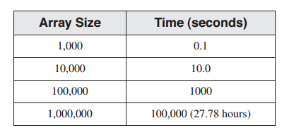

冒泡排序对于1百万整数的数组并不高效，因为它需要太长的时间才能排序完成。但是对于处理几百整数的数组则足够高效。

*伪代码* 使用比汇编语言更为简单的伪代码来创建冒泡排序的一个简单版本是非常有处的。我们将使用N表示数组的尺寸，cx1表示外层循环计数器，而cx2表示内层循环计数器：

.. code-block::

    cx1 = N - 1
    while( cx1 > 0 )
    {
        esi = addr(array)
        cx2 = cx1
        while( cx2 > 0 )
        {
            if( array[esi] > array[esi+4] )
                exchange( array[esi], array[esi+4] )
            add esi,4
            dec cx2
        }
        dec cx1
    }

机械上的关注点，例如保存与恢复外层循环计数器，已经被故意忽略掉了。注意，内层循环计数（cx2）是基于外层循环计数（cx1）的当前值的，后者会随着每次数组遍历而减小。

*汇编语言* 由伪代码，我们可以很容易使用汇编语言生成一个匹配的实现，将其放入带有参数与局部变量的过程中：

.. code-block::

    ;-------------------------------------------------------
    ; BubbleSort
    ; Sort an array of 32-bit signed integers in ascending
    ; order, using the bubble sort algorithm.
    ; Receives: pointer to array, array size
    ; Returns: nothing
    ;-------------------------------------------------------
    BubbleSort PROC USES eax ecx esi,
        pArray:PTR DWORD, ; pointer to array
        Count:DWORD ; array size
        mov ecx,Count
        dec ecx ; decrement count by 1
    L1: push ecx ; save outer loop count
        mov esi,pArray ; point to first value
    L2: mov eax,[esi] ; get array value
        cmp [esi+4],eax ; compare a pair of values
        jg L3 ; if [ESI] <= [ESI+4], no exchange
        xchg eax,[esi+4] ; exchange the pair
        mov [esi],eax
    L3: add esi,4 ; move both pointers forward
        loop L2 ; inner loop
        pop ecx ; retrieve outer loop count
        loop L1 ; else repeat outer loop
    L4: ret
    BubbleSort ENDP

9.5.2 二分查找
>>>>>>>>>>>>>>>>>>>>>

数组搜索是日常编程中最常见的操作之一。对于小数组（1000个元素或更少），很容易进行顺序搜索，即由数组的第一个元素开始，顺序检查每个数组元素，直到找到匹配的数组元素。对于任意一个n个元素的数组，顺序搜索平均需要n/2次比较。如果搜索小数组，则执行时间比较小。另一方面，搜索1百万元素的数组则需要大量的处理时间。

当搜索大数组时，二分查找算法特别高效。它有一个重要的先决条件：数组元素必须以升序或降序排列。下面的算法假定元素以升序排序：

在开始搜索之前，提示用户输入一个整数，我们将其为searchVal。

1. 要搜索的数组范围以名为first和last的下标标记。如果first>last，退出搜索，表明没有找到匹配元素。
2. 计算下标first与last之间的数组的中间点。
3. 将searchVal与数组中间点的整数进行比较：
    * 如果值相等，由过程中返回，将中间点存储在EAX中。返回值表明在数组中成功找到匹配。
    * 否则，如果searchVal大于中间点值，将first设置为比中间点大1的位置。
    * 或者，如果searchVal小于中间点值，将last设置为中间点下一个位置。
4. 返回步骤1。

二分查找特别高效的原因在于其使用分治策略。在每次循环迭代中将值的范围分为一半。通常，它被描述为O(log n)算法，意味着数组元素的个数以n倍增长，平均搜索时间仅以log_2 n的倍数增长。为了有助于你理解二分查找如何高效，表9-6列出了在一些示例尺寸的数组上同时执行顺序查找与二分查找所需要执行的最大比较次数。这些次数表最坏情况－在实践中，匹配值可以在几次比较之后即可找到。

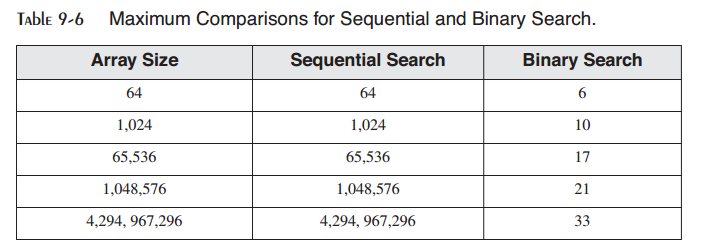

下面是设计来处理有符号整数数组的二分查找的C++实现：

.. code-block::

    int BinSearch( int values[], const int searchVal, int count )
    {
        int first = 0;
        int last = count - 1;
        while( first <= last )
        {
            int mid = (last + first) / 2;
            if( values[mid] < searchVal )
                first = mid + 1;
            else if( values[mid] > searchVal )
                last = mid - 1;
            else
                return mid; // success
        }
        return -1; // not found
    }

下述代码是示例C++代码的汇编语言实现：

.. code-block::

    ;--------------------------------------------------------------
    ; BinarySearch
    ; Searches an array of signed integers for a single value.
    ; Receives: Pointer to array, array size, search value.
    ; Returns: If a match is found, EAX = the array position of the
    ; matching element; otherwise, EAX = -1.
    ;--------------------------------------------------------------
    BinarySearch PROC USES ebx edx esi edi,
        pArray:PTR DWORD, ; pointer to array
        Count:DWORD, ; array size
        searchVal:DWORD ; search value
        LOCAL first:DWORD, ; first position
        last:DWORD, ; last position
        mid:DWORD ; midpoint
        mov first,0 ; first = 0
        mov eax,Count ; last = (count - 1)
        dec eax
        mov last,eax
        mov edi,searchVal ; EDI = searchVal
        mov ebx,pArray ; EBX points to the array
    L1: ; while first <= last
        mov eax,first
        cmp eax,last
        jg L5 ; exit search
    ; mid = (last + first) / 2
        mov eax,last
        add eax,first
        shr eax,1
        mov mid,eax
    ; EDX = values[mid]
        mov esi,mid
        shl esi,2 ; scale mid value by 4
        mov edx,[ebx+esi] ; EDX = values[mid]
    ; if ( EDX < searchval(EDI) )
        cmp edx,edi
        jge L2
    ; first = mid + 1
        mov eax,mid
        inc eax
        mov first,eax
        jmp L4
    ; else if( EDX > searchVal(EDI) )
    L2: cmp edx,edi ; optional
        jle L3
    ; last = mid - 1
        mov eax,mid
        dec eax
        mov last,eax
        jmp L4
    ; else return mid
    L3: mov eax,mid ; value found
        jmp L9 ; return (mid)
    L4: jmp L1 ; continue the loop
    L5: mov eax,-1 ; search failed
    L9: ret
    BinarySearch ENDP

测试程序
::::::::::::::

为了演示本章中的冒泡排序与二分查找，让我们编写一个简短的测试程序，顺序执行下列步骤：

* 以随机整数填充数组
* 显示数组
* 使用冒泡排序对数组排序
* 再次显示数组
* 提示用户输入整数
* 为用户输入的整数（数组中值）执行二分查找
* 显示二分查找的结果

单独的过程被放在单独的文件中以使得更易于定位并编辑源代码。表9-7列出了每个模块及其内容。大多数专业编写的程序都会被分割为单独的代码模块。

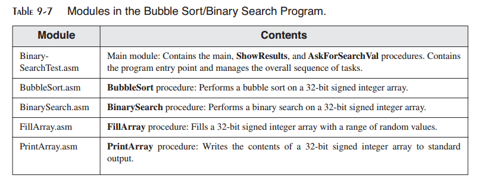

除BinarySearchTest.asm之外的所有模块中的过程以这样的方式编写，从而使得更易于在其他程序中使用，而无需任何修改。之所以如此是因为我们可以在未来重用已有的代码时节省时间。在Irvine32库中使用了同样的方法。下面是一个包含文件（BinarySearch.inc）包含由主模块中调用的过程的原型：

.. code-block::

    ; BinarySearch.inc - prototypes for procedures used in
    ; the BubbleSort / BinarySearch program.
    ; Searches for an integer in an array of 32-bit signed
    ; integers.
    BinarySearch PROTO,
        pArray:PTR DWORD, ; pointer to array
        Count:DWORD, ; array size
        searchVal:DWORD ; search value
    ; Fills an array with 32-bit signed random integers
    FillArray PROTO,
        pArray:PTR DWORD, ; pointer to array
        Count:DWORD, ; number of elements
        LowerRange:SDWORD, ; lower limit of random values
        UpperRange:SDWORD ; upper limit of random values
    ; Writes a 32-bit signed integer array to standard output
    PrintArray PROTO,
        pArray:PTR DWORD,
        Count:DWORD
    ; Sorts the array in ascending order
    BubbleSort PROTO,
        pArray:PTR DWORD,
        Count:DWORD

下述为BinarySearchTest.asm的主模块：

.. code-block::

    ; Bubble Sort and Binary Search BinarySearchTest.asm)
    ; Bubble sort an array of signed integers, and perform
    ; a binary search.
    ; Main module, calls BinarySearch, BubbleSort, FillArray
    ; and PrintArray
    INCLUDE Irvine32.inc
    INCLUDE BinarySearch.inc ; procedure prototypes
    LOWVAL = -5000 ; minimum value
    HIGHVAL = +5000 ; maximum value
    ARRAY_SIZE = 50 ; size of the array
    .data
    array DWORD ARRAY_SIZE DUP(?)
    .code
    main PROC
        call Randomize
        ; Fill an array with random signed integers
        INVOKE FillArray, ADDR array, ARRAY_SIZE, LOWVAL, HIGHVAL
    ; Display the array
        INVOKE PrintArray, ADDR array, ARRAY_SIZE
        call WaitMsg
    ; Perform a bubble sort and redisplay the array
        INVOKE BubbleSort, ADDR array, ARRAY_SIZE
        INVOKE PrintArray, ADDR array, ARRAY_SIZE
    ; Demonstrate a binary search
        call AskForSearchVal ; returned in EAX
        INVOKE BinarySearch,
        ADDR array, ARRAY_SIZE, eax
        call ShowResults
        exit
    main ENDP

    ;--------------------------------------------------------
    AskForSearchVal PROC
    ;
    ; Prompt the user for a signed integer.
    ; Receives: nothing
    ; Returns: EAX = value input by user
    ;--------------------------------------------------------
    .data
    prompt BYTE "Enter a signed decimal integer "
        BYTE "in the range of -5000 to +5000 "
        BYTE "to find in the array: ",0
    .code
        call Crlf
        mov edx,OFFSET prompt
        call WriteString
        call ReadInt
        ret
    AskForSearchVal ENDP

    ;--------------------------------------------------------
    ShowResults PROC
    ;
    ; Display the resulting value from the binary search.
    ; Receives: EAX = position number to be displayed
    ; Returns: nothing
    ;--------------------------------------------------------
    .data
    msg1 BYTE "The value was not found.",0
    msg2 BYTE "The value was found at position ",0
    .code
    .IF eax == -1
        mov edx,OFFSET msg1
        call WriteString
    .ELSE
        mov edx,OFFSET msg2
        call WriteString
        call WriteDec
    .ENDIF
        call Crlf
        call Crlf
        ret
    ShowResults ENDP
    END main

*PrintArray* 下述代码是包含PrintArray过程的模块：

.. code-block::

    ; PrintArray Procedure (PrintArray.asm)
    INCLUDE Irvine32.inc
    .code
    ;-----------------------------------------------------------
    PrintArray PROC USES eax ecx edx esi,
    pArray:PTR DWORD, ; pointer to array
    Count:DWORD ; number of elements
    ;
    ; Writes an array of 32-bit signed decimal integers to
    ; standard output, separated by commas
    ; Receives: pointer to array, array size
    ; Returns: nothing
    ;-----------------------------------------------------------
    .data
    comma BYTE ", ",0
    .code
        mov esi,pArray
        mov ecx,Count
        cld ; direction = forward
    L1: lodsd ; load [ESI] into EAX
        call WriteInt ; send to output
        mov edx,OFFSET comma
        call Writestring ; display comma
        loop L1
        call Crlf
        ret
    PrintArray ENDP
    END

*FillArray* 下面是包含FillArray过程的模块代码：

.. code-block::

    ; FillArray Procedure (FillArray.asm)
    INCLUDE Irvine32.inc
    .code
    ;------------------------------------------------------------
    FillArray PROC USES eax edi ecx edx,
        pArray:PTR DWORD, ; pointer to array
        Count:DWORD, ; number of elements
        LowerRange:SDWORD, ; lower range
        UpperRange:SDWORD ; upper range
    ;
    ; Fills an array with a random sequence of 32-bit signed
    ; integers between LowerRange and (UpperRange - 1).
    ; Returns: nothing
    ;-----------------------------------------------------------
        mov edi,pArray ; EDI points to the array
        mov ecx,Count ; loop counter
        mov edx,UpperRange
        sub edx,LowerRange ; EDX = absolute range (0..n)
        cld ; clear direction flag
    L1: mov eax,edx ; get absolute range
        call RandomRange
        add eax,LowerRange ; bias the result
        stosd ; store EAX into [edi]
        loop L1
        ret
    FillArray ENDP
    END

9.6 Java字节码：字符串处理
-------------------------------

在第8章我们介绍了Java字节码，并且向你展示了如何将Java .class文件反汇编为可读的字节码格式。在本节中，我们将会展示Java如何处理字符串以及作用于字符串的方法。

示例：查找子串
:::::::::::::::::

下面的Java代码定义了一个包含员工ID与姓的字符串变量。然而，它调用子串方法将员工编号放入第二个字符串变量中：

.. code-block::

    String empInfo = "10034Smith";
    String id = empInfo.substring(0,5);

当此Java代码被反汇编时会显示下述的字节码：

.. code-block::

    0: ldc #32; // String 10034Smith
    2: astore_0
    3: aload_0
    4: iconst_0
    5: iconst_5
    6: invokevirtual #34; // Method java/lang/String.substring
    9: astore_1

下面我们会逐步研究这些代码，并添加我们自己的注释。ldc指令由常量池中载入字符串字面量的引用放入操作数栈。然后，astore_0指令由运行时栈弹出字符串引用并将其存储在局部变量区域索引0处，名为empInfo的局部变量中：

.. code-block::

    0: ldc #32; // load literal string: 10034Smith
    2: astore_0 // store into empInfo (index 0)

接下来，aload_0指令将empinfo的引用压入操作数栈：

.. code-block::

    3: aload_0 // load empinfo onto the stack

然后，在调用substring方法之前，它的两个参数（0与5）必须被压入操作数栈。这是通过iconst_0与iconst_5两条指令实现的：

.. code-block::

    4: iconst_0
    5: iconst_5

invokevirtual指令调用substring方法，其引用ID为34：

.. code-block::

    6: invokevirtual #34; // Method java/lang/String.substring

substring方法由栈上弹出参数，创建新的字符串，并将字符串的引用压入操作数栈。下面的astore_1指令将该字符串存储到局部变量区域中索引位置1处。这也正是名为id的变量所在的位置：

.. code-block::

    9: astore_1

9.7 本章小结
------------------

字符串基础指令是为高速内存访问而优化的。它们是

* MOVS：移动字符串数据
* CMPS：比较字符串
* SCAS：扫描字符串
* STOS：存储字符串
* LODS：由字符串载入加法器

当处理字节，字，以及双字时，每个字符串基础指令前分别有一个B，W或D前缀。

重复前缀REP通过索引寄存器的自动递增或递减重复字符串基础指令。例如，当REPNE与SCASB配合使用时，它会扫描内存字节，直到EDI所指向的内存值民AL寄存器的内容相匹配。方向标记决定在每次字符基础指令迭代中，索引寄存器是增加还是减小。

字符串与数组几乎是相同的。传统上来说，字符串由单个字节的ASCII值构成，但是现在字符串可以包含16位Unicode字符。字符与数组之间唯一的重要的区别在于字符串通常以单个空字节（包含零）结束。

数据操作是计算密集型计算，因为它通常涉及循环算法。大部分程序花费其运行时间的百分之80至90仅执行程序中的一小部分代码。所以，通过降低循环内部的指令数量与复杂性，你可以提高软件的运行速度。汇编语言是进行代码优化的强力工具，因为你可以控制所有细节。例如，你可以通过将内存变量替换为寄存器来优化代码块。或者是你可以使用本章所展示的字符串处理指令中的一种，而不是MOV与CMP指令。

本章介绍了多个有用的字符串处理过程：Str_copy过程将一个字符串拷贝到另一处。Str_length返回字符串的长度。Str_compare比较两个字符串。Str_trim由字符串的结尾处移除选定的字符。Str_ucase将一个字符串转换为大写字符。

基-索引操作数辅助操作二维数组（表）。你可以将基寄存器设置为表行的地址，而将索引寄存器指向选定行中第一列的偏移。在32位模式下，任意通用32位寄存器可以用作基与索引寄存器。基-索引-偏移操作数与基-索引操作数类似，所不同的是它还包含数组的名字：

.. code-block::

    [ebx + esi] ; base-index
    array[ebx + esi] ; base-index-displacement

我们提供了冒泡排序与二分查找的汇编语言实现。冒泡排序以升序或降序对数组元素进行排列。它对于只有几百元素的小数组非常有效，但对于大数组效率低下。二分查找可以在一个已排序的数组中进行快速搜索。它很容易以汇编语言实现。