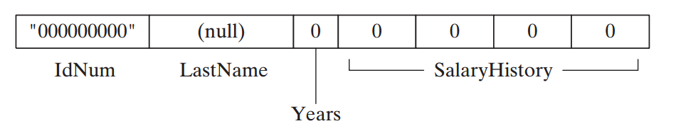
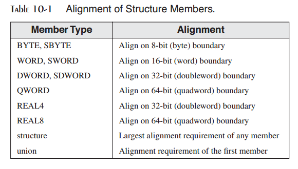
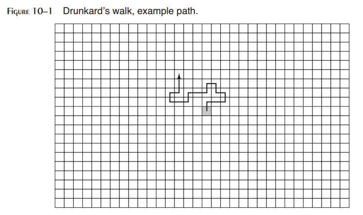
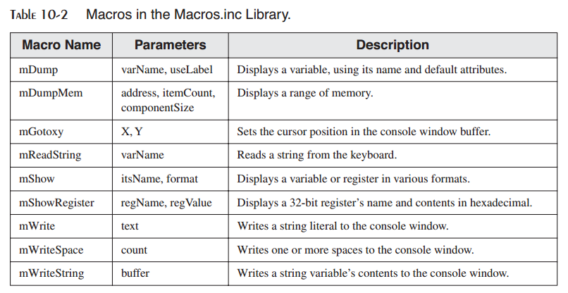
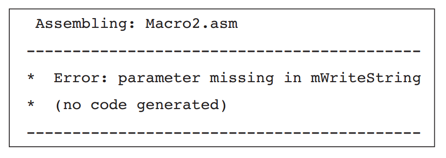
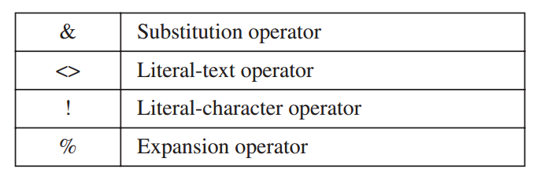
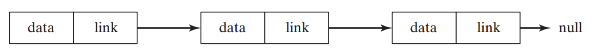

10 结构与宏
^^^^^^^^^^^^^^^^^

10.1 结构
-----------------

结构（structure）是结构上相关的一组变量的模型或模式。结构中的变量被称为域（field）。程序语句可以将结构作为一个整体访问，也可以访问单个域。结构通常包含不同类型的域。联合也将多个标识符组合在一起，但在标识符重叠在内存中的相同区域。联合将会在10.1.7中探讨。

结构为聚合数据提供了一种简便的方法，并且可以将其由一个过程传递给另一个过程。假定一个过程的输出参数由20个与磁盘驱动器相关的不同数据单元组成。调用这样的过程很容易出错，因为调用者也许会弄混参数的顺序，或是传递错误的参数个数。相反，你可以将所有的输入数据放在一个结构中，并向过程传递结构的地址。这样可以使用最小的栈空间（一个地址），并且被调用的过程可以修改结构的内容。

汇编语言中的结构与C和C++中的结构本质上相同。经过一个小小的转换，你可以使用MS-Windows API库中的结构，使其作用于汇编语言。大多数调试器都可以显示单个结构域。

*COORD结构* Windows API中定义的COORD结构标识了X与Y屏幕坐标。相对于结构的起始处，域X的偏移量为零，而域Y的偏移量为2：

.. code-block::

    COORD STRUCT
        X WORD ? ; offset 00
        Y WORD ? ; offset 02
    COORD ENDS

使用结构涉及到三个顺序步骤：

1. 定义结构。
2. 声明一个或多个结构类型的变量，称为结构变量。
3. 编写访问结构域的运行时语名。

10.1.1 定义结构
>>>>>>>>>>>>>>>>>>>>>>

结构是通过使用STRUCT和ENDS指令来定义的。在结构内部，使用与普通变量相同的语法定义域。结构可以包含任意数量的域：

.. code-block::

    name STRUCT
        field-declarations
    name ENDS

*域初始化器* 当结构域具有初始化器时，在结构变量被创建时进行赋值。我们可以使用多种域初始化器类型：

* 未定义的：?操作符使得域内容为未定义状态。
* 字符串字面量：以引号标识的字符串。
* 整数：整数常量及整数表达式。
* 数组：DUP操作符可以初始化数组元素。

下面的Employee结构描述了员工信息，包含ID号，姓，服务年限，以及工资历史数组等域。下面的定义必须出现在Employee变量声明之前：

.. code-block::

    Employee STRUCT
        IdNum BYTE "000000000"
        LastName BYTE 30 DUP(0)
        Years WORD 0
        SalaryHistory DWORD 0,0,0,0
    Employee ENDS

下面是结构的内存布局的线性表示：

赋值结构域
:::::::::::::::

为了最好的I/O内存性能，结构成员应该对齐到与其数据类匹配的地址。否则，CPU需要花费更多的时间来访问成员。例如，双字成员应该对齐到双字边界。表10-1列出了Microsoft C和C++编译器以及Win32 API函数所使用的对齐。在汇编语言中，ALIGN指令设置下一个域或变量的地址对齐：

.. code-block::

    ALIGN datatype

例如，下面的语句将myVar对齐到双字边界：

.. code-block::

    .data
    ALIGN DWORD
    myVar DWORD ?

让我们正确定义员工结构，使用ALIGN将Years对齐到WORD边界，而将SalaryHistory对齐到DWORD边界。域的尺寸显示在注释中。

.. code-block::

    Employee STRUCT
        IdNum BYTE "000000000" ; 9
        LastName BYTE 30 DUP(0) ; 30
        ALIGN WORD ; 1 byte added
        Years WORD 0 ; 2
        ALIGN DWORD ; 2 bytes added
        SalaryHistory DWORD 0,0,0,0 ; 16
    Employee ENDS ; 60 total

10.1.2 声明结构变量
>>>>>>>>>>>>>>>>>>>>>>>>

声明结构变量并可以使用特定的值进行初始化。其语法如structureType已经通过STRUCT指令进行了定义：

.. code-block::

    identifier structureType < initializer-list >

identifier遵循MASM中其他变量的命名规则。initializer-list是可选的，但如果使用，则是一个与特定结构域的数据类型相匹配的，以逗号分隔的，汇编时常量列表：

.. code-block::

    initializer [, initializer] . . .

空的尖括号<>使得结构包含结构定义中的默认域值。另外，你也可以在选定的域中插入新的值。由左至右，与结构声明中的域次序相匹配，依次将值插入结构域中。在下面的示例中，使用COORD与Employee结构同时展示了两种方法：

.. code-block::

    .data
    point1 COORD <5,10> ; X = 5, Y = 10
    point2 COORD <20> ; X = 20, Y = ?
    point3 COORD <> ; X = ?, Y = ?
    worker Employee <> ; (default initializers)

也可以仅覆盖选定的域初始化器。下面的声明仅覆盖Employee结构中的IdNum域，而将其他域赋为默认值：

.. code-block::

    person1 Employee <"555223333">

另外也可以使用花括号{...}而不是尖括号：

.. code-block::

    person2 Employee {"555223333"}

当字符串域的初始化器小于域时，其余位置会以空格填充。空字节并不会被自动插入到字符串域的结尾。你可以通过插入逗号作为空格标记来略过结构域。例如，下面的语句略过了IdNum域而初始化LastName域：

.. code-block::

    person3 Employee <,"dJones">

对于数组域，使用DUP操作符来初始化某些或全部的数组元素。如果初始化器比域短，则其余位置以零填充。在下面的示例中，我们初始化SalaryHistory的前两个值，而将其余值设置为零：

.. code-block::

    person4 Employee <,,,2 DUP(20000)>

*结构数组* 使用DUP操作符来创建结构数组。在下面的示例中，AllPoints中每个元素的X与Y域被初始化为零：

.. code-block::

    NumPoints = 3
    AllPoints COORD NumPoints DUP(<0,0>)

对齐结构变量
::::::::::::::::

为了最好的处理器性能，将结构变量的内存边界对齐到最大的结构成员。Employee结构包含DWORD域，所以下面的定义使用对齐：

.. code-block::

    .data
    ALIGN DWORD
    person Employee <>

10.1.3 引用结构变量
>>>>>>>>>>>>>>>>>>>>>

可以通过使用TYPE与SIZEOF操作符来引用结构变量与结构名字。例如，让我们回到之前见过的Employee结构：

.. code-block::

    Employee STRUCT
        IdNum BYTE "000000000" ; 9
        LastName BYTE 30 DUP(0) ; 30
        ALIGN WORD ; 1 byte added
        Years WORD 0 ; 2
        ALIGN DWORD ; 2 bytes added
        SalaryHistory DWORD 0,0,0,0 ; 16
    Employee ENDS ; 60 total

给定数据定义：

.. code-block::

    .data
    worker Employee <>

下面的表达式会返回相同的值：

.. code-block::

    TYPE Employee ; 60
    SIZEOF Employee ; 60
    SIZEOF worker ; 60

TYPE操作符（4.4节）返回标识的存储空间类型（BYTE，WORD，DWORD，等）所使用的字节数。LENGTHOF操作符返回数组中的元素个数。SIZEOF操作符为LENGTHOF与TYPE的乘积。

引用成员
::::::::::::::::

引用命名结构成员需要结构变量作为限定符。使用Employee结构，可以在汇编时生成下面的常量表达式：

.. code-block::

    TYPE Employee.SalaryHistory ; 4
    LENGTHOF Employee.SalaryHistory ; 4
    SIZEOF Employee.SalaryHistory ; 16
    TYPE Employee.Years ; 2

下述语句是对worker，一个Employee，的运行时引用：

.. code-block::

    .data
    worker Employee <>
    .code
    mov dx,worker.Years
    mov worker.SalaryHistory,20000 ; first salary
    mov [worker.SalaryHistory+4],30000 ; second salary

*使用OFFSET操作符* 你可以使用OFFSET操作符来获得结构变量内域的地址：

.. code-block::

    mov edx,OFFSET worker.LastName

间接与索引操作数
:::::::::::::::::::

间接操作数允许使用寄存器（例如ESI）来编址结构成员。间接编址提供了灵活性，特别是向过程传递结构地址或是使用结构数组时。当引用间接操作数时需要使用PTR操作符：

.. code-block::

    mov esi,OFFSET worker
    mov ax,(Employee PTR [esi]).Years

下面的语句不会被汇编，因为Years本身并没有标识它属的结构：

.. code-block::

    mov ax,[esi].Years ; invalid

*索引操作数* 我们可以使用索引操作数来访问结构数组。假定department是一个包含五个Employee对象的数组。下面的语句访问索引位置1处的员工的Years域：

.. code-block::

    .data
    department Employee 5 DUP(<>)
    .code
    mov esi,TYPE Employee ; index = 1
    mov department[esi].Years, 4

*数组循环* 间接或索引编址可以使用循环来操作结构数组。下面的程序（AllPoints.asm）将坐标赋给AllPoints数组：

.. code-block::

    ; Loop Through Array (AllPoints.asm)
    INCLUDE Irvine32.inc
    NumPoints = 3
    .data
    ALIGN WORD
    AllPoints COORD NumPoints DUP(<0,0>)
    .code
    main PROC
        mov edi,0 ; array index
        mov ecx,NumPoints ; loop counter
        mov ax,1 ; starting X, Y values
    L1: mov (COORD PTR AllPoints[edi]).X,ax
        mov (COORD PTR AllPoints[edi]).Y,ax
        add edi,TYPE COORD
        inc ax
        loop L1
        exit
    main ENDP
    END main

对齐结构成员的性能
::::::::::::::::::::::::

我们可以断定处理器可以更高效地访问正确对齐的结构成员。未对齐的域对性能有多大影响呢？让我们做一些简单的测试，使用本章中的Employee结构的两个不同版本。我们重命名第一个版本，从而可以在同一个程序中同时使用两个结构：

.. code-block::

    EmployeeBad STRUCT
        IdNum BYTE "000000000"
        LastName BYTE 30 DUP(0)
        Years WORD 0
        SalaryHistory DWORD 0,0,0,0
    EmployeeBad ENDS

    Employee STRUCT
        IdNum BYTE "000000000"
        LastName BYTE 30 DUP(0)
        ALIGN WORD
        Years WORD 0
        ALIGN DWORD
        SalaryHistory DWORD 0,0,0,0
    Employee ENDS

下面的代码获取系统时间，执行访问结构域的循环，并计算逝去的时间。变量emp可以声明为Employee或EmployeeBad对象：

.. code-block::

    .data
    ALIGN DWORD
    startTime DWORD ? ; align startTime
    emp Employee <> ; or: emp EmployeeBad <>
    .code
        call GetMSeconds ; get starting time
        mov startTime,eax
        mov ecx,0FFFFFFFFh ; loop counter
    L1: mov emp.Years,5
        mov emp.SalaryHistory,35000
        loop L1
        call GetMSeconds ; get starting time
        sub eax,startTime
    call WriteDec ; display elapsed time

在我们的简单测试程序中（Struct1.asm），使用正确对齐的Employee结构的执行时间为6141毫秒。当使用EmployeeBad结构时的执行时间为6203毫秒。时间差很小（62毫秒），也许是由于处理器的内部缓存最小化了对齐问题。

10.1.4 示例：显示系统时间
>>>>>>>>>>>>>>>>>>>>>>>>>>>

MS_Window提供了设置屏幕光标位置并获取系统时间的控制台功能。要使用这些函数，创建两个预定义结构的实现－COORD与SYSTEMTIME：

.. code-block::

    COORD STRUCT
        X WORD ?
        Y WORD ?
    COORD ENDS

    SYSTEMTIME STRUCT
        wYear WORD ?
        wMonth WORD ?
        wDayOfWeek WORD ?
        wDay WORD ?
        wHour WORD ?
        wMinute WORD ?
        wSecond WORD ?
        wMilliseconds WORD ?
    SYSTEMTIME ENDS

两个结构定义在SamllWin.inc中，该文件位于汇编器的INCLUDE目录并且被Irvine32.inc所引用。要获得系统时间（为你的本地时区调整）调用MS-Windows GetLocalTime函数，并向其传递SYSTEMTIME结构的地址：

.. code-block::

    .data
    sysTime SYSTEMTIME <>
    .code
    INVOKE GetLocalTime, ADDR sysTime

接下来，我们由SYSTEMTIME结构获取相应的值：

.. code-block::

    movzx eax,sysTime.wYear
    call WriteDec

当Win32程序生成屏幕输出，它调用MS-Windows GetStdHandle函数来获取标准控制台输出句柄（整数）：

.. code-block::

    .data
    consoleHandle DWORD ?
    .code
    INVOKE GetStdHandle, STD_OUTPUT_HANDLE
    mov consoleHandle,eax

（常量STD_OUTPUT_HANDLE定义在SmallWin.inc中。）

要设置光标位置，调用MS-Windows SetConsoleCursorPosition函数，向其传递控制输出句酚以及包含X，Y字符坐标的COORD结构变量：

.. code-block::

    .data
    XYPos COORD <10,5>
    .code
    INVOKE SetConsoleCursorPosition, consoleHandle, XYPos

*程序源码* 下面的程序（ShowTime.asm）获取系统时间并在选定的屏幕位置处显示。它仅运行保护模式：

.. code-block::

    ; Structures (ShowTime.ASM)
    INCLUDE Irvine32.inc
    .data
    sysTime SYSTEMTIME <>
    XYPos COORD <10,5>
    consoleHandle DWORD ?
    colonStr BYTE ":",0
    .code
    main PROC
    ; Get the standard output handle for the Win32 Console.
        INVOKE GetStdHandle, STD_OUTPUT_HANDLE
        mov consoleHandle,eax
    ; Set the cursor position and get the system time.
        INVOKE SetConsoleCursorPosition, consoleHandle, XYPos
        INVOKE GetLocalTime, ADDR sysTime
    ; Display the system time (hh:mm:ss).
        movzx eax,sysTime.wHour ; hours
        call WriteDec
        mov edx,OFFSET colonStr ; ":"
        call WriteString
        movzx eax,sysTime.wMinute ; minutes
        call WriteDec
        call WriteString
        movzx eax,sysTime.wSecond ; seconds
        call WriteDec
        call Crlf
        call WaitMsg ; "Press any key..."
        exit
    main ENDP
    END main

下面是SamllWin.inc（自动包含在Irvine32.inc）中的程序所使用的定义：

.. code-block::

    STD_OUTPUT_HANDLE EQU -11
    SYSTEMTIME STRUCT ...
    COORD STRUCT ...
    GetStdHandle PROTO,
        nStdHandle:DWORD
    GetLocalTime PROTO,
        lpSystemTime:PTR SYSTEMTIME
    SetConsoleCursorPosition PROTO,
        nStdHandle:DWORD,
        coords:COORD

下面为示例程序输出：

.. code-block::

    12:16:35
    Press any key to continue...

10.1.5 包含结构的结构
>>>>>>>>>>>>>>>>>>>>>>>>

结构可以包含其他结构的实例。例如，Rectangle可以由左上角和右下角的角度来定义，两者都为COORD结构：

.. code-block::

    Rectangle STRUCT
        UpperLeft COORD <>
        LowerRight COORD <>
    Rectangle ENDS

可以无覆盖或是覆盖单个COORD域来声明Rectangle变量。如下所示：

.. code-block::

    rect1 Rectangle < >
    rect2 Rectangle { }
    rect3 Rectangle { {10,10}, {50,20} }
    rect4 Rectangle < <10,10>, <50,20> >

下面语句是对结构域的直接引用：

.. code-block::

    mov rect1.UpperLeft.X, 10

你可以使用间接操作数访问结构域。下面的示例将10拷贝到ESI所指向的结构的左上角的Y坐标：

.. code-block::

    mov esi,OFFSET rect1
    mov (Rectangle PTR [esi]).UpperLeft.Y, 10

OFFSET操作符返回指向单个结构域的指针，包括嵌套域：

.. code-block::

    mov edi,OFFSET rect2.LowerRight
    mov (COORD PTR [edi]).X, 50
    mov edi,OFFSET rect2.LowerRight.X
    mov WORD PTR [edi], 50

10.1.6 示例：Drunkard's Walk
>>>>>>>>>>>>>>>>>>>>>>>>>>>>>>>>>>>>

至此，看一个使用结构的简短程序对你而言也许是有帮助的。我们将会创建一个"Drunkard's Walk"练习的版本，其中程序将会模拟一个还不错的教授由计算机科学假期聚会到家的路径。使用随机数生成器，你可以为教授所走的每一步选择一个方向。假定教授的起点位于一个想像格网的中心，其中每个方格表示向北，南，东，或西方向的一步。它们遵循穿过格网的随机路径（图10-1）。

我们的程序将会使用COORD结构来跟踪教授路径上的每一步。每步会被存储到一个COORD对象的数组中：

.. code-block::

    WalkMax = 50
        DrunkardWalk STRUCT
        path COORD WalkMax DUP(<0,0>)
        pathsUsed WORD 0
    DrunkardWalk ENDS

**Walkmax** 是一个确定模拟中教授所走的总步数。 **pathsUsed** 域表明，当程序循环结束时，共走了多少步。当教授每走一步时，他或她的位置会被存储到一个COORD对象，并被插入到 **path** 数组中下一个可用的位置处。程序在屏幕上显示坐标。下面是设计运行于32位模式下的完整的程序列表：

.. code-block::

    ; Drunkard's Walk (Walk.asm)
    ; Drunkard's walk program. The professor starts at
    ; coordinates 25, 25 and wanders around the immediate area.
    INCLUDE Irvine32.inc
    WalkMax = 50
    StartX = 25
    StartY = 25
    DrunkardWalk STRUCT
        path COORD WalkMax DUP(<0,0>)
        pathsUsed WORD 0
    DrunkardWalk ENDS
    DisplayPosition PROTO currX:WORD, currY:WORD
    .data
    aWalk DrunkardWalk <>
    .code
    main PROC
        mov esi,OFFSET aWalk
        call TakeDrunkenWalk
        exit
    main ENDP

    ;-------------------------------------------------------
    TakeDrunkenWalk PROC
    LOCAL currX:WORD, currY:WORD
    ;
    ; Takes a walk in random directions (north, south, east,
    ; west).
    ; Receives: ESI points to a DrunkardWalk structure
    ; Returns: the structure is initialized with random values
    ;-------------------------------------------------------
        pushad
    ; Use the OFFSET operator to obtain the address of the
    ; path, the array of COORD objects, and copy it to EDI.
        mov edi,esi
        add edi,OFFSET DrunkardWalk.path
        mov ecx,WalkMax ; loop counter
        mov currX,StartX ; current X-location
        mov currY,StartY ; current Y-location
    Again:
    ; Insert current location in array.
        mov ax,currX
        mov (COORD PTR [edi]).X,ax
        mov ax,currY
        mov (COORD PTR [edi]).Y,ax
        INVOKE DisplayPosition, currX, currY
        mov eax,4 ; choose a direction (0-3)
        call RandomRange
    .IF eax == 0 ; North
        dec currY
    .ELSEIF eax == 1 ; South
        inc currY
    .ELSEIF eax == 2 ; West
        dec currX
    .ELSE ; East (EAX = 3)
        inc currX
    .ENDIF
    add edi,TYPE COORD ; point to next COORD
    loop Again
    Finish:
        mov (DrunkardWalk PTR [esi]).pathsUsed, WalkMax
        popad
        ret
    TakeDrunkenWalk ENDP
    ;-------------------------------------------------------
    DisplayPosition PROC currX:WORD, currY:WORD
    ; Display the current X and Y positions.
    ;-------------------------------------------------------
    .data
    commaStr BYTE ",",0
    .code
        pushad
        movzx eax,currX ; current X position
        call WriteDec
        mov edx,OFFSET commaStr ; "," string
        call WriteString
        movzx eax,currY ; current Y position
        call WriteDec
        call Crlf
        popad
        ret
    DisplayPosition ENDP
    END main

*TakeDrunkenWalk过程* 让我们近距离看一下TakeDrunkenWalk过程。它接收一个指向DrunkardWalk结构的指针（ESI）。使用OFFSET操作符，它计算path数组的偏移并将其拷贝到EDI中：

.. code-block::

    mov edi,esi
    add edi,OFFSET DrunkardWalk.path

教授的初始X与Y位置（StartX与StartY）被设置为25，位于想像的50x50格网的中心处。循环计数器被初始化为：

.. code-block::

    mov ecx, WalkMax ; loop counter
    mov currX,StartX ; current X-location
    mov currY,StartY ; current Y-location

在循环开始时，path数组的第一项被初始化为：

.. code-block::

    Again:
        ; Insert current location in array.
        mov ax,currX
        mov (COORD PTR [edi]).X,ax
        mov ax,currY
        mov (COORD PTR [edi]).Y,ax

在游走的最后，计数器被插入到pathsUsed域，表明已走了多少步：

.. code-block::

    Finish:
        mov (DrunkardWalk PTR [esi]).pathsUsed, WalkMax

在当前版本的程序中，pathsUsed总是等于WalkMax，但如果我们检测湖或建筑等障碍物时，该值会发生变化。从而循环会在到达WalMax之前结束。

10.1.7 声明并使用联合
>>>>>>>>>>>>>>>>>>>>>>>>>>>

结构中的每个域都有一个相对于结构的第一个字节的偏移量，但联合中的每个域都由相同的偏移处开始。联合的存储空间尺寸等于其最长域的长度。如果联合不是结构的组成部分，则可以使用UNION与ENDS指令来声明：

.. code-block::

    unionname UNION
        union-fields
    unionname ENDS

如果联合嵌套到结构内部，则语法会略有不同：

.. code-block::

    structname STRUCT
        structure-fields
        UNION unionname
            union-fields
        ENDS
    structname ENDS

联合中的域声明遵循与结构声明相同的规则，所不同的是每个域仅有一个初始化器。例如，Integer联合对于相同的数据有三个不同的尺寸属性，并将所有域初始化为零：

.. code-block::

    Integer UNION
        D DWORD 0
        W WORD 0
        B BYTE 0
    Integer ENDS

*一致* 初始化器，如果使用，应具有相同值。假定使用不同的初始化器声明整数：

.. code-block::

    Integer UNION
        D DWORD 1
        W WORD 5
        B BYTE 8
    Integer ENDS

同时，假定我们使用不同的初始化器声明一个名为myInt的整型变量：

.. code-block::

    .data
    myInt Integer <>

结果，myInt.D，myInt.W以及myInt.B的值均等于1。为域W与B声明的初始化器会被汇编器所忽略。

*包含联合的结构* 你可以通过在声明中使用联合名来将联合嵌套到结构内部，就如同下面将FileID域嵌套到FileInfo结构中：

.. code-block::

    FileInfo STRUCT
        FileID Integer <>
        FileName BYTE 64 DUP(?)
    FileInfo ENDS

或者是你可以在结构内部声明联合，就如同下面的FileID域：

.. code-block::

    FileInfo STRUCT
        UNION FileID
            D DWORD ?
            W WORD ?
            B BYTE ?
        ENDS
        FileName BYTE 64 DUP(?)
    FileInfo ENDS

*声明并使用联合变量* 联合变量的声明与初始化与结构变量相同，但有一点重要区别：不允许多个初始化器。下面是整型变量的示例：

.. code-block::

    val1 Integer <12345678h>
    val2 Integer <100h>
    val3 Integer <>

要在可执行指令中使用联合变量，你必须提供一个变量域的名字。在下面的示例中，我们将寄存器值赋给整型联合域。注意，我们可以使用不同的操作数尺寸的灵活性：

.. code-block::

    mov val3.B, al
    mov val3.W, ax
    mov val3.D, eax

联合也可以包含结构。下面的INPUT_RECORD结构为某些MS-Windows控制输入函数所使用。它包含一个名为Event的联合，其会在某些预定义的结构类型中选择。EventType域表明哪种结构类型出现在联合中。每个结构具有不同的布局与尺寸，但是每次仅使用一个域：

.. code-block::

    INPUT_RECORD STRUCT
        EventType WORD ?
        ALIGN DWORD
            UNION Event
            KEY_EVENT_RECORD <>
            MOUSE_EVENT_RECORD <>
            WINDOW_BUFFER_SIZE_RECORD <>
            MENU_EVENT_RECORD <>
            FOCUS_EVENT_RECORD <>
        ENDS
    INPUT_RECORD ENDS

当命名结构时，Win32 API经常包含单词RECORD。这是KEY_EVENT_RECORD结构的定义：

.. code-block::

    KEY_EVENT_RECORD STRUCT
        bKeyDown DWORD ?
        wRepeatCount WORD ?
        wVirtualKeyCode WORD ?
        wVirtualScanCode WORD ?
        UNION uChar
            UnicodeChar WORD ?
            AsciiChar BYTE ?
        ENDS
        dwControlKeyState DWORD ?
    KEY_EVENT_RECORD ENDS

在SmallWin.inc文件中可以找到INPUT_RECORD的其余STRUCT定义。

10.2 宏
------------------

10.2.1 概述
>>>>>>>>>>>>>>>>>>>>

宏过程是汇编语言语句的命名块。一旦定义，它可以在程序中被任意调用多次。当你调用一个宏过程时，其代码的拷贝会被直接插入被调用处。这种类型的自动代码插入也被称为内联展开（inline expansion）。习惯上称其为调用宏过程，尽管所用的技术并没有涉及CALL指令。

注意：Microsoft汇编器手册中的术语宏过程用来标识并不返回值的宏。也存在返回值的宏函数。在程序员中间，单词宏通常被理解为与宏过程相同的内容。自此，我们将会使用较短的格式。

*位置* 宏定义通常出现在程序源代码的起始处，或者它们被放置在单独的文件，并通过INCLUDE指令被拷贝到程序中。宏是在汇编器的预处理步骤被展开的。在该步骤中，预处理器读取宏定义，并扫描程序中的其余源码。在宏被调用的每个位置，汇编器将宏的源码的拷贝插入到程序中。汇编器在汇编宏调用之前，它必须能够找到宏定义。如果程序定义了宏，但是从未调用，宏代码不会出现在编译后的程序中。

在下面的示例中，一个名为PrintX的宏调用Irvine32库中的WriteChar过程。定义通常被放置在数据段之前：

.. code-block::

    PrintX MACRO
        mov al,'X'
        call WriteChar
    ENDM

接下来，在代码段中，我们调用宏：

.. code-block::

    .code
    PrintX

当预处理器扫描该程序并且发现了对PrintX的调用，它会使用下面的语句替换宏调用：

.. code-block::

    mov al,'X'
    call WriteChar

发生了文本替换。尽管宏不灵活，我们很快会展示如何向宏传递参数，从而使其更为有用。

10.2.2 定义宏
>>>>>>>>>>>>>>>>>>>>>

宏是使用MACRO与ENDM指令来定义的。其语法为：

.. code-block::

    macroname MACRO parameter-1, parameter-2...
        statement-list
    ENDM

对于缩进并没有固定的规则，但是我们推荐你缩进macroname与ENDM之间的语句。你也许希望使用字符m作为宏名的前缀，创建可识别的名字，例如mPutChar，mWriteString，以及mGotoxy。MACRO与ENDM指令之间的语句直到宏被调用时才会被汇编。宏定义中可以有任意个参数，以逗号分隔。

*参数* 宏参数是传递给调用者的文本参数的命名占位符。实际上的参数可以为整数，变量名，或是其他值，但是预处理器将其看作文本。参数并不包含类型信息，所以预处理器并不会检测参数类型以确定它们是否正确。如果发生类型不匹配，则它会在宏被展开后被汇编器捕捉到。

*mPutchar示例* 下面的mPutchar宏接收一个名为char的输入参数，并通过调用本书的链接库中的WriteChar过程将其显示到控制台：

.. code-block::

    mPutchar MACRO char
        push eax
        mov al,char
        call WriteChar
        pop eax
    ENDM

10.2.3 调用宏
>>>>>>>>>>>>>>>>>>>

宏是通过将其名字插入到程序来调用的，后跟宏参数。调用宏的语法如下：

.. code-block::

    macroname argument-1, argument-2, ...

macroname必须是在源码中调用位之前定义的宏名。每个参数是表示宏中参数的文本值。参数顺序必须与参数顺序相对应，但是参数的个数不必与参数的个数相匹配。如果传递了过多的参数，汇编器会触发警告。如果过少的参数被传递给宏，则未填充的参数会被留空。

*调用mPutchar* 在前面的内容中，我们定义了mPutchar宏。当调用mPutchar时，我们可以传递任意字符或ASCII码。下面的语句调用mPutchar并为其传递字符'A'：

.. code-block::

    mPutchar 'A'

汇编器的预处理器扩展下面代码中的语句，显示在列表文件中：

.. code-block::

    1 push eax
    1 mov al,'A'
    1 call WriteChar
    1 pop eax

左列的1表示宏的展开层次，当你在宏中调用其他宏时，该值会增加。下面的循环显示了字母表中的前20个字符：

.. code-block::

        mov al,'A'
        mov ecx,20
    L1:
        mPutchar al ; macro call
        inc al
        loop L1

我们的循环会被预处理器扩展为下列代码。宏定义被显示在其扩展之前：

.. code-block::

        mov al,'A'
        mov ecx,20
    L1:
        mPutchar al ; invoke the macro
    1   push eax
    1   mov al,al
    1   call WriteChar
    1   pop eax
        inc al
        loop L1

提示：通常，宏的执行要比过程快得多，因为过程还有额外的CALL与RET指令的负载。然而，使用宏也有一个缺点：重复使用较大的宏会增加程序的尺寸，因为每个宏调用会向程序中插入宏代码的新拷贝。

调试宏
::::::::::::::

调试使用宏的程序是一种特殊的挑战。在汇编程序之后，查看其列表文件（extension.LST）来确保每个宏按你的意愿进行展开。接下来，在Visual Studio调试器启动程序，右击调试窗口，并由弹出菜单中选择Go to Disassembly。每个宏调用后跟该宏所生成的代码。如下面的示例所示：

.. code-block::

    mWriteAt 15,10,"Hi there"
        push edx
        mov dh,0Ah
        mov dl,0Fh
        call _Gotoxy@0 (401551h)
        pop edx
        push edx
        mov edx,offset ??0000 (405004h)
        call _WriteString@0 (401D64h)
        pop edx

以下划线开头的函数名是因为Irvine32库使用STDCALL调用约定。

10.2.4 额外的宏特性
>>>>>>>>>>>>>>>>>>>>>>

必需的参数
::::::::::::::

使用REQ限定符，你可以指定一个宏参数是必需的。如果宏被调用时没有与必需的参数匹配的参数，汇编器会显示错误信息。如果宏有多个必需的参数，每个都必须包含REQ限定符。在下面的mPutchar宏中，char参数是必需的：

.. code-block::

    mPutchar MACRO char:REQ
        push eax
        mov al,char
        call WriteChar
        pop eax
    ENDM

宏注释
:::::::::::::

出在宏定义中的普通注释行会在每次宏展开时出现。如果你要在宏展开时忽略注释，以双引号作为前缀注释（;;）。如下面的示例所示:

.. code-block::

    mPutchar MACRO char:REQ
        push eax ;; reminder: char must contain 8 bits
        mov al,char
        call WriteChar
        pop eax
    ENDM

ECHO指令
:::::::::::::

ECHO指令会在程序被汇编时将字符串写入到标准输出。在下面的mPutchar版本中，消息"Expanding the mPutchar macro"会在汇编过程中显示：

.. code-block::

    mPutchar MACRO char:REQ
        ECHO Expanding the mPutchar macro
        push eax
        mov al,char
        call WriteChar
        pop eax
    ENDM

LOCAL指令
:::::::::::::

宏定义经常在代码中包含标签以及对这些标签的自引用。例如，下面的makeString宏声明了一个名为string的变量，并使用字符数组对其初始化：

.. code-block::

    makeString MACRO text
        .data
        string BYTE text,0
    ENDM

假定我们两次调用该宏：

.. code-block::

    makeString "Hello"
    makeString "Goodbye"

则会导致错误，因为汇编器不允许两个标签具有相同的名字：

.. code-block::

        makeString "Hello"
    1   .data
    1   string BYTE "Hello",0
        makeString "Goodbye"
    1   .data
    1   string BYTE "Goodbye",0 ; error!

*使用LOCAL* 要避免重定义所导致的问题，你可以将LOCAL指令应用于宏定义中的标签。当一个标签被标记为LOCAL时，预处理器会在每次宏被展开时将标签名转换为唯一的标识符。下面是使用LOCAL的新版本makeString：

.. code-block::

    makeString MACRO text
        LOCAL string
        .data
        string BYTE text,0
    ENDM

如果像之前一样调用两次宏，预处理器所生成的代码会使用唯一的标识符替换所出现的string：

.. code-block::

        makeString "Hello"
    1   .data
    1   ??0000 BYTE "Hello",0
        makeString "Goodbye"
    1   .data
    1   ??0001 BYTE "Goodbye",0

汇编器所生成的标签名使用??nnnn的格式，其中nnnn是唯一的整数。LOcAL宏也应用于宏中的代码标签。

包含代码与数据的宏
::::::::::::::::::::::

宏经常同时包含代码与数据。例如，下面的mWrite宏，会向控制台显示字符串字面量：

.. code-block::

    mWrite MACRO text
        LOCAL string ;; local label
        .data
        string BYTE text,0 ;; define the string
        .code
        push edx
        mov edx,OFFSET string
        call WriteString
        pop edx
    ENDM

下面的语句两次调用宏，并为其传递不同的字符串字面量：

.. code-block::

    mWrite "Please enter your first name"
    mWrite "Please enter your last name"

汇编器对两条语句的展开表明每个字符串被赋予唯一的标签，而MOV指令会进行相应的调整：

.. code-block::

        mWrite "Please enter your first name"
    1   .data
    1   ??0000 BYTE "Please enter your first name",0
    1   .code
    1   push edx
    1   mov edx,OFFSET ??0000
    1   call WriteString
    1   pop edx
        mWrite "Please enter your last name"
    1   .data
    1   ??0001 BYTE "Please enter your last name",0
    1   .code
    1   push edx
    1   mov edx,OFFSET ??0001
    1   call WriteString
    1   pop edx

嵌套宏
:::::::::::::

一个宏为另一个宏所调用被称为嵌套宏。当汇编器的预处理器遇到对嵌套宏的调用时，它会立即展开该宏。传递给封装宏的参数会被直接传递给其嵌套宏。

提示：当创建宏时使用模块方法。使其短小简单从而它们可以被组合为更复杂的宏。这样有助于减少你的程序中重复的代码量。

*mWriteln示例* 下面的mWriteln宏会将字符串字面量写入控制并添加行结束符。它调用mWrite宏并调用Crlf过程：

.. code-block::

    mWriteln MACRO text
        mWrite text
        call Crlf
    ENDM

text参数会被直接传递给mWrite。假定下面的语句调用mWriteln：

.. code-block::

    mWriteln "My Sample Macro Program"

在所得到的代码展开中，语句旁边的嵌套层次（2）表明嵌套宏已被调用：

.. code-block::

        mWriteln "My Sample Macro Program"
    2   .data
    2   ??0002 BYTE "My Sample Macro Program",0
    2   .code
    2   push edx
    2   mov edx,OFFSET ??0002
    2   call WriteString
    2   pop edx
    1   call Crlf

10.2.5 使用本书的宏库（仅32位模式）
>>>>>>>>>>>>>>>>>>>>>>>>>>>>>>>>>>>>>>>>

本书的示例程序包含一个小但却有用的32位库，你可以简单地将下述行放置在INCLUDE语句之后：

.. code-block::

    INCLUDE Macros.inc

其中一些宏是对Irvine32库中已有过程的封装，从而使其更易于传递参数。其他的一些宏提供了新功能。列表10-2详细描述了每个宏。可以在MacroTest.asm中找到示例代码。

mDumpMem
:::::::::::::::

mDumpMem宏在控制台窗口显示内存块。为其传递你要显示的常量，寄存器，或是包含内存偏移量的变量。第二个参数应是要显示的内存组件的数量，而第三个参数是每个内存组件的大小。（宏调用DumpMem库过程，分别将三个参数赋值给ESI，ECX以及EBX。）让我们假定下面的数据定义：

.. code-block::

    .data
    array DWORD 1000h,2000h,3000h,4000h

下面的语句使用其默认属性显示数组：

.. code-block::

    mDumpMem OFFSET array, LENGTHOF array, TYPE array

输出结果为：

.. code-block::

    Dump of offset 00405004
    -------------------------------
    00001000 00002000 00003000 00004000

下面的语句以字节序列显示相同的数组：

.. code-block::

    mDumpMem OFFSET array, SIZEOF array, TYPE BYTE

输出结果为：

.. code-block::

    Dump of offset 00405004
    -------------------------------
    00 10 00 00 00 20 00 00 00 30 00 00 00 40 00 00

下面的代码将三个值压入栈，设置EBX，ECX与ESI的值，并使用mDumpMem来显示栈：

.. code-block::

    mov eax,0AAAAAAAAh
    push eax
    mov eax,0BBBBBBBBh
    push eax
    mov eax,0CCCCCCCCh
    push eax
    mov ebx,1
    mov ecx,2
    mov esi,3
    mDumpMem esp, 8, TYPE DWORD

栈输出的结果表明宏已将EBX，ECX以及ESI压入栈。下述结果是我们在调用mDumpMem之前压入栈的三个整数值：

.. code-block::

    Dump of offset 0012FFAC
    -------------------------------
    00000003 00000002 00000001 CCCCCCCC BBBBBBBB AAAAAAAA 7C816D4F
    0000001A

*实现* 下面是宏的代码列表：

.. code-block::

    mDumpMem MACRO address:REQ, itemCount:REQ, componentSize:REQ
    ;
    ; Displays a dump of memory, using the DumpMem procedure.
    ; Receives: memory offset, count of the number of items
    ; to display, and the size of each memory component.
    ; Avoid passing EBX, ECX, and ESI as arguments.
    ;------------------------------------------------------
        push ebx
        push ecx
        push esi
        mov esi,address
        mov ecx,itemCount
        mov ebx,componentSize
        call DumpMem
        pop esi
        pop ecx
        pop ebx
    ENDM

mDump
::::::::::::::::

mDump宏以十六进制显示变量的地址与内容。向其传递一个变量名以及（可选）字符表明应显示变量旁边的标签。显示式格式会自动与变量的尺寸属性相匹配（BYTE，WORD，或DWORD）。下面的示例展示了对mDump的两个调用：

.. code-block::

    .data
    diskSize DWORD 12345h
    .code
    mDump diskSize ; no label
    mDump diskSize,Y ; show label

当代码执行时会得到下面的输出结果：

.. code-block::

    Dump of offset 00405000
    -------------------------------
    00012345
    Variable name: diskSize
    Dump of offset 00405000
    -------------------------------
    00012345

*实现* 下面是mDump宏的列表，它会调用mDumpMem。它会使用一个名为IFNB（如果不为空）的新指令来查找调用者是否传递了第二个参数（参看10.3节）：

.. code-block::

    ;----------------------------------------------------
    mDump MACRO varName:REQ, useLabel
    ;
    ; Displays a variable, using its known attributes.
    ; Receives: varName, the name of a variable.
    ; If useLabel is nonblank, the name of the
    ; variable is displayed.
    ;----------------------------------------------------
        call Crlf
        IFNB <useLabel>
        mWrite "Variable name: &varName"
        ENDIF
        mDumpMem OFFSET varName, LENGTHOF varName, TYPE varName
    ENDM

&varName中的&是一个替换操作符，它允许varName参数的值被插入到字符串字面量中。参看10.3.7节了解详细内容。

mGotoxy
::::::::::::::

mGotoxy宏将光标定位于控制台窗口缓冲区中的列与行位置。你可以为其传递8位立即值，内存操作数，以及寄存器值：

.. code-block::

    mGotoxy 10,20 ; immediate values
    mGotoxy row,col ; memory operands
    mGotoxy ch,cl ; register values

*实现* 下面是该宏的源码列表：

.. code-block::

    ;------------------------------------------------------
    mGotoxy MACRO X:REQ, Y:REQ
    ;
    ; Sets the cursor position in the console window.
    ; Receives: X and Y coordinates (type BYTE). Avoid
    ; passing DH and DL as arguments.
    ;------------------------------------------------------
        push edx
        mov dh,Y
        mov dl,X
        call Gotoxy
        pop edx
    ENDM

*避免寄存器冲突* 当宏参数为寄存器时，有时它们会与宏内部所用的寄存器相冲突。例如，如果我们使用DH与DL调用mGotoxy，它并不会生成正确的代码。要了解为什么，让我们检查一下参数被替换之后的展开代码：

.. code-block::

    1 push edx
    2 mov dh,dl ;; row
    3 mov dl,dh ;; column
    4 call Gotoxy
    5 pop edx

假定DL作为Y值，DH作为X值被传递，在我们机会在第3行将列值拷贝到DL之前，第2行替换了DH。

提示：当可能时，宏定义该包含注释指明哪些寄存器不能用作参数。

mReadString
:::::::::::::::

mReadString宏由键盘输入一个字符串，并将其存储到缓冲区中。就内部而言，它封装了对ReadString库过程的调用。为其传递缓冲区的名字：

.. code-block::

    .data
    firstName BYTE 30 DUP(?)
    .code
    mReadString firstName

下面是该宏的源码:

.. code-block::

    ;------------------------------------------------------
    mReadString MACRO varName:REQ
    ;
    ; Reads from standard input into a buffer.
    ; Receives: the name of the buffer. Avoid passing
    ; ECX and EDX as arguments.
    ;------------------------------------------------------
        push ecx
        push edx
        mov edx,OFFSET varName
        mov ecx,SIZEOF varName
        call ReadString
        pop edx
        pop ecx
    ENDM

mShow
:::::::::

mShow宏以调用者选择的格式显示寄存器或变量的名字与内容。向其传递寄存器的名字，后跟表明要求格式的可选字符序列。使用下面的代码：H为十六进制，D为无符号十进制数，I为有符号十进制数，B为二进制，N添加新行。多种输出格式可以进行组合，而且可以指定多个新行。默认格式为"HIN"。mShow是一个有用的辅助工具，并且为DumpRegs库过程所广泛使用。你可以将mShow作为一个调试工具，来显示重要寄存器或变量的值。

*示例* 下面的语句以十六进制，有符号十进制数，无符号十进制数以及二进制显示AX寄存器：

.. code-block::

    mov ax,4096
    mShow AX ; default options: HIN
    mShow AX,DBN ; unsigned decimal, binary, newline

其输出如下：

.. code-block::

    AX = 1000h +4096d
    AX = 4096d 0001 0000 0000 0000b

*示例* 下列语句会在相同的输出行以无符号十进制数显示AX，BX，CX与DX的内容：

.. code-block::

    ; Insert some test values and show four registers:
    mov ax,1
    mov bx,2
    mov cx,3
    mov dx,4
    mShow AX,D
    mShow BX,D
    mShow CX,D
    mShow DX,DN

下面是其对应的输出：

.. code-block::

    AX = 1d BX = 2d CX = 3d DX = 4d

*示例* 下述对mShow的调用会以无符号十进制数显示mydword的内容，后跟一个新行：

.. code-block::

    .data
    mydword DWORD ?
    .code
    mShow mydword,DN

*实现* mShow的实现较大而不能在这里显示，但可以本书的安装目录（C:\Irvine）的Macros.inc文件中找到。当编写mShow时，我们要小心在宏内部的语句修改寄存器的内容之前显示寄存器的值。

mShowRegister
::::::::::::::::::

mShowRegister宏以十六进制显示有符号32位寄存器的名字与内容。向其传递你希望显示的寄存器的名字，后跟寄存器自身。下面的宏调用指定要显示的名字为EBX：

.. code-block::

    mShowRegister EBX, ebx

所得到的输出结果如下：

.. code-block::

    EBX=7FFD9000

下面的调用使用尖括号封装标签，因为它包含嵌入的空格：

.. code-block::

    mShowRegister <Stack Pointer>, esp

得到下面的输出：

.. code-block::

    Stack Pointer=0012FFC0

*实现* 下面是该宏的源码：

.. code-block::

    ;---------------------------------------------------
    mShowRegister MACRO regName, regValue
    LOCAL tempStr
    ;
    ; Displays a register's name and contents.
    ; Receives: the register name, the register value.
    ;---------------------------------------------------
    .data
    tempStr BYTE " &regName=",0
    .code
        push eax
    ; Display the register name
        push edx
        mov edx,OFFSET tempStr
        call WriteString
        pop edx
    ; Display the register contents
        mov eax,regValue
        call WriteHex
        pop eax
    ENDM

mWriteSpace
:::::::::::::::::

mWriteSpace宏向控制台窗口写入一个或多个空格。你可以向其传递指定要写入的空格数量（默认为1）的整型参数。例如，下面的语句写入五个空格：

.. code-block::

    mWriteSpace 5

*实现* 下面是mWriteSpace的源码：

.. code-block::

    ;------------------------------------------------------
    mWriteSpace MACRO count:=<1>
    ;
    ; Writes one or more spaces to the console window.
    ; Receives: an integer specifying the number of spaces.
    ; Default value of count is 1.
    ;------------------------------------------------------
    LOCAL spaces
    .data
    spaces BYTE count DUP(' '),0
    .code
        push edx
        mov edx,OFFSET spaces
        call WriteString
        pop edx
    ENDM

10.3.2节解释如何为宏参数使用默认初始化器。

mWriteString
::::::::::::::::::

mWriteString宏向控制台窗口写入字符串变量的内容。就内部而言，它允许你在相同的语句行传递字符串变量的名字，并简单地调用WriteString。例如：

.. code-block::

    .data
    str1 BYTE "Please enter your name: ",0
    .code
    mWriteString str1

*实现* 下面的mWriteString实现将EDX保存到栈，使用字符串的偏移填充EDX，并在过程调用之后由栈顶弹出EDX：

.. code-block::

    ;------------------------------------------------------
    mWriteString MACRO buffer:REQ
    ;
    ; Writes a string variable to standard output.
    ; Receives: string variable name.
    ;------------------------------------------------------
        push edx
        mov edx,OFFSET buffer
        call WriteString
        pop edx
    ENDM

10.2.6 示例程序：封装器
>>>>>>>>>>>>>>>>>>>>>>>>>>

让我们创建一个名为Wraps.asm的程序。因为每个宏隐藏了大量繁琐的参数传递，程序会显得紧凑。我们假定目前为止所显示的宏全部位于Macros.inc文件中：

.. code-block::

    ; Procedure Wrapper Macros (Wraps.asm)
    ; This program demonstrates macros as wrappers
    ; for library procedures. Contents: mGotoxy, mWrite,
    ; mWriteString, mReadString, and mDumpMem.
    INCLUDE Irvine32.inc
    INCLUDE Macros.inc ; macro definitions
    .data
    array DWORD 1,2,3,4,5,6,7,8
    firstName BYTE 31 DUP(?)
    lastName BYTE 31 DUP(?)
    .code
        main PROC
        mGotoxy 0,0
        mWrite <"Sample Macro Program",0dh,0ah>
    ; Input the user's name.
        mGotoxy 0,5
        mWrite "Please enter your first name: "
        mReadString firstName
        call Crlf
        mWrite "Please enter your last name: "
        mReadString lastName
        call Crlf
    ; Display the user's name.
        mWrite "Your name is "
        mWriteString firstName
        mWriteSpace
        mWriteString lastName
        call Crlf
    ; Display the array of integers.
        mDumpMem OFFSET array, LENGTHOF array, TYPE array
        exit
    main ENDP
    END main

*程序输出* 下面是该程序的示例输出：

.. code-block::

    Sample Macro Program
    Please enter your first name: Joe
    Please enter your last name: Smith
    Your name is Joe Smith
    Dump of offset 00404000
    -------------------------------
    00000001 00000002 00000003 00000004 00000005
    00000006 00000007 00000008

10.3 条件汇编指令
---------------------

大量不同的条件汇编指令可以与宏配合使用以使其更为灵活。条件汇编指令的通用语法为：

.. code-block::

    IF condition
        statements
    [ELSE
        statements]
    ENDIF

提示：不要将本章中的常量指令与6.7节中介绍的运行时指令，例如.IF与.ENDIF，相混淆。后者基于存储在寄存器与变量中的运行时值计算表达式。

表10-3列出了常见的条件汇编指令。当描述表明指令允许汇编时，它意味着后续语句被汇编，直到下一个ELSE或ENDIF指令。必须强调的是，表中所列的指令在汇编时计算，而不是在运行时计算。

.. image:: _images/table-10-3.png

10.3.1 检测缺失参数
>>>>>>>>>>>>>>>>>>>>>>>>

宏可以检测以确定其参数是否为空。通常，如果空参数被宏所接收，当宏被预处理器展开时，会得到错误的指令结果。例如，如果我们调用mWriteString宏而没有传递参数，当将字符串偏移拷贝到EDX中时，宏展开会得到非法指令。如下为汇编器生成的语句，它会检测缺失参数并触发错误信息：

.. code-block::

    mWriteString
    1 push edx
    1 mov edx,OFFSET
    Macro2.asm(18) : error A2081: missing operand after unary operator
    1 call WriteString
    1 pop edx

要阻止缺失参数所导致的错误，你可以使用IFB（如果空）指令，如果宏参数为空，则该指令返回true。或者，你可以使用IFNB（如果非空）操作符，如果宏参数不为空，则返回true。让我们创建一个mWriteString的不同版本，使其在汇编过程中显示错误信息：

.. code-block::

    mWriteString MACRO string
    IFB <string>
        ECHO -------------------------------------------
        ECHO * Error: parameter missing in mWriteString
        ECHO * (no code generated)
        ECHO -------------------------------------------
        EXITM
    ENDIF
    push edx
    mov edx,OFFSET string
    call WriteString
    pop edx
    ENDM

（回顾10.2.2节中，ECHO指令会在程序被汇编时向控制台输出信息。）EXITM指令通知预处理器退出宏，并且不要扩展宏中的任何语句。下图显示了当汇编缺失参数的程序时的屏幕输出：

10.3.2 默认参数初始化器
>>>>>>>>>>>>>>>>>>>>>>>>

宏可以有默认参数初始化器。当宏被调用时，如果宏参数缺失，则使用默认参数。其语法为：

.. code-block::

    paramname := < argument >

（操作符前后的空格是可选的。）例如，可以为mWriteln宏提供一个仅包含空格的字符串作为其默认参数。如果它被无参数调用时，它依然会输出一个空格，后跟换行：

.. code-block::

    mWriteln MACRO text:=<" ">
        mWrite text
        call Crlf
    ENDM

如果使用空字符串（""）作为默认参数，汇编器会触发错误，所以你在引号之间至少要插入一个空格。

10.3.3 布尔表达式
>>>>>>>>>>>>>>>>>>>

汇编器允许在包含IF以及其他条件指令的常量布尔表达式中使用下列的关系操作符：

.. code-block::

    LT Less than
    GT Greater than
    EQ Equal to
    NE Not equal to
    LE Less than or equal to
    GE Greater than or equal to

10.3.4 IF，ELSE，以及ENDIF指令
>>>>>>>>>>>>>>>>>>>>>>>>>>>>>>>>>>>

IF指令后必须跟常量布尔表达式。表达式可以包含整数常量，符号常量，或是常量宏参数，但是不可以包含寄存器或变量名。语法格式仅使用IF与ENDIF：

.. code-block::

    IF expression
        statement-list
    ENDIF

另一种格式使用IF，ELSE，以及ENDIF：

.. code-block::

    IF expression
        statement-list
    ELSE
        statement-list
    ENDIF

*示例：MGotoxyConst宏* mGotoxyConst宏使用LT与GT操作符对传递给宏的参数执行范围检测。参数X与Y必须为常量。另一个名为ERRS的常量符号计数所发现的错误数。基于X的值，我们可以将ERRS设置为1。基于Y的值，我们将ERRS加1。最后，如果ERRS大于零，EXITM指令退出宏：

.. code-block::

    ;-----------------------------------------------------
    mGotoxyConst MACRO X:REQ, Y:REQ
    ;
    ; Sets the cursor position at column X, row Y.
    ; Requires X and Y coordinates to be constant expressions
    ; in the ranges 0 <= X < 80 and 0 <= Y < 25.
    ;------------------------------------------------------
        LOCAL ERRS ;; local constant
        ERRS = 0
        IF (X LT 0) OR (X GT 79)
            ECHO Warning: First argument to mGotoxy (X) is out of range.
            ECHO ******************************************************
            ERRS = 1
        ENDIF
        IF (Y LT 0) OR (Y GT 24)
            ECHO Warning: Second argument to mGotoxy (Y) is out of range.
            ECHO ******************************************************
            ERRS = ERRS + 1
        ENDIF
        IF ERRS GT 0 ;; if errors found,
            EXITM ;; exit the macro
        ENDIF
        push edx
        mov dh,Y
        mov dl,X
        call Gotoxy
        pop edx
    ENDM

10.3.5 IFIDN与IFIDNI指令
>>>>>>>>>>>>>>>>>>>>>>>>>>>>>>

IFIDNI指令在两个符号（包含宏参数名）之间执行大小写不敏感的匹配，如果它们相同则返回true。IFIDN指令执行大小写敏感匹配。当你希望确保宏的调用者并未使用与宏内部所用的寄存器冲突的寄存器参数时，前者非常有用。IFIDNI的主法为：

.. code-block::

    IFIDNI <symbol>, <symbol>
        statements
    ENDIF

IFIDN的语法完全相同。例如，在下面的mReadBuf宏中，第二个参数不能为EDX，因为当buffer的偏移被拷贝到EDX中时，它会被覆盖。下面的修改版本会在不满足需求时显示警告信息：

.. code-block::

    ;------------------------------------------------------
    mReadBuf MACRO bufferPtr, maxChars
    ;
    ; Reads from the keyboard into a buffer.
    ; Receives: offset of the buffer, count of the maximum
    ; number of characters that can be entered. The
    ; second argument cannot be edx or EDX.
    ;------------------------------------------------------
        IFIDNI <maxChars>,<EDX>
            ECHO Warning: Second argument to mReadBuf cannot be EDX
            ECHO **************************************************
            EXITM
        ENDIF
        push ecx
        push edx
        mov edx,bufferPtr
        mov ecx,maxChars
        call ReadString
        pop edx
        pop ecx
    ENDM

下面的语句会使得宏生成警告信息，因为EDX为第二个参数：

.. code-block::

    mReadBuf OFFSET buffer,edx

10.3.6 示例：矩阵行求和
>>>>>>>>>>>>>>>>>>>>>>>>>>>>

9.4.2节展示了如何对一个字节矩阵中单独行求和。第9章的练习要求你对该过程进行通用化，以适用于字与双字矩阵。然而该练习的答案较长，让我们来了解一下如何使用宏来简化该任务。首先，下面是第9章中所展示的源始calc_row_sum过程：

.. code-block::

    ;------------------------------------------------------------
    calc_row_sum PROC USES ebx ecx esi
    ;
    ; Calculates the sum of a row in a byte matrix.
    ; Receives: EBX = table offset, EAX = row index,
    ; ECX = row size, in bytes.
    ; Returns: EAX holds the sum.
    ;------------------------------------------------------------
        mul ecx ; row index * row size
        add ebx,eax ; row offset
        mov eax,0 ; accumulator
        mov esi,0 ; column index
    L1: movzx edx,BYTE PTR[ebx + esi] ; get a byte
        add eax,edx ; add to accumulator
        inc esi ; next byte in row
        loop L1
        ret
    calc_row_sum ENDP

我们将PROC修改为MACRO，删除RET指令，并将ENDP修改为ENDM。在宏中并没有与USES指令等效的指令，所以我们插入PUSH与POP指令：

.. code-block::

    mCalc_row_sum MACRO
        push ebx ; save changed regs
        push ecx
        push esi
        mul ecx ; row index * row size
        add ebx,eax ; row offset
        mov eax,0 ; accumulator
        mov esi,0 ; column index
    L1: movzx edx,BYTE PTR[ebx + esi] ; get a byte
        add eax,edx ; add to accumulator
        inc esi ; next byte in row
        loop L1
        pop esi ; restore changed regs
        pop ecx
        pop ebx
    ENDM

接下来，我们将寄存器参数替换为宏参数，并在宏内部初始化寄存器：

.. code-block::

    mCalc_row_sum MACRO index, arrayOffset, rowSize
        push ebx ; save changed regs
        push ecx
        push esi
    ; set up the required registers
        mov eax,index
        mov ebx,arrayOffset
        mov ecx,rowSize
        mul ecx ; row index * row size
        add ebx,eax ; row offset
        mov eax,0 ; accumulator
        mov esi,0 ; column index
    L1: movzx edx,BYTE PTR[ebx + esi] ; get a byte
        add eax,edx ; add to accumulator
        inc esi ; next byte in row
        loop L1
        pop esi ; restore changed regs
        pop ecx
        pop ebx
    ENDM

然后，我们添加一个指明数组类型（BYTE，WORD，或DWORD）的eltType参数：

.. code-block::

    mCalc_row_sum MACRO index, arrayOffset, rowSize, eltType

rowSize参数，被拷贝到ECX中，当前表明每一行中的字节数。如果我们要将其用作循环计数器，它必须包含每一行中的元素数量。所以，对于16位数组，我们将ECX除以2，而对于双字数组，我们将ECX除以4。实现该目的的快速方法是将eltType除以2，并将其用作移位计数器，将ECX向右移位：

.. code-block::

    shr ecx,(TYPE eltType / 2) ; byte=0, word=1, dword=2

TYPE eltType变为MOVZX指令中基-索引参数的缩放因子：

.. code-block::

    movzx edx,eltType PTR[ebx + esi*(TYPE eltType)]

如果右手操作数为双字，则MOVZX不会被汇编，所以当eltType等于DWORD时，我们必须使用IFINDI操作符来创建一个单独的MOV指令：

.. code-block::

    IFIDNI <eltType>,<DWORD>
        mov edx,eltType PTR[ebx + esi*(TYPE eltType)]
    ELSE
        movzx edx,eltType PTR[ebx + esi*(TYPE eltType)]
    ENDIF

最终，我们得到完成的宏，记住将标签L1指定为LOCAL：

.. code-block::

    ;------------------------------------------------------------
    mCalc_row_sum MACRO index, arrayOffset, rowSize, eltType
    ; Calculates the sum of a row in a two-dimensional array.
    ;
    ; Receives: row index, offset of the array, number of bytes
    ; in each table row, and the array type (BYTE, WORD, or DWORD).
    ; Returns: EAX = sum.
    ;-------------------------------------------------------------
    LOCAL L1
        push ebx ; save changed regs
        push ecx
        push esi
    ; set up the required registers
        mov eax,index
        mov ebx,arrayOffset
        mov ecx,rowSize
    ; calculate the row offset.
        mul ecx ; row index * row size
        add ebx,eax ; row offset
    ; prepare the loop counter.
        shr ecx,(TYPE eltType / 2) ; byte=0, word=1, dword=2
    ; initialize the accumulator and column indexes
        mov eax,0 ; accumulator
        mov esi,0 ; column index
    L1:
        IFIDNI <eltType>, <DWORD>
            mov edx,eltType PTR[ebx + esi*(TYPE eltType)]
        ELSE
            movzx edx,eltType PTR[ebx + esi*(TYPE eltType)]
        ENDIF
        add eax,edx ; add to accumulator
        inc esi
        loop L1
        pop esi ; restore changed regs
        pop ecx
        pop ebx
    ENDM

下述是使用字节，字与双字数组对该宏的示例调用。参看rowsum.asm程序：

.. code-block::

    .data
    tableB BYTE 10h, 20h, 30h, 40h, 50h
    RowSizeB = ($ - tableB)
        BYTE 60h, 70h, 80h, 90h, 0A0h
        BYTE 0B0h, 0C0h, 0D0h, 0E0h, 0F0h
    tableW WORD 10h, 20h, 30h, 40h, 50h
    RowSizeW = ($ - tableW)
        WORD 60h, 70h, 80h, 90h, 0A0h
        WORD 0B0h, 0C0h, 0D0h, 0E0h, 0F0h
    tableD DWORD 10h, 20h, 30h, 40h, 50h
    RowSizeD = ($ - tableD)
        DWORD 60h, 70h, 80h, 90h, 0A0h
        DWORD 0B0h, 0C0h, 0D0h, 0E0h, 0F0h
    index DWORD ?
    .code
    mCalc_row_sum index, OFFSET tableB, RowSizeB, BYTE
    mCalc_row_sum index, OFFSET tableW, RowSizeW, WORD
    mCalc_row_sum index, OFFSET tableD, RowSizeD, DWORD

10.3.7 特殊操作符
>>>>>>>>>>>>>>>>>>>>>>>

有四个汇编器操作符使得宏更为灵活：

替换操作符（&）
::::::::::::::::::::::

替换操作符（&）解决了宏内部对参数名称的模糊引用。mShowRegister宏（10.2.5节）显示名字与32位寄存器的十六进制内容。如下面的示例调用：

.. code-block::

    .code
    mShowRegister ECX

下面是对mShowRegister调用所生成的示例输出：

.. code-block::

    ECX=00000101

可以在宏内部定义一个包含寄存器名字的字符串变量：

.. code-block::

    mShowRegister MACRO regName
    .data
    tempStr BYTE " regName=",0

但是预处理器会将regName认作是字符串字面量的一部分，而不会将其替换为传递给宏的参数值。相反，如果我们添加&操作符，它会强制预处理器将宏参数（例如ECX）插入到字符串字面量中。下述代码展示了如何定义tempStr：

.. code-block::

    mShowRegister MACRO regName
    .data
    tempStr BYTE " &regName=",0

展开操作符（%）
::::::::::::::::::::

展开操作符（%）将文本宏展开为，或是将常量表达式转换为其文本表示。它以多种不同的方法实现该目的。当用于TEXTEQU时，%操作符计算常量表达式的值并将结果转换为整数。在下面的示例中，%操作符计算表达式（5+count）并返回整数15（作为文本返回）：

.. code-block::

    count = 10
    sumVal TEXTEQU %(5 + count) ; = "15"

如果宏需要一个常量整型参数，%操作符为你提供传递整型表达式的灵活性。表达式会被计算为其整型值，然后传递给宏。例如，当调用mGotoxyConst时，这里的表达式会被计算为50与7：

.. code-block::

    mGotoxyConst %(5 * 10), %(3 + 4)

预处理器生成下述语句：

.. code-block::

    1 push edx
    1 mov dh,7
    1 mov dl,50
    1 call Gotoxy
    1 pop edx

*行起始处的%* 当展开操作符（%）是源码行的第一个字符时，它会指示预处理器展开相同行中的所有文本宏与宏函数。例如，如果我们要在汇编过程中在屏幕上显示数组的尺寸。下述语句并不会生成预期的结果：

.. code-block::

    .data
    array DWORD 1,2,3,4,5,6,7,8
    .code
    ECHO The array contains (SIZEOF array) bytes
    ECHO The array contains %(SIZEOF array) bytes

屏幕输出为无用的结果：

.. code-block::

    The array contains (SIZEOF array) bytes
    The array contains %(SIZEOF array) bytes

相反，如果我们使用TEXTEQU来创建一个包含(SIZEOF array)的文本宏，该宏会在下一行被展开：

.. code-block::

    TempStr TEXTEQU %(SIZEOF array)
    % ECHO The array contains TempStr bytes

并得到下面的输出：

.. code-block::

    The array contains 32 bytes

*显示行号* 下面的Mul32宏将其前两个参数相乘，并在第三个参数中返回乘积。其参数可以为寄存器，内存操作数，以及立即操作数（除了乘积）：

.. code-block::

    Mul32 MACRO op1, op2, product
        IFIDNI <op2>,<EAX>
            LINENUM TEXTEQU %(@LINE)
            ECHO --------------------------------------------------
        %   ECHO * Error on line LINENUM: EAX cannot be the second
            ECHO * argument when invoking the MUL32 macro.
            ECHO --------------------------------------------------
            EXITM
        ENDIF
        push eax
        mov eax,op1
        mul op2
        mov product,eax
        pop eax
    ENDM

**Mul32** 检测一个重要地注：EAX不能作为第二个参数。关于此宏有趣的一点是，它会显示宏被调用时的行号。它引用@LINE，这是一个返回当前源代码的预定义汇编器操作：

.. code-block::

    LINENUM TEXTEQU %(@LINE)

接下来，包含ECHO语句的行的第一列中的展开操作符（%）会使得LINENUM被展开：

.. code-block::

    % ECHO * Error on line LINENUM: EAX cannot be the second

假定下面的宏调用出现在程序中的第40行：

.. code-block::

    MUL32 val1,eax,val3

在汇编过程中��显示下面的消息：

.. code-block::

    --------------------------------------------------
    * Error on line 40: EAX cannot be the second
    * argument when invoking the MUL32 macro.
    --------------------------------------------------

你可以查看Macro3.asm程序中的Mul32宏测试。

字面量文本操作符（<>）
::::::::::::::::::::::::::::

字面量文本操作符（<>）将一个或多个字符与符号组合为一个文本字面量。它会阻止预处理器将列表成员解释为单独参数。当字符串包含特殊字符时，例如逗号，百分号（%），和号（&）以及分号（；），该操作符会特别有用，否则会被解释为分隔符事其他操作符。例如，本章前面的mWrite宏接收一个字符串字面量作为其唯一的参数。如果我们向其传递下列字符串，预处理器会将其解析为三个单独的宏参数：

.. code-block::

    mWrite "Line three", 0dh, 0ah

第一个逗号之后的文本会被丢弃，因为宏只接受一个参数。与之相对，我们使用字面量文本将其包围起来，预处理器会将尖括号之间的所有文本看作一个宏参数：

.. code-block::

    mWrite <"Line three", 0dh, 0ah>

字面量字符操作符（!）
::::::::::::::::::::::::::

字面量字符操作符（!）的发明与字面量文本操作符出于相同的目的：它强制预处理器将预定义的操作符看作普通字符。在下面的TEXTEQU定义中，!操作符会阻止>符号成为文本分隔符：

.. code-block::

    BadYValue TEXTEQU <Warning: Y-coordinate is !> 24>

*警告信息示例* 下面的示例有助于展示%，&，以及!操作符是如何配合使用的。让我们假定我们已经定义了BadYValue符号。我们可以创建一个接收文本参数的ShowWarning宏，将其封装在括号中，并向mWrite宏传递字面量。注意我们使用替换操作符（&）会使得LINENUM被展开：

.. code-block::

    ShowWarning MACRO message
        mWrite "&message"
    ENDM

接下来我们调用ShowWarning，向其传递扩展%BadYValue。%操作符计算（解引用）BadYValue，并生成其等效字符串：

.. code-block::

    .code
    ShowWarning %BadYValue

正如你所期望的，程序运行并显示警告信息：

.. code-block::

    Warning: Y-coordinate is > 24

10.3.8 宏函数
>>>>>>>>>>>>>>>>>>>>>

宏函数与宏过程类似，它为汇编语言语句列表赋一个名字。不同之处在于它总是通过EXITM语句返回一个常量（整数或字符串）。在下面的示例中，如果指定的符号已定义，IsDefined宏返回真（－1），否则，它返回假（0）：

.. code-block::

    IsDefined MACRO symbol
        IFDEF symbol
            EXITM <-1> ;; True
        ELSE
            EXITM <0> ;; False
        ENDIF
    ENDM

EXITM（退出宏）指令终止所有宏的进一步展开。

*调用宏函数* 当你调用宏函数时，其参数列表必须以括号封装。例如，我们调用IsDefined宏，向其传递RealMode，一个已定义或未定义的符号名字：

.. code-block::

    IF IsDefined( RealMode )
        mov ax,@data
        mov ds,ax
    ENDIF

如果汇编器在汇编过程中的调用点之前已经遇到了RealMode的定义，它会汇编下面两条语句：

.. code-block::

    mov ax,@data
    mov ds,ax

相同的IF指令可以放置在Startup宏内：

.. code-block::

    Startup MACRO
        IF IsDefined( RealMode )
            mov ax,@data
            mov ds,ax
        ENDIF
    ENDM

当你为多内存模型设计程序时，类似IsDefined的宏会非常有用。例如，我们可以用其来确定使用哪个包含文件：

.. code-block::

    IF IsDefined( RealMode )
        INCLUDE Irvine16.inc
    ELSE
        INCLUDE Irvine32.inc
    ENDIF

*定义RealMode符号* 剩下的是查到一种定义RealMode符号的方法。一种方法是将下述代码行放置在程序开头位置：

.. code-block::

    RealMode = 1

与之相对的，汇编器的命令有一个使用-D开关来定义符号的选项。下面的ML命令定义RealMode符号并将其值赋为1：

.. code-block::

    ML -c -DRealMode=1 myProg.asm

用于保护模式的对应ML命令不定义RealMode符号：

.. code-block::

    ML -c myProg.asm

*HelloNew程序* 下面的程序（HelloNew.asm）使用我们刚刚描述的宏，在屏幕上显示信息：

.. code-block::

    ; Macro Functions (HelloNew.asm)
    INCLUDE Macros.inc
    IF IsDefined( RealMode )
        INCLUDE Irvine16.inc
    ELSE
        INCLUDE Irvine32.inc
    ENDIF
    .code
    main PROC
        Startup
        mWrite <"This program can be assembled to run ",0dh,0ah>
        mWrite <"in both Real mode and Protected mode.",0dh,0ah>
        exit
    main ENDP
    END main

实模式程序在第14-17章中进行探讨。16位实模式程序运行在模拟MS-DOS环境下，并且使用Irvine16.inc包含文件与Irvine16链接库。

10.4 定义重复块
----------------------

MASM有大量的重复指令用于生成重复语句块：WHILE，REPEAT，FOR以及FORC。不同于LOOP指令，这些指令仅作用于汇编时，使用常量值作为循环条件与计数器：

* WHILE指令基于布尔表达式重复语句块。
* REPEAT指令基于计数器值重复语句块。
* FOR指令通过在符号列表上迭代重复语句块。
* FORC指令通过在字符串上迭代重复语句块。

每条指令在Repeat.asm示例程序中进行了演示。

10.4.1 WHILE指令
>>>>>>>>>>>>>>>>>>>>>>>

WHILE指令会在常量表达式为真时重复语句块。其语法为：

.. code-block::

    WHILE constExpression
        statements
    ENDM

下面的代码展示了如何作为汇编时常量序列生成1至F0000000h之间的Fibonacci值：

.. code-block::

    .data
    val1 = 1
    val2 = 1
    DWORD val1 ; first two values
    DWORD val2
    val3 = val1 + val2
    WHILE val3 LT 0F0000000h
        DWORD val3
        val1 = val2
        val2 = val3
        val3 = val1 + val2
    ENDM

在列表文件中可以查看上述代码生成的值。

10.4.2 REPEAT指令
>>>>>>>>>>>>>>>>>>>>>>>

REPEAT在汇编时重复固定次数的语句块。其语法为：

.. code-block::

    REPEAT constExpression
        statements
    ENDM

constExpression，无符号常量整型表达式，确定重复次数。

REPEAT可以与DUP类似的方式来创建数组。在下面的示例中，WeatherReading结构包含一个定位字符串，后跟一个降雨与温度数据的数组：

.. code-block::

    WEEKS_PER_YEAR = 52
    WeatherReadings STRUCT
        location BYTE 50 DUP(0)
        REPEAT WEEKS_PER_YEAR
            LOCAL rainfall, humidity
            rainfall DWORD ?
            humidity DWORD ?
        ENDM
    WeatherReadings ENDS

当循环在汇编时被重复时，LOCAL指令可用来避免重定义rainfall与humidity导致的错误。

10.4.3 FOR指令
>>>>>>>>>>>>>>>>>>>>>>>

FOR指令通过在一个逗号分隔的符号列表上迭代来重复语句块。列表中的每个符号会引起一次循环迭代。其语法为：

.. code-block::

    FOR parameter,<arg1,arg2,arg3,...>
        statements
    ENDM

在第一次循环迭代时，parameter使用arg1的值；在第二次迭代时，parameter使用arg2的值；依次类推直到列表中的最后一个参数。

*学生登记示例* 让我们创建一个学生登记的应用场景，其中我们有一个包含课程编号与证书数量的COURSE结构。SEMESTER结构包含一个六个课程的数组与一个名为NumCourses的计数器：

.. code-block::

    COURSE STRUCT
        Number BYTE 9 DUP(?)
        Credits BYTE ?
    COURSE ENDS
    ; A semester contains an array of courses.
    SEMESTER STRUCT
        Courses COURSE 6 DUP(<>)
        NumCourses WORD ?
    SEMESTER ENDS

我们可以使用FOR循环来定义四个SEMESTER对象，每一个具有一个由尖括号的符号列表中选择的不同名字：

.. code-block::

    .data
    FOR semName,<Fall2013,Spring2014,Summer2014,Fall2014>
        semName SEMESTER <>
    ENDM

如果我们查看列表文件，我们可以发现下述变量：

.. code-block::

    .data
    Fall2013 SEMESTER <>
    Spring2014 SEMESTER <>
    Summer2014 SEMESTER <>
    Fall2014 SEMESTER <>

10.4.4 FORC指令
>>>>>>>>>>>>>>>>>>>>>>>>

FORC指令通过在字符串上迭代来重复语句块。字符串中的每个字符会触发一次循环迭代。其语法为：

.. code-block::

    FORC parameter, <string>
        statements
    ENDM

在第一次循环迭代时，parameter等于字符串中的第一个字符；在第二个迭代时，parameter等于字符串中的第二个字符；依次类推，直到字符串结束。下面的示例创建了一个由一些非字母字符组成的字符查找表。注意<与>必须前置字面量字符操作符（!）以避免违反FORC指令的语法：

.. code-block::

    Delimiters LABEL BYTE
    FORC code,<@#$%^&*!<!>>
        BYTE "&code"
    ENDM

在列表文件中你可以看到所生成的下述数据表：

.. code-block::

    00000000 40 1 BYTE "@"
    00000001 23 1 BYTE "#"
    00000002 24 1 BYTE "$"
    00000003 25 1 BYTE "%"
    00000004 5E 1 BYTE "^"
    00000005 26 1 BYTE "&"
    00000006 2A 1 BYTE "*"
    00000007 3C 1 BYTE "<"
    00000008 3E 1 BYTE ">"

10.4.5 示例：链表
>>>>>>>>>>>>>>>>>>>>>>>>

使用REPEAT指令组合结构声明来指示汇编器创建链表数据结构非常简单。链表中的每个节点包含一个数据域与一个链接域：

在数据域，一个或多个变量可以存储每个节点唯一的数据。在链接域，一个指针包含列表中下一个节点的地址。最后一个节点的链接部分通常包含一个空指针。让我们创建一个创建并显示简单链表的程序。首先，程序定义一个包含单个整数（数据）与指向下一个节点的指针的列表节点：

.. code-block::

    ListNode STRUCT
        NodeData DWORD ? ; the node's data
        NextPtr DWORD ? ; pointer to next node
    ListNode ENDS

接下来，REPEAT指令创建多个ListNode对象的实例。出于测试目的，NodeData域包含1至15范围内的一个整型常量。在循环内部，我们增加计数器并向ListNode域插入值：

.. code-block::

    TotalNodeCount = 15
    NULL = 0
    Counter = 0
    .data
    LinkedList LABEL PTR ListNode
    REPEAT TotalNodeCount
        Counter = Counter + 1
        ListNode <Counter, ($ + Counter * SIZEOF ListNode)>
    ENDM

表达式($+Counter*SIZEOF ListNode)告诉汇编器将计数器与ListNode的尺寸相乘，并将其乘积加到当前位置计数器上。该值被插入到结构中的NextPtr域。（要注意的有趣的一点是，位置计数器的值（$）保持固定在列表中第一个节点处。）列表被赋一个结尾节点标明其结处，其中NextPtr域包含空（0）：

.. code-block::

    ListNode <0,0>

当程序遍历列表时，它使用下面的语句来获取NextPtr域并将其与NULL相比较，从而可以检测列表的结束：

.. code-block::

    mov eax,(ListNode PTR [esi]).NextPtr
    cmp eax,NULL

*程序列表* 下面是完整的程序列表。在主程序中，一个循环遍历列表并显示所有的节点值。并没有循环使用固定的计数器，程序检测结尾节点中的空间指针，并在遇到空指针时停止循环：

.. code-block::

    ; Creating a Linked List (List.asm)
    INCLUDE Irvine32.inc
    ListNode STRUCT
        NodeData DWORD ?
        NextPtr DWORD ?
    ListNode ENDS
    TotalNodeCount = 15
    NULL = 0
    Counter = 0
    .data
    LinkedList LABEL PTR ListNode
    REPEAT TotalNodeCount
        Counter = Counter + 1
        ListNode <Counter, ($ + Counter * SIZEOF ListNode)>
    ENDM
    ListNode <0,0> ; tail node
    .code
    main PROC
        mov esi,OFFSET LinkedList
    ; Display the integers in the NodeData fields.
    NextNode:
        ; Check for the tail node.
        mov eax,(ListNode PTR [esi]).NextPtr
        cmp eax,NULL
        je quit
        ; Display the node data.
        mov eax,(ListNode PTR [esi]).NodeData
        call WriteDec
        call Crlf
        ; Get pointer to next node.
        mov esi,(ListNode PTR [esi]).NextPtr
        jmp NextNode
    quit:
        exit
    main ENDP
    END main

10.5 本章小结
---------------------

