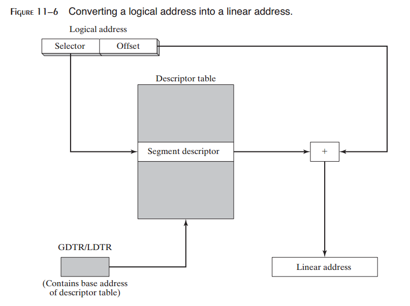
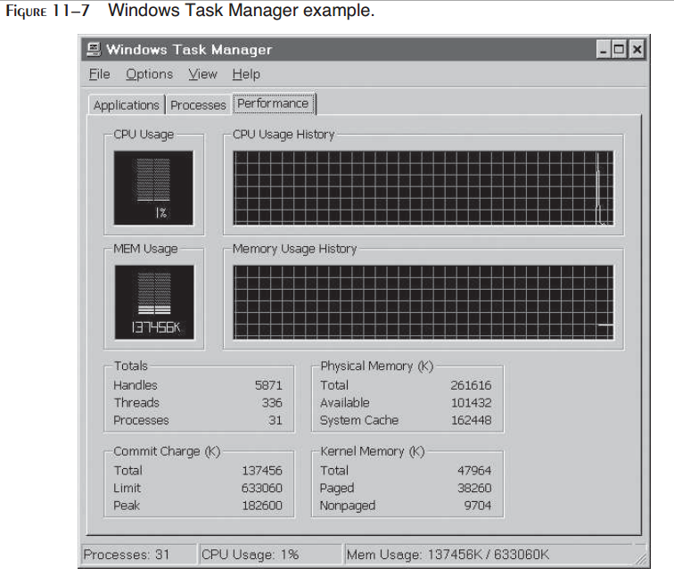
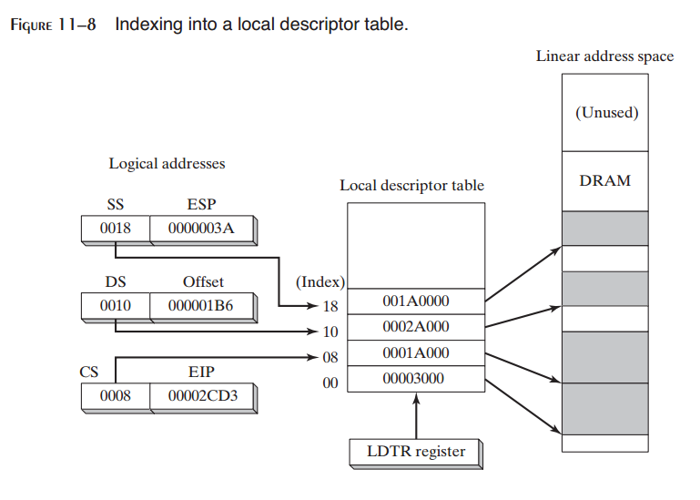
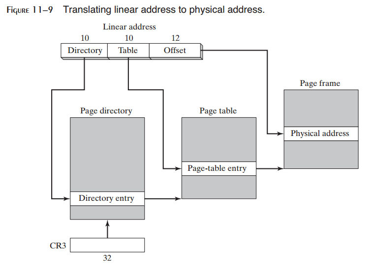

11 MS-Windows Programming
^^^^^^^^^^^^^^^^^^^^^^^^^^^^^^^

11.1 Win32控制台编程
----------------------

在前面的章节中，毫地疑问，你会好奇我们如何实现本书的链接库（Irvine32与Irvine64）。

11.4 x86内存管理
-----------------------

在本节中，我们将会概述Windows 32位内存管理，展示它如何使用直接内建于x86处理器中的功能。我们主要关注于内存管理的两个方面：

* 将逻辑地址转换为线性地址
* 将线性地址转换为物理地址（分页）

让我们简要回顾一下第2中介绍的一些x86内存管理的术语，由下述开始：

* **多任务** 允许在同一时刻运行多个程序（或任务）。处理器将时间分配给所有正在运行的程序。
* **段** 是包含代码或数据的程序所用的尺寸可变的内存区域。
* **分段** 为内存段彼此隔离提供了一种方法。这允许多个程序同时运行而不互相影响。
* **段描述符** 是表明并描述单个内存段的64位值。它包含关于段的基址，访问权限，尺寸限制，类型以及用法的信息。

现在我们向列表中添加两个新术语：

* **段选择符** 是存储在段寄存器（CS，DS，SS，ES，FS或GS）中的16位值。
* **逻辑地址** 是段选择符与32位偏移量的组合。

在本书中完全忽略了段寄存器，因为它们永远不会为用户程序直接修改。我们仅关注于32位数据偏移。然而，由系统程序员的角度来看，段寄存器很重要，因为它们包含对内存段的间接引用。

11.4.1 线性地址
>>>>>>>>>>>>>>>>>>>>

将逻辑地址转换为线性地址
::::::::::::::::::::::::::::

多任务操作系统允许多个程序（任务）同时在内存中运行。每个程序有其自己唯一的数据区域。假定有三个程序，每个程序包含一个位于偏移200h处的变量，这三个变量是如何彼此分离而不被共享的呢？此问题的答案就在于x86处理器使用一步或两个处理来将每个变量的偏移转换为唯一的内存地址。

第一步是将段值与变量的偏移组合来生成线性地址。此线性地址是变量的物理地址。但操作系统，例如MS-Windows与Linux应用一种被称为分页的特性允许程序使用比计算机中可用的物理内存更大的线性内存。它们必须使用被称为分页转换的第二步将线性地址转换为物理地址。我们会在11.4.2节中解释分页转换。

首先，让我们来看一下处理器使用段与偏移来确定变量的线性地址的方式。每个段选择符指向一个段描述符（位于描述符表中），每个段描述符包含内存段的基地址。逻辑地址中的32位偏移被加到段的基地址，生成32位线性地址，如图11-6所示。

*线性地址* 线性地址是位于0至FFFFFFFFh之间的32位整数，它指向内存地址。如果禁止了分页特性，则线性地址也是目标数据的物理地址。

分页
::::::::::

分页是x86处理器的一个重要特性，它使得计算机运行程序的组合成为可能，否则内存不足运行该程序。处理是通过初始仅将程序的一部分加载到内存中，而将其余部分保留在硬盘上来实现的。程序所用的内存被分割为页的小单元，每个页通常为4K字节。随着每个程序的运行，处理器选择性地由内存中卸载不活动的页，并加载另一个立即被需要的页。

操作系统维护一个页目录与页表集合来跟踪当前内存中所有程序所用的页。当程序试图访问线性地址空间中的某个地址时，处理器自动将线性地址转换为物理地址。这一转换被称为页转换。如果所请求的页并不在内存中，处理器中断程序并产生页错误。操作系统在程序可以恢复之前将所需要的页由硬盘拷贝到内存中。由应用程序的视角来看，页错误与页转换是自动发生的。

你可以激活名为任务管理器的Microsoft Windows实用程序，并可以看到物理内存与虚拟内存之间的区别。图11-7中可以看到256M字节的物理内存。当前使用中的虚拟内存总量为任务管理器的Commit Charge部分。虚拟内存限制为633M字节，明显大于计算机的物理内存尺寸。

描述符表
:::::::::::::::

段描述符有两种表类型：全局描述符表与局部描述符表。

全局描述符表（GDT） GDT是在操作系统启动过程中将处理器切换保护模式时创建的。其基地址存储在GDTR（全局描述符表寄存器）中。表包含指段的表项（称为段描述符）。操作系统可以选择所有程序用的段存储到GDT中。

局部描述符（LDT） 在多任务操作系统中，每个任务或程序通常会被赋给其自己的段描述表，称不LDT。LDTR寄存器包含程序的LDT的地址。每个段描述符包含线性地址空间内段的基地址。该段通常与其他段区别开来，如图11-8所示。其中显示了三个不同的逻辑地址，每一个选择LDT中的不同项。在该图中，我们假定分页被禁止，从而线性地址空间同时为物理地址空间。

段描述符细节
::::::::::::::::

除了段的基地址之外，段描述符包含表明段限制与段类型的位映射域。只读段类型的一个示例为代码段。如果程序试图修改只读段，则会产生处理器错误。

段描述符包含保护操作系统不被其他应用程序访问的保护级别。下述为单个选择符域的描述：

*基地址*：在4GB线性地址空间中定义段起始位置的32位整数。

*权限级别*：每个段可以被赋值0到3之间的一个权限级别，其中0为最高权限，通常用于操作系统内核代码。如果较高权限级别的程序试图访问较低权限级别的段，则会产生处理器错误。

*段类型*：表明段类型，指明对段的访问类型，以及段的增长（向上或向下）的方向。数据（包括栈）段可以是只读或读/写，并且能够向上或向下增长。代码段可以是只执行或执行/只读。

*段存在标记*：此标记位表明该段当前是否位于物理内存中。

*粒度标记*：确定段的极限域的解释。如果该位被清除，段的极限解释为字节单元。如果该位被设置，段的极限被解释为4096字节单元。

*段极限*：20位整数指定段的尺寸大小。基于粒度标记，它可以下述两种方式的一种进行解释：

* 段中的字节数，由1到1MB范围。
* 4096字节单元的数量，允许段的尺寸大小范围为4KB到4GB。

11.4.2 页转换
>>>>>>>>>>>>>>>>>>>>>

当允许分页时，处理器必须将32位线性地址转换为32位物理地址。有三种结构应用于该过程：

* 页目录：多至1024个32位页目录项的数组。
* 页表：多至1024个32位页表项的数组。
* 页：4KB或4MB地址空间。

为简化下述讨论，我们假定使用4KB页。

线性地址空间被分为三个域：指向页目录项的指针，指向页表项的指针，以及页帧中的偏移。控制寄存器（CR3）包含页目录的起始地址。当执行线性地址到物理地址的转换时，会执行下述步骤，如图11-9所示：

1. 线性地址指向线性地址空间中的位置。
2. 线性地址中的10位目录域是页目录项的索引。页目录项包含页表的基地址。
3. 线性地址中的10位表域是表示为页目录项的页表中的索引。该位置处的页表项包含物理内存中页的基地址。
4. 线性地址中的12位偏移被添加到页的基地址，生成操作数的实际物理地址。

操作系统可以选择将单个页目录用于所有运行的程序或任务，或者每个任务一个页目录，或者是两者的组合。

Windows虚拟机器管理器
:::::::::::::::::::::::::::

现在我们已经大致了解了IA-32是如何管理内存的，了解Windows是如何进行内存管理的是一件有趣的事。下面是在线Microsoft文档中的一段话：

虚拟机器管理器（VMM）是Windows核心中的32位保护模式操作系统。它创建，运行，监视与终止虚拟机器。它管理内存，进程，中断以及异常。它处理虚拟设备，允许他们解析控制对硬件与所安装软件的访问的中断与错误。VMM与虚拟设备以0级权限运行于32位平坦模型地址空间中。系统创建两个全局描述符表项（段描述符），一个用于代码，而另一个用于数据。段固定于线性地址0处。VMM提供多线程，抢占式多任务。它通过在程序运行所在用的虚拟机器之间共享CPU时间实现多应用的并行运行。

由上面一段话，我们可以将术语虚拟机器解释为Intel中的进程或任务。它由程序码，支持软件，内存以及寄存器组成。每个虚拟机器被赋予其自己的地址空间，I/O端口空间，解析向量表，以及局部描述符表。运行虚拟8086模式下的应用运行3级权限运行。在Windows中，保护模式的程序运行权限0与3级别。