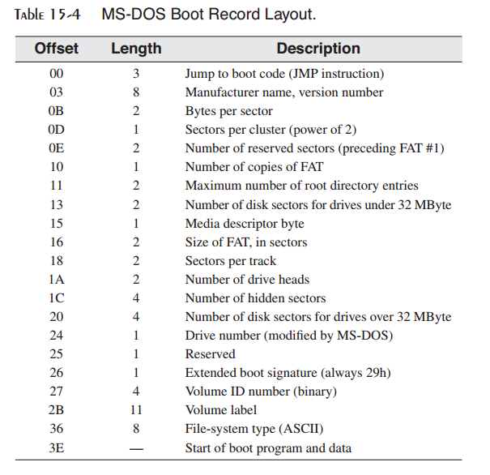

15 磁盘基础
^^^^^^^^^^^^^^^^^^

15.1 磁盘存储系统
-------------------

在本章中，我们介绍磁盘存储系统基础。我们同时展示磁盘存储如何与旧Windows系统中的BIOS级磁盘存储相关，以及MS-Windows如何与应用程序交互来提供对文件和目录的访问。系统BIOS首次在2.5节中提到。当你考虑磁盘存储时，计算机的输入输出访问的不同层间的交互则是很明显的（图15-1）：

* 最底层为磁盘控制器固件，它使用智能控制芯片来为特定的磁盘驱动品牌与模型提供磁盘几何（物理位置）映射。
* 下一层为系统BIOS，它为操作系统提供一个低层功能集合来执行诸如扇区读取，扇区写入，以及轨道格式化等操作。
* 接下来的最高层为操作系统API，它提供了一个API函数集合为诸如打开与关闭文件，设置文件属性，读取文件以及写入文件等提供服务。

所有的磁盘存储系统有一些共同特点：它们处理数据的物理分区，在文件级别访问数据，并且将文件名映射为物理存储。在硬件层级，磁盘存储是由碟片，面，轨道，柱面以及扇区的角度来描述的。在系统BIOS层级，磁盘存储是由簇与扇区的角度来描述。在OS层级，磁盘存储是由目录与文件的角度来描述。

*汇编语言程序* 以汇编语言编写的用户层程序可以在MS-DOS，Windows 95，98，2000等系统下直接访问系统BIOS。例如，你也许希望以非常规的格式存储和获取数据，恢复丢失的数据，或是在磁盘硬件上执行诊断。在本章中，我们将会展示系统BIOS文件与扇区功能的示例。为了演示通常的系统级数据访问，在本章的最后列出了大量用于驱动器与目录操作的MS-DOS函数。

如果你正在使用最新的32位Windows，用户级程序仅可以使用Win32 API访问磁盘系统。这强化了系统安全性，并且仅能为运行最高权限级别的设备驱动器程序所绕过。

15.1.1 轨道，柱面与扇区
>>>>>>>>>>>>>>>>>>>>>>>>>

如图15.2所示，通常的硬件驱动器由多个安装到以固定速度旋转的主轴上的多个碟片构成。在每个碟片的表面上是记录磁脉冲的读/写头。读/写头以小步向碟片中心或远离碟片中心做径向运动。

磁片表面被格式化为不可见的同轴环，被称为轨道，数据以磁方式存储于其上。一个普通的3.5寸硬盘可以包含上千条轨道。将读/写由一个磁道移动另一个磁道被称为寻道。平均寻道时间是磁盘速度度量的一种类型。另一种度量类型是RPM（每分钟转数），通常为7200。磁盘的外层磁道是磁道0，磁道编号向中心方向递增。

柱面是由读/写头的同一位置可访问的所有磁道。文件初始时使用相邻的柱面存储在磁盘上。这减少了读/写头的移动量。

扇区是512字节的磁道部分，如图15-3所示。物理扇区是制造商使用所谓的低级格式化技术在磁盘上做的磁标记（不可见）。无论安装何种操作系统，扇区的大小不会改变。一个硬盘的每个磁道上可以包含63或更多的扇区。

物理磁盘几何是一种描述磁盘结构的方式，从而使其可以为系统BIOS读取。它由每个磁盘的柱面数，每个柱面的读/写头数，以及每个磁道的扇区数构成，并存在下述关系：

* 每个磁盘的柱面数等于每个面的磁道数。
* 磁道总数等于柱面数乘以每个柱面的读/写头数。

*分片* 文件随着时间的变化会变得超出一个磁盘时，它们会变得碎片化。一个分片文件是是其扇区不再位于磁盘的连续区域。当发生这种情况时，在读取文件数据时，读/写头需要跨过某些磁道。这会降低文件的读写速度。

*转换为逻辑扇区号* 硬盘控制器会执行一种转换操作，将物理磁盘几何转换为操作系统可以理解的逻辑结构。在转换之后，操作系统可以使用逻辑扇区号。逻辑扇区号总是顺序编号的，由零开始。

15.1.2 磁盘分区（卷）
>>>>>>>>>>>>>>>>>>>>>>>

在MS-Windows下，一个物理硬盘可以分为一个或多个被称为分区或卷的逻辑单元。每个格式化的分区被表示为一个单独的盘符，例如C，D，或E，而且它可以在多种文件系统之中选择进行格式化的系统。一个驱动器可以包含两种分区类型：主分区与扩展分区。

主分区通常是可启动分区，并存有操作系统。扩展分区可以被划分为无限数量的逻辑分区。每个逻辑分区被映射到一个盘符（C，D，E，等）。逻辑分区不可启动。可以将每个系统或逻辑分区格式化为不同的文件系统。

例发， 假定20GB硬盘驱动器被划分为一个10GB的主分区（驱动器C），我们在其上安装操作系统。其扩展分区为10GB。我们可以将后者划分为2GB与8GB的两个逻辑分区，并且使用各种文件系统，例如FAT16，FAT32或NTFS，进行格式化。假定不再有其他已安装的硬盘驱动器，则两个逻辑分区可以被赋予盘符D与E。

*多启动系统* 创建多个主分区，每个主分区启动（加载）不同的操作系统的情况非常常见。这使得在不同的环境中测试软件并且利用更为高级的操作系统的安全特性成为可能。在广泛可用的可视化软件之前，软件开发者使用主分区为开发中的软件创建测试环境。然后他们可以保留另一个存储有已经过测试并且可为客户所用的生产软件的主分区。

与之相对，逻辑分区主要用于数据。它使得不同的操作系统共享同一个逻辑分区中的数据成为可能。例如，所有最新的MS-Windows版本以及Linux可以读取FAT32磁盘。计算机可以由这些操作系统启动并且读取位于共享逻辑分区中的相同数据文件。

*主启动记录* 主启动记录（MBR）是在硬盘上的第一个分区被创建时创建的，位于驱动器的第一个逻辑扇区中。MBR包含下述内容：

* 磁盘分区表，描述磁盘上所有分区的大小与位置。
* 位于分区的启动扇区中的一个小程序，该程序将控制权传递给扇区中加载操作系统的程序。

15.2 文件系统
-------------------

所有的操作系统都有某种类型的磁盘管理系统。在最低层次，它管理分区。在次高层次，它管理文件与目录。文件系统必须跟踪每个磁盘文件的位置，大小以及属性。让我们看一下最初为IBM-PC所设计，并且在Windows下依然可用的FAT类型文件系统。FAT类型文件系统使用下列结构：

* 逻辑扇区到簇的映射，所有文件与目录存储的基本单元。
* 文件与目录名到簇序列的映射。

簇是文件所用的最小空间单元；它由一个或多个相邻的磁盘扇区组成。文件系统将每个文件存储为相链接的簇序列。簇的大小同时依赖于所用的文件系统的类型及其磁盘分区的大小。图15-4显示了由两个2048字节簇构成的文件，每一个包含四个512字节扇区。簇链是由一个记录文件所用的所用簇的文件分配表（FAT）来引用的。指向FAT中第一个簇项的指针存储在每个文件的目录项中。15.3.2节更详细地解释了FAT。

*浪费的空间* 甚至一个小文件也要求至少一个簇的磁盘存储，从而会导致浪费的空间。图15-5显示了一个8200字节的文件，它可以完全填充两个4096字节的簇，而仅使用第三个簇的8个字节。这会导致第三个簇的4088字节的浪费空间。4096（4KB）大小的簇被认为是存储小文件的有效方法。想像一下如果我们的8200字节的文件存储在一个具有32KB簇的卷上会发生什么情况。在那种情况下，24568字节（32768－8200）会被浪费。在具有大小小文件的卷上，小簇尺寸是最佳的。

*Windows 2000/XP示例* Windows2000与WindowsXP下所使用的硬盘标准簇尺寸与文件系统类型如表15-1所示。这些值经常会随着新操作系统的发布而发生变化，所以这里显示的信息仅用于展示目的。

15.2.1 FAT12
>>>>>>>>>>>>>>>>>>>>

FAT12文件系统首先被用于IBM-PC磁盘。它依然被所有的MS-Windows版本以及Linux所支持。它的簇尺寸仅为512字节，因而它适用于存储小文件。其文件分配表中的每一项为12位长。FAT12卷存储小于4087个簇。

15.2.2 FAT16
>>>>>>>>>>>>>>>>>>>

FAT16文件系统是唯一用于MS-DOS下格式化硬盘的文件系统。它为所有的MS-Windows版本以及Linux所支持。FAT16的缺点有：

* 不能用于超过1GB的卷的存储，因为FAT16大簇尺寸。
* 文件分配表中的每一项为16位长，限制了簇的总数。
* 卷可以包含4087至65526之间的簇。
* 启动扇区未备份，因而一个扇区的读取错误会导致灾难。
* 不存在内建的文件系统安全或单个的用户权限。

15.2.3 FAT32
>>>>>>>>>>>>>>>>>>>

FAT32文件系统是由Windows 95所引入，并且在Windows 98下进行了重定义。相对于FAT16，它的改进有：

* 单个文件最大可达4GB减去2个字节。
* 文件分配表中的每一项为32位长。
* 每个卷可以有65526至268435456个簇。
* 根目录可以位于磁盘上的位置位置，并且几乎可以为任意尺寸。
* 卷可以高达32GB。
* 相比于FAT16，在存储有1GB至8GB的卷上使用较小的簇尺寸，从而会导致较小的浪费空间。
* 启动扇区包含重要数据结构的备份。这意味着FAT32驱动器对于单个点的失败并不像FAT驱动器那样易受影响。

15.2.4 NTFS
>>>>>>>>>>>>>>>>>>>>>>>

NTFS文件系统为所有最新的Windows版本所支持。它在FAT32之上进行了重大改进：

* NTFS处理大卷，可以应用于单个硬盘驱动器也可以跨越多个硬盘驱动器。
* 对于大于2GB的磁盘默认簇尺寸小4KB。
* 支持最多255个字符长度的Unicode文件名（非ANSI字符）。
* 允许在文件或目录下进行权限设置。可以被单个用户或用户组访问。不同的访问层级（读，写，修改，等等）。
* 在文件，目录以及卷上提供内建数据加密与压缩。
* 可以在一个修改通道（change journal）内跟踪长时间内对单个文件的修改。
* 可以为单个用户或用户组设置磁盘配额。
* 为数据错误提供鲁棒性恢复。通过记录事务日志自动修复错误。
* 支持磁盘镜像，即相同的数据被同时写入多个驱动器。

15.2.5 主磁盘区域
>>>>>>>>>>>>>>>>>>>>

FAT12与FAT16卷拥有一个为启动记录，文件分配表以及根目录所保留的特定位置。（FAT32驱动器上的根目录并没有存储在固定位置。）每个区域的尺寸大小是在卷被格式化时确定的。例如，3.5英寸，1.44MB磁盘上的扇区映射如表15-3所示。

*启动记录* 启动记录包含一个存储有卷信息的表以及一个新MS-DOS加载到内存中的简短启动程序。启动程序检测特定操作系统文件的存在并将其加载入到内存中。表15-4展示了通常MS-DOS启动记录中的域列表。域的确切排列在不同的操作系统版本之间会略有不同。

*文件分配表（FAT）* 文件分配表相当复杂，因而我们会在15.3.3节中进行详细讨论。

*根目录* 根目录是磁盘卷的主目录。目录项可以是其目录名或对文件的引用。对文件引用的目录项包括文件名，尺寸，属性以及文件所用的开始簇号。

*数据区域* 磁盘的数据区域是存储文件与子目录的区域。

15.3 磁盘目录
-------------------

所用的FAT风格与NTFS磁盘具有一个包含磁盘上主要文件列表的根目录。根目录也会包含其名目录的名字，被称为子目录。子目录可以被认为是其目录名字出现在其他目录中的目录－后者被称为父目录。每个子目录可以包含文件名以及其他的目录名。结果是类似于树的结构，根目录位于顶部，向下分支到其他目录（图15-6）。

每个目录名以及目录中的每个文件是以其上的目录名为限定的，称之为路径。例如，驱动器C上ASM下的SOURCE目录中的PROG1.ASM文件的路径为：

.. code-block::

    C:\ASM\SOURCE\PROG1.ASM

通常，当输入输出操作发生在当前磁盘驱动器上时，驱动器盘符可以由路径中省略。在我们示例目录树中目录名的完整列表如下：

.. code-block::

    C:\
    \ASM
    \ASM\LIB
    \ASM\SOURCE
    \JAVA
    \JAVA\CLASSES
    \JAVA\SOURCE
    \CPP
    \CPP\RUN
    \CPP\SOURCE

所以，文件规范可以采用单个文件名或目录路径后跟文件名的形式。也可以前置驱动器规范。

15.3.1 MS-DOS目录结构
>>>>>>>>>>>>>>>>>>>>>>>>>>

如果我们尝试解释基于Intel计算机上可用的各种文件格式，我们至少需要包含Linux，MS-DOS以及MS-Windows的所有版本。相反，让我们使用MS-DOS作为一个基础示例，更详细地解释其结构。然后我们会描述MS-Windows中可用的扩展名结构。

每个MS-DOC目录项为32字节长，并且包含表15-5中的域。filename域保存文件名，子目录，或磁盘卷标签。第一个字节表明文件的状态，或者可以是文件名的第一个字符。可能的状态值如表15-6所示。16位starting cluster number域指分配给文件的第一个簇，以及文件分配表（FAT）中的起始项。file size域是表明文件大小的32位值，以字节计。

属性域
::::::::::::

attribute域表示文件类型。该域为位映射，并且通常包含图15-7中所示的值的组合。两个保留（reserved）位总是。当文件被修改时，archive位会被设置。如果该项包含子目录名，则subdirectory位会被设置。volume label将该项标识为磁盘卷名。system file位表示该文件是操作系统的组成 部分。hidden file位使得文件隐藏，其名字不会出现在目录显示中。read-only位阻止文件被删除或修改。最后，属性值0Fh表示当前目录项用于扩展文件名。

日期与时间
::::::::::::::

日期戳域（图15-8）表示文件被创建或上次修改的时间，以位映射值表示。year值为0至119之间，并且会被自动添加1980（IBM-PC发布的年份）。month值位于1与12之间，而day值位于1与31之间。

时间戳域（图15-9）表示文件被创建或上次被修改的时间，表示为位映射值。hours位于0至23之间，minutes位于0至59之间，而seconds位于0至59之间，存储为2秒递增量。例如，10100二进制值等于40秒。图15-10中的时间戳表示14:02:40。

*文件目录项示例* 让我们看一下MAI.CPP文件的目录项（图15-11）。该文件具有一个普通属性，并且其archive位（20h）已被设置，表明该文件已被修改。其起始簇号为0020h，其大小为000004EEh字节，时间域为4DBDh（9:45:58），而日期域为247Ah（March 26, 1998）。

在此图中，时间，日期以及起始簇号为16位值，以小端顺序（低字节后为高字节）存储。文件size域为双字，也以小端序存储。

15.3.2 MS-Windows中的长文件名
>>>>>>>>>>>>>>>>>>>>>>>>>>>>>>>>>

在MS-Windows中，超过8+3字符的文件名或者使用大小组合的文件名被赋予多个磁盘目录项。如果属性字节等于 0Fh，系统查看偏移0处的字节。如果高部分数值等于4，则该项开始长文件名序列。低部分数值表示长文件名所占用的数目项数量。后续项计数由n-1至1，其中n为项数量。例如，如果一个文件名需要三个目录项，第一个状态字节为43h。后续项状态字节为02h与01h，如下表所示：

*示例* 为了演示，让我们使用一个具有26个字符文件名的ABCDEFGHIJKLMNOPQRSTUV.TXT，并将其存储为A驱动器根目录下的文本文件。接下来，我们由命令行提示中运行DEBUG.EXE，并将目录扇区加载到偏移量100处。其后跟随D（导出命令）：

.. code-block::

    L 100 0 13 5 (load sectors 13h - 17h)
    D 100 (dump offset 100 on the screen)

Windows会为此文件创建三个目录项，如图15-12所示。

让我无名火01C0h处的目录项开始。第一个字节包含01，标记该项为长文件序列的最后。其后跟随文件名的前13个字符ABCDEFGHIJKLM。每个Unicode字符为16位，以小端顺序存储。注意偏移0B处的属性字节等于0F，表明这是一个扩展文件名项（具有该属性的文件名会自动为MS-DOS所忽略）。

01A0h处的项包含长文件名的最后13个字符，即NOPQRSTUV.TXT。

在偏移01E0h处，自动生成的短文件名由长文件名的前六个字符构成，后跟~1，然后是源文件名中最的一个句点之后的前三个字符。这些字符是一个字节的ASCII码。短文件名项同时包含文件创建日期与时间，最后访问日期，最后修改的日期与时间，起始簇号，以及文件尺寸。图15-13展示了Windows资源管理器属性对话中所显示的信息，它匹配了源目录数据。

15.3.3 文件分配表（FAT）
>>>>>>>>>>>>>>>>>>>>>>>>>>>>>>

FAT12，FAT16，以及FAT32文件系统使用一种被称为文件分配表（FAT）的表格记录每个文件在磁盘上的位置。FAT映射磁盘簇，通过特定的文件展示其所属关系。每个项与一个簇号相对应，而每个簇包含一个或多个扇区。换句话说，第10个FAT项表示磁盘上的第10个簇，而第11个项表示第11个簇，依次类推。

FAT中的每个文件被表示为链表，称为簇链。每个FAT项包含一个表示下一个项的整数。图15-14中展示了两个簇，一个用于File1，而另一个用于File2。File1占用了簇1，2，3，4，8，9以及10。File2占用簇5，6，7，11与12。文件的最后一个FAT项中的eoc（end of chain）是一个在链中标记最后一个簇的预定义整数值。

当文件被创建时，操作系统查找FAT中第一个可用的簇项。当不存在足够的连续簇来存储整个文件时，会产生空隙。在前面的图中，File1与File2均为此种情况。当一个文件被修改并保存回磁盘时，其簇链经常会增加碎片化。如果多个文件变得碎片化，磁盘性能会开始下降，因为读/写头必须在不同的轨道之间跳转以定位文件的所有簇。大多数操作系统提供了一个内建的磁盘碎片程序。

15.4 读写磁盘扇区
---------------------

INT 21h函数 7305h（绝对磁盘读写）允许你读取逻辑磁盘扇区。类似于所有INT函数，它被设计仅用于16位实地址模式。由于所涉及的复杂性，我们不会在保护模式中尝试调用INT 21h（或是其他中断）函数。

函数7305h作用于Windows 95，98，以及Windows Me下的FAT12，FAT16，以及FAT32文件系统。由于安全性原因，它不会作用于Windows NT，2000，XP或之后的操作系统。被允许读写磁盘扇区的程序可以很容易越过文件与目录共享权限。当调用函数7305h时，传递下列参数：

DISKIO结构包含起始扇区号，要读写的扇区数以及扇区缓冲区的段/偏移地址：

.. code-block::

    DISKIO STRUCT
        startSector DWORD 0 ; starting sector number
        numSectors WORD 1 ; number of sectors
        bufferOfs WORD OFFSET buffer ; buffer offset
        bufferSeg WORD SEG buffer ; buffer segment
    DISKIO ENDS

下面是使用DISKIO结构变量存储扇区数据的输入缓冲区的示例：

.. code-block::

    .data
    buffer BYTE 512 DUP(?)
    diskStruct DISKIO <>
    diskStruct2 DiskIO <10,5> ; sectors 10,11,12,13,14

当调用7305h时，传递给SI的参数确定是要读取还是写入扇区。要读取扇区，将位0清除；要写入扇区，设置位0。另外，当使用下列模式写入扇区时，需要配置位13，14以及15：

其余位（1至12）必须总被清除。

*示例1：* 下述语句由磁盘C上读取一个或多个扇区：

.. code-block::

    mov ax,7305h ; absolute Read/Write
    mov cx,0FFFFh ; always this value
    mov dl,3 ; drive C
    mov bx,OFFSET diskStruct ; DISKIO structure
    mov si,0 ; read sector
    int 21h

*示例2：* 下述语句向磁盘A写入一个或多个扇区：

.. code-block::

    mov ax,7305h ; absolute Read/Write
    mov cx,0FFFFh ; always this value
    mov dl,1 ; drive A
    mov bx,OFFSET diskStruct ; DISKIO structure
    mov si,6001h ; write normal sector(s)
    int 21h

15.4.1 扇区显示程序
>>>>>>>>>>>>>>>>>>>>

让我们通过编写一个读取并以ASCII格式显示单个扇区的程序来很好地利用我们所学习到的关于扇区的内容。其伪代码如下：

.. code-block::

    Ask for starting sector number and drive number
        do while (keystroke <> ESC)
        Display heading
        Read one sector
        If MS-DOS error then exit
        Display one sector
        Wait for keystroke
        Increment sector number
    end do

*程序列表* 下面是16位Sector.asm程序的完整源码列表。它可以运行于Windows 95，98以及Me下的实地址模式中，但由于与磁盘访问相关的安全性，此程序不可运行于Windows NT，2000，XP以及之后的操作系统下：

.. code-block::

    ; Sector Display Program (Sector.asm)
    ; Demonstrates INT 21h function 7305h (ABSDiskReadWrite)
    ; This Real-mode program reads and displays disk sectors.
    ; Works on FAT16 & FAT32 file systems running under Windows
    ; 95, 98, and Millenium.
    INCLUDE Irvine16.inc
    Setcursor PROTO, row:BYTE, col:BYTE
    EOLN EQU <0dh,0ah>
    ESC_KEY = 1Bh
    DATA_ROW = 5
    DATA_COL = 0
    SECTOR_SIZE = 512
    READ_MODE = 0 ; for Function 7505h
    DiskIO STRUCT
        startSector DWORD ? ; starting sector number
        numSectors WORD 1 ; number of sectors
        bufferOfs WORD OFFSET buffer ; buffer offset
        bufferSeg WORD @DATA ; buffer segment
    DiskIO ENDS

    .data
    driveNumber BYTE ?
    diskStruct DiskIO <>
    buffer BYTE SECTOR_SIZE DUP(0),0 ; one sector
    curr_row BYTE ?
    curr_col BYTE ?

    ; String resources
    strLine BYTE EOLN,79 DUP(0C4h),EOLN,0
    strHeading BYTE "Sector Display Program (Sector.exe)"
        BYTE EOLN,EOLN,0
    strAskSector BYTE "Enter starting sector number: ",0
    strAskDrive BYTE "Enter drive number (1=A, 2=B, "
        BYTE "3=C, 4=D, 5=E, 6=F): ",0
    strCannotRead BYTE EOLN,"*** Cannot read the sector. "
        BYTE "Press any key...", EOLN, 0
    strReadingSector \
        BYTE "Press Esc to quit, or any key to continue..."
        BYTE EOLN,EOLN,"Reading sector: ",0

    .code
    main PROC
        mov ax,@data
        mov ds,ax
        call Clrscr
        mov dx,OFFSET strHeading ; display greeting
        call Writestring ; ask user for...
        call AskForSectorNumber
    L1: call Clrscr
        call ReadSector ; read a sector
        jc L2 ; quit if error
        call DisplaySector
        call ReadChar
        cmp al,ESC_KEY ; Esc pressed?
        je L3 ; yes: quit
        inc diskStruct.startSector ; next sector
        jmp L1 ; repeat the loop
    L2: mov dx,OFFSET strCannotRead ; error message
        call Writestring
        call ReadChar

    L3: call Clrscr
        exit
    main ENDP
    ;-----------------------------------------------------
    AskForSectorNumber PROC
    ;
    ; Prompts the user for the starting sector number
    ; and drive number. Initializes the startSector
    ; field of the DiskIO structure, as well as the
    ; driveNumber variable.
    ;-----------------------------------------------------
        pusha
        mov dx,OFFSET strAskSector
        call WriteString
        call ReadInt
        mov diskStruct.startSector,eax
        call Crlf
        mov dx,OFFSET strAskDrive
        call WriteString
        call ReadInt
        mov driveNumber,al
        call Crlf
        popa
        ret
    AskForSectorNumber ENDP

    ;-----------------------------------------------------
    ReadSector PROC
    ;
    ; Reads a sector into the input buffer.
    ; Receives: DL = Drive number
    ; Requires: DiskIO structure must be initialized.
    ; Returns: If CF=0, the operation was successful;
    ; otherwise, CF=1 and AX contains an
    ; error code.
    ;-----------------------------------------------------
        pusha
        mov ax,7305h ; ABSDiskReadWrite
        mov cx,-1 ; always -1
        mov bx,OFFSET diskStruct ; sector number
        mov si,READ_MODE ; read mode
        int 21h ; read disk sector
        popa
        ret
    ReadSector ENDP

    ;-----------------------------------------------------
    DisplaySector PROC
    ;
    ; Display the sector data in <buffer>, using INT 10h
    ; BIOS function calls. This avoids filtering of ASCII
    ; control codes.
    ; Receives: nothing. Returns: nothing.
    ; Requires: buffer must contain sector data.
    ;-----------------------------------------------------
        mov dx,OFFSET strHeading ; display heading
        call WriteString
        mov eax,diskStruct.startSector ; display sector number
        call WriteDec
        mov dx,OFFSET strLine ; horizontal line
        call Writestring
        mov si,OFFSET buffer ; point to buffer
        mov curr_row,DATA_ROW ; set row, column
        mov curr_col,DATA_COL
        INVOKE SetCursor,curr_row,curr_col
        mov cx,SECTOR_SIZE ; loop counter
        mov bh,0 ; video page 0
    L1: push cx ; save loop counter
        mov ah,0Ah ; display character
        mov al,[si] ; get byte from buffer
        mov cx,1 ; display it
        int 10h
        call MoveCursor
        inc si ; point to next byte
        pop cx ; restore loop counter
        loop L1 ; repeat the loop
        ret
    DisplaySector ENDP
    
    ;-----------------------------------------------
    MoveCursor PROC
    ;
    ; Advance the cursor to the next column,
    ; check for possible wraparound on screen.
    ;-----------------------------------------------
        cmp curr_col,79 ; last column?
        jae L1 ; yes: go to next row
        inc curr_col ; no: increment column
        jmp L2
    L1: mov curr_col,0 ; next row
        inc curr_row
    L2: INVOKE Setcursor,curr_row,curr_col
        ret
    MoveCursor ENDP

    ;-----------------------------------------------------
    Setcursor PROC USES dx,
    row:BYTE, col:BYTE
    ;
    ; Set the screen cursor position
    ;-----------------------------------------------------
        mov dh, row
        mov dl, col
        call Gotoxy
        ret
    Setcursor ENDP
    END main

程序的核心是ReadSector过程，该过程会使用INT 21h函数7305h由磁盘上读取每个扇区。扇区数据会存放在缓冲区中，而缓冲区会被DisplaySector过程显示。

*使用INT 10h* 大多数扇区包含二进制数据，而如果使用INT 21h来进行显示，ASCII控制字符会被过滤。例如，Tab与换行字符会使得显示变得不连续。相反，最好使用INT 10h函数0Ah，它会将0至31的ASCII码显示为图形字符。INT 10h会在第16章中进行描述。由于函数0Ah不会移动光标，必须添加额外的代码使得在显示每个字符之后将光标向右移动一列。SetCursor过程简化了Irvine16库中的Gotoxy过程的实现。

15.5 系统级文件函数
-------------------------

在实地址模式下，INT 21h提供了创建与修改目录，修改文件属性，查找匹配文件，等的系统服务（表15-7）。这些服务通常可用于高级程序语言库。当调用这些服务，函数编号被放置在AH或AX中。其他寄存器可以包含输入参数。让我们仔细了解一些常用的。在附录D中可以找到MS-DOS中断及其描述的详细列表。

Windows 95/85/Me支持所有已有的MS-DOS INT 21h函数并且提供了允许基于MS-DOS的程序利用高级特性，例如长文件名以及排他卷锁，的扩展。INT 21h函数7303h（获取磁盘空闲空间）就是一个增强系统函数的例子。

15.5.1 获取磁盘空闲空间（7303h）
>>>>>>>>>>>>>>>>>>>>>>>>>>>>>>>>>>>>>

INT 21h函数7303h可以用于确定磁盘卷的尺寸以及在FAT16或FAT32驱动器上有多少自由磁盘空间。信息以一个名为ExtGetDskFreSpcStruc的标准结构返回，如下所示：

.. code-block::

    ExtGetDskFreSpcStruc STRUC
        StructSize WORD ?
        Level WORD ?
        SectorsPerCluster DWORD ?
        BytesPerSector DWORD ?
        AvailableClusters DWORD ?
        TotalClusters DWORD ?
        AvailablePhysSectors DWORD ?
        TotalPhysSectors DWORD ?
        AvailableAllocationUnits DWORD ?
        TotalAllocationUnits DWORD ?
        Rsvd DWORD 2 DUP (?)
    ExtGetDskFreSpcStruc ENDS

下面列出了每个域的简要描述：

* StructSize：表示ExtGetDskFreSpcStruc结构的大小的返回值，以字节计。当INT 21h函数7303h（Get_ExtFreeSpace）执行时，它将结构大小放在该成员中。
* Level：输入与返回层级值。该域必须被初始化为零。
* SectorsPerCluster：每个簇中的扇区数量。
* BytesPerSector：每个扇区中的字节数量。
* AvailableClusters：可用的簇数量。
* TotalClusters：卷上的簇数量。
* AvailablePhysSectors：卷上可用的物理扇区数量，并未为压缩调整。
* TotalPhySectors：卷上的物理扇区总量，并未为压缩调整。
* AvailabelAllocationUnits：卷上可用的分配单元数量，并未为压缩调整。
* TotalAllocationUnits：卷上的分配单元总量，并未为压缩调整。
* Rsvd：保留成员。

*调用函数* 当调用INT 21h函数7303h时，需要下列输入参数：

* AX必须等于7303h。
* ES:DI必须指向一个ExtGetDskFreSpcStruc变量。
* CX必须包含ExtGetDskFreSpcStruc变量的大小。
* DS:DX必须指向一个包含驱动器名字的空结束字符串。你可以使用MS-DOS的驱动器规范类型，例如（“C:\”），或者你可以使用通用命名约定卷规范，例如（“\\Server\Share”）。

如果函数执行成功，它会清除进位标记并填充结构。否则，它会设置进位标记。在调用函数之后，下述的计算类型也许会有用：

* 确定以千字节计的卷大小，使用公式（TotalClusters * SectorsPerCluster * BytesPerSector）/1024。
* 确定以千字节计的卷中的自由空间大小，公式为(AvailableClusters * SectorsPerCluster * BytesPerSector)/1024。

磁盘自由空间程序
::::::::::::::::::::::

下面的程序使用INT 21h函数7303h来获取FAT类型驱动器卷上的自由空间信息。它会同时显示卷与自由空间大小。它运行在Windows 95，98以及Millenium系统之下，但是不可运行于Windows NT，2000，XP及其后操作系统上：

.. code-block::

    ; Disk Free Space (DiskSpc.asm)
    INCLUDE Irvine16.inc

    .data
    buffer ExtGetDskFreSpcStruc <>
    driveName BYTE "C:\",0
    str1 BYTE "Volume size (KB): ",0
    str2 BYTE "Free space (KB): ",0
    str3 BYTE "Function call failed.",0dh,0ah,0

    .code
    main PROC
        mov ax,@data
        mov ds,ax
        mov es,ax
        mov buffer.Level,0 ; must be zero
        mov di,OFFSET buffer ; ES:DI points to buffer
        mov cx,SIZEOF buffer ; buffer size
        mov dx,OFFSET DriveName ; ptr to drive name
        mov ax,7303h ; get disk free space
        int 21h
        jc error ; failed if CF = 1
        mov dx,OFFSET str1 ; volume size
        call WriteString
        call CalcVolumeSize
        call WriteDec
        call Crlf
        mov dx,OFFSET str2 ; free space
        call WriteString
        call CalcVolumeFree
        call WriteDec
        call Crlf
        jmp quit
    error:
        mov dx,OFFSET str3
        call WriteString
    quit:
        exit
    main ENDP

    ;------------------------------------------------------------
    CalcVolumeSize PROC
    ;
    ; Calculate and return the disk volume size, in kilobytes.
    ; Receives: buffer variable, a ExtGetDskFreSpcStruc structure
    ; Returns: EAX = volume size
    ; Remarks: (SectorsPerCluster * 512 * TotalClusters) / 1024
    ;------------------------------------------------------------
        mov eax,buffer.SectorsPerCluster
        shl eax,9 ; mult by 512
        mul buffer.TotalClusters
        mov ebx,1024
        div ebx ; return kilobytes
        ret
    CalcVolumeSize ENDP
    
    ;------------------------------------------------------------
    CalcVolumeFree PROC
    ;
    ; Calculate and return the number of available kilobytes
    ; on the given volume.
    ; Receives: buffer variable, a ExtGetDskFreSpcStruc structure
    ; Returns: EAX = available space, in kilobytes
    ; Remarks: (SectorsPerCluster * 512 * AvailableClusters) / 1024
    ;-------------------------------------------------------------
        mov eax,buffer.SectorsPerCluster
        shl eax,9 ; mult by 512
        mul buffer.AvailableClusters
        mov ebx,1024
        div ebx ; return kilobytes
        ret
    CalcVolumeFree ENDP
    END main

15.5.2 创建子目录（39h）
>>>>>>>>>>>>>>>>>>>>>>>>>>>>>

INT 21h函数39h创建一个新的子目录。它接收DS:DX中指向包含路径规范的空结束的字符串的指针。下面的示例展示了如何在默认驱动器的根目录下创建一个名为ASM的子目录：

.. code-block::

    .data
    pathname BYTE "\ASM",0
    .code
        mov ah,39h ; create subdirectory
        mov dx,OFFSET pathname
        int 21h
        jc display_error

如果函数失败则设置进位标记。可能的错误返回代码为3与5。错误3（路径未找到）意味着路径的某部分不存在。假定我们要求OS创建目录ASM\PROG\NEW，但是路径ASM\PROG不存在。此时会生成错误3。错误5（拒绝访问）表明子目录已存在或者路径中的第一个目录为根目录并且已满。

15.5.3 移除子目录（3AH）
>>>>>>>>>>>>>>>>>>>>>>>>>>>>

INT 21h函数3AH移除一个目录。它在DS:DX中接收一个指向所要求驱动器与路径的指针。如果驱动名为空，则使用默认驱动器。下面的代码由驱动器C中移除\ASM目录：

.. code-block::

    .data
    pathname BYTE 'C:\ASM',0
    .code
    mov ah,3Ah ; remove subdirectory
    mov dx,OFFSET pathname
    int 21h
    jc display_error

如果函数失败则设置进位标记。可能的错误代码为3（路径未找到），5（访问被拒绝：目录包含文件），6（非法句柄），以及16（试图移除当前目录）。

15.5.4 设置当前目录（3Bh）
>>>>>>>>>>>>>>>>>>>>>>>>>>>>>>>

INT 21h函数3Bh设置当前目录。它在DS:DX中接收一个指向目标驱动器与路径的空结束的字符串的指针。例如，下述语句将当前目录设置为C:\ASM\PROGS：

.. code-block::

    .data
    pathname BYTE "C:\ASM\PROGS",0
    .code
        mov ah,3Bh ; set current directory
        mov dx,OFFSET pathname
        int 21h
        jc display_error

15.5.5 获取当前目录（47h）
>>>>>>>>>>>>>>>>>>>>>>>>>>>>>>>>

INT 21h函数47h返回一个包含当前目录的字符串。它在DL中接收驱动器编号（0默认，1为A，2为B，等），在DS:SI中接收一个指向64字节缓冲区中的指针。在该缓冲区中，MS-DOS放置由根目录到当前目录的完整路径名的空结束的字符串（驱动器字符与前置反斜线会被忽略）。当函数返回时，如果进位标记被设置，AX中唯一可能的错误返回码为0Fh（非法驱动器）。

在下面的示例中，MS-DOS返回默认驱动器上当前目录路径。假定当前目录为C:\ASM\PROGS，则MS-DOS返回的字符串为"ASM\PROGS"：

.. code-block::

    .data
    pathname BYTE 64 dup(0) ; path stored here by MS-DOS
    .code
        mov ah,47h ; get current directory path
        mov dl,0 ; on default drive
        mov si,OFFSET pathname
        int 21h
        jc display_error

15.5.6 获取与设置文件属性（7143h）
>>>>>>>>>>>>>>>>>>>>>>>>>>>>>>>>>>>>>>>>>

INT 21h函数7143h获取或设置文件属性，以及其他任务。在DX中传递文件名偏移。要设置文件属性，将BL赋为1，并将CX设置为表15-8中的一个或多个属性。_A_NORMAL属性必须被单独使用，而其他属性可以使用+操作符进行组合。

.. image:: _images/table-15-8.png

下面的代码将文件的属性设置为只读和隐藏：

.. code-block::

    mov ax,7143h
    mov bl,1
    mov cx,_A_HIDDEN + _A_RDONLY
    mov dx,OFFSET filename
    int 21h

要获取文件的当前属性，将BX设置为0并调用相同的函数。CX中返回的属性值是2的幂次组合。使用TEST指令来检测单个指令。例如：

.. code-block::

    test cx,_A_RDONLY
    jnz readOnlyFile ; file is read-only

_A_ARCH属性可以与其他属性一同出现。

15.6 本章小结
----------------------

