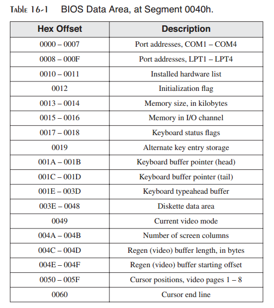
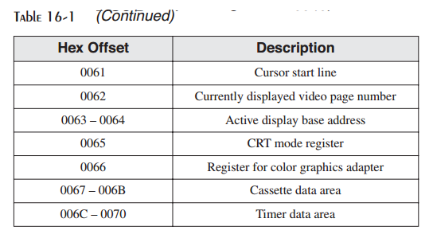
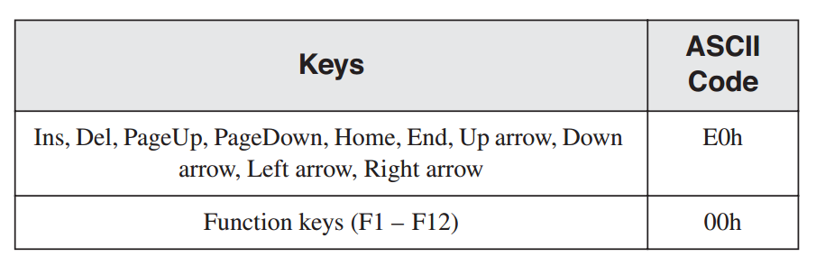
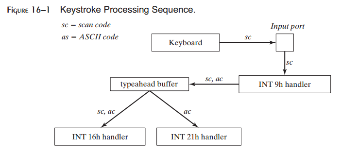
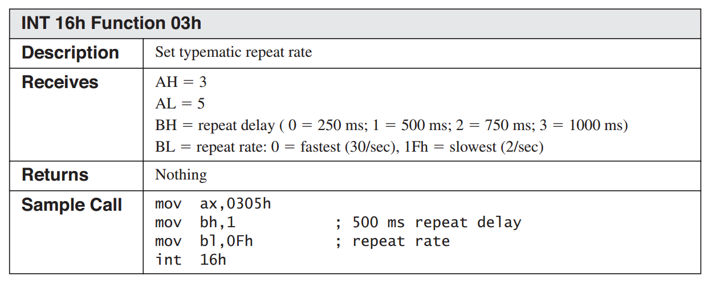
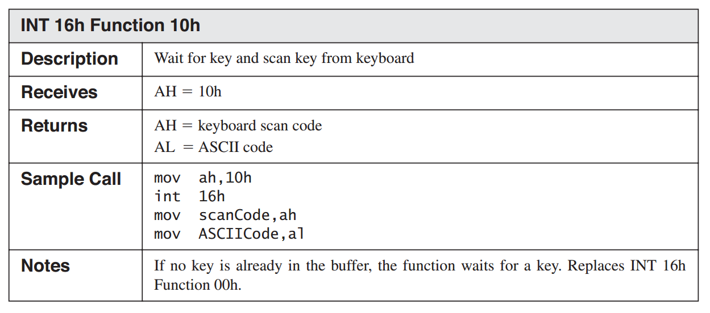
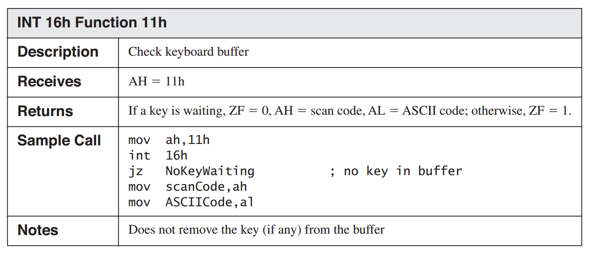
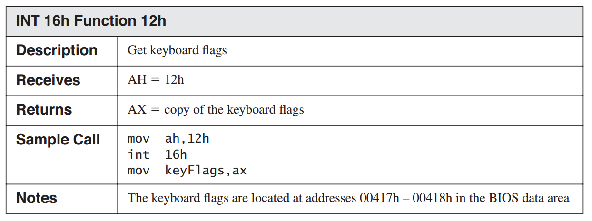

16 BIOS级编程
===========================

阅读本章就如同是对历史的回顾。当第一台IBM-PC出现时，许多程序（包括我自己）希望了解如何进入机器内部直接操作硬件。Peter Norton很快发现所有有用的秘密信息，从而促成了他的标记性书籍Inside the IBM-PC。以示宽宏大量，IBM公布了IBM PC/XT BIOS的所有汇编源码。先锋游戏设计者，例如Michael Abrash（Quake与Doom的作者）使用他们的硬件知识学习如何优化图形与声音软件。现在你可以加入这受人尊重的组织，在幕后工作，在MS-DOS与Windows之下，在BIOS级别。这些信息过时了吗？如果你正工作于嵌入式系统应用之上，或者你要学习计算机BIOS是如何设计，那当然没有。

本章中所有程序是16位，实模式程序。你可以在Windows XP版本之前的Windows系统上开发并运行这里所展示的程序。你将会学习到如下的有用信息：

* 当键盘按键被按下时发生了什么，以及所有字符去了哪里。
* 如何检测键盘缓冲区以确定是否有字符正在等待，以及如何将旧的击键清除出缓冲区。
* 如何读取非ASCII键盘按键，例如功能键以及光标方向键。
* 如何显示彩色文本，以及颜色为什么基于视频显示的RGB颜色混合系统。
* 如何将屏幕分割为颜色面板并对每一个单独滚动。
* 如何以256色绘制位映射图像。
* 如何检测鼠标移动与鼠标点击。

16.1.1 BIOS数据域
>>>>>>>>>>>>>>>>>>>>>>>>>>

BIOS数据域，如表16-1所示，包含ROM BIOS服务例程所用的系统数据。例如，键盘字模缓冲区（位于偏移001Eh处）包含正在等待被BIOS处理的ASCII码与键盘扫描码。

16.2 使用INT 16h的键盘输入
------------------------------

在2.5节中，我们区分了汇编语言程序可用的输入输出层级。在本章中，通过调用计算机制造者所安装的函数，你将会获得直接在BIOS层及工作的机会。在该层级，你仅在硬件层级之上，从而你可以有更多的灵活性与控制。

BIOS通过使用中断16h调用来处理键盘输入。BIOS例程并不允许重定向，但是可以很容易读取扩展键盘按键，例如功能键，方向键，PgUp与PgDn。每个扩展按键生成一个8位扫描码，如本书的内封面所示。扫描码对IBM兼容机是唯一的。所有的键盘按键生成扫描码，但我们通常并不会关注ASCII字符的扫描码，因为ASCII码在几乎所有的计算机上都是标准的。在MS-Windows下，当一个扩展按键被按下时，其ASCII码为00h或E0h，如下表所示：

16.2.1 键盘如何工作
>>>>>>>>>>>>>>>>>>>>>>>>>>

键盘输入遵循一条由键盘控制芯片开始到将字符被放入一个名为键盘字模缓冲区中为止的事件路径（参看图;16-1）。在缓冲区中至多可以存放15个击键，因为一个击键生成2个字节（ASCII码加扫描码）。当用户按下按键时会发生下列事件：

* 键盘控制芯片向PC的键盘输入端口发送一个8位数值扫描码（sc）。
* 输入端口触发中断，预定义信号会被发送到CPU，提醒CPU需要注意输入输出设置。CPU执行INT 9h服务例程作为响应。
* INT 9h服务例程由输入端口获取键盘扫描码（sc）并查找对应的ASCII码（ac）。它同时将扫描码与ASCII码插入到键盘字模缓冲区中。（如果扫描码并没有匹配的ASCII码，则字模缓冲区中的按键的ASCII码等于零或E0h）

一旦扫描码与ASCII码被安全存入字模缓冲区中，它们会一直存在，直到当前运行的程序从中读取。在实模式应用中有两种读取方法：

* 使用INT 16h调用BIOS层级函数由键盘字模缓冲区中同时读取扫描码与ASCII码。这在处理没有ASCII码的扩展按键，例如功能键与光标方向键，时非常有用。
* 使用INT 21h调用MS-DOS层级函数由输入缓冲区中读取ASCII码。如果扩展按键被按下，INT 21h必须被调用第二次来获取扫描码。INT 21h键盘输入在14.2.3中进行了解释。

16.2.2 INT 16h函数
>>>>>>>>>>>>>>>>>>>>>>>>>>>>>

对于键盘处理，相对于INT 21h，INT 16h具有明显的优点。首先，INT 16h可以一次同时读取扫描码与ASCII码。其次，INT 16h还有其他操作，如设置击键速率与获取键盘标记状态。击键速率是当你持续按下按键时，键盘按键重复的速率。当你不知道用户是否按下普通按键还是扩展按键，INT 16h通常是调用的最佳函数。

设置击键速率（03h）
::::::::::::::::::::::::::::

INT 16h函数03h允许你设置键盘击键重复速率，如下表所示。当你持续按下一个按键时，在按键开起重复之前有250至1000毫秒的延时。重复速率可以为1Fh（最慢）至0（最快）。

按键存在键盘缓冲区（05h）
::::::::::::::::::::::::::

正如下表所示，INT 6h函数05h允许你将按键存入键盘字模缓冲区。一个按键由两个8位整数组成：ASCII码与键盘扫描码。

.. image:: _images/16-3.png

等待按键（10h）
:::::::::::::::::::::

INT 16h函数10h由键盘字模缓冲区中移除下一个可用的按键。如果没有未处理的按键，键盘处理器会等待用户按下按键，如下所表所示：

示例程序
::::::::::::::::

下面的键盘显示程序使用INT 16h循环来输入击键并同时显示每个按键的ASCII码与扫描码。它会确定Esc键是否被按下：

.. code::

    TITLE Keyboard Display (Keybd.asm)
    ; This program displays keyboard scan codes
    ; and ASCII codes, using INT 16h.
    INCLUDE Irvine16.inc
    .code
    main PROC
        mov ax,@data
        mov ds,ax
        call ClrScr ; clear screen
    L1: mov ah,10h ; keyboard input
        int 16h ; using BIOS
        call DumpRegs ; AH = scan, AL = ASCII
        cmp al,1Bh ; ESC key pressed?
        jne L1 ; no: repeat the loop
        call ClrScr ; clear screen
        exit
    main ENDP
    END main

对DumpRegs的调用显示所有寄存器，但你仅需要查看AH（扫描码）与AL（ASCII码）。例如，当用户按下F1功能按键时，所得到的显示如下（3B00h）：

.. code-block::

    EAX=00003B00 EBX=00000000 ECX=000000FF EDX=000005D6
    ESI=00000000 EDI=00002000 EBP=0000091E ESP=00002000
    EIP=0000000F EFL=00003202 CF=0 SF=0 ZF=0 OF=0 AF=0 PF=0

检测键盘缓冲区（11h）
::::::::::::::::::::::

INT 16h函数11h允许你深入键盘字模缓冲区来查看是否存在被等待处理的按键。如果存在，它会返回下一个可用按键的ASCII码与扫描码。你可以在执行其他程序任务的循环内使用该函数。注意该函数并不会由字模缓冲区中移除按键。参看下表以了解其详细信息：

获取键盘标记
::::::::::::::::::::

INT 16h函数12h返回关于键盘标记的当前状态的有价值信息。也许，你已经注意到字处理程序经常在按键，如CapsLock，NumLock以及Insert，被按下时在屏幕底部显示标记。这是通过持续检测键盘状态标记，匹配所有变化来实现的。

键盘标记特别有趣，因为它会告诉你大量关于用户正在使用键盘进行的操作。用户是否按下左Shift键盘或右Shift键？用户是否同时按下Alt键盘？这种类型的问题可以通过INT 16h来回答。当其匹配按键被按下或切换（CpasLock，ScrollLock，NumLock以及Insert）时，对应位为1。在Windows95与98系统下，键盘标记字节也可以通过直接读取段0040h，偏移17h 18h处的内存而获得。

清除键盘缓冲区
:::::::::::::::::::::::

