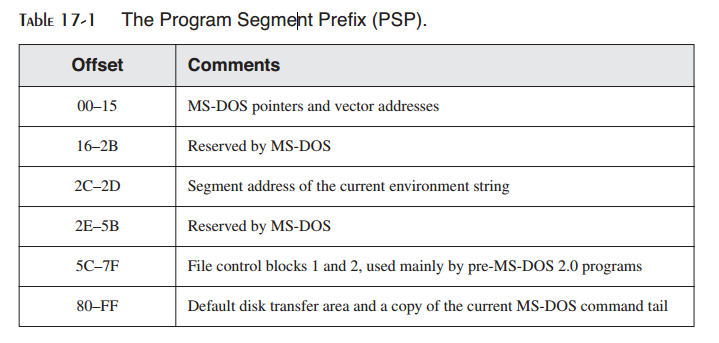
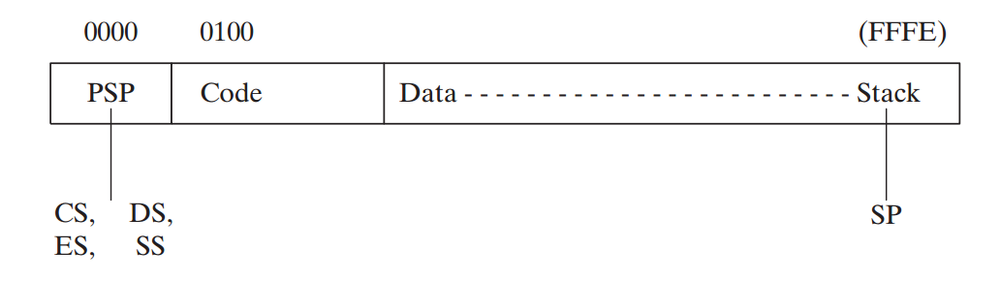
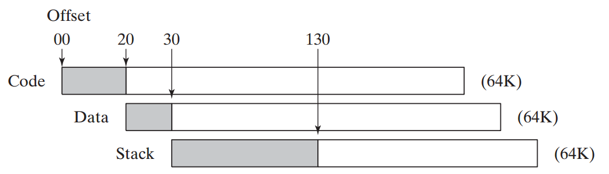
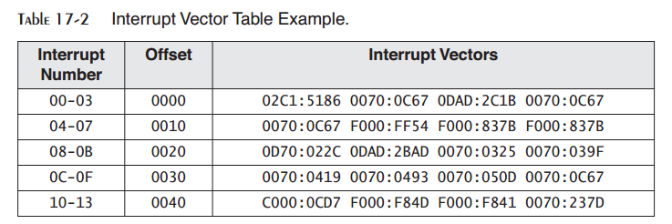
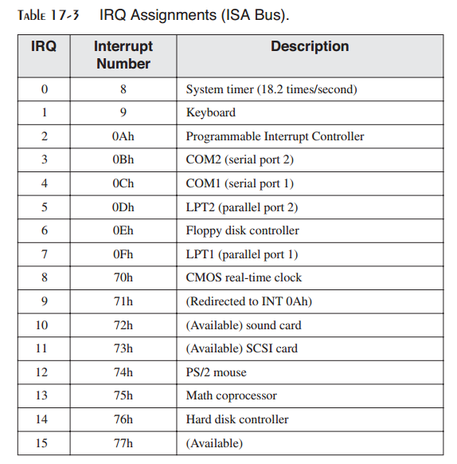
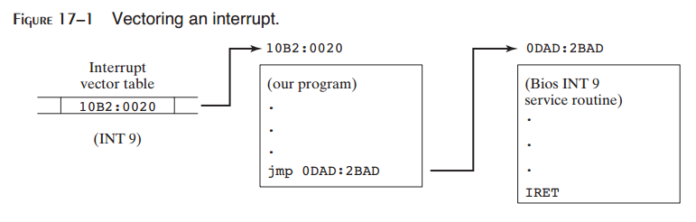
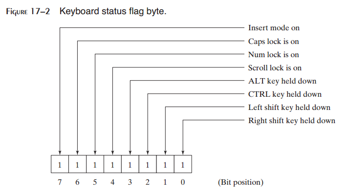

17 Expert MS-DOS Programming
^^^^^^^^^^^^^^^^^^^^^^^^^^^^^^^^^^^

17.1 简介
--------------

如果你希望成为一名Intel处理器上的硬件级别工程师，则这是需要好好阅读的一章。如果你希望理解几年前MS-DOS专家以有限的资源所完成的神奇的事情，则本章也是需要好好阅读的一章。如果你计划成为一名系统级程序员，它会为你提供一些有用的背景。这是关于MS-DOS系统资源与编程的一章。下面是我们要探讨的内容：

* 向你展示如何由.MODEL，.CODE，.STACK以及相关指令尽可能获得灵活性。
* 向你展示如何使用显式段指令，从零定义段。
* 演示具有多代码与数据段的大内存模型程序。
* 解释COM与EXE程序，包括EXE头，的运行时结构。
* 映射程序段前缀（PSP）并向你展示如何查找MS-DOS环境字符串。
* 向你展示如何使用自己的中断处理器替换已有的中断处理器。我们将会通过编写Ctrl-Break中断处器（也被称为中断服务例程，或ISR）来演示这一点。
* 解释硬件中断如何工作，并列出Intel 8259可编程中断控制器（PIC）所使用的各种中断请求（IRQ）级别。
* 编写解释Ctrl-Alt-Del按键组合的终止与驻留程序。如果你学会了这一点，你也可以加入MS-DOS专家行列。
* 向你展示如何向输出端口直接写入硬件数据，以及如何使用端口监视硬件状态，控制硬件行为，以及由硬件设备读取数据。

如果你是有几年经验的程序员，你也许听说过前面所列的许多术语。注意，旧专家似乎要丢掉他们印象中的一些术语，例如IRQ，TSR，PSP以及8259。现在你可以发现他们会讨论什么。

17.2 定义段
----------------

为MASM的早期版本编写的程序需要创建详细的代码，数据与栈段。当简化段指令（.code，.stack，.data）时，所有的指令都松了一口气，因为它们使得第一周的课程更为平滑顺利。然而，很清楚的是，专家级程序员更喜欢灵活性而是简单，因而会坚持这样做的传统方法。如果你到了这一章（并理解了前面的所章节），现你已经装备好掌握显式段指令的细节了。

然而，首先，我们需要探讨可以用于简化指令并满足其需求的各种方法。

17.2.1 简化的段指令
>>>>>>>>>>>>>>>>>>>>>>>

当你使用.MODEL指令时，汇编器会自动地为你的近数据段定义DGROUP。DGROUP中的段构成了近数据，可以直接通过DS或SS进行访问。

.DATA与.DATA?指令均创建近数据段，当运行实地址模式时，可以达到64KB。它被放置于一个以DGROUP标识的特殊组中，其极限也为64Kb。当.FARDATA与.FARDATA?被用于小型与中型的内存模型中，汇编器分别创建名为FAR_DATA与FAR_BSS的数据段。

*标识变量的段* 某些BIOS与DOS函数要求你在传递参数数据时使用特殊的段寄存器。你可以使用SEG操作符将段地址赋给段寄存器。例如，下面的语句将DS设置为包含farvar的段：

.. code-block::

    mov ax,SEG farvar
    mov ds,ax

*代码段* 正如你已知的，代码段是通过.CODE指令来创建的。在小型内存模型程序中，.CODE指令使得汇编器生成一个名为_TEXT的段。你可以在列表文件中的Segments与Gruops部分看到：

.. code-block::

    _TEXT . . . . .16 Bit 0009 Word Public 'CODE'

（上述内容表明名为_TEXT的16位段为9个字长。它对齐到偶数字边界，它是一个公开段，而其段类型为'CODE'）

在中型，大型以及超大型程序中，每个源码模块被赋予一个不同的段名。名字由模块名后跟_TEXT构成。例如，在一个使用.MODEL，LARGE指令的MyProg.asm程序中，列表文件会生成下面的代码段项：

.. code-block::

    MYPROG_TEXT . . . . .16 Bit 0009 Word Public 'CODE'

无论何种内存模型，你可以在相同的模块内声明多个代码段。通过向.CODE指令添加一个可选的段名来实现：

.. code-block::

    .code MyCode

记住：如果你调用本书的16位链接库过程，你的代码必须位于名为_TEXT的段内。例如，下面的片段会使链接器生成fixup overflow消息：

.. code-block::

    .code MyCode
        mov dx,offset msg
        call Writestring

*多代码段程序* 下面的MltCode.asm程序包含两个代码段。除了未包含Irvine16.inc文件，我们可以向你展示程序中所用的所有MASM指令：

.. code-block::

    TITLE Multiple Code Segments (MultCode.asm)
    ; This small model program contains multiple
    ; code segments.
    .model small,stdcall
    .stack 100h
    WriteString PROTO
    .data
    msg1 db "First Message",0dh,0ah,0
    msg2 db "Second Message",0dh,0ah,"$"
    .code
    main PROC
        mov ax,@data
        mov ds,ax
        mov dx,OFFSET msg1
        call WriteString ; NEAR call
        call Display ; FAR call
        .exit
    main ENDP
    .code OtherCode
    Display PROC FAR
        mov ah,9
        mov dx,offset msg2
        int 21h
        ret
    Display ENDP
    END main

在前面的示例中，_TEXT段包含main过程，而OtherCode段包含Display过程。注意，Display过程必须包含一个FAR标识符通知汇编器生成在栈上同时保存当前段与偏移的调用指令类型。为了验证，我们可以在MultCode.lst列表文件中看到两个代码段的名字：

.. code-block::

    OtherCode . . . .16 Bit 0008 Word Public 'CODE'
    _TEXT . . . . . .16 Bit 0014 Word Public 'CODE'

17.2.2 显式段定义
>>>>>>>>>>>>>>>>>>>>>

存在一些你更希望创建显式段定义的情况。例如，你也许希望在额外的内存缓冲区中定义多个数据段。或者你将程序链接到使用其自有段名的对象库。最后，你也许在编写一个被不使用Microsoft段名的高级语言编译器中调用的过程。

具有显式段定义的程序需要执行两个任务：首先，段寄存器（DE，ES或SS）必须在使用之前被设置为每个段的位置。其次，汇编器必须被告之如何计算正确段中的标签的偏移。

SEGMENT与ENDS指令分别定义段的开始与结束。一个程序也许会包含任意数量的段，每一个具有唯一的名字。段也可以被组合在一起。其语法为：

.. code-block::

    name SEGMENT [align] [combine] ['class']
        statement-list
    name ENDS

* name标识段，它可以是唯一的，也可以是已有段的名字。
* align可以是BYTE，WORD，DWORD，PARA，或PAGE。
* combine可以是PRIVATE，PUBLIC，STACK，COMMON，MEMORY，或AT地址。
* class是一个单引号封装的标识符，用于表明段的特定类型，例如CODE或STACK。

例如，下面是如何定义ExtraData段的代码：

.. code-block::

    ExtraData SEGMENT PARA PUBLIC 'DATA'
        var1 BYTE 1
        var2 WORD 2
    ExtraData ENDS

对齐类型
:::::::::::::

当组合一个或多个段时，它们的align类型告诉链接器如何对齐其起始地址。默认为PARA，表明段必须由偶数16字节边界处开始。下面是一个落在段落边界的20位十六进制地址的示例。注意最后一位数字总为零：

.. code-block::

    0A150 81B30 07460

要创建指定的对齐，汇编器会在已有段的结束处添加字节，直到新段到达正确的起始地址处。额外的字节被称为忽略字节（slack bytes）。它仅影响连接到已有段的段，因为组中的第一个段总是由段落边界处开始。（回忆第2章段地址总是包含四个隐式的低字节零位。）可以使用下述的对齐类型：

* BYTE对齐类型由前一个段的下一个字节处开始新段。
* WORD对齐类型在下一个16位边界处开始新段。
* DWORD对齐类型在下一个32位边界处开始新段。
* PARA在下一个16字节边界处开始新段。
* PAGE在下一个256字节边界处开始新段。

如果程序运行在8086或80286处理器，WORD对齐（或更大）是数据段的最佳对齐类型，因为处理有16位的数据总线。这样处理器总是移动2个字节，其中第一个为偶数地址。从而，偶数边界的变量只需要一次内存读取，而奇数边界的变量则需要两次。与之相对，x86处理器一次读取32位，应使用DWORD对齐类型。

组合类型
:::::::::::::

段的组合类型通知链接如何组合具有相同名字的段。默认类型为PRIVATE，表明这样的段不会与其他的段组合。

PUBLIC与MEMORY组合类型使得段与其他具有相同名字的PUBLIC或MEMORY段组合，从而它们变为一个段。所有标签的偏移会进行调整，从而它们相对于相同段的起始处。

STACK组合类型类似于PUBLIC类型，从而所有其他的栈段将会组合在一起。MS-DOS自动将SS初始化为它找到的STACK组合类型中的第一个段的起始处；MS-DOS将SP设置为程序被加载后的栈长度（减1）。在EXE程序中，至少应用一个STACK组合类型的段；否则，链接器会显示警告信息。

COMMON组合类型使得段开始于其他具有相同名字的COMMON段的相同地址处。结果，段彼此互相重叠。所有的偏移量由相同的起始地址处计算，并变量相互重叠。

AT地址组合类型允许你在绝对地址处创建段；它经常用于数据地址为硬件或操作系统预定义的情况。没有变量或数据被初始化，但是你可以创建指向特定偏移的变量名。例如：

.. code-block::

    bios SEGMENT AT 40h
        ORG 17h
        keyboard_flag BYTE ? ; MS-DOS keyboard flag
    bios ENDS
    .code
        mov ax,bios ; point to BIOS segment
        mov ds,ax
        and ds:keyboard_flag,7Fh ; clear high bit

在该示例中，需要段覆盖（DS:），因为keyboard_flag并没有位于标准数据段中。我们会在17.2.3节中解释段覆盖。

类类型
:::::::::::::

段的类类型为组合段提供了另一种方式，特别是，具有不同名字的段。类类型是以单引号封装的大小写敏感字符串。具有相同类类型的段会被一起加载，尽管在普通程序中会使用不同的顺序。一个标准类型，CODE，为链接器所识别，并用被用于包含指令的段。如果你计划使用调试器，你必须包含该类型的标签。

ASSUME指令
::::::::::::::::

ASSUME指令通知汇编器在汇编时如何计算代码与数据标签的偏移。它通常被直接放置于代码段中的SEGMENT指令之后。其语需要一个段寄存器名，后跟冒号，然后是段名：

.. code-block::

    ASSUME segreg : segname

ASSUME实际上并不会修改段寄存器的值。这必须发生运行时，使用将段值赋给段寄存器的指令完成。你的代码也许会包含多个ASSUME指令。当遇到一个新指令时，汇编器会修改计算相对于该点地址的方式。

下面的ASSUME告诉汇编器使用DS作为data1段的默认寄存器：

.. code-block::

    ASSUME ds:data1

下面的语句将CS与myCode相关联，而将SS与myStack相关联：

.. code-block::

    ASSUME cs:myCode, ss:myStack

示例：多数据段
::::::::::::::::::

在本节前面的内容中，我们展示了一个具有两个代码段的程序。让我们创建一个具有两个数据段，data1与data2，的程序（MultData.asm）。两者都使用类名DATA进行声明。ASSUME指令将DS与data1相关联，而将ES与data2相关联：

.. code-block::

    ASSUME cs:cseg, ds:data1, es:data2, ss:mystack
    data1 SEGMENT 'DATA'
    data2 SEGMENT 'DATA'

下面是完整的程序列表：

.. code-block::

    TITLE Multiple Data Segments (MultData.asm)
    ; This program shows how to explicitly declare
    ; multiple data segments.
    cseg SEGMENT 'CODE'
    ASSUME cs:cseg, ds:data1, es:data2, ss:mystack
    main PROC
        mov ax,data1 ; point DS to data1 segment
        mov ds,ax
        mov ax,SEG val2 ; point ES to data2 segment
        mov es,ax
        mov ax,val1 ; data1 segment assumed
        mov bx,val2 ; data2 segment assumed
        mov ax,4C00h ; exit program
        int 21h
    main ENDP
    cseg ENDS
    data1 SEGMENT 'DATA
        val1 WORD 1001h
    data1 ENDS
    data2 SEGMENT 'DATA'
        val2 WORD 1002h
    data2 ENDS
    mystack SEGMENT para STACK 'STACK'
        BYTE 100h dup('S')
    mystack ENDS
    END main

在运行时使用两种设置段寄存器值的方式。第一种使用段名字（data1）：

.. code-block::

    mov ax,data1 ; point DS to data1 segment
    mov ds,ax

第二种方法是使用SEG操作符来获取val2的段地址：

.. code-block::

    mov ax,SEG val2 ; point ES to data2 segment
    mov es,ax

汇编器所创建的列表文件显示两个变量val1与val2具有相同值（起始偏移），但是具有不同的段属性：

.. code-block::

    Name                       Type Value Attr
    val1 . . . . . . . . . . . Word 0000 data1
    val2 . . . . . . . . . . . Word 0000 data2

17.2.3 段覆盖
>>>>>>>>>>>>>>>>

段覆盖是一个字节前缀，使得当前指令在计算有效地址时使用一个不同于ASSUME指令指定的段寄存器。例如，它可以被用于访问CS或DS所关联段之外的段中变量：

.. code-block::

    mov al,cs:var1 ; segment pointed to by CS
    mov al,es:var2 ; segment pointed to by ES

应注意，在实地址模式中，你可以将变量放置于代码段中。你绝不要保护模式中使用该方法。

下面的指令获取并非ASSUME指令中指定的DS或ES关联段中的变量：

.. code-block::

    mov bx,OFFSET AltSeg:var2

通过插入ASSUM临时改变默认段引用，可以更为容易地处理对变量的多引用。

.. code-block::

    ASSUME ds:AltSeg ; use AltSeg for a while
    mov ax,AltSeg
    mov ds,ax
    mov al,var1
    ..
    ASSUME ds:data ; use the default data segment
    mov ax,data
    mov ds,ax

17.2.4 组合段
>>>>>>>>>>>>>>>>>>>>>>>>>

大程序应被分解为单独的模块以简化编辑和调试。甚至是位于不同模块中的源码可以被组合在相同的段中。只需要在每个模块内使用相同的段名并指定PUBLIC组合类型。这就是你将16位程序与本书的Irvine16链接库链接时，使用简化的段指令时所发生的事情。

如果你使用BYTE对齐类型，每个段会紧跟前一个段。如果使用WORD对齐类型，会在前一个段的下一个偶数字边界处开始新段。默认对齐类型为PARA，此时每个段位于下一个段落边界处。

*程序示例* 让我们看一个包含一个代码段（CSEG），一个数据段（DSEG），以及一个栈段（SSEG）的两模块程序。主模块包含所有三个段；CSEG与DSEG具有PUBLIC组合类型。BYTE对齐类型用于CSEG，以避免两个模块代码之间的空隙。

主模块：TITLE段示例（主模块，Seg2.asm）

.. code-block::

    EXTRN var2:WORD, subroutine_1:PROC
    cseg SEGMENT BYTE PUBLIC 'CODE'
    ASSUME cs:cseg,ds:dseg, ss:sseg
    main PROC
        mov ax,dseg ; initialize DS
        mov ds,ax
        mov ax,var1 ; local variable
        mov bx,var2 ; external variable
        call subroutine_1 ; external procedure
        mov ax,4C00h ; exit to OS
        int 21h
    main ENDP
    cseg ENDS
    dseg SEGMENT WORD PUBLIC 'DATA' ; local data segment
        var1 WORD 1000h
    dseg ends
    sseg SEGMENT STACK 'STACK' ; stack segment
        BYTE 100h dup('S')
    sseg ENDS
    END main

子模块：TITLE段示例（子模块，Seg2a.asm）

.. code-block::

    PUBLIC subroutine_1, var2
    cseg SEGMENT BYTE PUBLIC 'CODE'
        ASSUME cs:cseg, ds:dseg
        subroutine_1 PROC ; called from MAIN
        mov ah,9
        mov dx,OFFSET msg
        int 21h
        ret
    subroutine_1 ENDP
    cseg ENDS
    dseg SEGMENT WORD PUBLIC 'DATA'
    var2 WORD 2000h ; accessed by MAIN
    msg BYTE 'Now in Subroutine_1'
        BYTE 0Dh,0Ah,'$'
    dseg ENDS
    END

链接器具有创建MAP文件的选项，从而列出程序中的所有段。下面的程序MAP文件显示了一个代码段，一个数据段，以及一个栈段：

.. code-block::

    Start Stop Length Name Class
    00000H 0001BH 0001CH CSEG CODE
    0001CH 00035H 0001AH DSEG DATA
    00040H 0013FH 00100H SSEG STACK

    Program entry point at 0000:0000

17.3 运行时程序结构
-------------------------

高效的汇编语言程序员需要了解关于MS-DOS的大量内容。本节描述command.com，程序段前缀以及COM与EXE程序的结构。MS-DOS与Windows 95以及98提供的command.com程序被称为命令处理器。由Windows 2000开始，它被命名为cmd.exe。它解析在提示符处输入的所有命令。当你输入一个命令时，会发生下列操作：

1. MS-DOS检测命令是否为内部命令，例如DIR，REN或DEL（删除）。如果为内部命令，则命令立即由内存常驻的MS-DOS例程执行。
2. MS-DOS查找与COM扩展名匹配的文件。如果文件位于当前目录，则该文件被执行。
3. MS-DOS查找与EXE扩展名匹配的文件。如果文件位于当前目录，则该文件被执行。
4. MS-DOS查找与BAT扩展名匹配的文件，如果文件位于当前目录，则该文件被执行。以BAT为扩展名的文件被称为批处理文件，这是包含在控制台输入命令时会被执行的MS-DOS命令的文本文件。
5. 如果MS-DOS在当前目录不能查找与COM，EXE或BAT文件匹配的文件，它会搜索当前路径的第一个目录。如果匹配查找失败，则会处理路径中的下一个目录，并继续处理直到找到匹配文件或是路径搜索结束。

以COM和EXE为扩展名的程序被称为瞬态程序（transient programs）。通常，它们被载入到内存中执行；当执行完成后，它们所占用的内存会被释放。如果需要，瞬态程序在退出时可以在内存中保留部分代码；这些被称为内存常驻程序，或是终止与内存驻留（TSR）程序。

17.3.1 程序段前缀
>>>>>>>>>>>>>>>>>>>>>>>

MS-DOS在程序的开始处创建一个256字节的特殊块，该块会被载入到内存中，被称为程序段前缀。程序段前缀（PSP）的结构如表17-1所示。

17.3.2 COM程序
>>>>>>>>>>>>>>>>>>>>>>

有两种瞬态程序类型，以其文件扩展名（COM或EXE）标识。COM程序是未修改的机器语言程序的二进制映像。它被MS-DOS载入到最低可用的段地址内存处，并且在偏移0处创建PSP。代码，数据，以及栈被存储在相同的物理（与逻辑）段中。程序最大为64K，减去PSP的大小以及线结束处的两个保留字节。如下图所示，所有段寄存器被设置为PSP的基地址。代码域开始于偏移100h处，而数据域紧随代码域之后。栈域位于段结束处，因为MS-DOS将SP初始化为FFFEh：

让我们看一个以COM格式编写的简单程序。MASM需要一个COM程序来使用小型（tiny）内存模型。同时，ORG指令必须用于将程序代码的起始位置计数器设置为100h。这会PSP保留了100h字节，占用位置为0至0FFh：

.. code-block::

    TITLE Hello Program in COM format (HelloCom.asm)
    .model tiny
    .code
    org 100h ; must be before main
    main PROC
        mov ah,9
        mov dx,OFFSET hello_message
        int 21h
        mov ax,4C00h
        int 21h
    main ENDP
    hello_message BYTE 'Hello, world!',0dh,0ah,'$'
    END main

变量通常位于主过程之后，因为并不存在单独的数据段。如果我们将数据放在程序顶部，CPU将会尝试执行数据。一种折中方法是在程序开始处放置JMP指令，跳过数据直到第一条实际指令：

.. code-block::

    TITLE Hello Program in COM format (HelloCom.asm)
    .model tiny
    .code
    org 100h ; must be before entry point
    main proc
        jmp start ; skip over the data
    hello_message BYTE 'Hello, world!',0dh,0ah,'$'
    start:
        mov ah,9
        mov dx,OFFSET hello_message
        int 21h
        mov ax,4C00h
        int 21h
    main ENDP
    END main

Microsoft链接器需要/T参数来告诉它创建COM文件而不是EXE文件。COM程序总是小于其对应的EXE程序－例如，HelloCom.asm，当存储在磁盘上时仅为17字节长。然而当位于内存中时，COM程序会占用整个64K内存段，无论它是否需要这些空间。COM程序并不是为运行在多任务环境中而设计的。

17.3.3 EXE程序
>>>>>>>>>>>>>>>>>>>>>

EXE程序以EXE头后跟包含程序本身的加载模块的形式存储在磁盘中。程序头并不会被真正加载到内存中；相反，它包含MS-DOS用来加载与执行程序的信息。

当MS-DOS加载EXE程序时，会在第一个可用地址处创建一个程序段前缀（PSP），而程序会被放置在其上的内存中。随着MS-DOS解码程序头，它会将DS与ES设置程序的加载地址，也被称为程序段前缀（PSP）。CS与IP被设置为程序代码的入口点，由此程序开始执行。SS被设置为栈段的开始处，而SP被设置为栈尺寸。下图显示了代码，数据与栈段的重叠：

在程序中，代码域为20h字节，数据域为10h字节，而栈域为100h字节。

一个EXE可以包含至多65535个段，尽管包含如此之多段的程序并不常见。如果一个程序包含多个数据段，程序员通常需要手动为每个段设置DS与ES。

内存使用
::::::::::::::::

EXE程序所用的内存数量由其程序头指定－特别是，代码域后内存中用来处理变量与运行时栈的段落（每个16字节）的最小与最大值。默认情况下，链接器将最大值设置为65535段落，这大于MS-DOS下可用的内存量。所以当程序被加载时，MS-DOS自动分配可用的内存量。

当程序被链接时，可以使用/CP选项设置最大分配。如下面的prog1.obj程序所示。数值1024指16字节段落的数量，以十进制表示：

.. code-block::

    link16 /cp:1024 prog1;

使用Microsoft汇编器所提供的exehdr程序，可以在EXE程序被编译之后修改EXE头的值。例如，为prog1.exe程序将最大分配设置为400h段落（16384字节）的命令为：

.. code-block::

    exehdr prog1 /max 400

**exehdr** 可以显示程序的重要数据。下面的示例输出描述了prog1.exe程序使用最大分配被设置为1024段落链接后的信息：

.. code-block::

    PROG1                       (Hex)       (Dec)
    EXE size (bytes)            876         2166
    Minimum load size (bytes)   786         1926
    Overlay number              0           0
    Initial CS:IP               0000:0010   16
    Initial SS:SP               0068:0100   256
    Minimum allocation (para)   11          17
    Maximum allocation (para)   400         1024
    Header size (para)          20          32
    Relocation table offset     1E          30
    Relocation entries          1           1

EXE头
::::::::::::::

EXE程序的头部区域被MS-DOS用来正确计算段及其他组件的地址。头部包含如下如下信息：

* 重定位表，包含程序被加载时要计算的地址。
* EXE程序的文件大小，以512字节单元计算。
* 最小分配：在程序代码区域后保留的内存段落的最小值。其中一些存储被用于存储动态数据的运行时堆。
* 最大分配：程序所需要的段落的最大值。
* 为IP与SP寄存器指定的起始值。
* 距离加载模块的起始处的栈与代码段的偏移（以16字节段落计算）。
* 文件中所有单词的校验和，用于将程序加载到内存中时捕捉数据错误。

17.4 中断处理
-----------------------

在本节中，我们通过安装中断处理器（中断服务例程）来自定义BIOS与MS-DOS的方法。正如我们在前面的章节中所看到的，BIOS与MS-DOS包含简化输入/输出以及基础系统服务的中断处理器。我们看到了许多－用于视频处理的INT 10h例程，INT 16h键盘例程，INT 21h MS-DOS服务，等等。但是操作系统中同样重要的组成部分是响应硬件中断的中断处理器集合。MS-DOS允许你将这些服务例程中的任意一个替换为你自己的。

局限性：本章中出现的中断处理器仅适用于你的计算机启动为MS-DOS模式的情况。你可以使用Windows 95与98这样做，但是不可以在更新的Windows版本上这样做。后来的操作系统将系统硬件与应用程序隔离，以实现更好的系统稳定性与安全性。如果OS允许两个同时运行的程序修改相同硬件设备上的内部设置，结果是不可预料的。

中断处理器也许是为多种原因而编写的。你也许希望在热键被按下时，甚至是用户正在运行其他程序时，激活你的程序。例如，Borland的SideKick，是第一个能够在特殊的热键组合被按下时弹出记事本或计算器的程序。

你可以替换MS-DOS中的一个默认中断处理器以提供更为复杂的服务。例如，当CPU试图除以零时，除以零中断会被激活，但是对于程序而言并没有标准方法恢复。

你可以将MS-DOS严重错误处理器或Ctrl-Break处理器替换为你自己的中断处理器。MS-DOS的默认严重错误处理器会使得程序退出并返回到MS-DOS。你自己的处理器可以由错误中恢复并继续运行当前的应用程序。

用户编写的中断服务例程可以比MS-DOS更有效地处理硬件中断。例如，PC的异步通信处理器（INT 14h）执行非输入/输出缓冲。这意味着如果在另一个字符到达之前，当前输入字符未被由端口拷贝走，则输入字符会丢失。内存驻留程序可以等待将要到达的字符来生成硬件中断，输入端口中的字符，并将其存储在一个圆形缓冲区中。这会将程序由不得不花费宝贵的时间来重复检测端口的工作中解放出来。

*中断向量表* MS-DOS灵活性的关键在于RAM中前1024字节（位于0:0至0:03FF处）。表17-2包含向表的简短示例。表中的每一项（称为中断向量）是一个指向已有服务例程的32位段-偏移地址。

在指定的计算机上，由于BIOS与MS-DOS版本的不同，向量值会发生变化。每个中断向量对应一个中断编号。在表中，INT 0处理器（零除）的地址为02C1:5186h。中断向量的偏移量可以通过将其中断编号乘以4得到。所以，INT 9h的向量偏移为9*4，或十六进制0024。

*执行中断处理器* 中断处理器可以两种方式执行：（1）包含INT指令的应用程序可以调用例程，从而调用软中断；（2）当硬件设备（异步端口，键盘，计时器，等）向可编程中断控制器芯片发送信号时发生硬件中断。

17.4.1 硬件中断
>>>>>>>>>>>>>>>>>>>>>>

硬件中断是由Intel 8259可编程中断控制器（PIC）生成的，它会通知CPU暂停当前程序的执行并执行中断服务例程。例如，在输入端口等待的键盘字符如果未被CPU保存会被丢失，或者串口所接收的字符如果未被中断服务例程存储到缓冲区则会被丢失。

偶尔，当在段寄存器与栈上执行敏感操作时，程序必须禁止硬件中断。CLI（清除中断标记）指令禁止中断，而STI（设置中断标记）指令允许中断。

*IRQ级别* 中断可以被PC上多种不同的设备所触发，包括表17-3中所列的设备。基于其中断请求级别（IRQ），每个设备有一个优先级。级别0具有最高优先级，而级别15具有最低优先级。低级别中断不能中断正在运行中的高级别中断。例如，如果通信端口1（COM1）试图中断键盘中断处理器，则它必须等待直到后者完成。同时依据其优先级可以处理两个或多个并行中断请求。中断的调度是由8259 PIC处理的。

让我们使用键盘作为示例：当按键被按下时，8259 PIC向CPU发送一个INTR信号，向其传递中断编号；如果当前并未禁止外部中断，CPU会依次执行下列操作：

1. 将标记寄存器压入栈。
2. 清除中断标记，阻止其他硬件中断。
3. 将当前CS与IP压入栈。
4. 为INT 9定位中断向量表项，并将该地址放入CS与IP。

接下来，执行INT 9的BIOS的例程，而它会依次执行下述操作：

1. 重新打开硬件中断从而系统计时器不会受到影响。
2. 由键盘端口输入扫描码，尝试将其转换为ASCII字符，或将ASCII码赋为零。然后将扫描码与ASCII码存储到键盘缓冲区中，这是BIOS数据域中的一个32字节的环形缓冲区。
3. 执行IRET（中断返回）指令，它会将IP，CS以及标记寄存器由栈上弹出。控制返回到中断发生时的执行程序。

17.4.2 中断控制指令
>>>>>>>>>>>>>>>>>>>>>>>>>

CPU有一个中断标记（IF），控制CPU响应外部（硬件）中断的方式。如果中断标记被设置（IF=1），我们说中断被允许；如果标记被清除（IF=0），则中断被禁止。

*STI指令* STI指令允许外部中断。例如，系统通过暂停正在运行中的程序并执行下列动作来响应键盘输入：它调用INT 9，将击键存储在缓冲区中，然后返回当前程序。通常，中断标记被允许。否则，系统计时器不会正确计算时间与日期，而输入击键将会丢失。

*CLI指令* CLI指令禁止外部中断。它应被谨慎使用－仅在要执行重要操作使用，它不能被中断。例如，如果你的代码在修改SS与SP的值时被中断，你的SS寄存器也许会指向一个新的栈段，而你的栈指针需要被更新：

.. code-block::

    mov ax,mystack ; reset SS
    mov ss,ax
    ; INTERRUPTED HERE!!!
    mov sp,100h ; reset SP

为了确保安全，通过清除中断标记（CLI）禁止中断，并使用STI允许中断：

.. code-block::

    cli ; disable interrupts
    mov ax,mystack ; reset SS
    mov ss,ax
    mov sp,100h ; reset SP
    sti ; reenable interrupts

一次禁止中断不应超过几毫秒，否则你会丢失击键，并会降低系统计时器。当CPU响应中断处理器时，其他中断会被立即禁止。MS-DOS与BIOS中断服务例程会在它们开始执行重新允许中断。

17.4.3 编写自定义中断处理器
-----------------------------------

也许有人会问，为什么会存在中断向量表呢？当然，我们可以调用ROM中的特定过程来处理中断。IBM-PC的设计希望能够修改BIOS例程而无需替换ROM芯片。通过设置中断向量表，能够替换中断向量表中的地址，从而它们可以指向RAM中的过程。

中断向量表中的每个地址指向被称为中断处理器或中断服务例程（ISR）的过程。应用程序能够将表中的地址替换为指向新的中断处理器的新地址。例如，我们可以编写自定义的键盘中断处理器。由于所涉及的工作，这样做是有原因的。对于中断处理器更为可能的是直接调用默认INT 9来由键盘端口读取击键。一旦按键被放入键盘缓冲区，我们就可以操作其内容。

INT 21h函数25h与35h使得安装中断处理器成为可能。函数35h（获取中断向量）返回中断向量的段-偏移地址。将所需的中断编号放入AL中来调用函数。MS-DOS在ES:BX中返回32位向量。例如，下述语句将会获取INT 9向量：

.. code-block::

    .data
    int9Save LABEL WORD
    DWORD ? ; store old INT 9 address here
    .code
    mov ah,35h ; get interrupt vector
    mov al,9 ; for INT 9
    int 21h ; call MS-DOS
    mov int9Save,BX ; store the offset
    mov int9Save+2,ES ; store the segment

INT 21h函数25h（设置中断向量）允许你将已有的中断处理器替换为新的中断处理器。通过AL中的中断编号以及DS:DX中你自己的中断的段-偏移地址来调用中断。例如：

.. code-block::

    mov ax,SEG kybd_rtn ; keyboard handler
    mov ds,ax ; segment
    mov dx,OFFSET kybd_rtn ; offset
    mov ah,25h ; set Interrupt vector
    mov al,9h ; for INT 9h
    int 21h
    ..
    kybd_rtn PROC ; (new INT 9 interrupt handler begins here)

Ctrl-Break处理器示例
::::::::::::::::::::::::::

如果用户在MS-DOS等待输入中按下Ctrl-Break，控制会传递给默认的INT 32h中断处理器过程。默认的Ctrl-Break处理器结束当前运行的程序。这会使得当前程序处理不稳定状态，因为文件也许会保持打开，内存未释放，等等。然而，可以将INT 23h处理器替换为你自己的代码，从而阻止程序结束。下面的程序安装了一个简单的Ctrl-Break处理器：

.. code-block::

    TITLE Control-Break Handler (Ctrlbrk.asm)
    ; This program installs its own Ctrl-Break handler and
    ; prevents the user from using Ctrl-Break (or Ctrl-C)
    ; to halt the program. The program inputs and echoes
    ; keystrokes until the Esc key is pressed.
    INCLUDE Irvine16.inc
    .data
    breakMsg BYTE "BREAK",0
    msg BYTE "Ctrl-Break demonstration."
        BYTE 0dh,0ah
        BYTE "This program disables Ctrl-Break (Ctrl-C). Press any"
        BYTE 0dh,0ah
        BYTE "keys to continue, or press ESC to end the program."
        BYTE 0dh,0ah,0
    .code
    main PROC
        mov ax,@data
        mov ds,ax
        mov dx,OFFSET msg ; display greeting message
        call Writestring
    install_handler:
        push ds ; save DS
        mov ax,@code ; initialize DS to code segment
        mov ds,ax
        mov ah,25h ; set interrupt vector
        mov al,23h ; for interrupt 23h
        mov dx,OFFSET break_handler
        int 21h
        pop ds ; restore DS
    L1: mov ah,1 ; wait for a key, echo it
        int 21h
        cmp al,1Bh ; ESC pressed?
        jnz L1 ; no: continue
        exit
    main ENDP
    ; The following procedure executes when Ctrl-Break is
    ; pressed. All registers must be preserved.
    break_handler PROC
        push ax
        push dx
        mov dx,OFFSET breakMsg
        call WriteString
        pop dx
        pop ax
        iret
    break_handler ENDP
    END main

main过程为INT 23h初始中断向量。INT 21h函数25h要求的输入参数为：

* AH=25h
* AL=要处理的中断向量（23h）
* DS:DX=新Ctrl-Break处理器的段/偏移地址

程序的主循环简单地输入并回显击键直到Esc键被按下。

当Ctrl-Break被按下时，break_handler过程被执行；它通过调用WriteString来显示消息，并立即返回调用程序。当break_handler结束处的IRET（由中断返回）执行时，控制返回到主程序。当Ctrl-Break被按下时，正在运行的MS-DOS函数会被重新启动。通常，你可以在Ctrl-Break处理器内调用任意MS-DOS中断。你必须在中断处理器中保存所有寄存器。

你无需恢复INT 23h向量，因为当程序结束时MS-DOS会自动执行该操作。原始向量会被MS-DOS恢复到程序段前缀的偏移000Eh处。

17.4.4 结束与驻留程序
>>>>>>>>>>>>>>>>>>>>>>>>>>>>

结束与驻留程序被安装到内存中，并一直驻留直到为特殊的移除软件所移除或是计算机重新启动。TSR会保持休眠状态直到为某些事件，例如按下按键，所激活。

在TSR的早期，当两个或多个程序替换相同的中断向量时会出现兼容性问题。早期的程序使得向量指向他们自己的程序，并且不为会使用相同向量的其他程序提供转发链。稍后，为解决该问题，TSR作者会保存他们要替换的中断向量，并在他们自己的过程处理完中断之后，转发链到原始中断处理器。当然，这是对旧方法的改进，这意味着在处理中断时最后被自动安装的TSR具有顶级优先级。这意味着用户有时必须小心地以特定的顺序加载TSR程序。当MS-DOS应用被广泛使用后，已存在商业编程工具来管理多个内存驻留程序。

键盘示例
:::::::::::::::

假定我们编写一个中断服务例程检测键盘上的输入的每个字符并将其存储在10B2:0020位置处。要安装ISR，我们由中断向量表中获取INT 9向量，保存，并将其替换为我们的ISR地址。

当键盘按键被按下时，单个字符被键盘控制器传送到计算机的键盘端口，并触发硬件中断。8259 PIC将中断编号传递给CPU，而后者会跳转到中断向量表中的INT 9地址处，我们的ISR地址。我们的过程获取检测键盘字节的机会。当我们的键盘处理器存在时，它会执行跳转到原始BIOS键盘处理器过程。

这一链式过程如图17-1所示。地址是假定的。当BIOS INT 9h例程结束时，IRET指令由栈上弹出标记寄存器，并且在字符被按下时将控制返回到正在运行的程序。

17.4.5 应用：No_Reset程序
>>>>>>>>>>>>>>>>>>>>>>>>>>>>>>>

一个简单的内存驻留类型是阻止系统在按下Ctrl-Alt-Delete程序时重启。一旦我们的程序被安装到内存中，则系统仅能够通过按下特殊的按键组合：Ctrl-Alt-RightShift-Del来重启。该程序仅在你的计算机启动到MS-DOS模式时起作用。所有最新的Microsoft Windows版本阻止TSR程序解释键盘按键。

*MS-DOS键盘状态字节* 在开始之前我们需要知道的一点信息是MS-DOS在低内存中保存的键盘状态字节的位置，如图17-2所示。我们的程序将会检测该标记来确定Ctrl，Alt，Del以及RightShift按键是否被按下。键盘状态标记被存储在内存中的0040:0017h位置处。图中右侧的标签表示当该位为1时它所表示的含义。

位于0040:0018位置处的另一个键盘状态字节复制了前面的标记，所同不的是位3表示Ctrl-NumLock当前处于激活状态。

*安装程序* 内存驻留程序在其起作用之前必须被安状到内存中。由此以后，所有的键盘输入会在程序中过滤。如果例程有bug，键盘很可能会被锁住并需要我们冷启动机器。键盘中断处理器特别难于调度，因为在调试程序时我们会使用键盘。通常编写TSR程序的专业人士通常会购买硬件辅助调试器，该调试器会在受保护的内存中维护一个跟踪缓冲区。

*程序列表* 在下面的程序列表中，安装代码位于最后，因为它不会驻留在内存中。驻留部分，以标签int9_handler开始，被留在内存中，并通过INT 9h向量来指向：

.. code-block::

    TITLE Reset-Disabling program (No_Reset.asm)
    ; This program disables the usual DOS reset command
    ; (Ctrl-Alt-Del), by intercepting the INT 9 keyboard
    ; hardware interrupt. It checks the shift status bits
    ; in the MS-DOS keyboard flag and changes any Ctrl-Alt-Del
    ; to Alt-Del. The computer can only be rebooted by
    ; typing Ctrl+Alt+Right shift+Del. Assemble, link,
    ; and convert to a COM program by including the /T
    ; command on the Microsoft LINK command line.
    ; Boot into pure MS-DOS mode before running this program.
    .model tiny
    .386
    .code
        rt_shift EQU 01h ; Right shift key: bit 0
        ctrl_key EQU 04h ; CTRL key: bit 2
        alt_key EQU 08h ; ALT key: bit 3
        del_key EQU 53h ; scan code for DEL key
        kybd_port EQU 60h ; keyboard input port
        ORG 100h ; this is a COM program
    start:
        jmp setup ; jump to TSR installation
    ; Memory-resident code begins here
    int9_handler PROC FAR
        sti ; enable hardware interrupts
        pushf ; save regs & flags
        push es
        push ax
        push di
    ; Point ES:DI to the DOS keyboard flag byte:
    L1: mov ax,40h ; DOS data segment is at 40h
        mov es,ax
        mov di,17h ; location of keyboard flag
        mov ah,es:[di] ; copy keyboard flag into AH
    ; Test for the CTRL and ALT keys:
    L2: test ah,ctrl_key ; CTRL key held down?
        jz L5 ; no: exit
        test ah,alt_key ; ALT key held down?
        jz L5 ; no: exit
    ; Test for the DEL and Right-shift keys:
    L3: in al,kybd_port ; read keyboard port
        cmp al,del_key ; DEL key pressed?
        jne L5 ; no: exit
        test ah,rt_shift ; right shift key pressed?
        jnz L5 ; yes: allow system reset
    L4: and ah,NOT ctrl_key ; no: turn off bit for CTRL
        mov es:[di],ah ; store keyboard_flag
    L5: pop di ; restore regs & flags
        pop ax
        pop es
        popf
        jmp cs:[old_interrupt9] ; jump to INT 9 routine
    old_interrupt9 DWORD ?
    int9_handler ENDP
    end_ISR label BYTE
    ; --------------- (end of TSR program) ------------------
    ; Save a copy of the original INT 9 vector, and set up
    ; the address of our program as the new vector. Terminate
    ; this program and leave the int9_handler procedure in memory.
    setup:
        mov ax,3509h ; get INT 9 vector
        int 21h
        mov word ptr old_interrupt9,bx ; save INT 9 vector
        mov word ptr old_interrupt9+2,es
        mov ax,2509h ; set INT 9 vector
        mov dx,offset int9_handler
        int 21h
        mov ax,3100h ; terminate and stay resident
        mov dx,OFFSET end_ISR ; point to end of resident code
        shr dx,4 ; divide by 16
        inc dx ; round upward to next paragraph
        int 21h ; execute MS-DOS function
    END start

首先让我们来看一下安装程序的指令。在setup标签处，我们调用INT 21h函数35h来获取当前INT 9h向量，然后存储在old_interrupt9中。完成后程序能够转发链到已有的键盘处理器过程。在程序的相同部分，INT 21h函数25h将中断向量9h设置为该程序驻留部分的地址。在程序结束处，调用INT 21h函数31h退回到MS-DOS，而将驻留程序保留在内存中。函数会自动保存由PSP开始到DX偏移之间的所有内容。

*驻留程序* 内存驻留中断处理器开始于int9_handler标签处。它会在每次键盘按键被按下时执行。我们会在处理器获取控制权时重新使能中断，因为8259 PIC会自动禁止中断：

.. code-block::

    int9_handler PROC far
        sti ; enable hardware interrupts
        pushf ; save registers and status flags
        (etc...)

要记住，键盘中断经常会在另一个程序正在执行时发生。如果我们在这里修改寄存器或状态标记，我们会在应用程序中导致未预期的结果。

下面的语句会定位0040:0017地址处存储的键盘标记，并将其拷贝到AH中。字节必须进行测试以确定当前哪个键被按下：

.. code-block::

    L1: mov ax,40h ; MS-DOS data segment is at 40h
        mov es,ax
        mov di,17h ; location of keyboard flag
        mov ah,es:[di] ; copy keyboard flag into AH

下面的语句会同时检测Ctrl与Alt按键。如果当前两者未被按下，我们退出：

.. code-block::

    L2: test ah,ctrl_key ; CTRL key held down?
        jz L5 ; no: exit
        test ah,alt_key ; ALT key held down?
        jz L5 ; no: exit

如果Ctrl与Alt键被同时按下，有人也许会在尝试重启计算机。要确安哪个字符被按下，我们由键盘端口输入字符并将其与Del按键比较：

.. code-block::

    L3: in al,kybd_port ; read keyboard port
        cmp al,del_key ; Del key pressed?
        jne L5 ; no: exit
        test ah,rt_shift ; Right-Shift key pressed?
        jnz L5 ; yes: allow system reset

如果用户没有按下Del按键，我们简单地退出并允许INT 9h处理击键。如果Del按键被按下，我们知道Ctrl-Alt-Del被按下，我们仅在用户同时按下RightShift键时才会允许系统重新启动。否则，键盘标记中的Ctrl键位会被清除，有效地禁止用户尝试重新启动计算机：

.. code-block::

    L4: and ah,NOT ctrl_key ; no: turn off bit for CTRL
        mov es:[di],ah ; store keyboard_flag

最后，我们远跳转到存储在old_interrupt9中已有的BIOS INT 9h例程处。这允许所有正常的击键被处理，这对于计算机的基础操作是十分重要的：

.. code-block::

    jmp cs:[old_interrupt9] ; jump to INT 9 routine

17.5 使用I/O端口的硬件控制
-------------------------------

x86系统提供了两个硬件输入-输出类型：内存映射与基于端口。当使用内存映射的I/O时，程序可以将写入到特定的内存地址，而数据会被传输到输出设置。类似地，通过由预定义的内存地址拷贝数据可以由输入设置读取数据。文本视频显示是内存映射设置的一个示例。当你将字符放入视频段中时，它们会立即出现在显示器上。

基于端口I/O读写称为端口的特定编号的地址。端口是CPU与其他设置之间的连接，或门路，例如键盘，扬声器，调制解调器以及声卡等。

17.5.1 输入-输出端口
>>>>>>>>>>>>>>>>>>>>>>>>>

每个输入-输出端口有一个0至FFFFh之间的特定编号。例如，当通过快速切换扬声器的输入与输出来控制扬声器时会使用到端口。你可以通过设置端口参数（波特率，奇偶校验等）以及通过端口发送数据，直接通过串口与异步适配器通信。

键盘端口是输入输出端口的一个好示例。当一个按键被按下时，键盘控制器芯片向端口60h发送一个8位扫描码。击键触发硬件中断，从而使得CPU调用ROM BIOS中的INT 9。INT 9由端口输入扫描码，查询按键的ASCII码，并将两个值存储在键盘输入缓冲区中。事实上，可以完全绕过操作系统，而直接由端口60h读取字符。

除了传输数据的端口外，大多数硬件设备具有允许你监控设备状态并控制硬件行为的端口。

*IN与OUT指令* IN指令由端口输入字节，字或双字。相反地，OUT指令向端口输出值。两个指令的语法如下：

.. code-block::

    IN accumulator,port
    OUT port,accumulator

port是0至FFh范围内的常量，或者是DX中0至FFFFh之间的一个值。对于8位传输，加法器必须为AL，对于16位传输为AX，对于32位传输为EAX。如下所示：

.. code-block::

    in al,3Ch ; input byte from port 3Ch
    out 3Ch,al ; output byte to port 3Ch
    mov dx, portNumber ; DX can contain a port number
    in ax,dx ; input word from port named in DX
    out dx,ax ; output word to the same port
    in eax,dx ; input doubleword from port
    out dx,eax ; output doubleword to same port

17.5.2 PC声卡程序
>>>>>>>>>>>>>>>>>>>>>>>>

我们可以编写一个程序使用IN与OUT指令通过PC内建的扬声器生成声间。通过操纵Intel 8255可编程外设接口芯片，扬声器控制端口（编号61h）可以打开或关闭扬声器。要打开扬声器，输入端口61h中的当前值，设置最低2位，并将字节输出到端口。要关闭扬声器，清除位0与位1，并再次输出状态。

Intl 8253计时器芯片控制生成声音的频率。要使用该计时器，我们向端口42h发送0至255之间的值。扬声器演示程序展示了如何生成声音：

.. code-block::

    TITLE Speaker Demo Program (Spkr.asm)
    ; This program plays a series of ascending notes on
    ; an IBM-PC or compatible computer.
    INCLUDE Irvine16.inc
    speaker EQU 61h ; address of speaker port
    timer EQU 42h ; address of timer port
    delay1 EQU 500
    delay2 EQU 0D000h ; delay between notes
    .code
    main PROC
        in al,speaker ; get speaker status
        push ax ; save status
        or al,00000011b ; set lowest 2 bits
        out speaker,al ; turn speaker on
        mov al,60 ; starting pitch
    L2: out timer,al ; timer port: pulses speaker
    ; Create a delay loop between pitches.
        mov cx,delay1
    L3: push cx ; outer loop
        mov cx,delay2
    L3a: ; inner loop
        loop L3a
        pop cx
        loop L3
        sub al,1 ; raise pitch
        jnz L2 ; play another note
        pop ax ; get original status
        and al,11111100b ; clear lowest 2 bits
        out speaker,al ; turn speaker off
        exit
    main ENDP
    END main

首先，通过设置扬声器状态字节中的最低2位，程序打开使用端口61h的扬声器：

.. code-block::

    or al,00000011b ; set lowest 2 bits
    out speaker,al ; turn speaker on

然后，通过向计时器芯片发送60设置频率：

.. code-block::

        mov al,60 ; starting pitch
    L2: out timer,al ; timer port: pulses speaker

延时循环使得程序在再次修改频率之前暂停。由于不同的处理器速度，延时量会在不同的计算机之间发生变化。你也许需要调整delay1与delay2的值：

.. code-block::

        mov cx,delay1
    L3: push cx ; outer loop
        mov cx,delay2
    L3a: ; inner loop
        loop L3a
        pop cx
        loop L3

在延时之后，程序将周期减去1，从而提高频率。当循环重复时，新的频率被发送到计时器。继续该过程，直到AL中的频率计数器等于0。最后，程序由扬声器端口弹出原始状态字节，并通过清除最低2位关闭扬声器：

.. code-block::

    pop ax ; get original status
    and al,11111100b ; clear lowest 2 bits
    out speaker,al ; turn speaker off

17.6 本章小结
------------------------
